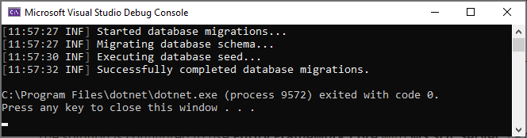

<div dir="rtl">
# آغاز به کار

````json
//[doc-params]
{
    "UI": ["MVC", "Blazor", "BlazorServer", "NG"],
    "DB": ["EF", "Mongo"],
    "Tiered": ["Yes", "No"]
}
````

> این مستند فرض میکند شما میخواهید از **{{ UI_Value }}** به عنوان رابط کاربری و از  **{{ DB_Value }}** به عنوان ارائه دهنده پایگاه داده استفاده نمایید. برای گزینه های دیگر، لطفاً اولویت را در بالای این سند تغییر دهید.

## ایجاد پایگاه داده

### Connection String

تنظیمات مربوطه به **connection string** را در فایل `appsettings.json` درقسمت {{if Tiered == "Yes"}}`.IdentityServer` و `.HttpApi.Host` projects{{else}}{{if UI=="MVC"}}`.Web` project{{else if UI=="BlazorServer"}}`.Blazor` project{{else}}`.HttpApi.Host` project{{end}}{{end}}. بررسی نمایید

{{ if DB == "EF" }}

````json
"ConnectionStrings": {
  "Default": "Server=(LocalDb)\MSSQLLocalDB;Database=BookStore;Trusted_Connection=True"
}
````

> **در خصوص Connection Strings سیستم های مدیریت پایگاه داده**
>
> سلوشن مذکور برای **Entity Framework Core** با **MS SQL Server** میباشد. با این حال، اگر DBMS دیگری را ترجیح میدهید پارامتر با استفاده از `-dbms` در ABP CLI `new` میتوانید تنظیم نمایید (مثال `-dbms MySQL`), تنظیمات connection string میتواند برای شما متفاوت باشد.
>
> EF Core از پایگاه داده های [متنوعی](https://docs.microsoft.com/en-us/ef/core/providers/) پشتیبانی مینماید و شما میتوانید از هر سیستمی که قابل پشتیبانی میباشد استفاده نمایید. بخش [سند یکپارچه سازی Entity Framework](Entity-Framework-Core.md) مطالب مهمی در خصوص [به DBMS دیگری بروید](Entity-Framework-Core-Other-DBMS.md) ارایه مینماید.

### Database Migrations

پروژه از مدل ساختاری [Entity Framework Core Code First Migrations](https://docs.microsoft.com/en-us/ef/core/managing-schemas/migrations/?tabs=dotnet-core-cli). که با کنسول `DbMigrator` میباشد و  **Migration ها را اعمال می کند** و همچنین **داده های اولیه را seed می کند**. در بخش **development** و همچنین **production** بسیار کاربردی است.

>پروژه های `DbMigrator` فایل `appsettings.json`. خود را دارند, اگر Connection String بالا را تغییر داده اید، باید این یکی را نیز تغییر دهید.

### اعمال Migration اولیه

دقت داشته باشید که `.DbMigrator` به صورت اتوماتیک در نخستین اجرا **migration اولیه را ایجاد می کند** 

**اگر از ویژوال استودیو استفاده می کنید، می توانید به آن بروید *Running the DbMigrator* section.** با این حال، IDE های دیگر (به عنوان مثال Rider) ممکن است برای اولین اجرا با مشکل مواجه شوند زیرا مهاجرت اولیه را اضافه می کند و پروژه را کامپایل می کند. در این مورد، یک ترمینال خط فرمان را در پوشه باز کنید `DbMigrator` و دستور را اجرا کنید:

````bash
dotnet run
````

برای دفعه بعد، می توانید آن را همانطور که معمولاً انجام می دهید در IDE خود اجرا کنید.

### اجرای DbMigrator

روی مورد `DbMigrator` کلیک راست کنید  و گزینه **Set as StartUp Project** را انتخاب نمایید


 کلید F5 (یا Ctrl+F5) فشار دهید تا برنامه اجرا شود و صفحه زیر را مشاهده خواهید کرد:

 

> به ساید داشته باشید که  [seed data](Data-Seeding.md)  باعث ایجاد نام کابری  `admin` با (رمز عبور `1q2w3E*`) در پایگاه داده میشود که برای ورود لازم است. بنابراین از `.DbMigrator` حداقل یک بار استفاده خواهید کرد.

{{ else if DB == "Mongo" }}

````json
"ConnectionStrings": {
  "Default": "mongodb://localhost:27017/BookStore"
}
````

راه حل برای استفاده از **MongoDB** در رایانه محلی شما پیکربندی شده است، بنابراین شما باید یک نمونه سرور MongoDB داشته باشید و در حال اجرا باشید یا Connection String را به سرور MongoDB دیگری تغییر دهید.

### ایجاد داده های اولیه

راه حل با یک برنامه کنسول `.DbMigrator` ارائه می‌شود که **داده‌های اولیه را نشان می‌دهد**. هم در زمان **development** و هم در زمان **production**.

>همچنین `.DbMigrator` فایل مخصوص `appsettings.json`. دارد, اگر Connection String بالا را تغییر داده اید، باید این یکی را نیز تغییر دهید. 

روی `.DbMigrator` کلیک راست کرده و **Set as StartUp Project** را انتخاب نمایید


F5 (یا Ctrl+F5) را بزنید تا برنامه اجرا شود. خروجی مانند شکل زیر خواهد داشت:

 

> به ساید داشته باشید که  [seed data](Data-Seeding.md)  باعث ایجاد نام کابری  `admin` با (رمز عبور `1q2w3E*`) در پایگاه داده میشود که برای ورود لازم است. بنابراین از `.DbMigrator` حداقل یک بار استفاده خواهید کرد.

{{ end }}

## برنامه را اجرا کنید

> لطفاً دستور `abp install-libs` را برای بازیابی lib های مورد نیاز پروژه وب قبل از اجرای برنامه اجرا کنید.

{{ if UI == "MVC" || UI == "BlazorServer" }}

{{ if Tiered == "Yes" }}

> راه حل های لایه ای از **Redis** به عنوان حافظه پنهان توزیع شده استفاده می کنند. مطمئن شوید که در رایانه محلی شما نصب و اجرا شده است. اگر از یک سرور Redis راه دور استفاده می‌کنید، پیکربندی را در فایل‌های `appsettings.json` پروژه‌های زیر تنظیم کنید.

1. مطمئن شوید که پروژه `.IdentityServer` پروژه Startup است. این برنامه را اجرا کنید که یک صفحه **ورود** را در مرورگر شما باز می کند.

> برای اجرای برنامه بدون Debugger از Ctrl+F5 در ویژوال استودیو (به جای F5) استفاده کنید. اگر نمیخواهید Debug کنید، این سریعتر خواهد بود.

شما می توانید وارد شوید، اما نمی توانید در اینجا وارد برنامه اصلی شوید. این **فقط سرور احراز هویت** است.

2. مطمئن شوید که پروژه `HttpApi.Host` پروژه راه اندازی است و برنامه ای را اجرا کنید که **Swagger UI** را در مرورگر شما باز می کند.


این API HTTP است که توسط برنامه وب استفاده می شود.

3. Lastly {{if UI=="MVC"}}`.Web`{{else}}`.Blazor`{{end}} باشد در این صورت صفحه **خوش آمدید** را مشاهده مینمایید


روی دکمه **ورود** کلیک کنید که شما را به *سرور احراز هویت* جهت ورود به برنامه هدایت می کند:


{{ else # Tiered != "Yes" }}

Ensure {{if UI=="MVC"}}`.Web`{{else}}`.Blazor`{{end}} باشد در این صورت صفحه **ورود** را مشاهده مینمایید

> برای اجرای برنامه بدون Debugger از Ctrl+F5 در ویژوال استودیو (به جای F5) استفاده کنید. اگر نمیخواهید Debug کنید، این سریعتر خواهد بود.


{{ end # Tiered }}

{{ else # UI != MVC || BlazorServer }}

### اجرای میزبان API HTTP (سمت سرور)

{{ if Tiered == "Yes" }}

> راه حل های لایه ای از Redis به عنوان کش توزیع شده استفاده می کنند. مطمئن شوید که در رایانه محلی شما نصب و اجرا شده است. اگر از یک سرور Redis راه دور استفاده می‌کنید، پیکربندی را در فایل‌های `appsettings.json` پروژه‌های زیر تنظیم کنید.

مطمئن شوید که پروژه `.IdentityServer` پروژه راه اندازی است. برنامه ای را اجرا کنید که یک صفحه **ورود** را در مرورگر شما باز می کند.

> برای اجرای برنامه بدون Debugger از Ctrl+F5 در ویژوال استودیو (به جای F5) استفاده کنید. اگر نمیخواهید Debug کنید، این سریعتر خواهد بود.

شما می توانید وارد شوید، اما نمی توانید در اینجا وارد برنامه اصلی شوید. این **فقط سرور احراز هویت** است.

مطمئن شوید که پروژه `.HttpApi.Host` پروژه راه اندازی است و برنامه ای را اجرا کنید که یک Swagger UI را باز می کند:

{{ else # Tiered == "No" }}

مطمئن شوید که پروژه `.HttpApi.Host` پروژه راه اندازی است و برنامه ای را اجرا کنید که یک Swagger UI را باز می کند:

> برای اجرای برنامه بدون Debugger از Ctrl+F5 در ویژوال استودیو (به جای F5) استفاده کنید. اگر نمیخواهید Debug کنید، این سریعتر خواهد بود.

{{ end # Tiered }}


می توانید API های برنامه را ببینید و آنها را در اینجا آزمایش کنید.  [اطلاعات بیشتر](https://swagger.io/tools/swagger-ui/).

{{ end # UI }}

{{ if UI == "Blazor" }}

### اجرای برنامه Blazor (سمت مشتری)

مطمئن شوید که پروژه `Blazor` پروژه راه اندازی است و برنامه را اجرا کنید.

> برای اجرای برنامه بدون Debugger از Ctrl+F5 در ویژوال استودیو (به جای F5) استفاده کنید. اگر نمیخواهید Debug کنید، این سریعتر خواهد بود.

پس از شروع برنامه، روی لینک **ورود** در بالای صفحه کلیک کنید، که شما را به سرور احراز هویت هدایت می کند تا نام کاربری و رمز عبور را وارد کنید:


{{ else if UI == "NG" }}

### اجرای Angular Application (سمت کلاینت)

به پوشه `angular` رفته, کامنت لاین را باز کرده, دستور `yarn` را اجرا نمایید (پیشنهاد ما استفاده از [yarn](https://yarnpkg.com/) جهت مدیریت پکیج میباشد اما در نظر داشته باشید که `npm install` نیز کار میکند)

```bash
yarn
```

وقتی تمامی ماژول ها بارگذاری شد دستور `yarn start` (یا `npm start`) اجرا نمایید:

```bash
yarn start
```

ممکن است برای ساخت اول زمان بیشتری طول بکشد. پس از اتمام، رابط کاربری Angular را در مرورگر پیش‌فرض شما با [localhost:4200](http://localhost:4200/) آدرس.


{{ end }}

به یاد داشته باشید **admin** را به عنوان نام کاربری و **1q2w3E*** را به عنوان رمز عبور برای ورود به برنامه وارد کنید. برنامه در حال اجرا است. شما می توانید توسعه برنامه خود را بر اساس این قالب راه اندازی شروع کنید.

## See Also

* [آموزش ساخت اپلیکیشن وب](Tutorials/Part-1.md)
* [الگوی راه اندازی برنامه](Startup-Templates/Application.md)
</div>