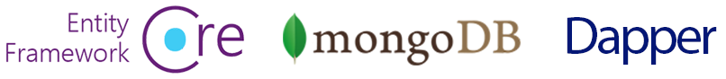
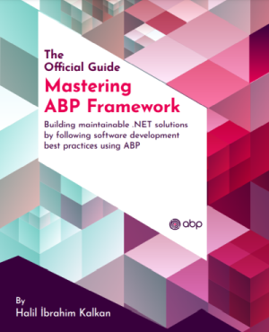

# مستندات ABP

فریم ورک ABP یک **معماری متفکرانه** را برای ایجاد راه حل های نرم افزارهای سازمانی با **بهترین شیوه ها** بر بستر پلتفرم های **DOT NET** و **ASP.NET Core** ارائه می دهد. زیرساخت های اساسی، قالب های آماده تولید، ماژول ها، تم ها، ابزارها، راهنماها و مستندات را برای پیاده سازی صحیح و **اتوماسیون کردن پیچیدگی ها** و کارهای تکراری را تا حد امکان فراهم می کند.

## آغاز کار

* [شروع سریع](Tutorials/Todo/Index.md)  یک راهنمای آموزشی کوتاه برای ساختن یک نرم افزار تحت وب ساده با استفاده از فریم ورک ABP است. اگر می خواهید به سرعت نحوه عملکرد ABP را درک کنید، پیشنهاد میکنیم با این آموزش شروع کنید.
* [آغاز به کار](Getting-Started.md) را می توانید برای ایجاد و اجرای راه حل های مبتنی بر ABP با گزینه ها و جزئیات بیشتر استفاده کنید
* [آموزش توسعه نرم افزار تحت وب](Tutorials/Part-1.md)  یک آموزش کامل و جامع برای توسعه یک نرم افزار تحت وب کامل با تمام جزئیات یک سیستم واقعی است.

### گزینه های فریم ورک مربوط به واسط کاربری

فریم ورک ABP می‌تواند با هر چارچوب UI کار کند، اما در نظر داشته باشید که گزینه های زیر به صورت پیش فرض پشتیبانی می‌شوند:

### پایگاه داده های قابل پشتیبانی

فریم ورک ABP می‌تواند با هر ارائه‌دهنده پایگاه داده ای کار کند، اما در نظر داشته باشید که گزینه های زیر به صورت پیش فرض پشتیبانی می‌شوند:

## بررسی مستندات

فریم ورک ABP دارای **مستندات بسیار جامع و کاملی** است که نه تنها چارچوب ABP را توضیح می دهد، بلکه شامل **راهنماها** و **نمونه هایی**  است که به شما کمک می کند بتوانید با استفاده از ** software development principle and best practices**. یک نرم افزار و **سیستم قابل توسعه** را تولید کنید.

### معماری نرم افزار

فریم ورک ABP یک معماری نرم‌افزار کامل، ماژولار و لایه‌ای را بر اساس اصول و الگوهای [Domain Driven Design] (Domain-Driven-Design.md) ارائه می‌کند. همچنین زیرساخت های لازم برای اجرای این معماری را فراهم می کند.

* برای درک سیستم ماژولار به سند [ماژولار](Module-Development-Basics.md) مراجعه کنید.
* [کتاب طراحی Domain Driven Design](https://abp.io/books/implementing-domain-driven-design?ref=doc) یک راهنمای جامع برای کسانی است که می خواهند DDD را با چارچوب ABP درک و پیاده سازی کنند.
* [معماری میکرو سرویس ها](Microservice-Architecture.md) توضیح می دهد که چگونه ABP به ایجاد یک راه حل میکروسرویسی کمک می کند.
* اسناد بخش [Multi-Tenancy](Multi-Tenancy.md) مفهوم معماری Multi-Tenancy را معرفی می کند و زیرساخت های مربوط به این مدل معماری در فریم ورک ABP را بررسی می کند.

### زیرساخت

بسیاری از ویژگی های ارائه شده توسط فریم ورک ABP جهت دستیابی به سناریوهای واقعی طراحی شده اند [Event Bus](Event-Bus.md), [Background Job System](Background-Jobs.md), [Audit Logging](Audit-Logging.md), [BLOB Storing](Blob-Storing.md), [Data Seeding](Data-Seeding.md), [Data Filtering](Data-Filtering.md).

### در خصوص Cruss-Cutting Concern

فریم ورک ABP نگرانی های اساسی و الزامات غیر کاربردی رایج در ساخت نرم افزار های تحت وب را بسیار ساده و یا حتی در برخی از موارد به صورت کامل اتوماتیک میکند [Exception Handling](Exception-Handling.md), [Validation](Validation.md), [Authorization](Authorization.md), [Localization](Localization.md), [Caching](Caching.md), [Dependency Injection](Dependency-Injection.md), [Setting Management](Settings.md),  وغیره . 

### ماژول های اپلیکیشن

در زیر برخی از ماژول های اساسی سیستم را مشاهده میکنید:

* ماژول [**Account**](Modules/Account.md): رابط کاربری را برای مدیریت حساب فراهم می کند و به کاربر اجازه می دهد تا به برنامه ورود و یا ثبت نام کند.
* ماژول **[Identity](Modules/Identity.md)**: بخش های سازمانی، رول ها یا همال نقش ها، کاربران و مجوزهای آنها را بر اساس کتابخانه Microsoft Identity مدیریت می کند.
* ماژول [**IdentityServer**](Modules/IdentityServer.md): به IdentityServer4 ادغام می شود.
* ماژول [**Tenant Management**](Modules/Tenant-Management.md): واحد های مربوط به [multi-tenant](Multi-Tenancy.md) (SaaS) را مدیریت مینماید.

قسمت [Application Modules](Modules/Index.md) را بررسی کنید. 

### قالب های آماده

قالب های آماده یا  [Startup templates](Startup-Templates/Index.md) قالب های ویژوال استودیو که پیشاپیش ساخته شده اند و شما می توانید پروژه خود را بر اساس این قالب ها ایجاد کنید و **سریعا شروع به برنامه نویسی کنید**.

## کتب و منابع دیگر

### Mastering ABP Framework

کتاب *Mastering ABP Framework* یک راهنمای جامع برای شروع و یادگیری کامل فریم ورک ABP است. این کتاب توسط Halil İbrahim Kalkan، خالق و توسعه‌دهنده اصلی فریم ورک ABP نوشته شده است.

**[میتوانید این کتاب را از آمازون تهیه کنید](https://www.amazon.com/Mastering-ABP-Framework-maintainable-implementing-dp-1801079242/dp/1801079242)!**

### کتاب رایگان: طراحی Domain Driven Design

**راهنمای عملی** جهت پیاده سازی Domain Driven Design (DDD). با در نظر گرفتن این که جزئیات پیاده سازی **بر اساس فریم ورک ABP ** است، مفاهیم اساسی، اصول و مدل ها را می توان برای هر راه حلی اعمال کرد، حتی اگر راه حل دات نت نباشد.

**[جهت دانلود کلیک کنید](https://abp.io/books/implementing-domain-driven-design?ref=doc).**

## انجمن ABP

### سورس کد

سورس کد فریم ورک ABP در گیت هاب موجود میباشد: [لینک گیت هاب ](https://github.com/abpframework).

### وب سایت انجمن ABP

وب سایت  [انجمن ](https://community.abp.io/) محلی جهت انتشار مقالات و به اشتراک گذاری دانش در مورد فریم ورک ABP است. شما همچنین می توانید برای انجمن، محتوا ایجاد کنید!

### وب لاگ

وب لاگ  [ABP Blog](https://blog.abp.io/) دنبال کنید تا از آخرین اخبار و تغییرات مربوط به فریم ورک ABP آگاه باشید

### نمونه کد ها

بخش [نمونه پروژه ها](Samples/Index.md) منبع فوق العاده ای از انواع سورس کد مربوط به ABP فریم فرک میباشد

### آیا میخواهید همکاری کنید؟

فریم ورک ABP یک پروژه منبع باز است. قسمت [همکاری با ما](Contribution/Index.md) را مطالعه کنید و در صورت تمایل ما را همراهی نمایید 

