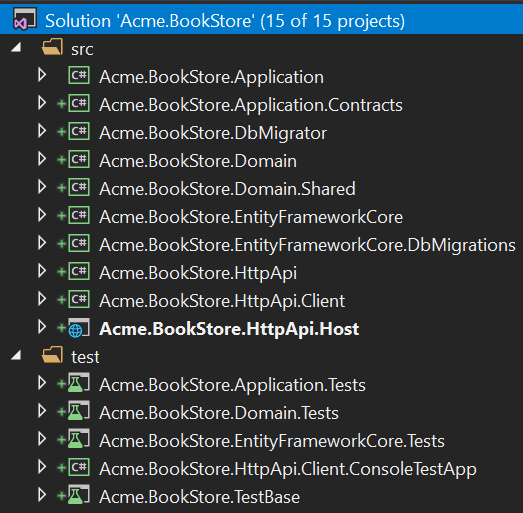
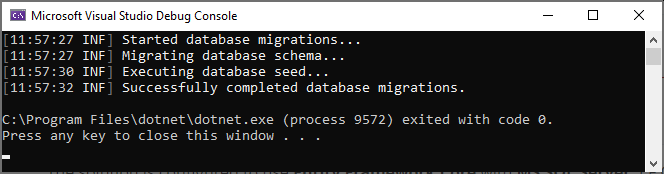
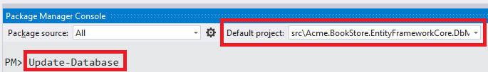
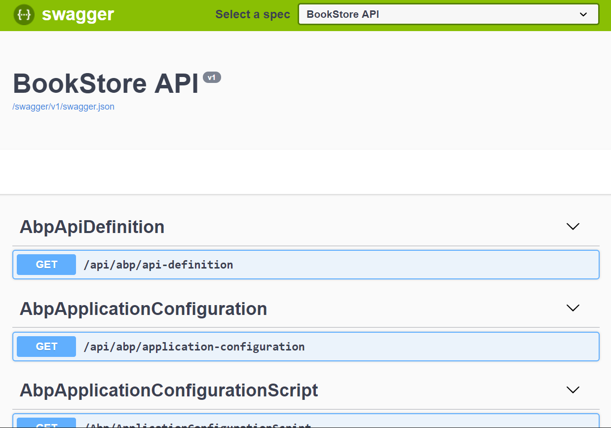

## Introdução ao modelo de aplicativo Angular

Este tutorial explica como criar um novo aplicativo Angular usando o modelo de inicialização, configurar e executá-lo.

### Criando um novo projeto

Este tutorial usa o **ABP CLI** para criar um novo projeto. Consulte a página [Introdução](https://abp.io/get-started) para outras opções.

Instale a CLI ABP usando uma janela de linha de comando, se você não tiver instalado antes:

```bash
dotnet tool install -g Volo.Abp.Cli
```

Use o `abp new`comando em uma pasta vazia para criar seu projeto:

```bash
abp new Acme.BookStore -u angular
```

> Você pode usar diferentes níveis de namespaces; por exemplo, BookStore, Acme.BookStore ou Acme.Retail.BookStore.

`-u angular`A opção especifica que a estrutura da interface do usuário seja Angular. O provedor de banco de dados padrão é o EF Core. Consulte a [documentação](CLI.md) da [CLI](CLI.md) para todas as opções disponíveis.

#### Pré requisitos

A solução criada requer;

* [Visual Studio 2019 (v16.4+)](https://visualstudio.microsoft.com/vs/)
* [.NET Core 3.0+](https://www.microsoft.com/net/download/dotnet-core/)
* [Node v12+](https://nodejs.org)
* [Yarn v1.19+](https://classic.yarnpkg.com/)

### A Estrutura da Solução

Abra a solução no **Visual Studio** :



A solução possui uma estrutura em camadas (baseada no [Domain Driven Design](Domain-Driven-Design.md) ) e contém projetos de teste de unidade e integração adequadamente configurados para trabalhar com o **banco de dados** **EF Core** & **SQLite in-memory**.

> Consulte o [documento do modelo do aplicativo](Startup-Templates/Application.md)  para entender a estrutura da solução em detalhes.

### String de Conexão de Banco de Dados

Verifique o **connection string** no `appsettings.json`arquivo no `.HttpApi.Host`projeto:

```json
{
  "ConnectionStrings": {
    "Default": "Server=localhost;Database=BookStore;Trusted_Connection=True"
  }
}
```

A solução está configurada para usar o **Entity Framework Core** com o **MS SQL Server** . O EF Core suporta [vários](https://docs.microsoft.com/en-us/ef/core/providers/) provedores de banco de dados, para que você possa usar outro DBMS, se desejar. Mude a cadeia de conexão, se necessário.

### Criar banco de dados e aplicar migrações de banco de dados

Você tem duas opções para criar o banco de dados.

#### Usando o aplicativo DbMigrator

A solução contém um aplicativo de console (nomeado `Acme.BookStore.DbMigrator`nesta amostra) que pode criar banco de dados, aplicar migrações e propagar dados iniciais. É útil no desenvolvimento e no ambiente de produção.

> `.DbMigrator`projeto tem o seu próprio `appsettings.json`. Portanto, se você alterou a cadeia de conexão acima, também deve alterar esta.

Clique com o botão direito do mouse no `.DbMigrator`projeto e selecione **Definir como Projeto de Inicialização** :


Pressione F5 (ou Ctrl + F5) para executar o aplicativo. Terá uma saída como mostrado abaixo:



#### Usando o comando EF Core Update-Database

O Ef Core possui um `Update-Database`comando que cria banco de dados, se necessário, e aplica migrações pendentes. Clique com o botão direito do mouse no `.Web`projeto e selecione **Definir como Projeto de Inicialização** :


Abra o **Console do Gerenciador de Pacotes** , selecione o `.EntityFrameworkCore.DbMigrations`projeto como **Projeto Padrão** e execute o `Update-Database`comando:



Isso criará um novo banco de dados com base na cadeia de conexão configurada.

> O uso da `.Migrator`ferramenta é a maneira sugerida, porque também semeia os dados iniciais para poder executar corretamente o aplicativo Web.

### Executando o aplicativo

#### Execute o host da API (lado do servidor)

Verifique se o `.HttpApi.Host`projeto é o projeto de inicialização e o aplicativo que abrirá uma interface do usuário do Swagger:



Você pode ver as APIs do aplicativo e testá-las aqui. Obtenha [mais informações](https://swagger.io/tools/swagger-ui/) sobre a interface do usuário do Swagger.

##### Autorização para a interface do usuário do Swagger

A maioria das APIs de aplicativos requer autenticação e autorização. Se você deseja testar APIs autorizadas, vá manualmente para a `/Account/Login`página, digite `admin`como o nome de usuário e `1q2w3E*`a senha para efetuar login no aplicativo. Você também poderá executar APIs autorizadas.

#### Execute o aplicativo angular (lado do cliente)

Vá para a `angular`pasta, abra um terminal de linha de comando, digite o `yarn`comando (sugerimos ao gerenciador de pacotes do [yarn](https://classic.yarnpkg.com/) enquanto o npm install também funcionará na maioria dos casos):

```bash
yarn
```

Depois que todos os módulos do nó estiverem carregados, execute `yarn start`ou `npm start`comando:

```bash
yarn start
```

Abra seu navegador favorito e vá para `localhost:4200`URL. Nome de usuário inicial é `admin`e senha é `1q2w3E*`.

O modelo de inicialização inclui os módulos de **gerenciamento de** **identidade** e **gerenciamento de inquilino** . Após o login, o menu Administração estará disponível, onde você poderá gerenciar **inquilinos** , **funções** , **usuários** e suas **permissões** .

> Recomendamos o [Visual Studio Code](https://code.visualstudio.com/) como editor do projeto Angular, mas você pode usar seu editor favorito.

### Qual é o próximo?

- [Tutorial de desenvolvimento de aplicativos](Tutorials/Angular/Part-I.md)