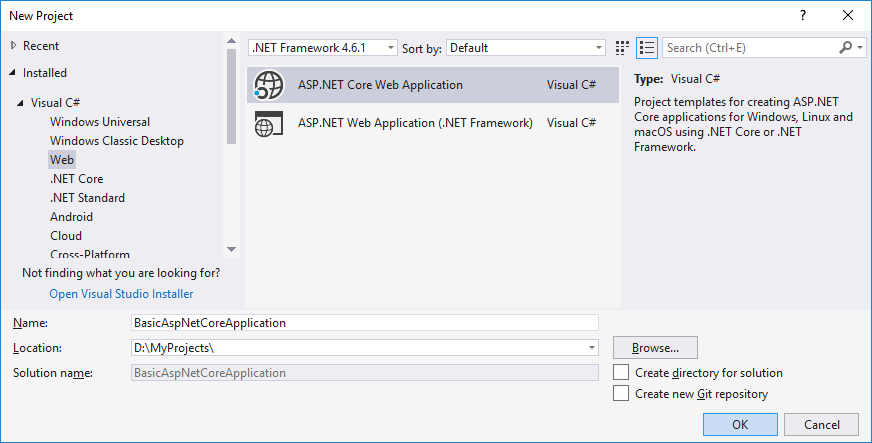
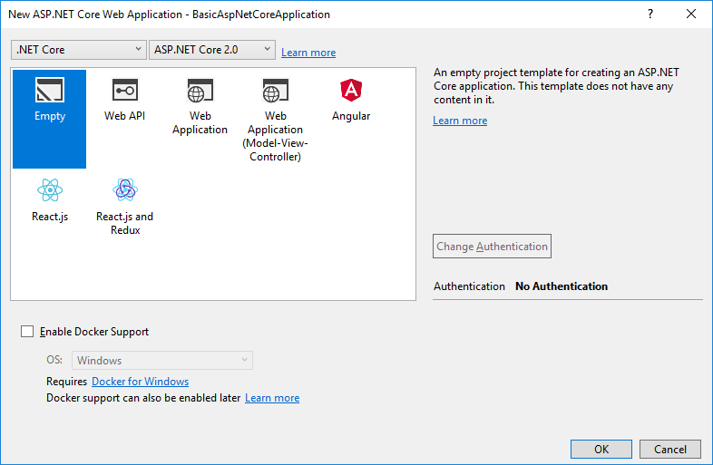

# Introdução ao ABP com o AspNet Core MVC Web Application

Este tutorial explica como iniciar o ABP do zero com dependências mínimas. Você geralmente deseja começar com o **modelo de inicialização** .

## Criar um novo projeto

1. Crie um novo aplicativo da Web vazio AspNet Core Web Application no Visual Studio:



1. Selecionar modelo vazio



Você pode selecionar outro modelo, mas quero mostrá-lo em um projeto claro.

## Instale o pacote Volo.Abp.AspNetCore.Mvc

Volo.Abp.AspNetCore.Mvc é um pacote de integração do AspNet Core MVC para ABP. Então, instale-o no seu projeto:

```
Install-Package Volo.Abp.AspNetCore.Mvc
```

## Criar o primeiro módulo ABP

O ABP é uma estrutura modular e requer uma classe de **módulo de inicialização (raiz)** derivada de `AbpModule`:

```csharp
using Microsoft.AspNetCore.Builder;
using Microsoft.AspNetCore.Hosting;
using Microsoft.Extensions.DependencyInjection;
using Volo.Abp;
using Volo.Abp.AspNetCore.Modularity;
using Volo.Abp.AspNetCore.Mvc;
using Volo.Abp.Modularity;

namespace BasicAspNetCoreApplication
{
    [DependsOn(typeof(AbpAspNetCoreMvcModule))]
    public class AppModule : AbpModule
    {
        public override void OnApplicationInitialization(ApplicationInitializationContext context)
        {
            var app = context.GetApplicationBuilder();
            var env = context.GetEnvironment();

            if (env.IsDevelopment())
            {
                app.UseDeveloperExceptionPage();
            }

            app.UseMvcWithDefaultRoute();
        }
    }
}
```

`AppModule` é um bom nome para o módulo de inicialização de um aplicativo.

Os pacotes ABP definem as classes do módulo e um módulo pode depender de outro módulo. No código acima, nosso `AppModule` depende `AbpAspNetCoreMvcModule`(definido pelo pacote Volo.Abp.AspNetCore.Mvc). É comum adicionar um `DependsOn`atributo após a instalação de um novo pacote de nuget ABP.

Em vez da classe Startup, estamos configurando o pipeline do ASP.NET Core nesta classe de módulo.

## A classe de inicialização

O próximo passo é modificar a classe Startup para integrar ao sistema do módulo ABP:

```csharp
using System;
using Microsoft.AspNetCore.Builder;
using Microsoft.Extensions.DependencyInjection;

namespace BasicAspNetCoreApplication
{
    public class Startup
    {
        public IServiceProvider ConfigureServices(IServiceCollection services)
        {
            services.AddApplication<AppModule>();

            return services.BuildServiceProviderFromFactory();
        }

        public void Configure(IApplicationBuilder app)
        {
            app.InitializeApplication();
        }
    }
}
```

`ConfigureServices` Método alterado para retornar em `IServiceProvider` vez de `void`. Essa alteração nos permite substituir a injeção de dependência do AspNet Core por outra estrutura (consulte a seção de integração com Autofac abaixo). `services.AddApplication<AppModule>()` adiciona todos os serviços definidos em todos os módulos a partir do `AppModule`.

`app.InitializeApplication()`O `Configure`método call in inicializa e inicia o aplicativo.

## Olá Mundo!

O aplicativo acima não faz nada. Vamos criar um controlador MVC que faz algo:

```csharp
using Microsoft.AspNetCore.Mvc;
using Volo.Abp.AspNetCore.Mvc;

namespace BasicAspNetCoreApplication.Controllers
{
    public class HomeController : AbpController
    {
        public IActionResult Index()
        {
            return Content("Hello World!");
        }
    }
}
```

Se você executar o aplicativo, verá um "Olá, mundo!" mensagem na página.

Derivado `HomeController`de em `AbpController`vez de `Controller`classe padrão . Isso não é necessário, mas a `AbpController`classe possui propriedades e métodos base úteis para facilitar seu desenvolvimento.

## Usando Autofac como framework de injeção de dependência

Embora o sistema de Injeção de Dependência (DI) do AspNet Core seja adequado para requisitos básicos, o Autofac fornece recursos avançados, como Injeção de Propriedade e Interceptação de Método, exigidos pela ABP para executar recursos avançados da estrutura de aplicativos.

Substituir o sistema DI do AspNet Core pelo Autofac e integrar ao ABP é bastante fácil.

1. Instale o pacote [Volo.Abp.Autofac](https://www.nuget.org/packages/Volo.Abp.Autofac)

```
Install-Package Volo.Abp.Autofac
```

1. Adicionar `AbpAutofacModule` dependência

```csharp
[DependsOn(typeof(AbpAspNetCoreMvcModule))]
[DependsOn(typeof(AbpAutofacModule))] //Add dependency to ABP Autofac module
public class AppModule : AbpModule
{
    ...
}
```

1. Altere a `services.AddApplication<AppModule>();` linha na `Startup`classe, como mostrado abaixo:

```csharp
services.AddApplication<AppModule>(options =>
{
    options.UseAutofac(); //Integrate to Autofac
});
```

1. Atualize `Program.cs` para não usar o `WebHost.CreateDefaultBuilder()` método, pois ele usa o contêiner DI padrão:

```csharp
public class Program
{
    public static void Main(string[] args)
    {
        /*
            https://github.com/aspnet/AspNetCore/issues/4206#issuecomment-445612167
            CurrentDirectoryHelpers exists in: \framework\src\Volo.Abp.AspNetCore.Mvc\Microsoft\AspNetCore\InProcess\CurrentDirectoryHelpers.cs
            Will remove CurrentDirectoryHelpers.cs when upgrade to ASP.NET Core 3.0.
        */
        CurrentDirectoryHelpers.SetCurrentDirectory();

        BuildWebHostInternal(args).Run();
    }

    public static IWebHost BuildWebHostInternal(string[] args) =>
        new WebHostBuilder()
            .UseKestrel()
            .UseContentRoot(Directory.GetCurrentDirectory())
            .UseIIS()
            .UseIISIntegration()
            .UseStartup<Startup>()
            .Build();
}
```

## Código fonte

Obter código-fonte do projeto de exemplo criada neste tutorial a partir de [aqui](https://github.com/abpframework/abp/tree/master/samples/BasicAspNetCoreApplication) .