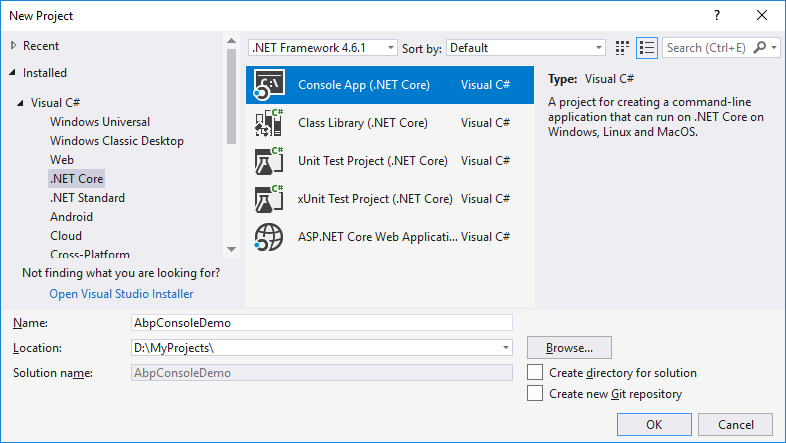

# Introdução ao ABP com aplicativo de console

Este tutorial explica como iniciar o ABP do zero com dependências mínimas. Você geralmente deseja começar com um **modelo de inicialização** .

## Criar um novo projeto

Crie um novo aplicativo regular .Net Core Console do Visual Studio:



## Instale o pacote Volo.Abp

Volo.Abp.Core é o pacote principal de nuget para criar aplicativos baseados em ABP. Então, instale-o no seu projeto:

```
Install-Package Volo.Abp.Core
```

## Criar o primeiro módulo ABP

O ABP é um framework modular e requer uma classe de **módulo de inicialização (raiz)** derivada de `AbpModule`:

```csharp
using Microsoft.Extensions.DependencyInjection;
using Volo.Abp.Modularity;

namespace AbpConsoleDemo
{
    public class AppModule : AbpModule
    {
        
    }
}
```

`AppModule` é um bom nome para o módulo de inicialização de um aplicativo.

## Inicializar o aplicativo

A próxima etapa é inicializar o aplicativo usando o módulo de inicialização criado acima:

```csharp
using System;
using Volo.Abp;

namespace AbpConsoleDemo
{
    class Program
    {
        static void Main(string[] args)
        {
            using (var application = AbpApplicationFactory.Create<AppModule>())
            {
                application.Initialize();

                Console.WriteLine("Press ENTER to stop application...");
                Console.ReadLine();
            }
        }
    }
}
```

`AbpApplicationFactory`é usado para criar o aplicativo e carregar todos os módulos que tomam `AppModule`como módulo de inicialização. `Initialize()`O método inicia o aplicativo.

## Olá Mundo!

O aplicativo acima não faz nada. Vamos criar um serviço que faça algo:

```csharp
using System;
using Volo.Abp.DependencyInjection;

namespace AbpConsoleDemo
{
    public class HelloWorldService : ITransientDependency
    {
        public void SayHello()
        {
            Console.WriteLine("Hello World!");
        }
    }
}
```

`ITransientDependency`é uma interface especial do ABP que registra automaticamente o serviço como transitório (consulte o [documento de injeção de dependência](Dependency-Injection.md) ).

Agora, podemos resolver o problema `HelloWorldService`e dizer olá. Altere o Program.cs como mostrado abaixo:

```csharp
using System;
using Microsoft.Extensions.DependencyInjection;
using Volo.Abp;

namespace AbpConsoleDemo
{
    class Program
    {
        static void Main(string[] args)
        {
            using (var application = AbpApplicationFactory.Create<AppModule>())
            {
                application.Initialize();

                //Resolve a service and use it
                var helloWorldService = 
                    application.ServiceProvider.GetService<HelloWorldService>();
                helloWorldService.SayHello();

                Console.WriteLine("Press ENTER to stop application...");
                Console.ReadLine();
            }
        }
    }
}
```

Embora seja suficiente para este exemplo de código simples, é sempre recomendável criar escopos no caso de resolver diretamente dependências de `IServiceProvider`(consulte a [documentação de Injeção de Dependências](Dependency-Injection.md)).

## Usando Autofac como framework de injeção de dependência

Embora o sistema de Injeção de Dependência (DI) do AspNet Core seja adequado para requisitos básicos, o Autofac fornece recursos avançados, como Injeção de Propriedade e Interceptação de Método, exigidos pela ABP para executar recursos avançados do framework de aplicativos.

Substituir o sistema DI do AspNet Core pelo Autofac e integrar ao ABP é bastante fácil.

1. Instale o pacote [Volo.Abp.Autofac](https://www.nuget.org/packages/Volo.Abp.Autofac)

```
Install-Package Volo.Abp.Autofac
```

1. Adicionar `AbpAutofacModule`dependência

```csharp
[DependsOn(typeof(AbpAutofacModule))] //Add dependency to the AbpAutofacModule
public class AppModule : AbpModule
{
    
}
```

1. Mude o `Program.cs`arquivo como mostrado abaixo:

```csharp
using System;
using Microsoft.Extensions.DependencyInjection;
using Volo.Abp;

namespace AbpConsoleDemo
{
    class Program
    {
        static void Main(string[] args)
        {
            using (var application = AbpApplicationFactory.Create<AppModule>(options =>
            {
                options.UseAutofac(); //Autofac integration
            }))
            {
                application.Initialize();

                //Resolve a service and use it
                var helloWorldService = 
                    application.ServiceProvider.GetService<HelloWorldService>();
                helloWorldService.SayHello();

                Console.WriteLine("Press ENTER to stop application...");
                Console.ReadLine();
            }
        }
    }
}
```

Apenas chamado `options.UseAutofac()`método nas `AbpApplicationFactory.Create`opções.

## Código fonte

Obter código-fonte do projeto de exemplo criada neste tutorial a partir de [aqui](https://github.com/abpframework/abp/tree/master/samples/BasicConsoleApplication) .


