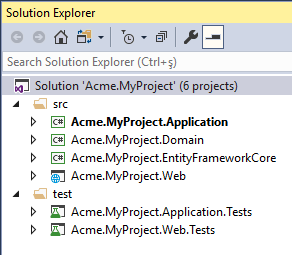

# Módulo de Documentação

## O que é o Módulo de Documentação?

O módulo de documentação é um módulo de aplicação para o framework ABP. Ele simplifica a documentação de software. Este módulo é gratuito e de código aberto.

### Integração

Atualmente, o módulo de documentação permite que você armazene sua documentação tanto no GitHub quanto no sistema de arquivos.

### Hospedagem

O módulo de documentação é um módulo de aplicação e não oferece nenhuma solução de hospedagem. Você pode hospedar sua documentação localmente ou na nuvem.

### Versionamento

Quando você usa o GitHub para armazenar sua documentação, o módulo de documentação suporta o versionamento. Se você tiver várias versões para sua documentação, haverá uma caixa de seleção na interface do usuário para alternar entre as versões. Se você escolher o sistema de arquivos para armazenar sua documentação, ele não suportará várias versões.

[Os documentos](https://docs.abp.io/) para o framework ABP também estão usando este módulo.

> O módulo de documentação segue as melhores práticas de arquitetura de módulos.

## Instalação

Este documento aborda o provedor `Entity Framework Core`, mas você também pode selecionar o `MongoDB` como seu provedor de banco de dados.

### 1- Criando uma aplicação

Se você não tiver um projeto ABP existente, você pode gerar um comando CLI a partir da página de início do site abp.io e executá-lo ou executar o comando abaixo:

```bash
abp new Acme.MyProject
```

### 2- Executando a aplicação vazia

Após baixar o projeto, extraia o arquivo ZIP e abra `Acme.MyProject.sln`. Você verá que a solução consiste nos projetos `Application`, `Application.Contracts`, `DbMigrator`, `Domain`, `Domain.Shared`, `EntityFrameworkCore`, `HttpApi`, `HttpApi.Client` e `Web`. Clique com o botão direito no projeto `Acme.MyProject.Web` e selecione **Definir como Projeto de Inicialização**.



A string de conexão do banco de dados está localizada em `appsettings.json` do seu projeto `Acme.MyProject.Web`. Se você tiver uma configuração de banco de dados diferente, altere a string de conexão.

```json
{
  "ConnectionStrings": {
    "Default": "Server=(LocalDb)\\MSSQLLocalDB;Database=MyProject;Trusted_Connection=True"
  }
}
```

Execute o projeto `Acme.MyProject.DbMigrator`, ele será responsável por aplicar a migração do banco de dados e os dados iniciais. O banco de dados `MyProject` será criado em seu servidor de banco de dados.

Agora um projeto ABP vazio foi criado! Agora você pode executar seu projeto e ver o site vazio.

Para fazer login no seu site, digite `admin` como nome de usuário e `1q2w3E*` como senha.

### 3- Instalação do Módulo

Os pacotes do módulo de documentação estão hospedados no NuGet. Existem 4 pacotes que precisam ser instalados em sua aplicação. Cada pacote deve ser instalado no projeto relevante.

#### 3.1- Usando o ABP CLI

É recomendado usar o ABP CLI para instalar o módulo. Abra a janela do CMD no diretório do arquivo de solução (`.sln`) e execute o seguinte comando:

```bash
abp add-module Volo.Docs
```

#### 3.2- Instalação manual

Ou você também pode instalar manualmente o pacote NuGet em cada projeto:

* Instale o pacote NuGet [Volo.Docs.Domain](https://www.nuget.org/packages/Volo.Docs.Domain/) no projeto `Acme.MyProject.Domain`.

  ```bash
  Install-Package Volo.Docs.Domain
  ```

* Instale o pacote NuGet [Volo.Docs.EntityFrameworkCore](https://www.nuget.org/packages/Volo.Docs.EntityFrameworkCore/) no projeto `Acme.MyProject.EntityFrameworkCore`.

  ```bash
  Install-Package Volo.Docs.EntityFrameworkCore
  ```

* Instale o pacote NuGet [Volo.Docs.Application](https://www.nuget.org/packages/Volo.Docs.Application/) no projeto `Acme.MyProject.Application`.

  ```bash
  Install-Package Volo.Docs.Application
  ```

* Instale o pacote NuGet [Volo.Docs.Web](https://www.nuget.org/packages/Volo.Docs.Domain/) no projeto `Acme.MyProject.Web`.

  ```bash
  Install-Package Volo.Docs.Web
  ```

##### 3.2.1- Adicionando Dependências de Módulo

Um módulo ABP deve declarar o atributo `[DependsOn]` se tiver uma dependência de outro módulo. Cada módulo deve ser adicionado no atributo `[DependsOn]` do projeto relevante.

* Abra `MyProjectDomainModule.cs` e adicione `typeof(DocsDomainModule)` como mostrado abaixo;

  ```csharp
   [DependsOn(
          typeof(DocsDomainModule),
          typeof(AbpIdentityDomainModule),
          typeof(AbpAuditingModule),
          typeof(BackgroundJobsDomainModule),
          typeof(AbpAuditLoggingDomainModule)
          )]
      public class MyProjectDomainModule : AbpModule
      {
          //...
      }
  ```

* Abra `MyProjectEntityFrameworkCoreModule.cs` e adicione `typeof(DocsEntityFrameworkCoreModule)` como mostrado abaixo;

  ```csharp
      [DependsOn(
          typeof(DocsEntityFrameworkCoreModule),
          typeof(MyProjectDomainModule),
          typeof(AbpIdentityEntityFrameworkCoreModule),
          typeof(AbpPermissionManagementEntityFrameworkCoreModule),
          typeof(AbpSettingManagementEntityFrameworkCoreModule),
          typeof(AbpEntityFrameworkCoreSqlServerModule),
          typeof(BackgroundJobsEntityFrameworkCoreModule),
          typeof(AbpAuditLoggingEntityFrameworkCoreModule)
          )]
      public class MyProjectEntityFrameworkCoreModule : AbpModule
      {
          //...
      }
  ```

* Abra `MyProjectApplicationModule.cs` e adicione `typeof(DocsApplicationModule)` como mostrado abaixo;

  ```csharp
     [DependsOn(
          typeof(DocsApplicationModule),
          typeof(MyProjectDomainModule),
          typeof(AbpIdentityApplicationModule))]
      public class MyProjectApplicationModule : AbpModule
      {
          public override void ConfigureServices(ServiceConfigurationContext context)
          {
              Configure<AbpPermissionOptions>(options =>
              {
                  options.DefinitionProviders.Add<MyProjectPermissionDefinitionProvider>();
              });
  
              Configure<AbpAutoMapperOptions>(options =>
              {
                  options.AddProfile<MyProjectApplicationAutoMapperProfile>();
              });
          }
      }
  ```

* Abra `MyProjectWebModule.cs` e adicione `typeof(DocsWebModule)` como mostrado abaixo;

  ```csharp
     [DependsOn(
          typeof(DocsWebModule),
          typeof(MyProjectApplicationModule),
          typeof(MyProjectEntityFrameworkCoreModule),
          typeof(AbpAutofacModule),
          typeof(AbpIdentityWebModule),
          typeof(AbpAccountWebModule),
          typeof(AbpAspNetCoreMvcUiBasicThemeModule)
      )]
      public class MyProjectWebModule : AbpModule
      {
          //...
      }
  ```

##### 3.2.2- Adicionando Pacote NPM

Abra `package.json` e adicione `@abp/docs": "^5.0.0` como mostrado abaixo:

  ```json
    {
        "version": "1.0.0",
        "name": "my-app",
        "private": true,
        "dependencies": {
            "@abp/aspnetcore.mvc.ui.theme.basic": "^5.0.0",
            "@abp/docs": "^5.0.0"
        }
    }
  ```

Em seguida, abra o terminal de linha de comando na pasta do projeto `Acme.MyProject.Web` e execute o seguinte comando:

````bash
abp install-libs
````

### 4- Integração com o Banco de Dados

#### 4.1- Integração com o Entity Framework

Se você escolher o Entity Framework como seu provedor de banco de dados, precisará configurar o módulo de documentação. Para fazer isso;

- Abra `MyProjectMigrationsDbContext.cs` e adicione `builder.ConfigureDocs()` ao `OnModelCreating()`.

  ```csharp
  public class MyProjectMigrationsDbContext : AbpDbContext<MyProjectMigrationsDbContext>
    {
        public MyProjectMigrationsDbContext(DbContextOptions<MyProjectMigrationsDbContext> options)
            : base(options)
        {

        }

        protected override void OnModelCreating(ModelBuilder builder)
        {
            base.OnModelCreating(builder);

            /* Inclua módulos no contexto de migração do banco de dados */

            builder.ConfigurePermissionManagement();
            builder.ConfigureSettingManagement();
            builder.ConfigureBackgroundJobs();
            builder.ConfigureAuditLogging();
            builder.ConfigureIdentity();
            builder.ConfigureIdentityServer();
            builder.ConfigureFeatureManagement();
            builder.ConfigureTenantManagement();
            builder.ConfigureDocs(); //Adicione esta linha para configurar o módulo de documentação

            /* Configure personalizações para entidades dos módulos incluídos */

            builder.Entity<IdentityUser>(b =>
            {
                b.ConfigureCustomUserProperties();
            });

            /* Configure suas próprias tabelas/entidades dentro do método ConfigureMyProject */

            builder.ConfigureMyProject();
        }
    }
  ```

* Abra o `Console do Gerenciador de Pacotes` no `Visual Studio` e escolha `Acme.MyProject.EntityFrameworkCore` como projeto padrão. Em seguida, escreva o comando abaixo para adicionar a migração para o módulo de documentação.

  ```csharp
  add-migration Added_Docs_Module
  ```

  Quando o comando for executado com sucesso, você verá um novo arquivo de migração chamado `20181221111621_Added_Docs_Module` na pasta `Acme.MyProject.EntityFrameworkCore\Migrations`.

  Agora, atualize o banco de dados para as alterações do módulo de documentação. Para fazer isso, execute o código abaixo no `Console do Gerenciador de Pacotes` no `Visual Studio`. Certifique-se de que `Acme.MyProject.EntityFrameworkCore` ainda é o projeto padrão.

  ```csharp
  update-database
  ```

  Por fim, você pode verificar seu banco de dados para ver as tabelas recém-criadas. Por exemplo, você pode ver a tabela `DocsProjects` adicionada ao seu banco de dados.

### 5- Vinculando o Módulo de Documentação

A rota padrão para o módulo de documentação é;

```txt
/Documents
```

Para adicionar o link do módulo de documentação ao menu de sua aplicação;

* Abra `MyProjectMenuContributor.cs` e adicione a linha abaixo ao método `ConfigureMainMenuAsync()`.

  ```csharp
  context.Menu.Items.Add(new ApplicationMenuItem("MyProject.Docs", l["Menu:Docs"], "/Documents"));
  ```

  A aparência final de **MyProjectMenuContributor.cs**

  ```csharp
      private async Task ConfigureMainMenuAsync(MenuConfigurationContext context)
      {
          var l = context.ServiceProvider.GetRequiredService<IStringLocalizer<MyProjectResource>>();
  
          context.Menu.Items.Insert(0, new ApplicationMenuItem("MyProject.Home", l["Menu:Home"], "/"));
  
          context.Menu.Items.Add(new ApplicationMenuItem("MyProject.Docs", l["Menu:Docs"], "/Documents"));
      }
  ```

A palavra-chave `Menu:Docs` é uma chave de localização. Para localizar o texto do menu, abra `Localization\MyProject\en.json` no projeto `Acme.MyProject.Domain`. E adicione a linha abaixo

```json
"Menu:Docs": "Documentos"
```

A aparência final de **en.json**

```json
{
  "culture": "en",
  "texts": {
    "Menu:Home": "Início",
    "Welcome": "Bem-vindo",
    "LongWelcomeMessage": "Bem-vindo à aplicação. Este é um projeto inicial baseado no framework ABP. Para obter mais informações, visite abp.io.",
    "Menu:Docs": "Documentos"
  }
}
```

O novo item de menu para o Módulo de Documentação foi adicionado ao menu. Execute sua aplicação web e acesse a URL `http://localhost:YOUR_PORT_NUMBER/documents`.

Você verá um aviso que diz;

```txt
Ainda não há projetos!
```

Como ainda não adicionamos nenhum projeto, este aviso é normal.

### 6- Adicionando um Novo Projeto de Documentação

Abra `DocsProjects` em seu banco de dados e insira um novo registro com as seguintes informações de campo;

* **Name**: O nome de exibição do nome do documento que será mostrado na página da web.
* **ShortName**: Um nome curto e amigável para URL que será usado na URL de seus documentos.
* **Format**: O formato do documento (para Markdown: `md`, para HTML: `html`)
* **DefaultDocumentName**: O documento para a página inicial.
* **NavigationDocumentName**: O documento a ser usado para o menu de navegação (Índice).
* **MinimumVersion**: A versão mínima para mostrar os documentos. As versões abaixo não serão listadas.
* **DocumentStoreType**: A fonte dos documentos (para GitHub:`GitHub`, para sistema de arquivos`FileSystem`)
* **ExtraProperties**: Um JSON serializado que armazena configurações especiais para o `DocumentStoreType` selecionado.
* **MainWebsiteUrl**: A URL para quando o usuário clicar no logotipo da página do módulo de documentação. Você pode simplesmente definir como `/` para vincular ao endereço raiz do seu site.
* **LatestVersionBranchName**: Esta é uma configuração para o GitHub. É o nome do branch que será usado para recuperar os documentos. Você pode definir como `master`.

#### Exemplo de Registro de Projeto para "GitHub"

Você pode usar a documentação do [ABP Framework](https://github.com/abpframework/abp/) no GitHub para configurar seu repositório de documentos do GitHub.

- Name: `ABP framework (GitHub)`

- ShortName: `abp`

- Format: `md`

- DefaultDocumentName: `Index`

- NavigationDocumentName: `docs-nav.json`

- MinimumVersion: `<NULL>` (sem versão mínima)

- DocumentStoreType: `GitHub`

- ExtraProperties: 

  ```json
  {"GitHubRootUrl":"https://github.com/abpframework/abp/tree/{version}/docs","GitHubAccessToken":"***","GitHubUserAgent":""}
  ```

  Observe que `GitHubAccessToken` está mascarado com `***`. É um token privado que você deve obter do GitHub. Consulte https://help.github.com/articles/creating-a-personal-access-token-for-the-command-line/

- MainWebsiteUrl: `/`

- LatestVersionBranchName: `dev`

Para bancos de dados `SQL`, você pode usar o comando `T-SQL` abaixo para inserir o exemplo especificado em sua tabela `DocsProjects`:

```mssql
INSERT [dbo].[DocsProjects] ([Id], [Name], [ShortName], [Format], [DefaultDocumentName], [NavigationDocumentName], [MinimumVersion], [DocumentStoreType], [ExtraProperties], [MainWebsiteUrl], [LatestVersionBranchName], [ParametersDocumentName], [ConcurrencyStamp]) VALUES (N'12f21123-e08e-4f15-bedb-ae0b2d939659', N'ABP framework (FileSystem)', N'abp', N'md', N'Index', N'docs-nav.json', NULL, N'FileSystem', N'{"Path":"C:\\Github\\abp\\docs"}', N'/', NULL, N'', N'12f21123e08e4f15bedbae0b2d939659')
```

Esteja ciente de que `GitHubAccessToken` está mascarado. É um token privado e você deve obter seu próprio token e substituir a string `***`.

Agora você pode executar a aplicação e navegar até `/Documents`.

#### Exemplo de Registro de Projeto para "FileSystem"

Você pode usar a documentação do [ABP Framework](https://github.com/abpframework/abp/) no GitHub para configurar seu repositório de documentos do GitHub.

- Name: `ABP framework (FileSystem)`

- ShortName: `abp`

- Format: `md`

- DefaultDocumentName: `Index`

- NavigationDocumentName: `docs-nav.json`

- MinimumVersion: `<NULL>` (sem versão mínima)

- DocumentStoreType: `FileSystem`

- ExtraProperties: 

  ```json
  {"Path":"C:\\Github\\abp\\docs"}
  ```

  Observe que `Path` deve ser substituído pelo diretório de documentos local. Você pode obter a documentação do ABP Framework em https://github.com/abpframework/abp/tree/master/docs e copiar para o diretório `C:\\Github\\abp\\docs` para que funcione.

- MainWebsiteUrl: `/`

- LatestVersionBranchName: `<NULL>`

Para bancos de dados `SQL`, você pode usar o comando `T-SQL` abaixo para inserir o exemplo especificado em sua tabela `DocsProjects`:

```mssql
INSERT [dbo].[DocsProjects] ([Id], [Name], [ShortName], [Format], [DefaultDocumentName], [NavigationDocumentName], [MinimumVersion], [DocumentStoreType], [ExtraProperties], [MainWebsiteUrl], [LatestVersionBranchName], [ParametersDocumentName]) VALUES (N'12f21123-e08e-4f15-bedb-ae0b2d939659', N'ABP framework (FileSystem)', N'abp', N'md', N'Index', N'docs-nav.json', NULL, N'FileSystem', N'{"Path":"C:\\Github\\abp\\docs"}', N'/', NULL, N'')
```

Adicione um dos projetos de exemplo acima e execute a aplicação. No menu, você verá o link `Documentos`, clique no link do menu para abrir a página de documentos.

Até agora, criamos um novo aplicativo a partir do site abp.io e o preparamos para o módulo de documentação.

### 7- Criando um Novo Documento

No exemplo de registros de projeto, você vê que o `Format` é especificado como `md`, que se refere ao [Mark Down](https://en.wikipedia.org/wiki/Markdown). Você pode ver o guia de referência do mark down seguindo o link abaixo;

https://github.com/adam-p/markdown-here/wiki/Markdown-Cheatsheet

O módulo de documentação do ABP pode renderizar mark down para HTML.

Agora vamos dar uma olhada em um exemplo de documento em formato mark down.

~~~markdown
# Este é um cabeçalho

Bem-vindo ao Módulo de Documentação.

## Este é um subcabeçalho

 [Este é um link](https://abp.io) 


## Este é um bloco de código

```csharp
public class Person
{
    public string Name { get; set; }

    public string Address { get; set; }
}
```
~~~

Como exemplo, você pode ver a documentação do ABP Framework:

[https://github.com/abpframework/abp/blob/master/docs/en/](https://github.com/abpframework/abp/blob/master/docs/en/)

#### Recurso de seções condicionais (Usando Scriban)

O módulo de documentação usa o [Scriban](https://github.com/lunet-io/scriban/tree/master/doc) para mostrar ou ocultar algumas partes de um documento de forma condicional. Para usar esse recurso, você deve criar um arquivo JSON como **documento de parâmetros** para cada idioma. Ele conterá todas as chaves-valores, bem como seus nomes de exibição.

Por exemplo, [en/docs-params.json](https://github.com/abpio/abp-commercial-docs/blob/master/en/docs-params.json):

```json
{
    "parameters": [{
        "name": "UI",
        "displayName": "UI",
		"values": {
			"MVC": "MVC / Razor Pages",
			"NG": "Angular"
		}
    },
	{
        "name": "DB",
        "displayName": "Database",
		"values": {
			"EF": "Entity Framework Core",
			"Mongo": "MongoDB"			
		}
    },
	{
        "name": "Tiered",
        "displayName": "Tiered",
		"values": {
			"No": "Not Tiered",
			"Yes": "Tiered"
		}
    }]
}
```

Como nem todos os documentos de seus projetos podem ter seções ou precisar de todos esses parâmetros, você deve declarar quais desses parâmetros serão usados para dividir o documento, como um bloco JSON em qualquer lugar do documento.

Por exemplo [Getting-Started.md](https://github.com/abpio/abp-commercial-docs/blob/master/en/getting-started.md):

```
.....

​```json
//[doc-params]
{
    "UI": ["MVC","NG"],
    "DB": ["EF", "Mongo"],
    "Tiered": ["Yes", "No"]
}
​```

........
```

Esta seção será excluída automaticamente durante a renderização. E, é claro, essas chaves de valores devem corresponder às do **documento de parâmetros**.


Agora você pode usar a sintaxe do **Scriban** para criar seções em seu documento.

Por exemplo:

````
{{ if UI == "NG" }}

* O argumento `-u` especifica o framework de IU, `angular` neste caso.

{{ end }}

{{ if DB == "Mongo" }}

* O argumento `-d` especifica o provedor de banco de dados, `mongodb` neste caso.

{{ end }}

{{ if Tiered == "Yes" }}

* O argumento `--tiered` é usado para criar uma solução em camadas em que o servidor de autenticação, as camadas de IU e API são fisicamente separadas.

{{ end }}

````

Você também pode usar variáveis em um texto, adicionando o sufixo **_Value** à sua chave:

```txt
Este documento pressupõe que você prefere usar **{{ UI_Value }}** como o framework de IU e **{{ DB_Value }}** como o provedor de banco de dados.
```

Além disso, as chaves **Document_Language_Code** e **Document_Version** são predefinidas se você quiser obter o código do idioma ou a versão do documento atual (isso pode ser útil para criar links que redirecionam para outro sistema de documentação em outro domínio).

------

**AVISO IMPORTANTE**: O Scriban usa "{{" e "}}" para a sintaxe. Portanto, você deve usar blocos de escape se for usá-los em seu documento (um documento Angular, por exemplo). Consulte a [documentação do Scriban](https://github.com/lunet-io/scriban/blob/master/doc/language.md#13-escape-block) para obter mais informações.

### 8- Criando o Documento de Navegação

O documento de navegação é o menu principal da página de documentos. Ele está localizado no lado esquerdo da página. É um arquivo `JSON`. Dê uma olhada no exemplo de documento de navegação abaixo para entender a estrutura.

```json
{  
   "items":[  
      {  
         "text":"Item de Menu de Exemplo - 1",
         "items":[  
            {  
               "text":"Item de Menu de Exemplo - 1.1",
               "items":[  
                  {  
                     "text":"Item de Menu de Exemplo - 1.1.1",
                     "path":"SampleMenuItem_1_1_1.md"
                  }
               ]
            },
            {  
               "text":"Item de Menu de Exemplo - 1.2",
               "items":[  
                  {  
                     "text":"Item de Menu de Exemplo - 1.2.1",
                     "path":"SampleMenuItem_1_2_1.md"
                  },
                  {  
                     "text":"Item de Menu de Exemplo - 1.2.2",
                     "path":"SampleMenuItem_1_2_2.md"
                  }
               ]
            }
         ]
      },
      {  
         "text":"Item de Menu de Exemplo - 2",
         "items":[  
            {  
               "text":"Item de Menu de Exemplo - 2.1",
               "items":[  
                  {  
                     "text":"Item de Menu de Exemplo - 2.1.1",
                     "path":"SampleMenuItem_2_1_1.md"
                  }
               ]
            }
         ]
      }
   ]
}
```

O exemplo acima de arquivo `JSON` renderiza o menu de navegação abaixo como `HTML`.


Finalmente, um novo Módulo de Documentação é adicionado ao seu projeto, que é alimentado pelo GitHub.


## Pesquisa de Texto Completo (Elastic Search)

O módulo de documentação suporta pesquisa de texto completo usando o Elastic Search. Ele não está habilitado por padrão. Você pode configurar `DocsElasticSearchOptions` para habilitá-lo.

```csharp
Configure<DocsElasticSearchOptions>(options =>
{
    options.Enable = true;
    options.IndexName = "your_index_name"; //o nome do índice padrão é abp_documents
});
```

O `Índice` é criado automaticamente após o início da aplicação se o `Índice` não existir.

`DefaultElasticClientProvider` é responsável por criar `IElasticClient`. Por padrão, ele lê a `Url` do Elastic Search da `IConfiguration`.
Se o seu `IElasticClient` precisar de configurações adicionais, use a substituição do serviço `IElasticClientProvider` e substitua-o no sistema de [injeção de dependência](../Dependency-Injection.md).

```json
{
  "ElasticSearch": {
    "Url": "http://localhost:9200"
  }
}
```


## Destacando Linhas

Você pode aplicar destaque a linhas de código específicas ou a um intervalo de linhas sequenciais.
Veja os exemplos a seguir:

```
	```C# {3, 5}
	public class Book : Entity<Guid>
	{
	    public string Name { get; set; }
	    public string Surname { get; set; }
	}
	```
```

```
	```C# {2-4}
	public class Book : Entity<Guid>
	{
	    public string Name { get; set; }
	    public string Surname { get; set; }
	}
	```
```

```
	```C# {1, 2-4}
	public class Book : Entity<Guid>
	{
	    public string Name { get; set; }
	    public string Surname { get; set; }
	}
	```
```

---


## Próximo

O Módulo de Documentação também está disponível como um aplicativo independente. Confira [VoloDocs](../Apps/VoloDocs).