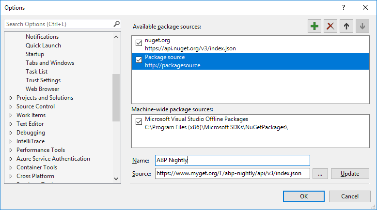

# Compilações Noturnas

Todos os pacotes de estrutura e módulo são implantados no MyGet todas as noites durante a semana. Portanto, você pode usar ou testar o código mais recente sem aguardar o próximo lançamento.

## Configurar o Visual Studio

> Requer Visual Studio 2017 ou superior

1. Vá para `Tools > Options > NuGet Package Manager > Package Source`.
2. Clique no `+` ícone verde .
3. Defina `ABP Nightly`como *Nome* e `https://www.myget.org/F/abp-nightly/api/v3/index.json`como a *Fonte,* como mostrado abaixo: 
4. Clique no `Update` botão
5. Clique no `OK` botão para salvar as alterações.

## Instalar pacote

Agora, você pode instalar pacotes noturnos / de visualização no seu projeto a partir do Nuget Browser ou do Package Manager Console.

1. No  Nuget Browser, selecione "Incluir pré-lançamentos".
2. Altere a fonte do pacote para "Todos".
3. Pesquise um pacote. Você verá as pré *-liberações* do pacote formatadas como `(VERSION)-preview(DATE)`(como *v0.16.0-preview20190401* neste exemplo).
4. Você pode clicar no `Install`botão para adicionar um pacote ao seu projeto.

  