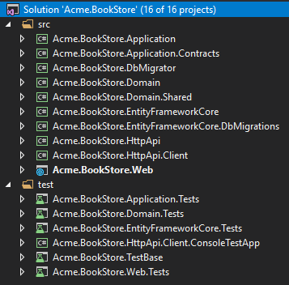

# Modelo de inicialização do aplicativo

## Introdução

Este modelo fornece uma estrutura de aplicativo em camadas com base nas práticas DDD ([Domain Driven Design](../Domain-Driven-Design.md)). Este documento explica a estrutura da solução e os projetos em detalhes. Se você deseja iniciar rapidamente, siga os guias abaixo:

- Consulte [Introdução ao modelo do ASP.NET Core MVC](../Getting-Started-AspNetCore-MVC-Template.md) para criar uma nova solução e executá-la para este modelo (usa o MVC como a estrutura da interface do usuário e o Entity Framework Core como o provedor de banco de dados).
- Consulte o [Tutorial de desenvolvimento de aplicativos do ASP.NET Core MVC](../Tutorials/AspNetCore-Mvc/Part-I.md) para aprender como desenvolver aplicativos usando este modelo (usa o MVC como a estrutura da interface do usuário e o Entity Framework Core como o provedor de banco de dados).
- Consulte o [Tutorial de desenvolvimento de aplicativos Angular](../Tutorials/Angular/Part-I.md) para aprender como desenvolver aplicativos usando este modelo (usa Angular como a estrutura da interface do usuário e MongoDB como o provedor de banco de dados).

## Como começar?

Você pode usar a [ABP CLI](../CLI.md) para criar um novo projeto usando este modelo de inicialização. Como alternativa, você pode criar e fazer o download diretamente na página [Introdução](https://abp.io/get-started) . A abordagem CLI é usada aqui.

Primeiro, instale a ABP CLI se você não tiver instalado antes:

```bash
dotnet tool install -g Volo.Abp.Cli
```

Em seguida, use o `abp new`comando em uma pasta vazia para criar uma nova solução:

```bash
abp new Acme.BookStore -t app
```

- `Acme.BookStore`é o nome da solução, como *YourCompany.YourProduct* . Você pode usar nomes de nível único, dois ou três níveis.
- Este exemplo especificou o nome do modelo ( `-t`ou `--template`opção). No entanto, `app`já é o modelo padrão se você não o especificar.

### Especifique a estrutura da interface do usuário

Este modelo fornece várias estruturas de interface do usuário:

- `mvc`: Interface do usuário do ASP.NET Core MVC com Razor Pages (padrão)
- `angular`: UI angular

Use `-u`ou `--ui`opção para especificar a estrutura da interface do usuário:

```bash
abp new Acme.BookStore -u angular
```

### Especifique o provedor de banco de dados

Este modelo suporta os seguintes provedores de banco de dados:

- `ef`: Entity Framework Core (padrão)
- `mongodb`: MongoDB

Use a opção `-d`(ou `--database-provider`) para especificar o provedor de banco de dados:

```bash
abp new Acme.BookStore -d mongodb
```

## Estrutura da solução

Com base nas opções especificadas, você obterá uma estrutura de solução ligeiramente diferente.

### Estrutura padrão

Se você não especificar nenhuma opção adicional, terá uma solução como a mostrada abaixo:



Os projetos são organizados em `src`e `test`pastas. `src`A pasta contém o aplicativo real que está em camadas com base nos princípios [DDD](https://docs.abp.io/en/abp/latest/Domain-Driven-Design) , como mencionado anteriormente.

O diagrama abaixo mostra as camadas e dependências do projeto do aplicativo:


Cada seção abaixo explicará o projeto relacionado e suas dependências.

#### Projeto .Domain.Shared

Este projeto contém constantes, enumerações e outros objetos. Na verdade, eles fazem parte da camada de domínio, mas precisam ser usados por todas as camadas / projetos da solução.

Um `BookType`enum e uma `BookConsts`classe (que podem ter alguns campos constantes para a `Book`entidade, como `MaxNameLength`) são bons candidatos para este projeto.

- Este projeto não depende de outros projetos na solução. Todos os outros projetos dependem disso direta ou indiretamente.

#### .Domain Project

Essa é a camada de domínio da solução. Ele contém principalmente [entidades, raízes agregadas](../Entities.md) , [serviços de domínio](../Domain-Services.md) , [tipos de valor](../Value-Types.md) , [interfaces de repositório](../Repositories) e outros objetos de domínio.

Uma `Book`entidade, um `BookManager`serviço de domínio e uma `IBookRepository`interface são bons candidatos para este projeto.

- Depende do `.Domain.Shared`porque usa constantes, enumerações e outros objetos definidos nesse projeto.

#### .Application.Contracts Project

Este projeto contém principalmente **interfaces de** [serviço de aplicativo](../Application-Services.md) e DTO ( [Data Transfer Objects](../Data-Transfer-Objects.md) ) da camada de aplicativo. Existe para separar a interface e a implementação da camada de aplicação. Dessa forma, o projeto de interface pode ser compartilhado com os clientes como um pacote de contrato.

Uma `IBookAppService`interface e uma `BookCreationDto`classe são boas candidatas para este projeto.

- Depende do `.Domain.Shared`porque ele pode usar constantes, enumerações e outros objetos compartilhados deste projeto nas interfaces de serviço de aplicativo e DTOs.

#### Projeto de Aplicação

Este projeto contém as **implementações** de [serviço de aplicativo](../Application-Services.md) das interfaces definidas no projeto.`.Application.Contracts`

Uma `BookAppService`turma é uma boa candidata para este projeto.

- Depende do `.Application.Contracts`projeto para poder implementar as interfaces e usar os DTOs.
- Depende do `.Domain`projeto para poder usar objetos de domínio (entidades, interfaces de repositório ... etc.) para executar a lógica do aplicativo.

#### Projeto .EntityFrameworkCore

Este é o projeto de integração para o EF Core. Ele define `DbContext`e implementa as interfaces de repositório definidas no `.Domain`projeto.

- Depende do `.Domain`projeto para poder fazer referência a entidades e interfaces de repositório.

> Este projeto está disponível apenas se você estiver usando o EF Core como provedor de banco de dados. Se você selecionar outro provedor de banco de dados, seu nome será diferente.

#### Projeto .EntityFrameworkCore.DbMigrations

Contém migrações de banco de dados EF Core para a solução. Ele foi separado `DbContext`para dedicado a gerenciar migrações.

ABP é uma estrutura modular e com um design ideal, cada módulo tem sua própria `DbContext`classe. É aqui que a migração `DbContext`entra em ação e unifica todas as `DbContext`configurações em um único modelo para manter um único esquema de banco de dados. Para cenários mais avançados, você pode ter vários bancos de dados (cada um contém uma única ou algumas tabelas de módulos) e várias migrações `DbContext`(cada uma mantém um esquema de banco de dados diferente).

Observe que a migração `DbContext`é usada apenas para migrações de banco de dados e *não em tempo de execução* .

- Depende do `.EntityFrameworkCore`projeto, pois reutiliza a configuração definida para `DbContext`o aplicativo.

> Este projeto está disponível apenas se você estiver usando o EF Core como provedor de banco de dados.

#### Projeto .DbMigrator

Este é um aplicativo de console que simplifica a execução de migrações de banco de dados em ambientes de desenvolvimento e produção. Quando você executa este aplicativo, ele;

- Cria o banco de dados, se necessário.
- Aplica as migrações de banco de dados pendentes.
- Semeia os dados iniciais, se necessário.

> Este projeto possui seu próprio `appsettings.json`arquivo. Portanto, se você deseja alterar a cadeia de conexão do banco de dados, lembre-se de alterar também esse arquivo.

Especialmente, semear dados iniciais é importante neste momento. A ABP possui uma infraestrutura modular de semente de dados. Consulte [a documentação](../Data-Seeding.md) para obter mais informações sobre a propagação de dados.

Embora a criação de banco de dados e a aplicação de migrações pareça necessária apenas para bancos de dados relacionais, esse projeto ocorre mesmo que você escolha um provedor de banco de dados NoSQL (como o MongoDB). Nesse caso, ele ainda semeia os dados iniciais necessários para a aplicação.

- Depende do `.EntityFrameworkCore.DbMigrations`projeto (para EF Core), pois ele precisa acessar as migrações.
- Depende do `.Application.Contracts`projeto para poder acessar as definições de permissão, porque o semeador de dados inicial concede todas as permissões para a função de administrador por padrão.

#### Projeto .HttpApi

Este projeto é usado para definir seus controladores de API.

Na maioria das vezes, você não precisa definir manualmente os controladores de API, pois o recurso de [controladores de API automática](../AspNetCore/Auto-API-Controllers.md) da ABP os cria automaticamente, com base na sua camada de aplicação. No entanto, no caso de você precisar escrever controladores de API, este é o melhor lugar para fazê-lo.

- Depende do `.Application.Contracts`projeto para poder injetar as interfaces de serviço do aplicativo.

#### Projeto .HttpApi.Client

Este é um projeto que define os proxies do cliente C # para usar as APIs HTTP da solução. Você pode compartilhar essa biblioteca com clientes de terceiros, para que eles consumam facilmente suas APIs HTTP em seus aplicativos Dotnet (para outros tipos de aplicativos, eles ainda podem usar suas APIs, manualmente ou usando uma ferramenta em sua própria plataforma)

Na maioria das vezes, você não precisa criar proxies de clientes C # manualmente, graças ao recurso [Dynamic C # API Clients](../AspNetCore/Dynamic-CSharp-API-Clients.md) da ABP .

`.HttpApi.Client.ConsoleTestApp` project é um aplicativo de console criado para demonstrar o uso dos proxies do cliente.

- Depende do `.Application.Contracts`projeto para poder compartilhar as mesmas interfaces de serviço de aplicativo e DTOs com o serviço remoto.

> Você pode excluir este projeto e dependências se não precisar criar proxies de cliente C # para suas APIs.

#### Projeto .Web

Este projeto contém a interface do usuário (UI) do aplicativo se você estiver usando a interface do usuário do ASP.NET Core MVC. Ele contém páginas Razor, arquivos JavaScript, arquivos CSS, imagens e assim por diante ...

Este projeto contém o `appsettings.json`arquivo principal que contém a cadeia de conexão e outras configurações do aplicativo.

- Depende da `.HttpApi`camada de interface do usuário que precisa usar APIs e interfaces de serviço de aplicativo da solução.

> Se você verificar o código fonte do `.Web.csproj`arquivo, verá as referências aos `.Application`e aos `.EntityFrameworkCore.DbMigrations`projetos.
>
> Na verdade, essas referências não são necessárias durante a codificação da camada da interface do usuário, porque a camada da interface do usuário normalmente não depende da implementação do EF Core ou da camada do Aplicativo. Esses modelos de inicialização estão prontos para a implantação em camadas, em que a camada da API está hospedada em um servidor separado da camada da interface do usuário.
>
> No entanto, se você não escolher a opção `--tiered`, essas referências estarão no projeto .Web para poder hospedar as camadas da Web, API e aplicativos em um único ponto de extremidade do aplicativo.
>
> Isso permite que você use entidades e repositórios de domínio em sua camada de apresentação. No entanto, isso é considerado uma má prática de acordo com o DDD.

#### Projetos de teste

A solução possui vários projetos de teste, um para cada camada:

- `.Domain.Tests` é usado para testar a camada de domínio.
- `.Application.Tests` é usado para testar a camada de aplicativo.
- `.EntityFrameworkCore.Tests` é usado para testar a configuração do EF Core e os repositórios personalizados.
- `.Web.Tests` é usado para testar a interface do usuário (se você estiver usando a interface do ASP.NET Core MVC).
- `.TestBase` é um projeto básico (compartilhado) para todos os testes.

Além disso, `.HttpApi.Client.ConsoleTestApp`é um aplicativo de console (não um projeto de teste automatizado) que demonstra o uso de APIs HTTP de um aplicativo .NET.

Projetos de teste são preparados para testes de integração;

- É totalmente integrado à estrutura ABP e a todos os serviços em sua aplicação.
- Ele usa o banco de dados SQLite na memória para o EF Core. Para o MongoDB, ele usa a biblioteca [Mongo2Go](https://github.com/Mongo2Go/Mongo2Go) .
- A autorização está desabilitada, portanto, qualquer serviço de aplicativo pode ser facilmente usado em testes.

Você ainda pode criar testes de unidade para suas classes, que serão mais difíceis de escrever (porque você precisará preparar objetos simulados / falsos), mas mais rápidos de executar (porque apenas testa uma única classe e ignora todo o processo de inicialização).

#### Como correr?

Defina `.Web`como o projeto de inicialização e execute o aplicativo. O nome de usuário padrão é `admin`e a senha é `1q2w3E*`.

Consulte [Introdução ao modelo ASP.NET Core MVC](../Getting-Started-AspNetCore-MVC-Template.md) para obter mais informações.

### Estrutura em camadas

Se você selecionou a interface do usuário do ASP.NET Core e especificou a `--tiered`opção, a solução criada será uma solução em camadas. O objetivo da estrutura em camadas é poder **implantar aplicativos da Web e API HTTP em diferentes servidores** :


- O navegador executa sua interface do usuário executando HTML, CSS e JavaScript.
- Os servidores da Web hospedam arquivos de interface do usuário estáticos (CSS, JavaScript, imagem ... etc.) e componentes dinâmicos (por exemplo, páginas Razor). Ele executa solicitações HTTP para o servidor da API para executar a lógica de negócios do aplicativo.
- O API Server hospeda as APIs HTTP que, em seguida, usam as camadas de aplicativo e domínio do aplicativo para executar a lógica de negócios.
- Finalmente, o servidor de banco de dados hospeda seu banco de dados.

Portanto, a solução resultante permite uma implantação em quatro camadas, comparando com a implantação em três camadas da estrutura padrão explicada anteriormente.

> A menos que você realmente precise de uma implantação em quatro camadas, é recomendável seguir a estrutura padrão que é mais simples de desenvolver, implantar e manter.

A estrutura da solução é mostrada abaixo:


Diferente da estrutura padrão, dois novos projetos entram em jogo: `.IdentityServer`& `.HttpApi.Host`.

#### Projeto .IdentityServer

Este projeto é usado como um servidor de autenticação para outros projetos. `.Web`O projeto usa a autenticação do OpenId Connect para obter tokens de identidade e acesso para o usuário atual do IdentityServer. Em seguida, usa o token de acesso para chamar o servidor da API HTTP. O servidor HTTP API usa autenticação de token de portador para obter declarações do token de acesso para autorizar o usuário atual.


O ABP usa a estrutura [IdentityServer4 de](https://identityserver.io/) código aberto para a autenticação entre aplicativos. Consulte a [documentação do IdentityServer4](http://docs.identityserver.io/) para obter detalhes sobre o protocolo IdentityServer4 e OpenID Connect.

Ele possui seu próprio `appsettings.json`que contém conexão com o banco de dados e outras configurações.

#### Projeto .HttpApi.Host

Este projeto é um aplicativo que hospeda a API da solução. Ele possui seu próprio `appsettings.json`que contém conexão com o banco de dados e outras configurações.

#### Projeto .Web

Assim como a estrutura padrão, este projeto contém a interface do usuário (UI) do aplicativo. Ele contém páginas de barbear, arquivos JavaScript, arquivos de estilo, imagens e assim por diante ...

Este projeto contém um `appsettings.json`arquivo, mas desta vez não possui uma cadeia de conexão porque nunca se conecta ao banco de dados. Em vez disso, ele contém principalmente o terminal do servidor de API remoto e o servidor de autenticação.

#### Pré requisitos

- [Redis](https://redis.io/) : os aplicativos usam Redis como cache distribuído. Então, você precisa ter o Redis instalado e funcionando.

#### Como correr?

Você deve executar o aplicativo com a ordem especificada:

- Primeiro, execute o `.IdentityServer`aplicativo, pois outros aplicativos dependem dele.
- Em seguida, execute o `.HttpApi.Host`que é usado pelo `.Web`aplicativo.
- Por fim, você pode executar o `.Web`projeto e efetuar login no aplicativo (usando `admin`como nome de usuário e `1q2w3E*`senha).

### UI angular

Se você escolher Angular como a estrutura da interface do usuário (usando a `-u angular`opção), a solução será separada em duas pastas:

- `angular` A pasta contém a solução Angular UI, do lado do cliente.
- `aspnet-core` A pasta contém a solução ASP.NET Core, do lado do servidor.

O lado do servidor é muito semelhante à solução descrita acima. `.HttpApi.Host`projeto serve a API, para que o aplicativo Angular possa consumi-lo.

Os arquivos na `angular/src/environments`pasta têm a configuração essencial do aplicativo.

## Qual é o próximo?

- Consulte [Introdução ao modelo ASP.NET Core MVC](../Getting-Started-AspNetCore-MVC-Template.md) para criar uma nova solução e executá-la para este modelo.
- Consulte o [Tutorial](../Tutorials/AspNetCore-Mvc/Part-I.md) do [ASP.NET Core MVC](../Tutorials/AspNetCore-Mvc/Part-I.md) para aprender como desenvolver aplicativos usando este modelo.


