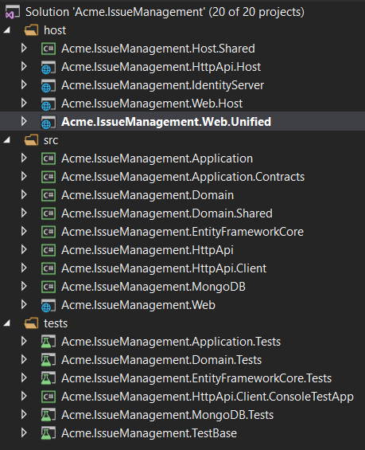

# Modelo de inicialização do módulo MVC

Este modelo pode ser usado para criar um **módulo de aplicativo** **reutilizável com** base nas [melhores práticas e convenções de desenvolvimento do módulo](../Best-Practices/Index.md). Também é adequado para criar **microsserviços** (com ou sem interface do usuário).

## Como começar?

Você pode usar a [ABP CLI](../CLI.md) para criar um novo projeto usando este modelo de inicialização. Como alternativa, você pode criar e fazer o download diretamente na página [Introdução](https://abp.io/get-started) . A abordagem CLI é usada aqui.

Primeiro, instale a ABP CLI se você não tiver instalado antes:

```bash
dotnet tool install -g Volo.Abp.Cli
```

Em seguida, use o `abp new`comando em uma pasta vazia para criar uma nova solução:

```bash
abp new Acme.IssueManagement -t module
```

- `Acme.IssueManagement`é o nome da solução, como *YourCompany.YourProduct* . Você pode usar nomes de nível único, dois ou três níveis.

### Sem interface de usuário

O modelo vem com uma interface do usuário do MVC por padrão. Você pode usar a `--no-ui`opção para não incluir a camada da interface do usuário.

```bash
abp new Acme.IssueManagement -t mvc-module --no-ui
```

## Estrutura da solução

Com base nas opções especificadas, você obterá uma estrutura de solução ligeiramente diferente. Se você não especificar nenhuma opção, terá uma solução como a mostrada abaixo:



Projetos são organizados como `src`, `test`e `host`pastas:

- `src`A pasta contém o módulo real, que é estratificado com base nos princípios [DDD](../Domain-Driven-Design.md) .
- `test` pasta contém testes de unidade e integração.
- `host`A pasta contém aplicativos com configurações diferentes para demonstrar como hospedar o módulo em um aplicativo. Isso não faz parte do módulo, mas é útil no desenvolvimento.

O diagrama abaixo mostra as camadas e dependências do projeto do módulo:


Cada seção abaixo explicará o projeto relacionado e suas dependências.

### Projeto .Domain.Shared

Este projeto contém constantes, enumerações e outros objetos. Na verdade, eles fazem parte da camada de domínio, mas precisam ser usados por todas as camadas / projetos da solução.

Um `IssueType`enum e uma `IssueConsts`classe (que podem ter alguns campos constantes para a `Issue`entidade, como `MaxTitleLength`) são bons candidatos para este projeto.

- Este projeto não depende de outros projetos na solução. Todos os outros projetos dependem disso direta ou indiretamente.

### .Domain Project

Essa é a camada de domínio da solução. Ele contém principalmente [entidades, raízes agregadas](../Entities.md) , [serviços de domínio](../Domain-Services.md) , [tipos de valor](../Value-Types.md) , [interfaces de repositório](../Repositories.md) e outros objetos de domínio.

Uma `Issue`entidade, um `IssueManager`serviço de domínio e uma `IIssueRepository`interface são bons candidatos para este projeto.

- Depende do `.Domain.Shared`porque usa constantes, enumerações e outros objetos definidos nesse projeto.

### .Application.Contracts Project

Este projeto contém principalmente **interfaces de** [serviço de aplicativo](../Application-Services.md) e DTO ( [Data Transfer Objects](../Data-Transfer-Objects.md) ) da camada de aplicativo. Existe para separar a interface e a implementação da camada de aplicação. Dessa forma, o projeto de interface pode ser compartilhado com os clientes como um pacote de contrato.

Uma `IIssueAppService`interface e uma `IssueCreationDto`classe são boas candidatas para este projeto.

- Depende do `.Domain.Shared`porque ele pode usar constantes, enumerações e outros objetos compartilhados deste projeto nas interfaces de serviço de aplicativo e DTOs.

### Projeto de Aplicação

Este projeto contém as **implementações** de [serviço de aplicativo](../Application-Services.md) das interfaces definidas no projeto.`.Application.Contracts`

Uma `IssueAppService`turma é uma boa candidata para este projeto.

- Depende do `.Application.Contracts`projeto para poder implementar as interfaces e usar os DTOs.
- Depende do `.Domain`projeto para poder usar objetos de domínio (entidades, interfaces de repositório ... etc.) para executar a lógica do aplicativo.

### Projeto .EntityFrameworkCore

Este é o projeto de integração do EF Core. Ele define `DbContext`e implementa as interfaces de repositório definidas no `.Domain`projeto.

- Depende do `.Domain`projeto para poder fazer referência a entidades e interfaces de repositório.

> Você pode excluir este projeto se não desejar dar suporte ao EF Core para o seu módulo.

### Projeto .MongoDB

Este é o projeto de integração do MongoDB.

- Depende do `.Domain`projeto para poder fazer referência a entidades e interfaces de repositório.

> Você pode excluir este projeto se não quiser dar suporte ao MongoDB para o seu módulo.

### Projetos de teste

A solução possui vários projetos de teste, um para cada camada:

- `.Domain.Tests` é usado para testar a camada de domínio.
- `.Application.Tests` é usado para testar a camada de aplicativo.
- `.EntityFrameworkCore.Tests` é usado para testar a configuração do EF Core e os repositórios personalizados.
- `.MongoDB.Tests` é usado para testar a configuração do MongoDB e os repositórios personalizados.
- `.TestBase` é um projeto básico (compartilhado) para todos os testes.

Além disso, `.HttpApi.Client.ConsoleTestApp`é um aplicativo de console (não um projeto de teste automatizado) que demonstra o uso de APIs HTTP de um aplicativo Dotnet.

Projetos de teste são preparados para testes de integração;

- É totalmente integrado à estrutura ABP e a todos os serviços em sua aplicação.
- Ele usa o banco de dados SQLite na memória para o EF Core. Para o MongoDB, ele usa a biblioteca [Mongo2Go](https://github.com/Mongo2Go/Mongo2Go) .
- A autorização está desabilitada, portanto, qualquer serviço de aplicativo pode ser facilmente usado em testes.

Você ainda pode criar testes de unidade para suas classes, que serão mais difíceis de escrever (porque você precisará preparar objetos simulados / falsos), mas mais rápidos de executar (porque apenas testa uma única classe e ignora todo o processo de inicialização).

> Os testes de domínio e aplicativos estão usando o EF Core. Se você remover a integração do EF Core ou desejar usar o MongoDB para testar essas camadas, altere manualmente as referências do projeto e as dependências do módulo.

### Projetos Anfitriões

A solução possui alguns aplicativos host para executar seu módulo. Aplicativos host são usados para executar seu módulo em um aplicativo totalmente configurado. É útil no desenvolvimento. Os aplicativos host incluem alguns outros módulos além do módulo que está sendo desenvolvido:

Os aplicativos host oferecem suporte a dois tipos de cenários.

#### Cenário de aplicativo único (unificado)

Se o seu módulo tiver uma interface do usuário, o `.Web.Unified`aplicativo será usado para hospedar a interface do usuário e a API em um único ponto. Ele possui seu próprio `appsettings.json`arquivo (que inclui a cadeia de conexão do banco de dados) e as migrações do banco de dados EF Core.

Para o `.Web.Unified`aplicativo, há um único banco de dados chamado `YourProjectName_Unified`(como *IssueManagement_Unified* para esta amostra).

> Se você selecionou a `--no-ui`opção, este projeto não estará na sua solução.

##### Como correr?

Defina-o como o projeto de inicialização, execute o `Update-Database`comando para o EF Core no Package Manager Console e execute seu aplicativo. O nome de usuário padrão é `admin`e a senha é `1q2w3E*`.

#### Implantação separada e cenário de bancos de dados

Nesse cenário, há três aplicativos;

- `.IdentityServer`application é um servidor de autenticação usado por outros aplicativos. Ele possui seu próprio `appsettings.json`que contém conexão com o banco de dados e outras configurações.
- `.HttpApi.Host`hospeda a API HTTP do módulo. Ele possui seu próprio `appsettings.json`que contém conexões com o banco de dados e outras configurações.
- `.Web.Host`hospedar a interface do usuário do módulo. Este projeto contém um `appsettings.json`arquivo, mas não possui uma cadeia de conexão porque nunca se conecta ao banco de dados. Em vez disso, ele contém principalmente o terminal do servidor de API remoto e o servidor de autenticação.

O diagrama abaixo mostra a relação dos aplicativos:


`.Web.Host`O projeto usa a autenticação OpenId Connect para obter tokens de identidade e acesso para o usuário atual do `.IdentityServer`. Em seguida, usa o token de acesso para chamar o `.HttpApi.Host`. O servidor HTTP API usa autenticação de token de portador para obter declarações do token de acesso para autorizar o usuário atual.

##### Como correr?

Você deve executar o aplicativo com a ordem especificada:

- Primeiro, execute o `.IdentityServer`aplicativo, pois outros aplicativos dependem dele.
- Em seguida, execute o `.HttpApi.Host`que é usado pelo `.Web.Host`aplicativo.
- Por fim, você pode executar o `.Web.Host`projeto e efetuar login no aplicativo usando `admin`como nome de usuário e `1q2w3E*`senha.


  