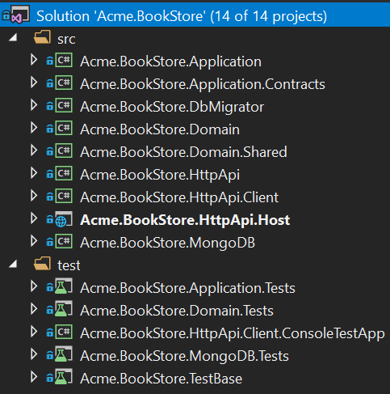
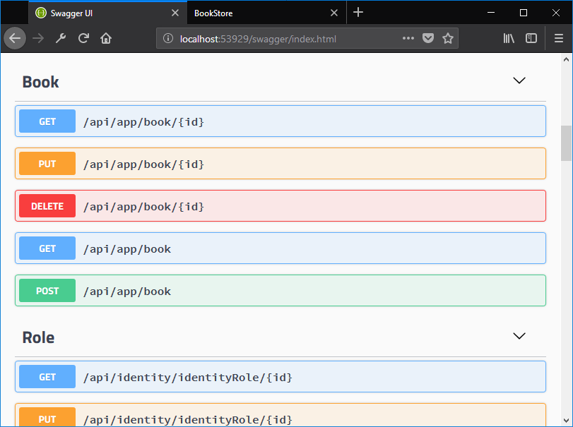
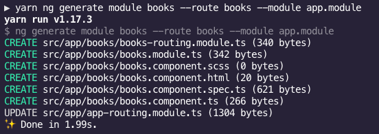
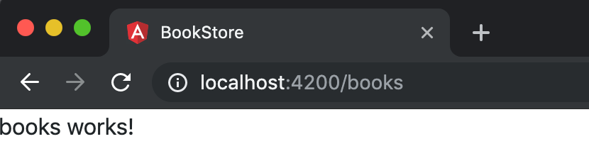
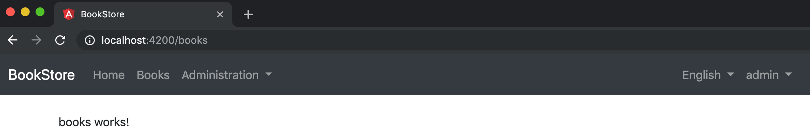
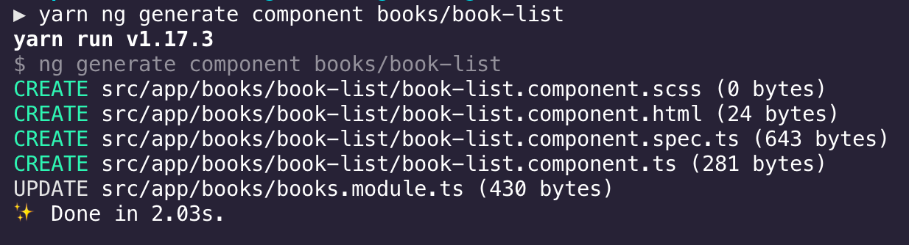
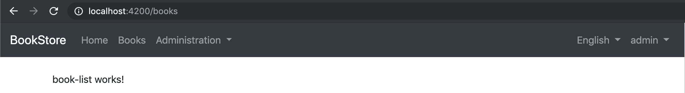
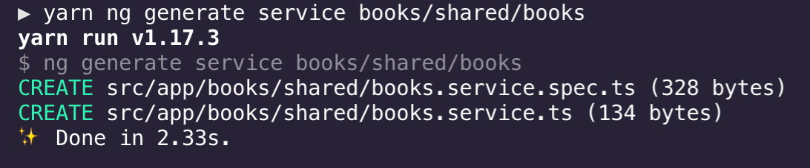
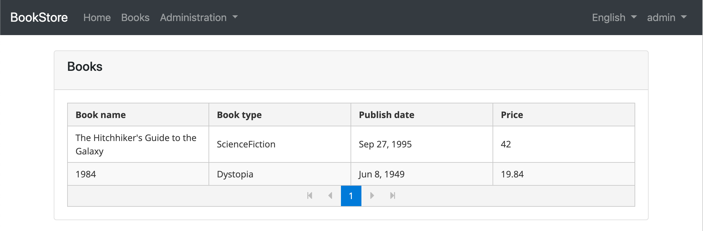
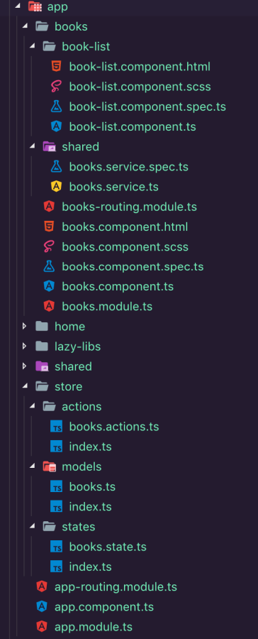

## Tutorial Angular - Parte I

### Sobre este tutorial

Nesta série de tutoriais, você criará um aplicativo usado para gerenciar uma lista de livros e seus autores. **Angular** será usado como estrutura da interface do usuário e **MongoDB** será usado como provedor de banco de dados.

Esta é a primeira parte da série de tutoriais angulares. Veja todas as peças:

- **Parte I: Crie o projeto e uma página de lista de livros (este tutorial)**
- [Parte II: Criar, atualizar e excluir livros](Part-II)
- [Parte III: Testes de Integração](Part-III)

Você pode acessar o **código fonte** do aplicativo no [repositório GitHub](https://github.com/abpframework/abp-samples/tree/master/BookStore-Angular-MongoDb) .

### Criando o projeto

Crie um novo projeto nomeado `Acme.BookStore`selecionando Angular como a estrutura da interface do usuário e MongoDB como o provedor de banco de dados, crie o banco de dados e execute o aplicativo seguindo o [documento Introdução](../../Getting-Started-Angular-Template.md) .

### Estrutura da solução (back-end)

É assim que a estrutura da solução em camadas cuida da criação:



> Você pode ver o [documento do modelo de aplicativo](../../Startup-Templates/Application.md) para entender a estrutura da solução em detalhes. No entanto, você entenderá o básico com este tutorial.

### Criar a entidade do livro

A camada de domínio no modelo de inicialização é separada em dois projetos:

- `Acme.BookStore.Domain`contém suas [entidades](../../Entities.md) , [serviços de domínio](../../Domain-Services.md) e outros objetos principais de domínio.
- `Acme.BookStore.Domain.Shared` contém constantes, enumerações ou outros objetos relacionados ao domínio que podem ser compartilhados com os clientes.

Defina [entidades](../../Entities.md) na **camada de domínio** ( `Acme.BookStore.Domain`projeto) da solução. A entidade principal do aplicativo é a `Book`. Crie uma classe, chamada `Book`, no `Acme.BookStore.Domain`projeto, como mostrado abaixo:

```csharp
using System;
using Volo.Abp.Domain.Entities.Auditing;

namespace Acme.BookStore
{
    public class Book : AuditedAggregateRoot<Guid>
    {
        public string Name { get; set; }

        public BookType Type { get; set; }

        public DateTime PublishDate { get; set; }

        public float Price { get; set; }
    }
}
```

- O ABP possui duas classes base fundamentais para entidades: `AggregateRoot`e `Entity`. **A raiz agregada** é um dos conceitos de **DDD (Domain Driven Design)** . Consulte o [documento da entidade](../../Entities.md) para obter detalhes e melhores práticas.
- `Book`entidade herda `AuditedAggregateRoot`que adiciona algumas propriedades de auditoria ( `CreationTime`, `CreatorId`, `LastModificationTime`... etc.) no topo da `AggregateRoot`classe.
- `Guid`é o **tipo** de **chave primária** da `Book`entidade.

#### BookType Enum

Defina a `BookType`enumeração no `Acme.BookStore.Domain.Shared`projeto:

```csharp
namespace Acme.BookStore
{
    public enum BookType
    {
        Undefined,
        Adventure,
        Biography,
        Dystopia,
        Fantastic,
        Horror,
        Science,
        ScienceFiction,
        Poetry
    }
}
```

#### Adicionar entidade de livro ao seu DbContext

Adicione uma `IMongoCollection`propriedade ao `BookStoreMongoDbContext`interior do `Acme.BookStore.MongoDB`projeto:

```csharp
public class BookStoreMongoDbContext : AbpMongoDbContext
{
    public IMongoCollection<Book> Books => Collection<Book>();
    ...
}
```

#### Adicionar dados de semente (amostra)

Esta seção é opcional, mas seria bom ter um dado inicial no banco de dados na primeira execução. O ABP fornece um [sistema de semente de dados](../../Data-Seeding.md) . Crie uma classe derivada de `IDataSeedContributor`no `.Domain`projeto:

```csharp
using System;
using System.Threading.Tasks;
using Volo.Abp.Data;
using Volo.Abp.DependencyInjection;
using Volo.Abp.Domain.Repositories;

namespace Acme.BookStore
{
    public class BookStoreDataSeederContributor
        : IDataSeedContributor, ITransientDependency
    {
        private readonly IRepository<Book, Guid> _bookRepository;

        public BookStoreDataSeederContributor(IRepository<Book, Guid> bookRepository)
        {
            _bookRepository = bookRepository;
        }

        public async Task SeedAsync(DataSeedContext context)
        {
            if (await _bookRepository.GetCountAsync() > 0)
            {
                return;
            }

            await _bookRepository.InsertAsync(
                new Book
                {
                    Name = "1984",
                    Type = BookType.Dystopia,
                    PublishDate = new DateTime(1949, 6, 8),
                    Price = 19.84f
                }
            );

            await _bookRepository.InsertAsync(
                new Book
                {
                    Name = "The Hitchhiker's Guide to the Galaxy",
                    Type = BookType.ScienceFiction,
                    PublishDate = new DateTime(1995, 9, 27),
                    Price = 42.0f
                }
            );
        }
    }
}
```

`BookStoreDataSeederContributor`simplesmente insere dois livros no banco de dados se não houver nenhum livro adicionado antes. O ABP descobre e executa automaticamente essa classe quando você propaga o banco de dados executando o `Acme.BookStore.DbMigrator`projeto.

### Crie o serviço de aplicativo

O próximo passo é criar um [serviço de aplicativo](../../Application-Services.md) para gerenciar (criar, listar, atualizar, excluir ...) os livros. A camada de aplicativo no modelo de inicialização é separada em dois projetos:

- `Acme.BookStore.Application.Contracts` contém principalmente seus DTOs e interfaces de serviço de aplicativo.
- `Acme.BookStore.Application` contém as implementações dos seus serviços de aplicativo.

#### BookDto

Crie uma classe DTO denominada `BookDto`no `Acme.BookStore.Application.Contracts`projeto:

```csharp
using System;
using Volo.Abp.Application.Dtos;

namespace Acme.BookStore
{
    public class BookDto : AuditedEntityDto<Guid>
    {
        public string Name { get; set; }

        public BookType Type { get; set; }

        public DateTime PublishDate { get; set; }

        public float Price { get; set; }
    }
}
```

- **As** classes **DTO** são usadas para **transferir dados** entre a *camada de apresentação* e a *camada de aplicativo* . Consulte o [documento Objetos de transferência de dados](../../Data-Transfer-Objects.md) para obter mais detalhes.
- `BookDto` é usado para transferir dados do livro para a camada de apresentação para mostrar as informações do livro na interface do usuário.
- `BookDto`é derivado do `AuditedEntityDto<Guid>`que possui propriedades de auditoria exatamente como a `Book`classe definida acima.

Será necessário converter `Book`entidades em `BookDto`objetos enquanto retorna os livros para a camada de apresentação. A biblioteca do [AutoMapper](https://automapper.org/) pode automatizar essa conversão quando você define o mapeamento adequado. O modelo de inicialização é fornecido com o AutoMapper configurado, para que você possa definir o mapeamento na `BookStoreApplicationAutoMapperProfile`classe no `Acme.BookStore.Application`projeto:

```csharp
using AutoMapper;

namespace Acme.BookStore
{
    public class BookStoreApplicationAutoMapperProfile : Profile
    {
        public BookStoreApplicationAutoMapperProfile()
        {
            CreateMap<Book, BookDto>();
        }
    }
}
```

#### CreateUpdateBookDto

Crie uma classe DTO denominada `CreateUpdateBookDto`no `Acme.BookStore.Application.Contracts`projeto:

```csharp
using System;
using System.ComponentModel.DataAnnotations;

namespace Acme.BookStore
{
    public class CreateUpdateBookDto
    {
        [Required]
        [StringLength(128)]
        public string Name { get; set; }

        [Required]
        public BookType Type { get; set; } = BookType.Undefined;

        [Required]
        public DateTime PublishDate { get; set; }

        [Required]
        public float Price { get; set; }
    }
}
```

- Essa classe DTO é usada para obter informações do livro a partir da interface do usuário ao criar ou atualizar um livro.
- Ele define atributos de anotação de dados (como `[Required]`) para definir validações para as propriedades. Os DTOs são [validados automaticamente](../../Validation.md) pela estrutura ABP.

Em seguida, adicione um mapeamento `BookStoreApplicationAutoMapperProfile`do `CreateUpdateBookDto`objeto à `Book`entidade:

```csharp
CreateMap<CreateUpdateBookDto, Book>();
```

#### IBookAppService

Defina uma interface nomeada `IBookAppService`no `Acme.BookStore.Application.Contracts`projeto:

```csharp
using System;
using Volo.Abp.Application.Dtos;
using Volo.Abp.Application.Services;

namespace Acme.BookStore
{
    public interface IBookAppService :
        ICrudAppService< //Defines CRUD methods
            BookDto, //Used to show books
            Guid, //Primary key of the book entity
            PagedAndSortedResultRequestDto, //Used for paging/sorting on getting a list of books
            CreateUpdateBookDto, //Used to create a new book
            CreateUpdateBookDto> //Used to update a book
    {

    }
}
```

- A definição de interfaces para serviços de aplicativos não é requerida pela estrutura. No entanto, é sugerido como uma prática recomendada.
- `ICrudAppService`define comuns **CRUD** métodos: `GetAsync`, `GetListAsync`, `CreateAsync`, `UpdateAsync`e `DeleteAsync`. Não é necessário estendê-lo. Em vez disso, você pode herdar da `IApplicationService`interface vazia e definir seus próprios métodos manualmente.
- Existem algumas variações de `ICrudAppService`onde você pode usar DTOs separados para cada método.

#### BookAppService

Implemente `IBookAppService`como nomeado `BookAppService`no `Acme.BookStore.Application`projeto:

```csharp
using System;
using Volo.Abp.Application.Dtos;
using Volo.Abp.Application.Services;
using Volo.Abp.Domain.Repositories;

namespace Acme.BookStore
{
    public class BookAppService :
        CrudAppService<Book, BookDto, Guid, PagedAndSortedResultRequestDto,
                            CreateUpdateBookDto, CreateUpdateBookDto>,
        IBookAppService
    {
        public BookAppService(IRepository<Book, Guid> repository)
            : base(repository)
        {

        }
    }
}
```

- `BookAppService`é derivado do `CrudAppService<...>`qual implementa todos os métodos CRUD definidos acima.
- `BookAppService`injeta `IRepository<Book, Guid>`qual é o repositório padrão da `Book`entidade. O ABP cria automaticamente repositórios padrão para cada raiz (ou entidade) agregada. Veja o [documento do repositório](../../Repositories) .
- `BookAppService`usa `IObjectMapper`para converter `Book`objetos em `BookDto`objetos e `CreateUpdateBookDto`objetos em `Book`objetos. O modelo de inicialização usa a biblioteca [AutoMapper](http://automapper.org/) como o provedor de mapeamento de objetos. Você definiu os mapeamentos antes, para que funcionem conforme o esperado.

### Controladores de API automática

Você normalmente cria **controladores** para expor serviços de aplicativos como pontos de extremidade da **API HTTP** . Assim, permite que navegadores ou clientes de terceiros os chamem via AJAX. O ABP pode configurar [**automaticamente**](../../AspNetCore/Auto-API-Controllers.md) seus serviços de aplicativo como controladores de API MVC por convenção.

#### UI do Swagger

O modelo de inicialização está configurado para executar a [interface do usuário do swagger](https://swagger.io/tools/swagger-ui/) usando a biblioteca [Swashbuckle.AspNetCore](https://github.com/domaindrivendev/Swashbuckle.AspNetCore) . Execute o `Acme.BookStore.HttpApi.Host`aplicativo e insira `https://localhost:XXXX/swagger/`(substitua XXXX por sua própria porta) como URL no seu navegador.

Você verá alguns pontos de extremidade de serviço internos, bem como o `Book`serviço e seus pontos de extremidade no estilo REST:



O Swagger tem uma ótima interface para testar APIs. Você pode tentar executar a `[GET] /api/app/book`API para obter uma lista de livros.

### Crie a página de livros

Neste tutorial;

- [A CLI angular](https://angular.io/cli) será usada para criar módulos, componentes e serviços
- [NGXS](https://ngxs.gitbook.io/ngxs/) será usado como a biblioteca de gerenciamento de estado
- [O Bootstrap](https://ng-bootstrap.github.io/#/home) será usado como a biblioteca de componentes da interface do usuário.
- [O Visual Studio Code](https://code.visualstudio.com/) será usado como editor de código (você pode usar seu editor favorito).

#### Instalar pacotes NPM

Abra uma janela do terminal, vá para a `angular`pasta e execute o `yarn` comando para instalar os pacotes NPM:

```
yarn
```

#### BooksModule

Execute a seguinte linha de comando para criar um novo módulo, denominado `BooksModule`:

```bash
yarn ng generate module books --route books --module app.module
```



Execute `yarn start`, aguarde Angular para executar o aplicativo e abra `http://localhost:4200/books`em um navegador:



#### Encaminhamento

Abra `app-routing.module.ts`e substitua `books`conforme mostrado abaixo:

```js
import { ApplicationLayoutComponent } from '@abp/ng.theme.basic';-

//...
{
  path: 'books',
  component: ApplicationLayoutComponent,
  loadChildren: () => import('./books/books.module').then(m => m.BooksModule),
  data: {
    routes: {
      name: 'Books',
    } as ABP.Route,
  },
},
```

`ApplicationLayoutComponent`configuração define o layout do aplicativo para a nova página. Se você deseja ver sua rota na barra de navegação (menu principal), também deve adicionar o `data`objeto com `name`propriedade à sua rota.



#### Componente da lista de livros

Primeiro, substitua pela `books.component.html`seguinte linha para colocar a saída do roteador:

```html
<router-outlet></router-outlet>
```

Em seguida, execute o comando abaixo no terminal na pasta raiz para gerar um novo componente, chamado book-list:

```bash
yarn ng generate component books/book-list
```



Importe `SharedModule`para `BooksModule`para reutilizar alguns componentes e serviços definidos em:

```js
import { SharedModule } from '../shared/shared.module';

@NgModule({
  //...
  imports: [
    //...
    SharedModule,
  ],
})
export class BooksModule {}
```

Em seguida, atualize o `routes`no `books-routing.module.ts`para adicionar o novo componente book-list:

```js
import { BookListComponent } from './book-list/book-list.component';

const routes: Routes = [
  {
    path: '',
    component: BooksComponent,
    children: [{ path: '', component: BookListComponent }],
  },
];

@NgModule({
  imports: [RouterModule.forChild(routes)],
  exports: [RouterModule],
})
export class BooksRoutingModule {}
```



#### Criar BooksState

Execute o seguinte comando no terminal para criar um novo estado, denominado `BooksState`:

```shell
yarn ng generate ngxs-schematic:state books
```

Este comando cria vários novos arquivos e edições `app.modules.ts`para importar o `NgxsModule`com o novo estado:

```js
// app.module.ts

import { BooksState } from './store/states/books.state';

@NgModule({
  imports: [
    //...
    NgxsModule.forRoot([BooksState]),
  ],
  //...
})
export class AppModule {}
```

#### Obter dados de livros do back-end

Primeiro, crie tipos de dados para mapear os dados que retornam do back-end (você pode verificar a interface do swagger ou a API do back-end para conhecer o formato dos dados).

Modifique o `books.ts`como mostrado abaixo:

```js
export namespace Books {
  export interface State {
    books: Response;
  }

  export interface Response {
    items: Book[];
    totalCount: number;
  }

  export interface Book {
    name: string;
    type: BookType;
    publishDate: string;
    price: number;
    lastModificationTime: string;
    lastModifierId: string;
    creationTime: string;
    creatorId: string;
    id: string;
  }

  export enum BookType {
    Undefined,
    Adventure,
    Biography,
    Dystopia,
    Fantastic,
    Horror,
    Science,
    ScienceFiction,
    Poetry,
  }
}
```

Adicionada `Book`interface que representa um objeto de livro e `BookType`enum representa uma categoria de livro.

#### BooksService

Agora, crie um novo serviço, nomeado `BooksService`para executar chamadas HTTP para o servidor:

```bash
yarn ng generate service books/shared/books
```



Modifique `books.service.ts`como mostrado abaixo:

```js
import { Injectable } from '@angular/core';
import { RestService } from '@abp/ng.core';
import { Books } from '../../store/models';
import { Observable } from 'rxjs';

@Injectable({
  providedIn: 'root',
})
export class BooksService {
  constructor(private restService: RestService) {}

  get(): Observable<Books.Response> {
    return this.restService.request<void, Books.Response>({
      method: 'GET',
      url: '/api/app/book'
    });
  }
}
```

Adicionado o `get`método para obter a lista de livros executando uma solicitação HTTP no terminal relacionado.

Substitua o `books.actions.ts`conteúdo conforme mostrado abaixo:

```js
export class GetBooks {
  static readonly type = '[Books] Get';
}
```

#### Implementar o BooksState

Abra o `books.state.ts`e altere o arquivo, como mostrado abaixo:

```js
import { State, Action, StateContext, Selector } from '@ngxs/store';
import { GetBooks } from '../actions/books.actions';
import { Books } from '../models/books';
import { BooksService } from '../../books/shared/books.service';
import { tap } from 'rxjs/operators';
import { Injectable } from '@angular/core';

@State<Books.State>({
  name: 'BooksState',
  defaults: { books: {} } as Books.State,
})
@Injectable()
export class BooksState {
  @Selector()
  static getBooks(state: Books.State) {
    return state.books.items || [];
  }

  constructor(private booksService: BooksService) {}

  @Action(GetBooks)
  get(ctx: StateContext<Books.State>) {
    return this.booksService.get().pipe(
      tap(booksResponse => {
        ctx.patchState({
          books: booksResponse,
        });
      }),
    );
  }
}
```

Adicionada a `GetBooks`ação que usa o `BookService`definido acima para obter os livros e corrigir o estado.

> O NGXS exige retornar o observável sem assiná-lo, conforme feito nesta amostra (na função get).

#### BookListComponent

Modifique o `book-list.component.ts`como mostrado abaixo:

```js
import { Component, OnInit } from '@angular/core';
import { Store, Select } from '@ngxs/store';
import { BooksState } from '../../store/states';
import { Observable } from 'rxjs';
import { Books } from '../../store/models';
import { GetBooks } from '../../store/actions';

@Component({
  selector: 'app-book-list',
  templateUrl: './book-list.component.html',
  styleUrls: ['./book-list.component.scss'],
})
export class BookListComponent implements OnInit {
  @Select(BooksState.getBooks)
  books$: Observable<Books.Book[]>;

  booksType = Books.BookType;

  loading = false;

  constructor(private store: Store) {}

  ngOnInit() {
    this.loading = true;
    this.store.dispatch(new GetBooks()).subscribe(() => {
      this.loading = false;
    });
  }
}
```

> Consulte as [ações de despacho](https://ngxs.gitbook.io/ngxs/concepts/store#dispatching-actions) e [selecione](https://ngxs.gitbook.io/ngxs/concepts/select) na documentação do NGXS para obter mais informações sobre esses recursos do NGXS.

Substitua o `book-list.component.html`conteúdo conforme mostrado abaixo:

```html
<div id="wrapper" class="card">
  <div class="card-header">
    <div class="row">
      <div class="col col-md-6">
        <h5 class="card-title">
          Books
        </h5>
      </div>
    </div>
  </div>
  <div class="card-body">
    <p-table [value]="books$ | async" [loading]="loading" [paginator]="true" [rows]="10">
      <ng-template pTemplate="header">
        <tr>
          <th>Book name</th>
          <th>Book type</th>
          <th>Publish date</th>
          <th>Price</th>
        </tr>
      </ng-template>
      <ng-template pTemplate="body" let-data>
        <tr>
          <td></td>
          <td></td>
          <td></td>
          <td></td>
        </tr>
      </ng-template>
    </p-table>
  </div>
</div>
```

> Usamos a [tabela PrimeNG](https://www.primefaces.org/primeng/#/table) neste componente.

A página de livros resultante é mostrada abaixo:



E esta é a estrutura de pastas e arquivos no final deste tutorial:



> Este tutorial segue o [Guia de estilo angular](https://angular.io/guide/styleguide#file-tree) .

### Próxima parte

Veja a [próxima parte](Part-II.md) deste tutorial.


  