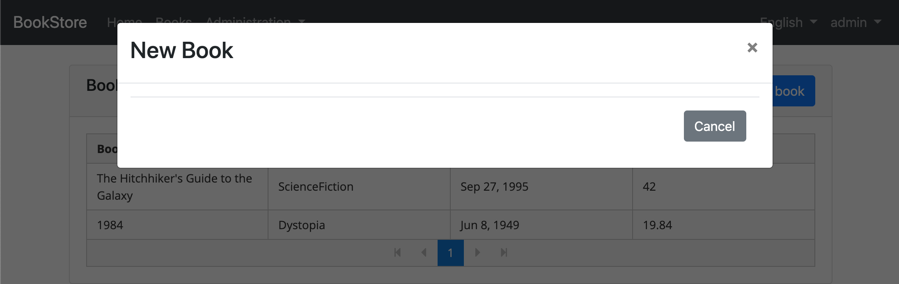
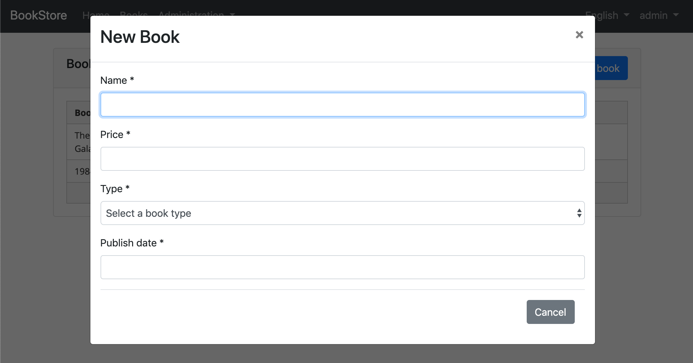
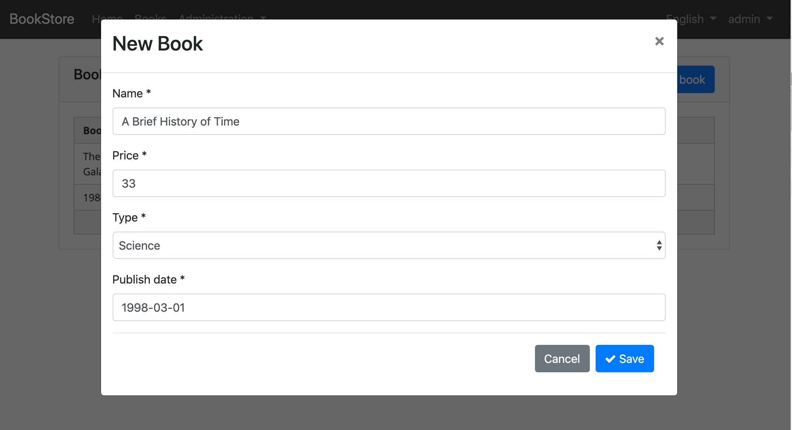
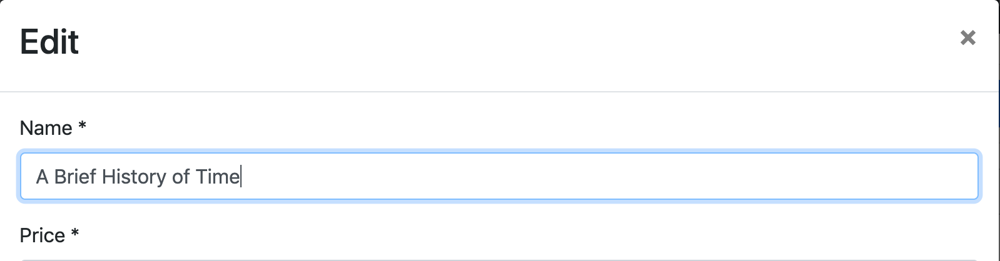
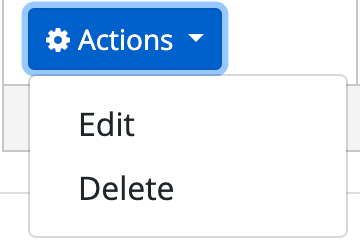
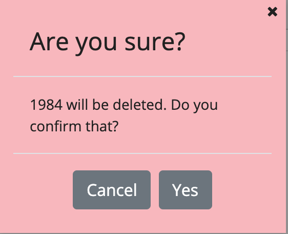

## Tutorial Angular - Parte II

### Sobre este tutorial

Esta é a segunda parte da série de tutoriais angulares. Veja todas as peças:

- [Parte I: Crie o projeto e uma página da lista de livros](Part-I.md)
- **Parte II: Criar, atualizar e excluir livros (este tutorial)**
- [Parte III: Testes de Integração](Part-III.md)

Você pode acessar o **código fonte** do aplicativo no [repositório GitHub](https://github.com/abpframework/abp-samples/tree/master/BookStore-Angular-MongoDb) .

### Criando um novo livro

Nesta seção, você aprenderá como criar um novo formulário de diálogo modal para criar um novo livro.

#### Definição do tipo

Criar uma interface, com o nome `CreateUpdateBookInput`no `books.ts`como mostrado abaixo:

```js
export namespace Books {
  //...
  export interface CreateUpdateBookInput {
    name: string;
    type: BookType;
    publishDate: string;
    price: number;
  }
}
```

`CreateUpdateBookInput`interface corresponde ao `CreateUpdateBookDto`no back-end.

#### Método de Serviço

Abra o `books.service.ts`e adicione um novo método, nomeado `create`para executar uma solicitação HTTP POST no servidor:

```js
create(createBookInput: Books.CreateUpdateBookInput): Observable<Books.Book> {
  return this.restService.request<Books.CreateUpdateBookInput, Books.Book>({
    method: 'POST',
    url: '/api/app/book',
    body: createBookInput
  });
}
```

- `restService.request`A função obtém parâmetros genéricos para os tipos enviados e recebidos do servidor. Este exemplo envia um `CreateUpdateBookInput`objeto e recebe um `Book`objeto (você pode definir o tipo `void`de solicitação ou retorno, se não for usado).

#### Definições de estado

Adicione a `CreateUpdateBook`ação ao `books.actions.ts`conforme mostrado abaixo:

```js
import { Books } from '../models';

export class CreateUpdateBook {
  static readonly type = '[Books] Create Update Book';
  constructor(public payload: Books.CreateUpdateBookInput) {}
}
```

Abra `books.state.ts`e defina o `save`método que ouvirá uma `CreateUpdateBook`ação para criar um livro:

```js
import { ... , CreateUpdateBook } from '../actions/books.actions';
import { ... , switchMap } from 'rxjs/operators';
//...
@Action(CreateUpdateBook)
save(ctx: StateContext<Books.State>, action: CreateUpdateBook) {
  return this.booksService
      .create(action.payload)
      .pipe(switchMap(() => ctx.dispatch(new GetBooks())));
}
```

Quando a `SaveBook`ação é despachada, o método save é executado. Ele chama o `create`método do `BooksService`definido anteriormente. Após a chamada de serviço, `BooksState`despacha a `GetBooks`ação para obter livros novamente do servidor para atualizar a página.

#### Adicionar um modal ao BookListComponent

Abra o `book-list.component.html`e adicione o `abp-modal`para mostrar / ocultar o modal para criar um novo livro.

```html
<abp-modal [(visible)]="isModalOpen">
  <ng-template #abpHeader>
    <h3>New Book</h3>
  </ng-template>

  <ng-template #abpBody> </ng-template>

  <ng-template #abpFooter>
    <button type="button" class="btn btn-secondary" abpClose>
      Cancel
    </button>
  </ng-template>
</abp-modal>
```

`abp-modal`é um componente pré-construído para mostrar os modais. Embora você possa usar outra abordagem para mostrar um modal, `abp-modal`fornece benefícios adicionais.

Adicione um botão rotulado `New book`para mostrar o modal:

```html
<div class="row">
  <div class="col col-md-6">
    <h5 class="card-title">
      Books
    </h5>
  </div>
  <div class="text-right col col-md-6">
    <button id="create-role" class="btn btn-primary" type="button" (click)="createBook()">
      <i class="fa fa-plus mr-1"></i> <span>New book</span>
    </button>
  </div>
</div>
```

Abra a variável `book-list.component.ts`e adicione `isModalOpen`e `createBook`método para mostrar / ocultar o modal.

```js
isModalOpen = false;

//...

createBook() {
  this.isModalOpen = true;
}
```



#### Criar um formulário reativo

> [Os formulários reativos](https://angular.io/guide/reactive-forms) fornecem uma abordagem orientada a modelo para lidar com entradas de formulário cujos valores mudam ao longo do tempo.

Adicione uma `form`variável e injete um `FormBuilder`serviço `book-list.component.ts`como mostrado abaixo (lembre-se de adicionar a instrução de importação).

```js
import { FormGroup, FormBuilder } from '@angular/forms';

form: FormGroup;

constructor(
  //...
  private fb: FormBuilder
) {}
```

> O serviço [FormBuilder](https://angular.io/api/forms/FormBuilder) fornece métodos convenientes para gerar controles. Reduz a quantidade de clichê necessária para criar formulários complexos.

Adicione o `buildForm`método para criar um formulário de livro.

```js
buildForm() {
  this.form = this.fb.group({
    name: ['', Validators.required],
    type: [null, Validators.required],
    publishDate: [null, Validators.required],
    price: [null, Validators.required],
  });
}
```

- O `group`método de `FormBuilder`( `fb`) cria a `FormGroup`.
- Adicionado `Validators.required`método estático que valida o elemento de formulário relacionado.

Modifique o `createBook`método como mostrado abaixo:

```js
createBook() {
  this.buildForm();
  this.isModalOpen = true;
}
```

#### Crie os elementos DOM do formulário

Abra `book-list.component.html`e adicione o formulário no modelo de corpo do modal.

```html
<ng-template #abpBody>
  <form [formGroup]="form">
    <div class="form-group">
      <label for="book-name">Name</label><span> * </span>
      <input type="text" id="book-name" class="form-control" formControlName="name" autofocus />
    </div>

    <div class="form-group">
      <label for="book-price">Price</label><span> * </span>
      <input type="number" id="book-price" class="form-control" formControlName="price" />
    </div>

    <div class="form-group">
      <label for="book-type">Type</label><span> * </span>
      <select class="form-control" id="book-type" formControlName="type">
        <option [ngValue]="null">Select a book type</option>
        <option [ngValue]="booksType[type]" *ngFor="let type of bookTypes"> </option>
      </select>
    </div>

    <div class="form-group">
      <label>Publish date</label><span> * </span>
      <input
        #datepicker="ngbDatepicker"
        class="form-control"
        name="datepicker"
        formControlName="publishDate"
        ngbDatepicker
        (click)="datepicker.toggle()"
      />
    </div>
  </form>
</ng-template>
```

- Este modelo cria um formulário com os campos Nome, Preço, Tipo e Data de publicação.

> Usamos o [datepicker do NgBootstrap](https://ng-bootstrap.github.io/#/components/datepicker/overview) neste componente.

Abra o `book-list.component.ts`e crie uma matriz chamada `bookTypes`:

```js
//...
form: FormGroup;

bookTypes = Object.keys(Books.BookType).filter(
    bookType => typeof this.booksType[bookType] === 'number'
);
```

O `bookTypes`contém os campos da `BookType`enumeração. A matriz resultante é mostrada abaixo:

```js
['Adventure', 'Biography', 'Dystopia', 'Fantastic' ...]
```

Essa matriz foi usada no modelo de formulário anterior (no `ngFor`loop).

#### Requisitos do Datepicker

Você precisa importar `NgbDatepickerModule`para o `books.module.ts`:

```js
import { NgbDatepickerModule } from '@ng-bootstrap/ng-bootstrap';

@NgModule({
  imports: [
    // ...
    NgbDatepickerModule,
  ],
})
export class BooksModule {}
```

Abra o `book-list.component.ts`e adicione `providers`como mostrado abaixo:

```js
import { NgbDateNativeAdapter, NgbDateAdapter } from '@ng-bootstrap/ng-bootstrap';

@Component({
  // ...
  providers: [{ provide: NgbDateAdapter, useClass: NgbDateNativeAdapter }],
})
export class BookListComponent implements OnInit {
// ...
```

> O `NgbDateAdapter`valor do Datepicker converte em `Date`tipo. Consulte os [adaptadores datepicker](https://ng-bootstrap.github.io/#/components/datepicker/overview) para obter mais detalhes.



#### Salvando o livro

Abra o `book-list.component.html`e adicione um `abp-button`para salvar o formulário.

```html
<ng-template #abpFooter>
  <button type="button" class="btn btn-secondary" abpClose>
    Cancel
  </button>
  <button class="btn btn-primary" (click)="save()">
    <i class="fa fa-check mr-1"></i>
    Save
  </button>
</ng-template>
```

Isso adiciona um botão Salvar à área inferior do modal:



Em seguida, defina um `save`método no `BookListComponent`:

```js
save() {
  if (this.form.invalid) {
    return;
  }

  this.store.dispatch(new CreateUpdateBook(this.form.value)).subscribe(() => {
    this.isModalOpen = false;
    this.form.reset();
  });
}
```

### Atualizando um livro existente

#### BooksService

Abra o `books.service.ts`e adicione os métodos `getById`e `update`.

```js
getById(id: string): Observable<Books.Book> {
  return this.restService.request<void, Books.Book>({
    method: 'GET',
    url: `/api/app/book/${id}`
  });
}

update(updateBookInput: Books.CreateUpdateBookInput, id: string): Observable<Books.Book> {
  return this.restService.request<Books.CreateUpdateBookInput, Books.Book>({
    method: 'PUT',
    url: `/api/app/book/${id}`,
    body: updateBookInput
  });
}
```

#### Ação CreateUpdateBook

Abra o  parâmetro `books.actins.ts`e adicione `id`à `CreateUpdateBook`ação:

```js
export class CreateUpdateBook {
  static readonly type = '[Books] Create Update Book';
  constructor(public payload: Books.CreateUpdateBookInput, public id?: string) {}
}
```

Abra `books.state.ts`e modifique o `save`método conforme mostrado abaixo:

```js
@Action(CreateUpdateBook)
save(ctx: StateContext<Books.State>, action: CreateUpdateBook) {
  let request;

  if (action.id) {
    request = this.booksService.update(action.payload, action.id);
  } else {
    request = this.booksService.create(action.payload);
  }

  return request.pipe(switchMap(() => ctx.dispatch(new GetBooks())));
}
```

#### BookListComponent

Injectar `BooksService`dependência, adicionando-o ao `book-list.component.ts`construtor e adicione uma variável chamada `selectedBook`.

```js
import { BooksService } from '../shared/books.service';
//...
selectedBook = {} as Books.Book;

constructor(
  //...
  private booksService: BooksService
)
```

`booksService`é usado para obter o livro de edição para preparar o formulário. Modifique o `buildForm`método para reutilizar o mesmo formulário ao editar um livro.

```js
buildForm() {
  this.form = this.fb.group({
    name: [this.selectedBook.name || '', Validators.required],
    type: this.selectedBook.type || null,
    publishDate: this.selectedBook.publishDate ? new Date(this.selectedBook.publishDate) : null,
    price: this.selectedBook.price || null,
  });
}
```

Adicione o `editBook`método como mostrado abaixo:

```js
  editBook(id: string) {
    this.booksService.getById(id).subscribe(book => {
      this.selectedBook = book;
      this.buildForm();
      this.isModalOpen = true;
    });
  }
```

Adicionado `editBook`método para obter o livro de edição, criar o formulário e mostrar o modal.

Agora, adicione a `selectedBook`definição ao `createBook`método para reutilizar o mesmo formulário ao criar um novo livro:

```js
  createBook() {
    this.selectedBook = {} as Books.Book;
    //...
  }
```

Modifique o `save`método para passar o ID do livro selecionado, como mostrado abaixo:

```js
save() {
  if (this.form.invalid) {
    return;
  }

  this.store.dispatch(new CreateUpdateBook(this.form.value, this.selectedBook.id))
    .subscribe(() => {
      this.isModalOpen = false;
      this.form.reset();
    });
}
```

#### Adicione o menu suspenso "Ações" à tabela

Abra o `book-list.component.html` e adicione modifique o `p-table` como mostrado abaixo:

```html
<p-table [value]="books$ | async" [loading]="loading" [paginator]="true" [rows]="10">
  <ng-template pTemplate="header">
    <tr>
      <th>Actions</th>
      <th>Book name</th>
      <th>Book type</th>
      <th>Publish date</th>
      <th>Price</th>
    </tr>
  </ng-template>
  <ng-template pTemplate="body" let-data>
    <tr>
      <td>
        <div ngbDropdown class="d-inline-block">
          <button
            class="btn btn-primary btn-sm dropdown-toggle"
            data-toggle="dropdown"
            aria-haspopup="true"
            ngbDropdownToggle
          >
            <i class="fa fa-cog mr-1"></i>Actions
          </button>
          <div ngbDropdownMenu>
            <button ngbDropdownItem (click)="editBook(data.id)">Edit</button>
          </div>
        </div>
      </td>
      <td></td>
      <td></td>
      <td></td>
      <td></td>
    </tr>
  </ng-template>
</p-table>
```

- Adicionado um `th`para a coluna "Ações".
- Adicionado `button`com `ngbDropdownToggle`para abrir ações quando clicamos no botão.

> Nós costumávamos usar o [NgbDropdown](https://ng-bootstrap.github.io/#/components/dropdown/examples) no menu suspenso de ações.

A interface do usuário final é semelhante a:


Atualize o cabeçalho modal para alterar o título com base na operação atual:

```html
<ng-template #abpHeader>
  <h3></h3>
</ng-template>
```



### Exclusão de um livro existente

#### BooksService

Abra `books.service.ts`e inclua um `delete`método para excluir um livro com o `id`, executando uma solicitação HTTP no nó de extremidade relacionado:

```js
delete(id: string): Observable<void> {
  return this.restService.request<void, void>({
    method: 'DELETE',
    url: `/api/app/book/${id}`
  });
}
```

#### Ação DeleteBook

Adicione uma ação chamada `DeleteBook`para `books.actions.ts`:

```js
export class DeleteBook {
  static readonly type = '[Books] Delete';
  constructor(public id: string) {}
}
```

Abra o `books.state.ts`e adicione o `delete`método que ouvirá a `DeleteBook`ação para excluir um livro:

```js
import { ... , DeleteBook } from '../actions/books.actions';
//...
@Action(DeleteBook)
delete(ctx: StateContext<Books.State>, action: DeleteBook) {
  return this.booksService.delete(action.id).pipe(switchMap(() => ctx.dispatch(new GetBooks())));
}
```

- Adicionado `DeleteBook`à lista de importação.
- Usa `bookService`para excluir o livro.

\#### Adicionar um botão Excluir

Abra `book-list.component.html`e modifique `ngbDropdownMenu`para adicionar o botão excluir, como mostrado abaixo:

```html
<div ngbDropdownMenu>
  ...
  <button ngbDropdownItem (click)="delete(data.id, data.name)">
    Delete
  </button>
</div>
```

A interface do usuário suspensa de ações finais é semelhante a abaixo:



\#### Caixa de diálogo Excluir confirmação

Abra `book-list.component.ts`e injete o `ConfirmationService`.

```js
import { ConfirmationService } from '@abp/ng.theme.shared';
//...
constructor(
	//...
  private confirmationService: ConfirmationService
)
```

> `ConfirmationService` é um serviço simples fornecido pela estrutura ABP que usa internamente o PrimeNG.

Adicione um método de exclusão ao `BookListComponent`:

```js
import { ... , DeleteBook } from '../../store/actions';
import { ... , Toaster } from '@abp/ng.theme.shared';
//...
delete(id: string, name: string) {
  this.confirmationService
    .error(`${name} will be deleted. Do you confirm that?`, 'Are you sure?')
    .subscribe(status => {
      if (status === Toaster.Status.confirm) {
        this.store.dispatch(new DeleteBook(id));
      }
    });
}
```

O `delete`método mostra um pop-up de confirmação e assina a resposta do usuário. `DeleteBook`ação despachada somente se o usuário clicar no `Yes`botão O pop-up de confirmação é exibido abaixo:



### Próxima parte

Veja a [próxima parte](Part-III.md) deste tutorial.

