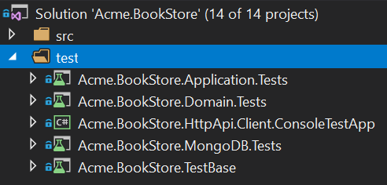
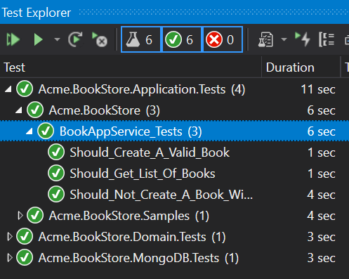

## Tutorial do ASP.NET Core MVC - Parte III

### Sobre este tutorial

Esta é a terceira parte da série de tutoriais Angular. Veja todas as peças:

- [Parte I: Crie o projeto e uma página da lista de livros](Part-I.md)
- [Parte II: Criar, atualizar e excluir livros](Part-II.md)
- **Parte III: Testes de Integração (este tutorial)**

Esta parte abrange os testes do **lado** do **servidor** . Você pode acessar o **código fonte** do aplicativo no [repositório GitHub](https://github.com/abpframework/abp-samples/tree/master/BookStore-Angular-MongoDb) .

### Testar projetos na solução

Existem vários projetos de teste na solução:



Cada projeto é usado para testar o projeto de aplicativo relacionado. Os projetos de teste usam as seguintes bibliotecas para teste:

- [xunit](https://xunit.github.io/) como a principal estrutura de teste.
- [Shouldly](http://shouldly.readthedocs.io/en/latest/) como uma biblioteca de asserções.
- [NSubstitute](http://nsubstitute.github.io/) como uma biblioteca de zombaria.

### Adicionando dados de teste

O modelo de inicialização contém a `BookStoreTestDataSeedContributor`classe no `Acme.BookStore.TestBase`projeto que cria alguns dados para executar os testes.

Mude a `BookStoreTestDataSeedContributor`classe como mostrado abaixo:

```csharp
using System;
using System.Threading.Tasks;
using Volo.Abp.Data;
using Volo.Abp.DependencyInjection;
using Volo.Abp.Domain.Repositories;
using Volo.Abp.Guids;

namespace Acme.BookStore
{
    public class BookStoreTestDataSeedContributor
        : IDataSeedContributor, ITransientDependency
    {
        private readonly IRepository<Book, Guid> _bookRepository;
        private readonly IGuidGenerator _guidGenerator;

        public BookStoreTestDataSeedContributor(
            IRepository<Book, Guid> bookRepository, 
            IGuidGenerator guidGenerator)
        {
            _bookRepository = bookRepository;
            _guidGenerator = guidGenerator;
        }

        public async Task SeedAsync(DataSeedContext context)
        {
            await _bookRepository.InsertAsync(
                new Book
                {
                    Id = _guidGenerator.Create(),
                    Name = "Test book 1",
                    Type = BookType.Fantastic,
                    PublishDate = new DateTime(2015, 05, 24),
                    Price = 21
                }
            );

            await _bookRepository.InsertAsync(
                new Book
                {
                    Id = _guidGenerator.Create(),
                    Name = "Test book 2",
                    Type = BookType.Science,
                    PublishDate = new DateTime(2014, 02, 11),
                    Price = 15
                }
            );
        }
    }
}
```

- Injetado `IRepository<Book, Guid>`e usado no `SeedAsync`para criar duas entidades de livro como dados de teste.
- `IGuidGenerator`Serviço usado para criar GUIDs. Embora `Guid.NewGuid()`funcionasse perfeitamente para testes, `IGuidGenerator`possui recursos adicionais especialmente importantes ao usar bancos de dados reais (consulte o documento de geração do [Guid](../../Guid-Generation.md) para obter mais informações).

### Testando o BookAppService

Crie uma classe de teste denominada `BookAppService_Tests`no `Acme.BookStore.Application.Tests`projeto:

```csharp
using System.Threading.Tasks;
using Shouldly;
using Volo.Abp.Application.Dtos;
using Xunit;

namespace Acme.BookStore
{
    public class BookAppService_Tests : BookStoreApplicationTestBase
    {
        private readonly IBookAppService _bookAppService;

        public BookAppService_Tests()
        {
            _bookAppService = GetRequiredService<IBookAppService>();
        }

        [Fact]
        public async Task Should_Get_List_Of_Books()
        {
            //Act
            var result = await _bookAppService.GetListAsync(
                new PagedAndSortedResultRequestDto()
            );

            //Assert
            result.TotalCount.ShouldBeGreaterThan(0);
            result.Items.ShouldContain(b => b.Name == "Test book 1");
        }
    }
}
```

- `Should_Get_List_Of_Books`O teste simplesmente usa o `BookAppService.GetListAsync`método para obter e verificar a lista de usuários.

Adicione um novo teste que crie um novo livro válido:

```csharp
[Fact]
public async Task Should_Create_A_Valid_Book()
{
    //Act
    var result = await _bookAppService.CreateAsync(
        new CreateUpdateBookDto
        {
            Name = "New test book 42",
            Price = 10,
            PublishDate = DateTime.Now,
            Type = BookType.ScienceFiction
        }
    );

    //Assert
    result.Id.ShouldNotBe(Guid.Empty);
    result.Name.ShouldBe("New test book 42");
}
```

Adicione um novo teste que tente criar um livro inválido e falhe:

```csharp
[Fact]
public async Task Should_Not_Create_A_Book_Without_Name()
{
    var exception = await Assert.ThrowsAsync<AbpValidationException>(async () =>
    {
        await _bookAppService.CreateAsync(
            new CreateUpdateBookDto
            {
                Name = "",
                Price = 10,
                PublishDate = DateTime.Now,
                Type = BookType.ScienceFiction
            }
        );
    });

    exception.ValidationErrors
        .ShouldContain(err => err.MemberNames.Any(mem => mem == "Name"));
}
```

- Como o `Name`está vazio, o ABP lança um `AbpValidationException`.

Abra a **janela Test Explorer** (use o menu Test -> Windows -> Test Explorer, se não estiver visível) e **execute Todos os** testes:



Parabéns, ícones verdes mostram que os testes foram aprovados com sucesso!


  