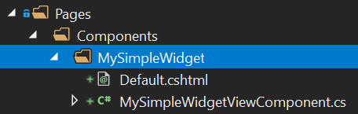

# Widgets

ABP fornece um modelo e infraestrutura para criar **widgets reutilizáveis**. O sistema de widgets é uma extensão dos [Componentes de Visualização do ASP.NET Core](https://docs.microsoft.com/en-us/aspnet/core/mvc/views/view-components). Os widgets são especialmente úteis quando você deseja:

* Ter dependências de **scripts e estilos** para o seu widget.
* Criar **painéis de controle** com widgets usados dentro.
* Definir widgets em **[módulos](../../Module-Development-Basics.md)** reutilizáveis.
* Cooperar com widgets com sistemas de **[autorização](../../Authorization.md)** e **[agrupamento](Bundling-Minification.md)**.

## Definição Básica de Widget

### Criar um Componente de Visualização

Como primeiro passo, crie um novo Componente de Visualização regular do ASP.NET Core:



**MySimpleWidgetViewComponent.cs**:

````csharp
using Microsoft.AspNetCore.Mvc;
using Volo.Abp.AspNetCore.Mvc;

namespace DashboardDemo.Web.Pages.Components.MySimpleWidget
{
    public class MySimpleWidgetViewComponent : AbpViewComponent
    {
        public IViewComponentResult Invoke()
        {
            return View();
        }
    }
}
````

Herdar de `AbpViewComponent` não é obrigatório. Você pode herdar do `ViewComponent` padrão do ASP.NET Core. `AbpViewComponent` apenas define algumas propriedades úteis básicas.

Você pode injetar um serviço e usá-lo no método `Invoke` para obter alguns dados do serviço. Talvez seja necessário tornar o método Invoke assíncrono, como `public async Task<IViewComponentResult> InvokeAsync()`. Consulte o documento [Componentes de Visualização do ASP.NET Core](https://docs.microsoft.com/en-us/aspnet/core/mvc/views/view-components) para ver todos os diferentes usos.

**Default.cshtml**:

```xml
<div class="my-simple-widget">
    <h2>My Simple Widget</h2>
    <p>This is a simple widget!</p>
</div>
```

### Definir o Widget

Adicione um atributo `Widget` à classe `MySimpleWidgetViewComponent` para marcar este componente de visualização como um widget:

````csharp
using Microsoft.AspNetCore.Mvc;
using Volo.Abp.AspNetCore.Mvc;
using Volo.Abp.AspNetCore.Mvc.UI.Widgets;

namespace DashboardDemo.Web.Pages.Components.MySimpleWidget
{
    [Widget]
    public class MySimpleWidgetViewComponent : AbpViewComponent
    {
        public IViewComponentResult Invoke()
        {
            return View();
        }
    }
}
````

## Renderizando um Widget

Renderizar um widget é bastante padrão. Use o método `Component.InvokeAsync` em uma view/página razor como você faria para qualquer componente de visualização. Exemplos:

````xml
@await Component.InvokeAsync("MySimpleWidget")
@await Component.InvokeAsync(typeof(MySimpleWidgetViewComponent))
````

A primeira abordagem usa o nome do widget, enquanto a segunda abordagem usa o tipo do componente de visualização.

### Widgets com Argumentos

O sistema de componentes de visualização do ASP.NET Core permite que você aceite argumentos para componentes de visualização. O exemplo de componente de visualização abaixo aceita `startDate` e `endDate` e usa esses argumentos para recuperar dados de um serviço.

````csharp
using System;
using System.Threading.Tasks;
using Microsoft.AspNetCore.Mvc;
using Volo.Abp.AspNetCore.Mvc;
using Volo.Abp.AspNetCore.Mvc.UI.Widgets;

namespace DashboardDemo.Web.Pages.Shared.Components.CountersWidget
{
    [Widget]
    public class CountersWidgetViewComponent : AbpViewComponent
    {
        private readonly IDashboardAppService _dashboardAppService;

        public CountersWidgetViewComponent(IDashboardAppService dashboardAppService)
        {
            _dashboardAppService = dashboardAppService;
        }

        public async Task<IViewComponentResult> InvokeAsync(
            DateTime startDate, DateTime endDate)
        {
            var result = await _dashboardAppService.GetCountersWidgetAsync(
                new CountersWidgetInputDto
                {
                    StartDate = startDate,
                    EndDate = endDate
                }
            );

            return View(result);
        }
    }
}
````

Agora, você precisa passar um objeto anônimo para passar argumentos, como mostrado abaixo:

````xml
@await Component.InvokeAsync("CountersWidget", new
{
    startDate = DateTime.Now.Subtract(TimeSpan.FromDays(7)),
    endDate = DateTime.Now
})
````

## Nome do Widget

O nome padrão dos componentes de visualização é calculado com base no nome do tipo do componente de visualização. Se o tipo do componente de visualização for `MySimpleWidgetViewComponent`, então o nome do widget será `MySimpleWidget` (remove o sufixo `ViewComponent`). É assim que o ASP.NET Core calcula o nome de um componente de visualização.

Para personalizar o nome do widget, basta usar o atributo `ViewComponent` padrão do ASP.NET Core:

```csharp
using Microsoft.AspNetCore.Mvc;
using Volo.Abp.AspNetCore.Mvc;
using Volo.Abp.AspNetCore.Mvc.UI.Widgets;

namespace DashboardDemo.Web.Pages.Components.MySimpleWidget
{
    [Widget]
    [ViewComponent(Name = "MyCustomNamedWidget")]
    public class MySimpleWidgetViewComponent : AbpViewComponent
    {
        public IViewComponentResult Invoke()
        {
            return View("~/Pages/Components/MySimpleWidget/Default.cshtml");
        }
    }
}
```

O ABP respeitará o nome personalizado ao lidar com o widget.

> Se o nome do componente de visualização e o nome da pasta do componente de visualização não corresponderem, talvez seja necessário escrever manualmente o caminho da visualização, como feito neste exemplo.

### Nome de Exibição

Você também pode definir um nome de exibição legível por humanos e localizável para o widget. Esse nome de exibição pode ser usado na interface do usuário quando necessário. O nome de exibição é opcional e pode ser definido usando as propriedades do atributo `Widget`:

````csharp
using DashboardDemo.Localization;
using Microsoft.AspNetCore.Mvc;
using Volo.Abp.AspNetCore.Mvc;
using Volo.Abp.AspNetCore.Mvc.UI.Widgets;

namespace DashboardDemo.Web.Pages.Components.MySimpleWidget
{
    [Widget(
        DisplayName = "MySimpleWidgetDisplayName", //Chave de localização
        DisplayNameResource = typeof(DashboardDemoResource) //recurso de localização
        )]
    public class MySimpleWidgetViewComponent : AbpViewComponent
    {
        public IViewComponentResult Invoke()
        {
            return View();
        }
    }
}
````

Consulte [o documento de localização](../../Localization.md) para saber mais sobre recursos e chaves de localização.

## Dependências de Estilo e Script

Existem alguns desafios quando seu widget possui arquivos de script e estilo;

* Qualquer página que usa o widget também deve incluir os arquivos de **script e estilos** dele na página.
* A página também deve se preocupar com as **bibliotecas/arquivos dependentes** do widget.

O ABP resolve esses problemas quando você relaciona corretamente os recursos com o widget. Você não precisa se preocupar com as dependências do widget ao usá-lo.

### Definindo como Caminhos Simples de Arquivo

O widget de exemplo abaixo adiciona um arquivo de estilo e um arquivo de script:

````csharp
using Microsoft.AspNetCore.Mvc;
using Volo.Abp.AspNetCore.Mvc;
using Volo.Abp.AspNetCore.Mvc.UI.Widgets;

namespace DashboardDemo.Web.Pages.Components.MySimpleWidget
{
    [Widget(
        StyleFiles = new[] { "/Pages/Components/MySimpleWidget/Default.css" },
        ScriptFiles = new[] { "/Pages/Components/MySimpleWidget/Default.js" }
        )]
    public class MySimpleWidgetViewComponent : AbpViewComponent
    {
        public IViewComponentResult Invoke()
        {
            return View();
        }
    }
}
````

O ABP leva em consideração essas dependências e as adiciona corretamente à visualização/página quando você usa o widget. Os arquivos de estilo/script podem ser **físicos ou virtuais**. Está completamente integrado ao [Sistema de Arquivos Virtual](../../Virtual-File-System.md).

### Definindo Contribuidores de Pacote

Todos os recursos para os widgets usados em uma página são adicionados como um **pacote** (agrupados e minificados em produção se você não configurar de outra forma). Além de adicionar um arquivo simples, você pode aproveitar ao máximo os contribuidores de pacote.

O código de exemplo abaixo faz o mesmo que o código acima, mas define e usa contribuidores de pacote:

````csharp
using System.Collections.Generic;
using Microsoft.AspNetCore.Mvc;
using Volo.Abp.AspNetCore.Mvc;
using Volo.Abp.AspNetCore.Mvc.UI.Bundling;
using Volo.Abp.AspNetCore.Mvc.UI.Widgets;

namespace DashboardDemo.Web.Pages.Components.MySimpleWidget
{
    [Widget(
        StyleTypes = new []{ typeof(MySimpleWidgetStyleBundleContributor) },
        ScriptTypes = new[]{ typeof(MySimpleWidgetScriptBundleContributor) }
        )]
    public class MySimpleWidgetViewComponent : AbpViewComponent
    {
        public IViewComponentResult Invoke()
        {
            return View();
        }
    }

    public class MySimpleWidgetStyleBundleContributor : BundleContributor
    {
        public override void ConfigureBundle(BundleConfigurationContext context)
        {
            context.Files
              .AddIfNotContains("/Pages/Components/MySimpleWidget/Default.css");
        }
    }

    public class MySimpleWidgetScriptBundleContributor : BundleContributor
    {
        public override void ConfigureBundle(BundleConfigurationContext context)
        {
            context.Files
              .AddIfNotContains("/Pages/Components/MySimpleWidget/Default.js");
        }
    }
}

````

O sistema de contribuição de pacotes é muito poderoso. Se o seu widget usa uma biblioteca JavaScript para renderizar um gráfico, você pode declará-la como uma dependência, para que a biblioteca JavaScript seja automaticamente adicionada à página se ainda não tiver sido adicionada. Dessa forma, a página que usa seu widget não se preocupa com as dependências.

Consulte a documentação de [agrupamento e minificação](Bundling-Minification.md) para obter mais informações sobre esse sistema.

## RefreshUrl

Um widget pode projetar uma `RefreshUrl` que é usada sempre que o widget precisa ser atualizado. Se for definido, o widget é renderizado novamente no lado do servidor em cada atualização (consulte o método de atualização do `WidgetManager` abaixo).

````csharp
[Widget(RefreshUrl = "Widgets/Counters")]
public class CountersWidgetViewComponent : AbpViewComponent
{
    
}
````

Depois de definir uma `RefreshUrl` para o seu widget, você precisa fornecer um endpoint para renderizá-lo e retorná-lo:

````csharp
[Route("Widgets")]
public class CountersWidgetController : AbpController
{
    [HttpGet]
    [Route("Counters")]
    public IActionResult Counters(DateTime startDate, DateTime endDate)
    {
        return ViewComponent("CountersWidget", new {startDate, endDate});
    }
}
````

A rota `Widgets/Counters` corresponde à `RefreshUrl` declarada anteriormente.

> Um widget deve ser atualizado de duas maneiras: Na primeira maneira, quando você usa uma `RefreshUrl`, ele é renderizado novamente no servidor e substituído pelo HTML retornado pelo servidor. Na segunda maneira, o widget obtém dados (geralmente um objeto JSON) do servidor e atualiza-se no lado do cliente (consulte o método de atualização na seção Widget JavaScript API).

## AutoInitialize

O atributo `Widget` tem uma propriedade `AutoInitialize` (`bool`) que pode ser definida como `true` para inicializar automaticamente um widget quando a página estiver pronta e sempre que o widget for adicionado ao DOM. O valor padrão é `false`.

Se um widget estiver configurado para ser inicializado automaticamente, então um `WidgetManager` (consulte abaixo) é criado e inicializado automaticamente para instâncias deste widget. Isso é útil quando as instâncias do widget não estão agrupadas e funcionam separadamente (não é necessário inicializar ou atualizar juntas).

Definir o `AutoInitialize` como `true` é equivalente a escrever esse código você mesmo:

````js
$('.abp-widget-wrapper[data-widget-name="MySimpleWidget"]')
    .each(function () {
        var widgetManager = new abp.WidgetManager({
            wrapper: $(this),
        });

        widgetManager.init($(this));
    });
````

> `AutoInitialize` também suporta widgets carregados/atualizados via AJAX (adicionados ao DOM posteriormente) e/ou usados de forma aninhada (um widget dentro de outro widget). Se você não precisa agrupar vários widgets e controlar com um único `WidgetManager`, `AutoInitialize` é a abordagem recomendada.

## API JavaScript do Widget

Um widget pode precisar ser renderizado e atualizado no lado do cliente. Nesses casos, você pode usar o `WidgetManager` do ABP e definir APIs para seus widgets.

### WidgetManager

O `WidgetManager` é usado para inicializar e atualizar um ou mais widgets. Crie um novo `WidgetManager` da seguinte forma:

````js
$(function() {
    var myWidgetManager = new abp.WidgetManager('#MyDashboardWidgetsArea');    
})
````

`MyDashboardWidgetsArea` pode conter um ou mais widgets dentro.

> Usar o `WidgetManager` dentro do document.ready (como acima) é uma boa prática, pois suas funções usam o DOM e precisam que o DOM esteja pronto.

#### WidgetManager.init()

`init` simplesmente inicializa o `WidgetManager` e chama os métodos `init` dos widgets relacionados, se eles estiverem definidos (consulte a seção Widget JavaScript API abaixo)

```js
myWidgetManager.init();
```

#### WidgetManager.refresh()

O método `refresh` atualiza todos os widgets relacionados a este `WidgetManager`:

````
myWidgetManager.refresh();
````

#### Opções do WidgetManager

O `WidgetManager` tem algumas opções adicionais.

##### Filtro do Formulário

Se seus widgets exigirem parâmetros/filtros, você geralmente terá um formulário para filtrar os widgets. Nesses casos, você pode criar um formulário que tenha alguns elementos de formulário e uma área de painel de controle com alguns widgets dentro. Exemplo:

````xml
<form method="get" id="MyDashboardFilterForm">
    ...elementos do formulário
</form>

<div id="MyDashboardWidgetsArea" data-widget-filter="#MyDashboardFilterForm">
   ...widgets
</div>
````

O atributo `data-widget-filter` relaciona o formulário com os widgets. Sempre que o formulário for enviado, todos os widgets serão atualizados automaticamente com os campos do formulário como filtro.

Em vez do atributo `data-widget-filter`, você pode usar o parâmetro `filterForm` do construtor do `WidgetManager`. Exemplo:

````js
var myWidgetManager = new abp.WidgetManager({
    wrapper: '#MyDashboardWidgetsArea',
    filterForm: '#MyDashboardFilterForm'
});
````

##### Callback do Filtro

Você pode querer ter um controle melhor para fornecer filtros ao inicializar e atualizar os widgets. Nesse caso, você pode usar a opção `filterCallback`:

````js
var myWidgetManager = new abp.WidgetManager({
    wrapper: '#MyDashboardWidgetsArea',
    filterCallback: function() {
        return $('#MyDashboardFilterForm').serializeFormToObject();
    }
});
````

Este exemplo mostra a implementação padrão do `filterCallback`. Você pode retornar qualquer objeto JavaScript com campos. Exemplo:

````js
filterCallback: function() {
    return {
        'startDate': $('#StartDateInput').val(),
        'endDate': $('#EndDateInput').val()
    };
}
````

Os filtros retornados são passados para todos os widgets em `init` e `refresh`.

### API JavaScript do Widget

Um widget pode definir uma API JavaScript que é invocada pelo `WidgetManager` quando necessário. O exemplo de código abaixo pode ser usado para começar a definir uma API para um widget.

````js
(function () {
    abp.widgets.NewUserStatisticWidget = function ($wrapper) {

        var getFilters = function () {
            return {
                ...
            };
        }

        var refresh = function (filters) {
            ...
        };

        var init = function (filters) {
            ...
        };

        return {
            getFilters: getFilters,
            init: init,
            refresh: refresh
        };
    };
})();
````

`NewUserStatisticWidget` é o nome do widget aqui. Ele deve corresponder ao nome do widget definido no lado do servidor. Todas as funções são opcionais.

#### getFilters

Se o widget tiver filtros personalizados internos, essa função deve retornar o objeto de filtro. Exemplo:

````js
var getFilters = function() {
    return {
        frequency: $wrapper.find('.frequency-filter option:selected').val()
    };
}
````

Este método é usado pelo `WidgetManager` ao construir filtros.

#### init

Usado para inicializar o widget quando necessário. Ele tem um argumento de filtro que pode ser usado ao obter dados do servidor. O método `init` é usado quando a função `WidgetManager.init()` é chamada. Também é chamado se o seu widget requer uma recarga completa na atualização. Consulte a opção de widget `RefreshUrl`.

#### refresh

Usado para atualizar o widget quando necessário. Ele tem um argumento de filtro que pode ser usado ao obter dados do servidor. O método `refresh` é usado sempre que a função `WidgetManager.refresh()` é chamada.

## Autorização

Alguns widgets podem estar disponíveis apenas para usuários autenticados ou autorizados. Nesse caso, use as seguintes propriedades do atributo `Widget`:

* `RequiresAuthentication` (`bool`): Defina como true para tornar este widget utilizável apenas para usuários autenticados (usuários que fizeram login na aplicação).
* `RequiredPolicies` (`List<string>`): Uma lista de nomes de políticas para autorizar o usuário. Consulte [o documento de autorização](../../Authorization.md) para obter mais informações sobre políticas.

Exemplo:

````csharp
using Microsoft.AspNetCore.Mvc;
using Volo.Abp.AspNetCore.Mvc;
using Volo.Abp.AspNetCore.Mvc.UI.Widgets;

namespace DashboardDemo.Web.Pages.Components.MySimpleWidget
{
    [Widget(RequiredPolicies = new[] { "MyPolicyName" })]
    public class MySimpleWidgetViewComponent : AbpViewComponent
    {
        public IViewComponentResult Invoke()
        {
            return View();
        }
    }
}
````

## WidgetOptions

Como alternativa ao atributo `Widget`, você pode usar o `AbpWidgetOptions` para configurar widgets:

```csharp
Configure<AbpWidgetOptions>(options =>
{
    options.Widgets.Add<MySimpleWidgetViewComponent>();
});
```

Escreva isso no método `ConfigureServices` do seu [módulo](../../Module-Development-Basics.md). Todas as configurações feitas com o atributo `Widget` também são possíveis com o `AbpWidgetOptions`. Exemplo de configuração que adiciona um estilo para o widget:

````csharp
Configure<AbpWidgetOptions>(options =>
{
    options.Widgets
        .Add<MySimpleWidgetViewComponent>()
        .WithStyles("/Pages/Components/MySimpleWidget/Default.css");
});
````

> Dica: `AbpWidgetOptions` também pode ser usado para obter um widget existente e alterar sua configuração. Isso é especialmente útil se você deseja modificar a configuração de um widget dentro de um módulo usado por sua aplicação. Use `options.Widgets.Find` para obter uma `WidgetDefinition` existente.

## Veja também

* [Projeto de exemplo (código-fonte)](https://github.com/abpframework/abp-samples/tree/master/DashboardDemo).