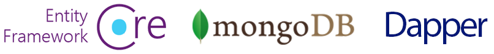

# ABP Документация

ABP Framework - это самодостаточная **инфраструктура**, основанная на **ASP.NET Core** для создания **современных веб-приложений** и **API**, следуя **лучшим практикам** разработки программного обеспечения с использованием **новейших технологий**.

## С чего начать

* [Быстрый старт](Tutorials/Todo/Index.md) - представляет собой состоящее из одной части краткое руководство по созданию простого приложения с помощью ABP Framework. Начните с этого руководства, если хотите быстро понять, как работает ABP.
* [Стартуем](Getting-Started.md) - данное руководство можно использовать для создания и запуска решений на основе ABP с различными параметрами и деталями.
* [Руководство по разработке веб-приложений](Tutorials/Part-1.md) - полное руководство по разработке полнофункционального веб-приложения со всеми аспектами реального решения.

### Выбор UI Framework

ABP Framework может работать с любым UI framework, "из коробки" поддерживаются:

### Выбор базы данных

ABP Framework может работать с любой базой данных, "из коробки" поддерживаются:

## Как использовать документацию

ABP предоставляет **исчерпывающую документацию**, которая не только объясняет структуру ABP, но также включает **руководства** и **примеры**, которые помогут вам в создании **поддерживаемого решения** путем введения и обсуждения общих принципов и передовых методов разработки программного обеспечения.

### Архитектура

ABP предлагает полную, модульную и многоуровневую архитектуру программного обеспечения, основанную на принципах и шаблонах [DDD - Domain Driven Design] (Domain-Driven-Design.md). Он также предоставляет необходимую инфраструктуру для реализации этой архитектуры.

* Просмотрите документ [Модульность](Module-Development-Basics.md) для понимания модульности системы.
* [Implementing Domain Driven Design book](https://abp.io/books/implementing-domain-driven-design?ref=doc) - данная книга является исчерпывающим руководством для тех, кто хочет понять и реализовать DDD с помощью ABP Framework.
* [Микросервисная архитектура](Microservice-Architecture.md) - документ, объясняющий как ABP помогает создавать микросервисные решения.
* [Мультитенантность (мультиарендность)](Multi-Tenancy.md) - данный документ знакомит с мультитенантностью (мультиарендностью) и исследует многопользовательскую инфраструктуру ABP.

### Инфраструктура

Платформа ABP Framework предоставляет множество функций для упрощения реализации реальных сценариев, таких как [Шина событий (Event Bus)](Event-Bus.md), [Система фоновых заданий (Background Job System)](Background-Jobs.md), [Ведение журнала аудита (Audit Logging)](Аудит-Logging.md), [Хранение BLOB-объектов (BLOB Storing)](Blob-Storing.md), [Заполнение данных (Data Seeding)](Data-Seeding.md), [Фильтрация данных (Data Filtering)](Data-Filtering.md).

### Решение общих проблем

ABP также упрощает (и даже автоматизирует, где это возможно) сквозные задачи и общие нефункциональные требования, такие как [Обработка исключений (Exception Handling)](Exception-Handling.md), [Валидация](Validation.md), [Авторизация](Authorization.md), [Локализация](Localization.md), [Кэширование](Caching.md), [Внедрение зависимостей (DI - Dependency Injection)](Dependency-Injection.md), [Управление настройками](Settings.md) и т.д.

### Модули приложений

Модули приложений предоставляют готовые функциональные возможности приложений:

* [**Account**](Modules/Account.md): Provides UI for the account management and allows user to login/register to the application.
* [**Identity**](Modules/Identity.md): Manages organization units, roles, users and their permissions, based on the Microsoft Identity library.
* [**IdentityServer**](Modules/IdentityServer.md): Integrates to IdentityServer4.
* [**Tenant Management**](Modules/Tenant-Management.md): Manages tenants for a [multi-tenant](Multi-Tenancy.md) (SaaS) application.

See the [Application Modules](Modules/Index.md) document for all pre-built modules.

### Шаблоны решений (Startup Templates)

[Шаблоны решений](Startup-Templates/Index.md) - это предварительно созданные шаблоны решений Visual Studio. Вы можете создать собственное решение на основе этих шаблонов, чтобы **сразу начать разработку**.

## Бесплатная электронная книга по DDD (English): Implementing Domain Driven Design

**Практическое руководство** по реализации Domain Driven Design (DDD) на английском языке. Хотя детали реализации **основаны на инфраструктуре ABP Framework**, основные концепции, принципы и модели могут быть применены к любому решению, даже если это решение написано не на .NET.

[Нажмите здесь, чтобы получить бесплатную копию](https://abp.io/books/implementing-domain-driven-design?ref=doc).

## ABP Сообщество

### Исходный код

ABP располагается на GitHub. Посмотрите [его исходный код](https://github.com/abpframework).

### Веб-сайт ABP сообщества

[ABP Сообщество](https://community.abp.io/) - это веб-сайт для публикации статей и обмена знаниями о ABP Framework. Вы также можете создавать контент для сообщества!

### Блог

Следите за [ABP Блог](https://blog.abp.io/), чтобы узнавать о последних событиях в структуре ABP Framework.

### Примеры

Посмотрите [примеры проектов](Samples/Index.md) созданных с помощью ABP Framework.

### Хотите внести свой вклад?

ABP - это проект с открытым исходным кодом, разрабатываемый сообществом. Посмотрите [Руководство по участию в проекте (The contribution guide)](Contribution/Index.md), если хотите стать частью этого проекта.
