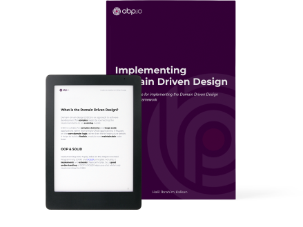

# ABP Framework Документация

ABP Framework предлагает **продуманную архитектуру** для создания корпоративных программных решений с использованием **лучших практик** на актуальной **.NET** и **ASP.NET Core** платформ. Он предоставляет базовую инфраструктуру, готовые к производству шаблоны запуска, модули, темы, инструментарий, руководства и документацию чтобы правильно реализовать эту архитектуру и максимально **автоматизировать детали** и повторяющиеся работы.

## Приступая к работе

* [Быстрый старт](Tutorials/Todo/Overall.md) представляет собой краткое руководство, состоящее из одной части, для создания простого приложения с помощью ABP Framework. Начните с этого руководства, если вы хотите быстро понять, как работает ABP.
* [Приступая к работе](Getting-Started.md) руководство может быть использовано для создания и запуска полноценного решения на базе ABP с различными параметрами и деталями.
* [Руководство по созданию Web приложения](Tutorials/Part-1.md) полное руководство по разработке полнофункционального веб-приложения со всеми аспектами реального решения.

### Параметры пользовательского интерфейса

ABP Framework может работать с любым фреймворком пользовательского интерфейса, следующие фреймворки поддерживаются «из коробки»:

### Провайдеры базы данных

ABP Framework может работать с любым провайдером баз данных, при этом следующие провайдеры поддерживаются "из коробки":

## Изучение документации

ABP имеет **всеобъемлющую документацию**, которая не только объясняет основы ABP Framework, но также включает **руководства** и **примеры**, которые помогут вам создать **поддерживаемое решение** путем введения и обсуждения общих **принципов разработоки программного обеспечения и лучшие практики**.

### Архитектура

ABP предлагает полную, модульную и многоуровневую программную архитектуру, основанную на принципах и шаблонах [Domain Driven Design](Domain-Driven-Design.md). Он также предоставляет необходимую инфраструктуру для реализации этой архитектуры.

* Смотрите [Модульность](Module-Development-Basics.md) документация объясняющая модульность системы.
* [Книга "Реализация Domain Driven Design"](https://abp.io/books/implementing-domain-driven-design?ref=doc) является исчерпывающим руководством для тех, кто хочет понять и внедрить DDD с помощью ABP Framework.
* [Микросервисная архитектура](Microservice-Architecture.md) документ объясняет, как ABP помогает создать микросервисное решение.
* [Multi-Tenancy](Multi-Tenancy.md) документ знакомит с multi-tenancy и объясняет multi-tenancy инфраструктуру ABP.

### Инфраструктура

Существует множество функций, предоставляемых ABP Framework, для упрощения реализации реальных сценариев, таких как [Event Bus](Event-Bus.md), [Background Job System](Background-Jobs.md), [Audit Logging](Audit-Logging.md), [BLOB Storing](Blob-Storing.md), [Data Seeding](Data-Seeding.md), [Data Filtering](Data-Filtering.md).

### Cross Cutting Concerns

ABP также упрощает (и даже автоматизирует, где это возможно) cross cutting concerns и общие нефункциональные требования, такие как [Обработка исключений](Exception-Handling.md), [Валидация](Validation.md), [Авторизация](Authorization.md), [Локализация](Localization.md), [Кэширование](Caching.md), [Внедрение зависимостей](Dependency-Injection.md), [Управление настройками](Settings.md), и так далее. 

### Модули приложения

Модули приложений предоставляют готовые функциональные возможности приложений;

* [**Account**](Modules/Account.md): Предоставляет пользовательский интерфейс для управления учетными записями и позволяет пользователю входить/регистрироваться в приложении.
* [**Identity**](Modules/Identity.md)**: Управляет организационными подразделениями, ролями, пользователями и их разрешениями на основе библиотеки Microsoft Identity.
* [**OpenIddict**](Modules/OpenIddict.md): Интеграция OpenIddict.
* [**Tenant Management**](Modules/Tenant-Management.md): Управляет арендаторами [multi-tenant](Multi-Tenancy.md) (SaaS) приложении.

Смотрите раздел [Модули приложения](Modules/Index.md) для ознакомления со всеми модулями приложения.

### Стартовые шаблоны

[Стартовые шаблоны](Startup-Templates/Index.md) преднастроенные шаблоны решений Visual Studio. Вы можете создать собственное решение на основе этих шаблонов, чтобы **немедленно приступить к разработке**.

## Книги

### Mastering ABP Framework

*Mastering ABP Framework* является исчерпывающим руководством по началу работы и совершенствованию работы с ABP Framework. Его автором является Халил Ибрагим Калкан, создатель и ведущий разработчик ABP Framework.

**[Вы можете приобрести ее на Amazon](https://www.amazon.com/Mastering-ABP-Framework-maintainable-implementing-dp-1801079242/dp/1801079242)!**

### Бесплатная электронная книга: Implementing Domain Driven Design

**Практическое руководство** по внедрению и реализации принципов Domain Driven Design (DDD). Хотя детали реализации **основаны на инфраструктуре ABP Framework**, основные концепции, принципы и модели можно применить к любому решению, даже если это не решение .NET.

**[Получить книгу можно перейдя по ссылке](https://abp.io/books/implementing-domain-driven-design?ref=doc).**

## Сообщество ABP

### Исходный код

Исходный код ABP размещён на GitHub. Смотрите [исходный код](https://github.com/abpframework).

### Сайт сообщества ABP

[Сообщество ABP](https://community.abp.io/) — это веб-сайт для публикации статей и обмена знаниями о ABP Framework. Вы также можете создавать контент для сообщества!

### Блог

Присоединяйтесь к [блогу ABP](https://blog.abp.io/) для изучения последних новшеств ABP Framework.

### Примеры

Смотрите [проекты примеров](Samples/Index.md) построенные на ABP Framework.

### Хотите внести свой вклад?

ABP — это проект с открытым исходным кодом, управляемый сообществом. Смотрите [руководство по вкладу](Contribution/Index.md), если вы хотите стать частью проекта.