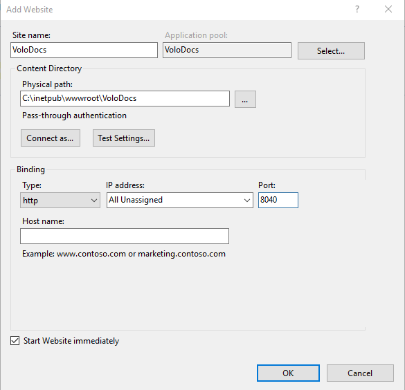
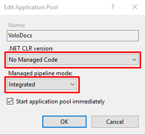
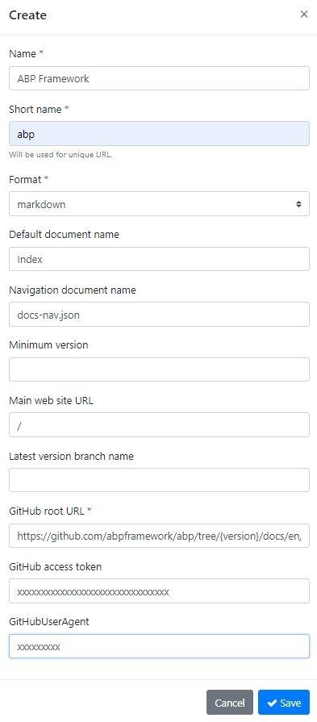
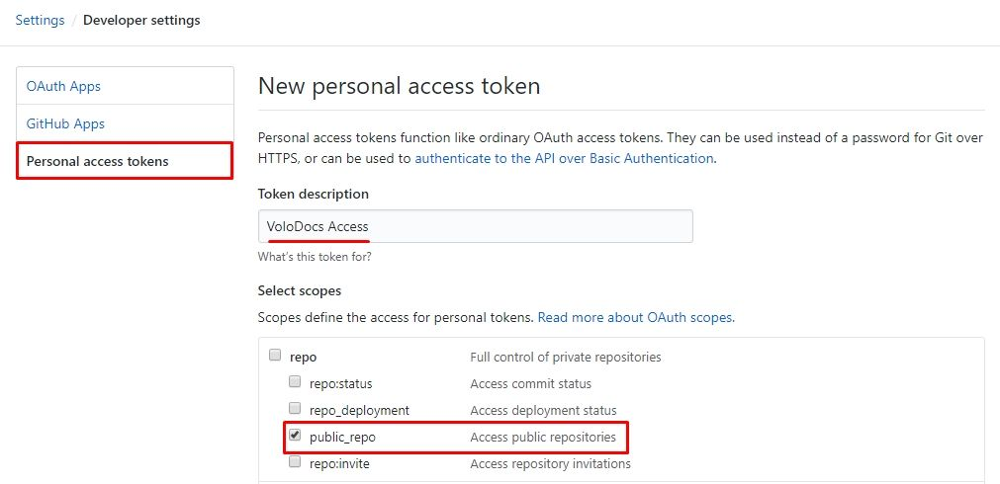
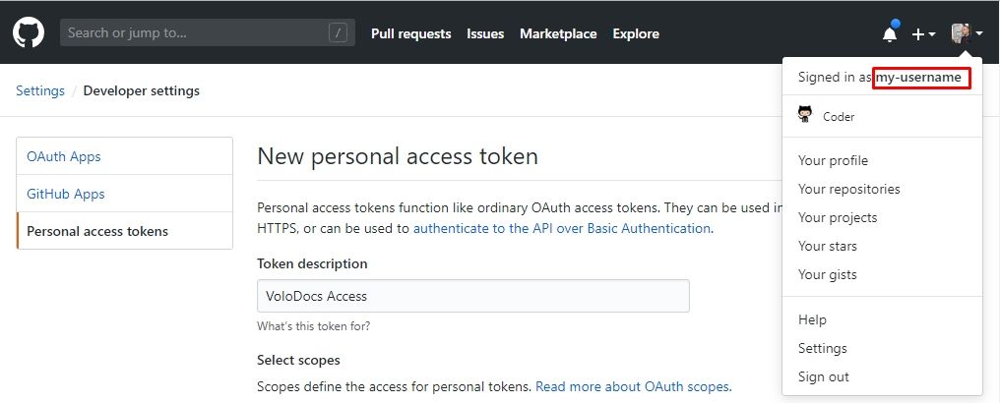

# VoloDocs 

## 什么是VoloDocs?

VoloDocs是一个跨平台的应用程序,帮助你简单的创建良好的文档与构建开发人员社区. 它借助Github集成简化了软件文档. 使用Github的强大功能进行版本控制,托管文档,并允许用户编译文档.

## 主要功能

- 集成Github从仓库提供文档.
- 支持Markdown/HTML文档格式.
- 支持版本控制 (集成Github release).
- 支持多个项目.
- 允许用户在Github上编辑文档.
- 跨平台,可部署到Windows/Linux/macOS.

## Github源码仓库

它是免费并且开源的. 你可以查看VoloDocs源码,我们也欢迎PR:

https://github.com/abpframework/abp/tree/master/modules/docs

## 下载

你可以在下面的链接下载VoloDocs release版:

http://apps.abp.io/VoloDocs/VoloDocs.win-x64.zip - **Windows 64 bit**

http://apps.abp.io/VoloDocs/VoloDocs.win-x86.zip - **Windows 32 bit**

http://apps.abp.io/VoloDocs/VoloDocs.osx-x64.zip - **MacOS**

http://apps.abp.io/VoloDocs/VoloDocs.linux-x64.zip - **Linux**

上面所有的release都是自包含运行时的部署文件. 包含所有的第三方依赖与.Net Core Runtime,所以你不需要安装任何.Net Core SDK/Runtime.

## 目录结构

解压 `VoloDocs.*.zip` 文件, 你会得到一个 `Web` 文件夹和 `Migrator` 文件夹. `Web` 文件夹中包含网站文件, `Migrator` 文件夹中包含构建数据库的应用程序. 在发布网站之前需要创建数据库或将现有的数据库更新到最新迁移. 如果这是你第一次安装VoloDocs, `Migrator` 会创建一个新数据库. 如果是升级已有的VoloDocs则会将数据库升级到最新的迁移. 使用 `Migrator` 你需要在 `appsettings.json` 文件中更改 `ConnectionString`. 参阅下一节了解如何配置VoloDocs应用程序.

## 逐步部署

- ### 数据库迁移

   进入 `Migrator` 目录中创建或更新数据库.

   打开 `appsettings.json` 文件设置连接字符串,如果你不清楚如何编写连接字符串,可以查看 https://www.connectionstrings.com/.

   设置连接字符串后运行 `Migrate.bat` 如果是Linux或MacOS运行 `DotNet VoloDocs.Migrator.dll` 命令.

- ### 配置网站

   进入 `Web` 目录下的VoloDocs文件夹. 打开 `appsettings.json` 文件设置连接字符串(与 `Migrator` 的 `appsettings.json` 相同). 你也可以为网站设置你想要的 `title`,它会显示在网站的左上角. 做完这些现在可以发布网站了.

- ### 部署网站

   在上一步我们创建/更新了数据库(确保数据库链接字符串正确).

   - #### 部署到IIS

      - 移动 `Web`  文件夹到你的 `wwwroot ` 文件夹中.
      - 重命名 `Web` 文件夹为 `VoloDocs`  (现在我们有了 `C:\inetpub\wwwroot\VoloDocs`).
      - 创建网站 `VoloDocs` 会自动创建相同名称的应用程序池. 打开 **应用程序池**  并双击  `VoloDocs` 应用程序池做以下设置 
        - **.NET CLR 版本**: `无托管代码`
        - **托管管道模式**: `集成`

      

      

      - 如果发生发生发现错误,表示未在服务器安装托管捆绑包. 请参阅文档 [this document](https://docs.microsoft.com/aspnet/core/host-and-deploy/iis/#install-the-net-core-hosting-bundle) 了解如何安装或[下载托管捆绑包](https://www.microsoft.com/net/permalink/dotnetcore-current-windows-runtime-bundle-installer).

        ```
        Handler "aspNetCore" has a bad module "AspNetCoreModuleV2" in its module list using IIS       
        ```

      - 关于托管VoloDocs的更多信息,请参阅 [在IIS上托管ASP.NET Core应用程序的微软官方文档](https://docs.microsoft.com/zh-cn/aspnet/core/host-and-deploy/iis).

   - #### 部署到Azure

      微软有一篇关于将ASP.NET Core应用程序部署到Azure App Service的文档. 我们建议你此[文档](https://docs.microsoft.com/en-us/azure/app-service/app-service-web-get-started-dotnet).

    - #### 使用命令行运行应用程序

      你可以从命令行运行应用程序,进入 `VoloDocs\Web` 文件夹并运行 `VoloDocs.Web.exe`,如果是Linux或MacOS运行 `DotNet VoloDocs.Web.dll` 命令.

- ### 首次运行

   打开浏览器导航到你的网址.

   首次运行网站,我们需要创建一个项目.

   #### 创建项目

   跳转到以下网址创建项目

   - `http://<yourwebsite>/Account/Login?returnUrl=/Docs/Admin/Projects`

   ##### 默认凭据

   使用管理员身份登陆到管理后台,用户名密码如下:

   * **用户名**: `admin`

   * **密码**: `1q2w3E*`

   ##### 示例项目的定义

   以下是一个使用了Github源的示例项目信息.

   配置VoloDocs展示存储在Github仓库中ABP Framework的文档.

   这是ABP Framework文档在Github的链接:

   https://github.com/abpframework/abp/tree/master/docs/zh-Hans

   

   * **名称**: `ABP Framework`

   * **简称**: `abp`

   * **格式**: `markdown`

   * **默认文档名称**: `Index`

   * **文档导航名称**: `docs-nav.json` ([参见示例](https://github.com/abpframework/abp/blob/master/docs/zh-Hans/docs-nav.json))

   * **最小版本**: *留空* *(隐藏之前的版本)*

   * **主网站网址**: `/`

   * **最新版本分支名称**: 留空

   * **GitHub链接**: `https://github.com/abpframework/abp/tree/{version}/docs/zh-Hans/`

   * **GitHub访问令牌**: [参见如何创建Github访问令牌](#retrieving-github-access-token)

   * **GitHub用户名称**: [参见如何找到自己的Github用户名称](#learn-your-github-username)

     

   ##### 创建访问令牌

   在Github页右上角找到 `Settings`,然后在左侧导航中点击 `Developer Settings`,在这里选择 `Personal access tokens`. 点击创建新token,输入名称与描述并勾选repo复选框. 如果已有访问令牌但已经忘记,可以选择[重新生成](https://github.com/settings/tokens/new).

   ###### 创建仅授权访问公共仓库的token

   想要仅授权访问公共仓库,仅勾选 `public_repo` 就可以了,然后点击页面底部的 `Generate Token` 按钮完成操作.

   

   ###### 创建可访问私有仓库的token

   想要授权访问私有仓库,勾选 `repo` 下的所有选项. 然后点击页面底部的 `Generate Token` 按钮完成操作.

   

   ###### 查看你的Github用户名称

   在Github页面右上角点击头像图片,"Signed in as ..." 后面就是你的用户名称

   


保存项目后转到网站根地址,你会看到文档已经正常显示.

`http://<yourwebsite>/documents`

### 发现问题?

如果你在安装,使用时遇到问题或者发现bug,请发起issues与我们联系:

https://github.com/abpframework/abp/issues/new