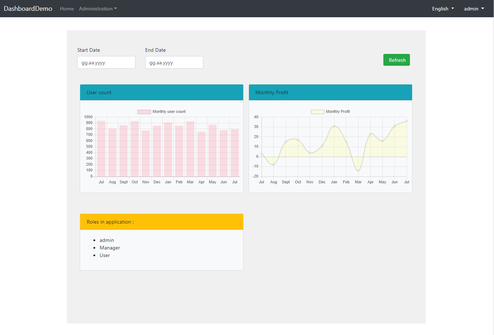

# 仪表板和小部件(Widget)系统

仪表板和小部件(Widget)系统允许你创建可重用的小部件和仪表板。



你可以在上面的屏幕截图中看到使用该系统构建的示例仪表板. 放置过滤器和刷新按钮的顶部是全局过滤器部分，下面的每个卡片都是一个小部件. 小部件和全局过滤器都是可重用的组件.仪表板布局也可以重复使用.

现在我们将看到如何在应用程序中使用它们.

## 仪表板组件

首先,我们将在应用程序中定义仪表板,你可以从[abp.io/get-started](https://abp.io/get-started)下载新的应用程序模板. 为简单起见,请不要使用分层选项.

在 *.Web项目中, 我们创建**DashboardNames.cs**和**DashboardDefinitionProvider.cs**类:

```c#
    public static class DashboardNames
    {
        public const string MyDashboard = "MyDashboard";

        public static string[] GetAll()
        {
            return ReflectionHelper.GetPublicConstantsRecursively(typeof(DashboardNames));
        }
    }
```

```c#
    public static class DashboardDefinitionProvider
    {
        public static List<DashboardDefinition> GetDefinitions()
        {
            var myDashboard = new DashboardDefinition(
                DashboardNames.MyDashboard,
                LocalizableString.Create<DashboardDemoResource>("MyDashboard")
                );

            return new List<DashboardDefinition>
            {
                myDashboard
            };
        }
    }
```

我们需要将该定义添加到**WebModule.cs**文件中**ConfigureServices**方法的**DashboardOptions**:

```c#
using Volo.Abp.AspNetCore.Mvc.UI.Dashboards;
//...
    public class DashboardDemoWebModule : AbpModule
    {
        public override void ConfigureServices(ServiceConfigurationContext context)
        {            
            //other codes..
            Configure<DashboardOptions>(options =>
            {
                options.Dashboards.AddRange(DashboardDefinitionProvider.GetDefinitions());
            })
            //other codes..
        }
        //other codes..
     }
```

然后我们可以创建我们定义的仪表板它将被渲染 **Pages/MyDashboard.cshtml**:

```html
@page
@using DashboardDemo.Dashboards
@using Microsoft.Extensions.Localization
@using Volo.Abp.AspNetCore.Mvc.UI.Dashboards
@using Volo.Abp.AspNetCore.Mvc.UI.Widgets
@inject IWidgetRenderer WidgetRenderer
@inject IDashboardRenderer DashboardRenderer
@inject IStringLocalizerFactory localizer
@model DashboardDemo.Pages.MyDashboardModel
@{
}
@section styles {
    <abp-style-bundle name="@DashboardNames.MyDashboard" />
}
@section scripts {
    <abp-script-bundle name="@DashboardNames.MyDashboard" />
}

    @await DashboardRenderer.RenderAsync(Component, new { dashboardName = DashboardNames.MyDashboard })


```

**DashboardRenderer.RenderAsync** 方法呈现我们定义的仪表板. 现在我们必须定义script和style bundles. 你可以在上面的代码中看到它们的用法:

```c#
    [DependsOn(typeof(AbpBasicDashboardStyleContributor))]
    public class MyDashboardStyleBundleContributor : BundleContributor
    {
        public override void ConfigureBundle(BundleConfigurationContext context)
        {

        }
    }
```

```c#
    [DependsOn(typeof(AbpBasicDashboardScriptContributor))]
    public class MyDashboardScriptBundleContributor : BundleContributor
    {
        public override void ConfigureBundle(BundleConfigurationContext context)
        {

        }
    }
```

仪表板系统使用[Bundling & Minification](../Bundling-Minification.md)作为脚本和样式. 仪表板贡献者将依赖于他们的小部件和全局过滤器贡献者, 小部件和全局过滤器将依赖于他们需要的其他贡献者. 这可以保证多个小部件可以请求javascript库, 并且不会重复.

我们需要将这些贡献者添加到**WebModule.cs**文件的**ConfigureServices**方法中的bundling选项:

```c#
            Configure<BundlingOptions>(options =>
            {
                options.ScriptBundles.Add(DashboardNames.MyDashboard, configuration =>
                    {
                      configuration.AddContributors(typeof(MyDashboardScriptBundleContributor));
                    });
               
                options.StyleBundles.Add(DashboardNames.MyDashboard, configuration =>
                    {
                      configuration.AddContributors(typeof(MyDashboardStyleBundleContributor));
                    });
            });
```

现在我们可以开始创建小部件了.

## 小部件

小部件是在将它们添加到仪表板时按顺序呈现的视图组件. 它们也可以在任何你喜欢的地方呈现.

我们将看到如何创建小部件并将其添加到我们创建的仪表板中. 我们将在本教程开头的屏幕截图中创建"每月利润"小部件.

在创建小部件之前,我们需要一个应用程序服务来返回小部件的虚拟数据.

```c#
namespace DashboardDemo
{
   public interface IDemoStatisticAppService : IApplicationService
    {
        Task<GetMonthlyUserStatisticDto> GetMonthlyUserStatistic(FilterDto filter);

        Task<MonthlyProfitStatisticDto> GetMonthlyProfitStatistic(FilterDto filter);
    }
    
    public class DemoStatisticAppService : ApplicationService, IDemoStatisticAppService
    {
        public async Task<MonthlyProfitStatisticDto> GetMonthlyProfitStatistic(FilterDto filter)
        {
            var monthCount = GetLabels(filter, out var monthList);

            var data = Enumerable
                .Repeat(0, monthCount)
                .Select(i => new Random().Next(-20, 40))
                .ToArray();

            return new MonthlyProfitStatisticDto { Labels = monthList.ToArray(), Data = data };
        }

        private static int GetLabels(FilterDto filter, out List<string> monthList)
        {
            DateTime endDate = filter.EndDate ?? DateTime.Now;
            DateTime startDate = filter.StartDate ?? DateTime.Now.AddYears(-1);

            if (filter.StartDate > filter.EndDate)
            {
                throw new BusinessException("Start date can not be greater than end date.");
            }

            var months = new[] {"Jan", "Feb", "Mar", "Apr", "May", "Jun", "Jul", "Aug", "Sept", "Oct", "Nov", "Dec"};
            var monthCount = (endDate.Year - startDate.Year) * 12 + endDate.Month - startDate.Month +1;
            monthList = new List<string>();

            for (int i = 0; i < monthCount; i++)
            {
                monthList.Add(months[endDate.Month-1]);
                endDate = endDate.AddMonths(-1);
            }

            monthList.Reverse();

            return monthCount;
        }
    }
    
    public class MonthlyProfitStatisticDto
    {
        public string[] Labels { get; set; }

        public int[] Data { get; set; }
    }
    
    public class FilterDto
    {
        public DateTime? StartDate { get; set; }

        public DateTime? EndDate { get; set; }
    }
}
```

我们将在**Global Filters**中使用**FilterDto**.

现在我们可以开始处理我们的小部件了.


你可以看到我们将创建小部件的文件. (如果你的小部件不需要css或javascript,则不需要创建它们和贡献者).

首先我们创建 **MonthlyProfitWidgetViewComponent**:

```html
@inject IHtmlLocalizer<DashboardDemoResource> L
@using DashboardDemo.Localization.DashboardDemo
@using Microsoft.AspNetCore.Mvc.Localization
@model DashboardDemo.Pages.widgets.MonthlyProfitWidgetViewComponent
@{
}
<div id="MonthlyProfitWidgetContainer">
    <abp-card background="Light">
        <abp-card-header background="Info">@L["Monthly Profit"]</abp-card-header>
        <abp-card-body>
            <div class="row margin-bottom-5">
                <canvas  id="MonthlyProfitStatistics"></canvas>
            </div>
        </abp-card-body>
    </abp-card>
</div>

```

```c#
    public class MonthlyProfitWidgetViewComponent : AbpViewComponent
    {
        public const string Name = "MonthlyProfitWidget";
        
        public const string DisplayName = "Monthly Profit Widget";

        public IViewComponentResult Invoke()
        {
            return View("/Pages/widgets/MonthlyProfitWidget/MonthlyProfitWidgetViewComponent.cshtml", new MonthlyProfitWidgetViewComponent());
        }
    }
```

我们将使用[chart.js library](https://www.chartjs.org/)来创建图表. 要将此库添加到项目中,我们将包依赖项添加到**package.json**:

```json
  "dependencies": {
    //other dependencies...
    "chart.js": "^2.8.0"
  }
```

然后添加映射到**abp.resourcemappings.js**:(参见[相关文档](/AspNetCore/Client-Side-Package-Management#resource-mapping-definition-file))

```js
    mappings: {
        //other mappings...
        "@node_modules/chart.js/dist/*.*": "@libs/chart.js/"
    }
```

现在我们的应用程序中有chart.js库. 为了使用它,我们将创建它的贡献者:

```c#
    public class ChartjsScriptContributor : BundleContributor
    {
        public override void ConfigureBundle(BundleConfigurationContext context)
        {
            context.Files.Add("/libs/chart.js/Chart.js");
        }
    }
    
    public class ChartjsStyleContributor : BundleContributor
    {
        public override void ConfigureBundle(BundleConfigurationContext context)
        {
            context.Files.Add("/libs/chart.js/Chart.css");
        }
    }
```

现在我们为小部件文件创建贡献者并使它们依赖于chart.js:

```c#
    [DependsOn(typeof(JQueryScriptContributor))]
    [DependsOn(typeof(ChartjsScriptContributor))]
    public class MonthlyProfitWidgetScriptBundleContributor : BundleContributor
    {
        public override void ConfigureBundle(BundleConfigurationContext context)
        {
            context.Files.Add("/Pages/widgets/MonthlyProfitWidget/MonthlyProfitWidget.js");
        }
    }
    
    [DependsOn(typeof(BootstrapStyleContributor))]
    [DependsOn(typeof(ChartjsStyleContributor))]
    public class MonthlyProfitWidgetStyleBundleContributor : BundleContributor
    {
        public override void ConfigureBundle(BundleConfigurationContext context)
        {
            context.Files.Add("/Pages/widgets/MonthlyProfitWidget/MonthlyProfitWidget.css");
        }
    }
```

**MonthlyProfitWidget.css** 对于我们的小部件是空的.

**MonthlyProfitWidget.js** 内容如下:

```js
(function ($) {
    var $container = $('#MonthlyProfitWidgetContainer');
    if ($container.length > 0) {
        var chart = {};

        var createChart = function () {
            dashboardDemo.demoStatistic.getMonthlyProfitStatistic({}).then(function (result) {
                chart = new Chart($container.find('#MonthlyProfitStatistics'), {
                    type: 'line',
                    data: {
                        labels: result.labels,
                        datasets: [{
                            label: 'Monthly Profit',
                            data: result.data,
                            backgroundColor: 'rgba(255, 255, 132, 0.2)'
                        }]
                    },
                    options: {
                        scales: {
                            yAxes: [{
                                ticks: {
                                    beginAtZero: true
                                }
                            }]
                        }
                    }
                });
            });
        };

        createChart();
    }
})(jQuery);

```

我们创建了小部件. 在将其添加到仪表板之前还有最后一件事, 我们需要定义它:

```c#
    public static class WidgetDefinitionProvider
    {
        public static List<WidgetDefinition> GetDefinitions()
        {
            //other widgets...

            var monthlyProfitWidget = new WidgetDefinition(
                    MonthlyProfitWidgetViewComponent.Name,
                    LocalizableString.Create<DashboardDemoResource>(MonthlyProfitWidgetViewComponent.DisplayName),
                    typeof(MonthlyProfitWidgetViewComponent)
                )
                .SetDefaultDimension(6, 4)
                .AddRequiredPermission(IdentityPermissions.Users.Default);

            return new List<WidgetDefinition>
            {
                //other widgets...
                monthlyProfitWidget
            };
        }
    }
```

**SetDefaultDimension(int x, int y):** 设置小部件的尺寸. 在仪表板中渲染时将使用此选项.  X表示bootstrap中的列宽，可以在1到12之间.Y是以像素为单位的高度,将乘以100.

**AddRequiredPermission(string permissionName)**: 设置窗口小部件的权限. 因此, 没有此权限的用户将看不到此小部件.

我们需要在**WebModule.cs**文件的**ConfigureServices**方法中将小部件定义添加到**WidgetOptions**:

```c#
            Configure<WidgetOptions>(options =>
            {
                options.Widgets.AddRange(WidgetDefinitionProvider.GetDefinitions());
            });
```

现在我们的小部件已经可以使用了. 我们将使用**DashboardDefinitionProvider.cs**中**WithWidget**方法将其添加到仪表板中:

```c#
            var myDashboard = new DashboardDefinition(
                DashboardNames.MyDashboard,
                LocalizableString.Create<DashboardDemoResource>("MyDashboard"))
               .WithWidget(MonthlyProfitWidgetViewComponent.Name); 
```

并将javascript和contributor依赖项添加到仪表板:

```c#
    [DependsOn(typeof(MonthlyProfitWidgetScriptBundleContributor))] // <<<<<<
    [DependsOn(typeof(AbpBasicDashboardScriptContributor))] 
    public class MyDashboardScriptBundleContributor : BundleContributor
    {
        public override void ConfigureBundle(BundleConfigurationContext context)
        {

        }
    }
    
    [DependsOn(typeof(MonthlyProfitWidgetStyleBundleContributor))] // <<<<<<
    [DependsOn(typeof(AbpBasicDashboardStyleContributor))] 
    public class MyDashboardStyleBundleContributor : BundleContributor
    {
        public override void ConfigureBundle(BundleConfigurationContext context)
        {

        }
    }
```

现在启动应用程序并转到 **/MyDashboard**页面.

## 全局过滤器

全局过滤器用于过滤具有相同输入的所有小部件. 如果向仪表板添加全局过滤器,则会显示刷新按钮,以使用新过滤器值刷新窗口小部件. 单击此按钮时,它会将过滤器序列化为对象,并以该对象作为参数触发事件.

我们来实现一个**date range**全局过滤器.

首先我们创建 **DateRangeGlobalFilterViewComponent.cshtml**:

```html
@inject IHtmlLocalizer<DashboardDemoResource> L
@using DashboardDemo.Localization.DashboardDemo
@using Microsoft.AspNetCore.Mvc.Localization
@model DashboardDemo.Pages.widgets.Filters.DateRangeGlobalFilterViewComponent
@{
}
<div id="DateRangeGlobalFilterContainer">
    <div class="row">
        <div class="col-md-6 mb-3">
            <label for="DateFilterStartDateInput">@L["Start Date"].Value</label>
            <input class="form-control" type="date" name="StartDate" id="DateFilterStartDateInput">
        </div>
        <div class="col-md-6 mb-3">
            <label for="DateFilterEndDateInput">@L["End Date"].Value</label>
            <input class="form-control" type="date" name="EndDate" id="EndDateStartDateInput">
        </div>
    </div>
</div>


```

```c#
namespace DashboardDemo.Pages.widgets.Filters
{
    [ViewComponent]
    public class DateRangeGlobalFilterViewComponent : ViewComponent
    {
        public const string Name = "DateRangeGlobalFilter";

        public const string DisplayName = "Date Range Filter";

        public IViewComponentResult Invoke()
        {
            return View("/Pages/widgets/Filters/DateRangeGlobalFilterViewComponent.cshtml", new DateRangeGlobalFilterViewComponent());
        }
    }
}
```

您可以像添加到窗口小部件一样添加javascript和css文件,但在此示例中不需要它们.

我们将在**WebModule.cs**文件的**ConfigureServices**方法中将全局过滤器定义添加到**GlobalFilterOptions**:

```c#
            Configure<GlobalFilterOptions>(options =>
            {
                options.GlobalFilters.AddRange(GlobalFilterDefinitionProvider.GetDefinitions());
            });
```

并使用**WithGlobalFilter**方法将其添加到**DashboardDefinitionProvider.cs**中的仪表板中:

```c#
            var myDashboard = new DashboardDefinition(
                DashboardNames.MyDashboard,
                LocalizableString.Create<DashboardDemoResource>("MyDashboard"))
                .WithWidget(MonthlyProfitWidgetViewComponent.Name)
                .WithGlobalFilter(DateRangeGlobalFilterViewComponent.Name);
```

现在让我们在小部件中捕获刷新事件：

```js
(function ($) {
    var $container = $('#MonthlyProfitWidgetContainer');
    if ($container.length > 0) {
        var chart = {};

        var createChart = function () {
            dashboardDemo.demoStatistic.getMonthlyProfitStatistic({}).then(function (result) {
                chart = new Chart($container.find('#MonthlyProfitStatistics'), {
                    type: 'line',
                    data: {
                        labels: result.labels,
                        datasets: [{
                            label: 'Monthly Profit',
                            data: result.data,
                            backgroundColor: 'rgba(255, 255, 132, 0.2)'
                        }]
                    },
                    options: {
                        scales: {
                            yAxes: [{
                                ticks: {
                                    beginAtZero: true
                                }
                            }]
                        }
                    }
                });
            });
        };

        $(document).on('RefreshWidgets',
            function (event, filters) {
                dashboardDemo.demoStatistic.getMonthlyProfitStatistic({ startDate: filters.startDate, endDate: filters.endDate }).then(function (result) {
                    chart.data = {
                        labels: result.labels,
                            datasets: [{
                            label: 'Monthly Profit',
                            data: result.data,
                            backgroundColor: 'rgba(255, 255, 132, 0.2)'
                        }]
                    },
                    chart.update();
                });
            });

        createChart();
    }
})(jQuery);

```

## 源代码

你可以在[Github](https://github.com/abpframework/abp/tree/dev/samples/DashboardDemo)查看仪表板的示例应用程序