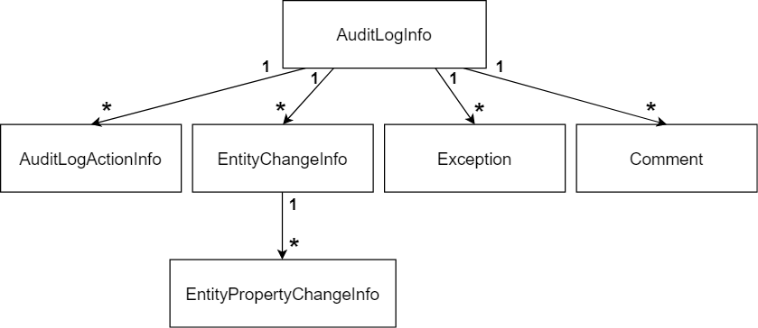

# 审计日志

[维基百科](https://en.wikipedia.org/wiki/Audit_trail): "*审计跟踪(也称为**审计日志**)是一种安全相关的按时间顺序记录,记录集或记录目的和来源. 这种记录提供了在任何特定时间的操作,过程或事件产生影响活动顺序的文件证据* ".

ABP框架提供一个可扩展的**审计日志系统**,自动化的根据**约定**记录审计日志,并提供**配置**控制审计日志的级别.

一个**审计日志对象**(参见下面的审计日志对象部分)通常是针对每个web请求创建和保存的.包括;

* **请求和响应的细节** (如URL,HTTP方法,浏览器信息,HTTP状态代码...等).
* **执行的动作** (控制器操作和应用服务方法调用及其参数).
* **实体的变化** (在Web请求中).
* **异常信息** (如果在执行请求发生操作).
* **请求时长** (测量应用程序的性能).

> [启动模板](Startup-Templates/Index.md)已经将审计日志系统配置为适用于大多数应用程序. 本文档介绍了对审计日志系统更精细的控制.

## 数据库提供程序支持

* [Entity Framework Core](Entity-Framework-Core.md)提供程序完全支持.
* [MongoDB](MongoDB.md)提供程序不支持实体更改审计记录. 其他功能按预期工作.

## UseAuditing()

`UseAuditing()` 中间件应该被添加到ASP.NET Core请求管道,用于创建和保存审计日志. 如果你使用[启动模板](Startup-Templates/Index.md)创建的应用程序,它已经默认添加.

## AbpAuditingOptions

`AbpAuditingOptions` 是配置审计日志系统的主要[options对象](Options.md). 你可以在[模块](Module-Development-Basics.md)的 `ConfigureServices` 方法中进行配置:

````csharp
Configure<AbpAuditingOptions>(options =>
{
    options.IsEnabled = false; //Disables the auditing system
});
````

这里是你可以配置的选项列表:

* `IsEnabled` (默认值: `true`): 启用或禁用审计系统的总开关. 如果值为 `false`,则不使用其他选项.
* `HideErrors` (默认值: `true`): 在保存审计日志对象时如果发生任何错误,审计日志系统会将错误隐藏并写入常规[日志](Logging.md). 如果保存审计日志对系统非常重要那么将其设置为 `false` 以便在隐藏错误时抛出异常.
* `IsEnabledForAnonymousUsers` (默认值: `true`): 如果只想为经过身份验证的用户记录审计日志,请设置为 `false`.如果为匿名用户保存审计日志,你将看到这些用户的 `UserId` 值为 `null`.
* `AlwaysLogOnException`(默认值: `true`): 如果设置为 `true`,将始终在异常/错误情况下保存审计日志,不检查其他选项(`IsEnabled` 除外,它完全禁用了审计日志).
* `IsEnabledForGetRequests` (默认值: `false`): HTTP GET请求通常不应该在数据库进行任何更改,审计日志系统不会为GET请求保存审计日志对象. 将此值设置为 `true` 可为GET请求启用审计日志系统.
* `ApplicationName`: 如果有多个应用程序保存审计日志到单一的数据库,使用此属性设置为你的应用程序名称区分不同的应用程序日志.
* `IgnoredTypes`: 审计日志系统忽略的 `Type` 列表. 如果它是实体类型,则不会保存此类型实体的更改. 在序列化操作参数时也使用此列表.
* `EntityHistorySelectors`:选择器列表,用于确定是否选择了用于保存实体更改的实体类型. 有关详细信息请参阅下面的部分.
* `Contributors`: `AuditLogContributor` 实现的列表. 贡献者是扩展审计日志系统的一种方式. 有关详细信息请参阅下面的"审计日志贡献者"部分.

### 实体历史选择器

保存你的所有实体的所有变化将需要大量的数据库空间. 出于这个原因**审计日志系统不保存为实体的任何改变,除非你明确地对其进行配置**.

要保存的所有实体的所有更改,只需使用 `AddAllEntities()` 扩展方法.

````csharp
Configure<AbpAuditingOptions>(options =>
{
    options.EntityHistorySelectors.AddAllEntities();
});
````

`options.EntityHistorySelectors` 实际上是一个类型谓词的列表,你可以写一个lambda表达式定义过滤器.

下面的示例中与使用 `AddAllEntities()` 扩展方法效果相同:

````csharp
Configure<AbpAuditingOptions>(options =>
{
    options.EntityHistorySelectors.Add(
        new NamedTypeSelector(
            "MySelectorName",
            type =>
            {
                if (typeof(IEntity).IsAssignableFrom(type))
                {
                    return true;
                }
                else
                {
                    return false;
                }
            }
        )
    );
});
````

条件 `typeof(IEntity).IsAssignableFrom(type)` 对于任何实现 `IEntity` 接口的类(从技术上来这些都是你应用程序中的实体) 结果都为 `true` . 你可以根据自己的逻辑编写条件并返回 `true` 或 `false`.

`options.EntityHistorySelectors` 是一种灵活动态的选择实体进行审计日志记录的方法. 另一种方法是为每个实体使用 `Audited` 和 `DisableAuditing` attribute.

## 启用/禁用审计日志服务

### 启用/禁用 Controllers & Actions

默认所有的控制器动作都会被记录下来(有关GET请求,请参阅上面的 `IsEnabledForGetRequests` ).

你可以使用 `[DisableAuditing]` 来禁用特定的控制器:

````csharp
[DisableAuditing]
public class HomeController : AbpController
{
    //...
}
````

使用 `[DisableAuditing]` 在action级别控制:

````csharp
public class HomeController : AbpController
{
    [DisableAuditing]
    public async Task<ActionResult> Home()
    {
        //...
    }

    public async Task<ActionResult> OtherActionLogged()
    {
        //...
    }
}
````

### 启用/禁用 应用服务&方法

[应用服务](Application-Services.md)也默认包含在审计日志中. 你可在服务或方法级别使用 `[DisableAuditing]`．

#### 启用/禁用 其他服务

可以为任何类型的类(注册到[依赖注入](Dependency-Injection.md)并从依赖注入解析)启用审计日志,默认情况下仅对控制器和应用程序服务启用.

对于任何需要被审计记录的类或方法都可以使用 `[Audited]` 和`IAuditingEnabled`.此外,你的类可以(直接或固有的)实现 `IAuditingEnabled` 接口以认启用该类的审计日志记录.

### 启用/禁用 实体 & 属性

以下情况下实体在实体更改审计日志记录中忽略实体;

* 如果将实体类型添加到 `AbpAuditingOptions.IgnoredTypes`(如前所述),它在审计日志系统中被完全忽略.
* 如果对象不是[实体](Entities.md)(没有直接或固有的实现 `IEntity` - 所有实体默认实现这个接口).
* 如果实体访问级别不是public的.

你可以使用 `Audited` 来启用实体更改审计日志:

````csharp
[Audited]
public class MyEntity : Entity<Guid>
{
    //...
}
````

或者禁用实体:

````csharp
[DisableAuditing]
public class MyEntity : Entity<Guid>
{
    //...
}
````

只有前面提到的 `AbpAuditingOptions.EntityHistorySelector` 选择实体时才有必要禁用审计日志记录.

你可以仅禁用实体的某些属性的审计,以审计日志记录进行精细控制:

````csharp
[Audited]
public class MyUser : Entity<Guid>
{
    public string Name { get; set; }

    public string Email { get; set; }

    [DisableAuditing] //Ignore the Passoword on audit logging
    public string Password { get; set; }
}
````

审计日志系统保存 `MyUser` 实体的更改,出于安全的目的忽略 `Password` 属性.

在某些情况下你可能要保存一些属性,但忽略所有其他属性. 为忽略的属性编写 `[DisableAuditing]` 将很乏味. 这种情况下将 `[Audited]` 用于所需的属性,使用 `[DisableAuditing]` 属性标记该实体:

````csharp
[DisableAuditing]
public class MyUser : Entity<Guid>
{
    [Audited] //Only log the Name change
    public string Name { get; set; }

    public string Email { get; set; }

    public string Password { get; set; }
}
````

## IAuditingStore

`IAuditingStore` 是一个接口,用于保存ABP框架的审计日志对象(下面说明). 如果需要将审计日志对象保存到自定义数据存储中,可以在自己的应用程序中实现 `IAuditingStore` 并在[依赖注入系统](Dependency-Injection.md)替换.

如果没有注册审计存储,则使用 `SimpleLogAuditingStore`. 它只是将审计对象写入标准[日志系统](Logging.md).

[审计日志模块](Modules/Audit-Logging.md)已在[启动模板](Startup-Templates/Index.md)中配置,它将审计日志对象保存到数据库中(支持多个数据库提供程序). 所以大多数时候你并不需要关心 `IAuditingStore` 是如何实现和使用的.

## 审计日志对象

默认为每个**web请求**创建一个**审计日志对象**,审计日志对象可以由以下关系图表示:



* **AuditLogInfo**: 具有以下属性:
  * `ApplicationName`: 当你保存不同的应用审计日志到同一个数据库,这个属性用来区分应用程序.
  * `UserId`:当前用户的Id,用户未登录为 `null`.
  * `UserName`:当前用户的用户名,如果用户已经登录(这里的值不依赖于标识模块/系统进行查找).
  * `TenantId`: 当前租户的Id,对于多租户应用.
  * `TenantName`: 当前租户的名称,对于多租户应用.
  * `ExecutionTime`: 审计日志对象创建的时间.
  * `ExecutionDuration`: 请求的总执行时间,以毫秒为单位. 可以用来观察应用程序的性能.
  * `ClientId`: 当前客户端的Id,如果客户端已经通过认证.客户端通常是使用HTTP API的第三方应用程序.
  * `ClientName`: 当前客户端的名称,如果有的话.
  * `ClientIpAddress`: 客户端/用户设备的IP地址.
  * `CorrelationId`: 当前[相关Id](CorrelationId.md). 相关Id用于在单个逻辑操作中关联由不同应用程序(或微服务)写入的审计日志.
  * `BrowserInfo`: 当前用户的浏览器名称/版本信息,如果有的话.
  * `HttpMethod`: 当前HTTP请求的方法(GET,POST,PUT,DELETE ...等).
  * `HttpStatusCode`: HTTP响应状态码.
  * `Url`: 请求的URL.
* **AuditLogActionInfo**: 一个  审计日志动作通常是web请求期间控制器动作或[应用服务](Application-Services.md)方法调用. 一个审计日志可以包含多个动作. 动作对象具有以下属性:
  * `ServiceName`:执行的控制器/服务的名称.
  * `MethodName`:控制器/服务执行的方法的名称.
  * `Parameters`:传递给方法的参数的JSON格文本.
  * `ExecutionTime`: 执行的时间.
  * `ExecutionDuration`: 方法执行时长,以毫秒为单位. 可以用来观察方法的性能.
* **EntityChangeInfo**: 表示一个实体在Web请求中的变更. 审计日志可以包含0个或多个实体的变更. 实体变更具有以下属性:
  * `ChangeTime`: 当实体被改变的时间.
  * `ChangeType`:具有以下字段的枚举: `Created`(0), `Updated`(1)和 `Deleted`(2).
  * `EntityId`: 更改实体的Id.
  * `EntityTenantId`:实体所属的租户Id.
  * `EntityTypeFullName`: 实体的类型(类)的完整命名空间名称(例如Book实体的*Acme.BookStore.Book*.
* **EntityPropertyChangeInfo**: 表示一个实体的属性的更改.一个实体的更改信息(上面已说明)可含有具有以下属性的一个或多个属性的更改:
  * `NewValue`: 属性的新值. 如果实体已被删除为 `null`.
  * `OriginalValue`:变更前旧/初始值. 如果实体是新创建为 `null`.
  * `PropertyName`: 实体类的属性名称.
  * `PropertyTypeFullName`:属性类型的完整命名空间名称.
* **Exception**: 审计日志对象可能包含零个或多个异常. 可以得到失败请求的异常信息.
* **Comment**:用于将自定义消息添加到审计日志条目的任意字符串值. 审计日志对象可能包含零个或多个注释.

除了上面说明的标准属性之外,`AuditLogInfo`, `AuditLogActionInfo` 和 `EntityChangeInfo` 对象还实现了`IHasExtraProperties` 接口,你可以向这些对象添加自定义属性.

## 审计日志贡献者

你可以创建类继承 `AuditLogContributor`类 来扩展审计系统,该类定义了 `PreContribute` 和 `PostContribute` 方法.

唯一预构建的贡献者是 `AspNetCoreAuditLogContributor` 类,它设置HTTP请求的相关属性.

贡献者可以设置 `AuditLogInfo` 类的属性和集合来添加更多信息.

例:

````csharp
public class MyAuditLogContributor : AuditLogContributor
{
    public override void PreContribute(AuditLogContributionContext context)
    {
        var currentUser = context.ServiceProvider.GetRequiredService<ICurrentUser>();
        context.AuditInfo.SetProperty(
            "MyCustomClaimValue",
            currentUser.FindClaimValue("MyCustomClaim")
        );
    }

    public override void PostContribute(AuditLogContributionContext context)
    {
        context.AuditInfo.Comments.Add("Some comment...");
    }
}
````

* `context.ServiceProvider` 可以从[依赖注入系统](Dependency-Injection.md)中解析服务.
* `context.AuditInfo` 可以用来访问当前审计日志的对象并进行操作.

创建贡献者后,需要将其添加到 `AbpAuditingOptions.Contributors` 列表中:

````csharp
Configure<AbpAuditingOptions>(options =>
{
    options.Contributors.Add(new MyAuditLogContributor());
});
````

## IAuditLogScope & IAuditingManager

本节介绍用于高级用例的 `IAuditLogScope` 和  `IAuditingManager` 服务.

**审计日志范围**是**构建**和**保存**审计日志对象的[环境范围](Ambient-Context-Pattern.md)(前面解释过). 默认审计日志中间件会为Web请求创建审计日志范围(请参阅上面的 `UseAuditing()` 部分).

### 获取当前审计日志范围

上面提到,审计日志贡献者是操作审计日志对象的全局方法. 你可从服务中获得值.

如果需要在应用程序的任意位置上操作审计日志对象,可以访问当前审计日志范围并获取当前审计日志对象(与范围的管理方式无关).
例:

````csharp
public class MyService : ITransientDependency
{
    private readonly IAuditingManager _auditingManager;

    public MyService(IAuditingManager auditingManager)
    {
        _auditingManager = auditingManager;
    }

    public async Task DoItAsync()
    {
        var currentAuditLogScope = _auditingManager.Current;
        if (currentAuditLogScope != null)
        {
            currentAuditLogScope.Log.Comments.Add(
                "Executed the MyService.DoItAsync method :)"
            );

            currentAuditLogScope.Log.SetProperty("MyCustomProperty", 42);
        }
    }
}
````

总是检查 `_auditingManager.Current` 是否为空,因为它是在外部范围中控制的,在调用方法之前你不知道是否创建了审计日志范围.

### 手动创建审计日志范围

你很少需要手动创建审计日志的范围,但如果你需要,可以使用 `IAuditingManager` 创建审计日志的范围.
例:

````csharp
public class MyService : ITransientDependency
{
    private readonly IAuditingManager _auditingManager;

    public MyService(IAuditingManager auditingManager)
    {
        _auditingManager = auditingManager;
    }

    public async Task DoItAsync()
    {
        using (var auditingScope = _auditingManager.BeginScope())
        {
            try
            {
                //Call other services...
            }
            catch (Exception ex)
            {
                //Add exceptions
                _auditingManager.Current.Log.Exceptions.Add(ex);
            }
            finally
            {
                //Always save the log
                await auditingScope.SaveAsync();
            }
        }
    }
}
````

你可以调用其他服务,它们可能调用其他服务,它们可能更改实体,等等. 所有这些交互都保存为finally块中的一个审计日志对象.

## 审计日志模块

审计日志模块基本上实现了 `IAuditingStore`, 将审计日志对象保存到数据库中并支持多个数据库提供程序. 默认此模块已添加到启动模板中.

参见[审计日志模块文档](Modules/Audit-Logging.md)了解更多.