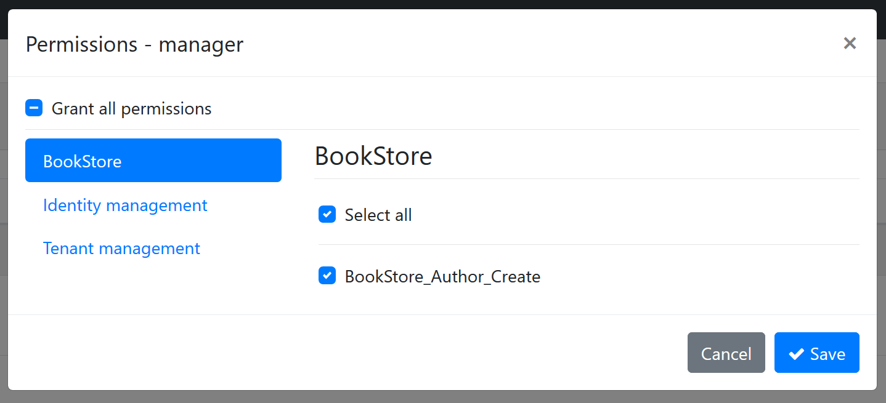
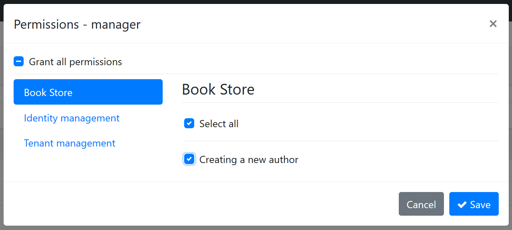
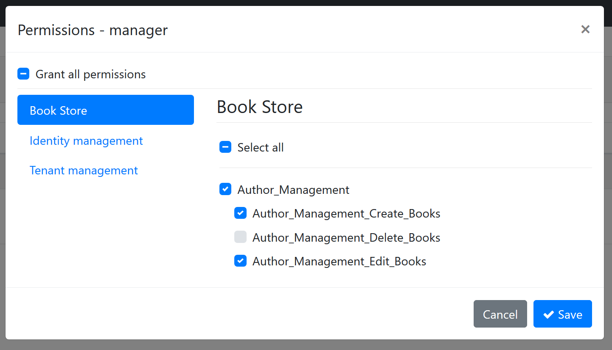

# 授权

授权用于在应用程序中判断是否允许用户执行某些特定的操作.

ABP扩展了[ASP.NET Core 授权](https://docs.microsoft.com/zh-cn/aspnet/core/security/authorization/introduction), 将 **权限** 添加为自动[策略](https://docs.microsoft.com/zh-cn/aspnet/core/security/authorization/policies)并且使授权系统在 **[应用服务](Application-Services.md)** 同样可用.

所以ASP.NET Core授权的功能特性和它的文档在基于ABP的应用程序是可用的.
本文中着重介绍在ASP.NET Core授权功能基础上添加的功能.

## Authorize Attribute

ASP.NET Core 定义了 [**Authorize**](https://docs.microsoft.com/zh-cn/aspnet/core/security/authorization/simple) attribute 用于在控制器,控制器方法以及页面上授权. 现在ABP将它带到了[应用服务](Application-Services.md).

示例:

````csharp
using System;
using System.Collections.Generic;
using System.Threading.Tasks;
using Microsoft.AspNetCore.Authorization;
using Volo.Abp.Application.Services;

namespace Acme.BookStore
{
    [Authorize]
    public class AuthorAppService : ApplicationService, IAuthorAppService
    {
        public Task<List<AuthorDto>> GetListAsync()
        {
            ...
        }

        [AllowAnonymous]
        public Task<AuthorDto> GetAsync(Guid id)
        {
            ...
        }

        [Authorize("BookStore_Author_Create")]
        public Task CreateAsync(CreateAuthorDto input)
        {
            ...
        }
    }
}

````

* `Authorize` attribute 使用户必须登陆到应用程序才可以访问 `AuthorAppService` 中的方法. 所以`GetListAsync` 方法仅可用于通过身份验证的用户.
* `AllowAnonymous` 禁用身份验证. 所以 `GetAsync` 方法任何人都可以访问,包括未授权的用户.
* `[Authorize("BookStore_Author_Create")]` 定义了一个策略 (参阅 [基于策略的授权](https://docs.microsoft.com/zh-cn/aspnet/core/security/authorization/policies)),它用于检查当前用户的权限.

"BookStore_Author_Create" 是一个策略名称. 如果你想要使用策略的授权方式,需要在ASP.NET Core授权系统中预先定义它.

你可以按照ASP.NET Core文档进行实施策略授权,但对于简单的 `true/false` 条件(比如是否授予了用户策略) ABP定义了权限系统,在下一部分中会进行讲解.

## 权限系统

权限系统是为特定用户,角色或客户端授权或禁止的简单策略.

### 定义权限

创建一个继承自 `PermissionDefinitionProvider` 的类,如下所示:

````csharp
using Volo.Abp.Authorization.Permissions;

namespace Acme.BookStore.Permissions
{
    public class BookStorePermissionDefinitionProvider : PermissionDefinitionProvider
    {
        public override void Define(IPermissionDefinitionContext context)
        {
            var myGroup = context.AddGroup("BookStore");

            myGroup.AddPermission("BookStore_Author_Create");
        }
    }
}
````

> ABP会自动发现这个类,不需要进行配置!

你需要在 `Define` 方法中添加**权限组**或者获取已存在的权限组,并向权限组中添加**权限**.

在定义权限后就可以在ASP.NET Core权限系统中当做**策略**名称使用. 在角色的权限管理模态框中同样可以看到:



* 左边的选项卡显示了 "BookStore" 权限组.
* 右侧的 "BookStore_Author_Create" 是权限名称,在这里可以为角色授权或禁止.

保存后更改会持久化到数据库并在授权系统使用.

> 只有在你安装了identity模块时,才会出现上图中的管理对话框. 该模块用于用户和角色的. 启动模板中已经预装identity模块.

#### 本地化权限名称

"BookStore_Author_Create" 名称对于权限系统来说很适合,但对于UI展示会让操作人员费解. 幸运的是 `AddPermission` 和 `AddGroup` 方法提供了 `LocalizableString` 参数:

````csharp
var myGroup = context.AddGroup(
    "BookStore",
    LocalizableString.Create<BookStoreResource>("BookStore")
);

myGroup.AddPermission(
    "BookStore_Author_Create",
    LocalizableString.Create<BookStoreResource>("Permission:BookStore_Author_Create")
);
````

然后在本地化文档中对 "BookStore" 和 "Permission:BookStore_Author_Create" 键添加本地化语言:

````json
"BookStore": "Book Store",
"Permission:BookStore_Author_Create": "Creating a new author"
````

> 有关更多信息请参阅[本地化系统文档](Localization.md).

下图展示了本地化后的效果:



#### 多租户

权限系统同样支持在ABP中做为一等公民的 [多租户](Multi-Tenancy.md). 在定义新权限时可以设置多租户选项. 有下面三个值:

* **Host**: 权限仅适用于宿主.
* **Tenant**: 权限仅适用于租户.
* **Both** (默认): 权限适用与宿主和租户.

> 如果你的应用程序不是多租户的,可以忽略这个选项.

`AddPermission` 方法的第三个参数用于设置多租户选项:

````csharp
myGroup.AddPermission(
    "BookStore_Author_Create",
    LocalizableString.Create<BookStoreResource>("Permission:BookStore_Author_Create"),
    multiTenancySide: MultiTenancySides.Tenant //set multi-tenancy side!
);
````

#### 子权限

权限可以具有子权限,当你想要创建一个层次结构的权限树时它特别有用. 在这个树中一个权限可能含有子权限,并且子权限只有在授权父权限时才可用.

定义示例:

````csharp
var authorManagement = myGroup.AddPermission("Author_Management");
authorManagement.AddChild("Author_Management_Create_Books");
authorManagement.AddChild("Author_Management_Edit_Books");
authorManagement.AddChild("Author_Management_Delete_Books");
````

在页面上如下所示 (你可能想要本地化权限名称):



下面的示例代码是一个典型的应用服务:

````csharp
[Authorize("Author_Management")]
public class AuthorAppService : ApplicationService, IAuthorAppService
{
    public Task<List<AuthorDto>> GetListAsync()
    {
        ...
    }

    public Task<AuthorDto> GetAsync(Guid id)
    {
        ...
    }

    [Authorize("Author_Management_Create_Books")]
    public Task CreateAsync(CreateAuthorDto input)
    {
        ...
    }

    [Authorize("Author_Management_Edit_Books")]
    public Task UpdateAsync(CreateAuthorDto input)
    {
        ...
    }

    [Authorize("Author_Management_Delete_Books")]
    public Task DeleteAsync(CreateAuthorDto input)
    {
        ...
    }
}
````

* 拥有`Author_Management`权限的用户可以访问`GetListAsync`和 `GetAsync`方法.
* 示例中的其他方法需要额外的权限.

### 自定义策略覆盖已有权限

有时我们需要扩展扩展应用程序中预构建模块的权限,可以定义并注册一个与权限名称相同的策略到ASP.Net Core授权系统,策略会覆盖已有权限.

参阅 [基于策略的授权](https://docs.microsoft.com/zh-cn/aspnet/core/security/authorization/policies) 文档了解如何自定义策略.

## IAuthorizationService

ASP.NET Core 提供了 `IAuthorizationService` 用于检查权限. 注入后使用它进行条件控制权限.

示例:

````csharp
public async Task CreateAsync(CreateAuthorDto input)
{
    var result = await AuthorizationService
        .AuthorizeAsync("Author_Management_Create_Books");
    if (result.Succeeded == false)
    {
        //throw exception
        throw new AbpAuthorizationException("...");
    }

    //continue to the normal flow...
}
````

> 因为应用服务会经常检查权限,`ApplicationService` 已经属性注入了`AuthorizationService`, 所有继承自 `ApplicationService` 的类都可以直接使用. 你也可以直接 [注入](Dependency-Injection.md)到类中.

上面的示例代码是检查权限的标准代码,ABP提供了一种简化的方式来编写它.

示例:

````csharp
public async Task CreateAsync(CreateAuthorDto input)
{
    await AuthorizationService.CheckAsync("Author_Management_Create_Books");

    //continue to the normal flow...
}
````

如果未授权 `CheckAsync` 扩展方法会抛出 `AbpAuthorizationException` 异常. 还有一个 `IsGrantedAsync` 扩展方法会返回 `true` 或 `false`.

`IAuthorizationService` 中有多个 `AuthorizeAsync` 方法重载. [ASP.NET Core 授权文档](https://docs.microsoft.com/zh-cn/aspnet/core/security/authorization/introduction)中有详细的解释.

> 提示: 尽可能使用声明式的 `Authorize` attribute,因为它比较简单不会侵入方法内部.  如果你需要在业务代码中有条件的检查权限,那么请使用 `IAuthorizationService`.

### 在JavaScript中检查权限

有时你会需要在客户端检查策略/权限. 在ASP.NET Core MVC/Razor页面应用程序可以使用 `abp.auth` API. 示例:

````js
abp.auth.isGranted('MyPermissionName');
````

参阅 [abp.auth](AspNetCore/JavaScript-API/Auth.md) API 文档了解详情.

## 权限管理

通常权限管理是管理员用户使用权限管理模态框进行授权:


如果你想要通过代码管理权限, 可以注入使用 `IPermissionManager`. 如下所示:

````csharp
public class MyService : ITransientDependency
{
    private readonly IPermissionManager _permissionManager;

    public MyService(IPermissionManager permissionManager)
    {
        _permissionManager = permissionManager;
    }

    public async Task GrantPermissionForUserAsync(Guid userId, string permissionName)
    {
        await _permissionManager.SetForUserAsync(userId, permissionName, true);
    }

    public async Task ProhibitPermissionForUserAsync(Guid userId, string permissionName)
    {
        await _permissionManager.SetForUserAsync(userId, permissionName, false);
    }
}
````

`SetForUserAsync` 方法用于设置用户的权限 (true/false). 类似的还有 `SetForRoleAsync` 和 `SetForClientAsync` 扩展方法.

`IPermissionManager` 由权限管理模块定义, 更多信息请参阅 [权限管理模块文档](Modules/Permission-Management.md).

## 高级主题

### Permission Value Providers

权限检查是可扩展的. 继承自 `PermissionValueProvider` (或实现 `IPermissionValueProvider`) 的任何类都可以参与权限检查. 有三个预定义的Provider:

* `UserPermissionValueProvider` 从当前的声明中拿到当前用户ID并检查用户授权. 用户声明由 `AbpClaimTypes.UserId` 静态属性定义.
* `RolePermissionValueProvider` 从当前的声明中拿到授予当前用户的角色集合并且判断角色是否具有指定的权限. 角色声明由 `AbpClaimTypes.Role` 静态属性定义.
* `ClientPermissionValueProvider` 从当前声明中拿到当前客户端并检查客户端是否具有指定的权限. 这在没有当前登录用户的客户端交互特别有用. 客户端声明由 `AbpClaimTypes.ClientId` 静态属性定义.

你可以定义自己的`PermissionValueProvider`扩展权限检查系统.

示例:

````csharp
public class SystemAdminPermissionValueProvider : PermissionValueProvider
{
    public SystemAdminPermissionValueProvider(IPermissionStore permissionStore)
        : base(permissionStore)
    {
    }

    public override string Name => "SystemAdmin";

    public override async Task<PermissionGrantResult>
           CheckAsync(PermissionValueCheckContext context)
    {
        if (context.Principal?.FindFirst("User_Type")?.Value == "SystemAdmin")
        {
            return PermissionGrantResult.Granted;
        }

        return PermissionGrantResult.Undefined;
    }
}
````

示例`SystemAdminPermissionValueProvider`允许声明`User_Type`值为`SystemAdmin`的用户授予所有权限. 通常在`Provider`中使用当前声明和 `IPermissionStore`.

`PermissionValueProvider` 的 `CheckAsync` 应该返回下面三个值之一:

* `PermissionGrantResult.Granted` 授予用户权限,如果没有其他的授权值提供程序返回 `Prohibited`, 那么最后会返回 `Granted`.
* `PermissionGrantResult.Prohibited` 禁止授权用户,任何一个授权值提供程序返回了 `Prohibited`, 那么其他的提供程序返回的值都不再重要.
* `PermissionGrantResult.Undefined` 代表当前无法确定是否授予或禁止权限, 返回`UnDefined`由其他权限值提供程序检查权限.

定义`Provider`后将其添加到 `PermissionOptions`,如下所示:

````csharp
Configure<PermissionOptions>(options =>
{
    options.ValueProviders.Add<SystemAdminPermissionValueProvider>();
});
````

### Permission Store

`IPermissionStore` 是唯一需要从持久化源(通常是数据库)中读取权限值的接口. 它的实现在权限管理模块. 参见 [权限管理模块](Modules/Permission-Management.md) 了解更多信息

### AlwaysAllowAuthorizationService

`AlwaysAllowAuthorizationService` 类可以绕过授权服务. 通常用于在需要禁用授权系统的集成测试中.

使用 `IServiceCollection.AddAlwaysAllowAuthorization()` 扩展方法将 `AlwaysAllowAuthorizationService` 注册到 [依赖注入](Dependency-Injection.md) 系统中:

````csharp
public override void ConfigureServices(ServiceConfigurationContext context)
{
    context.Services.AddAlwaysAllowAuthorization();
}
````

启动模板的集成测试已经禁用了授权服务.

## 接下来

* [权限管理模块](Modules/Permission-Management.md)
* [ASP.NET Core MVC / Razor 页面 JavaScript Auth API](AspNetCore/JavaScript-API/Auth.md)
