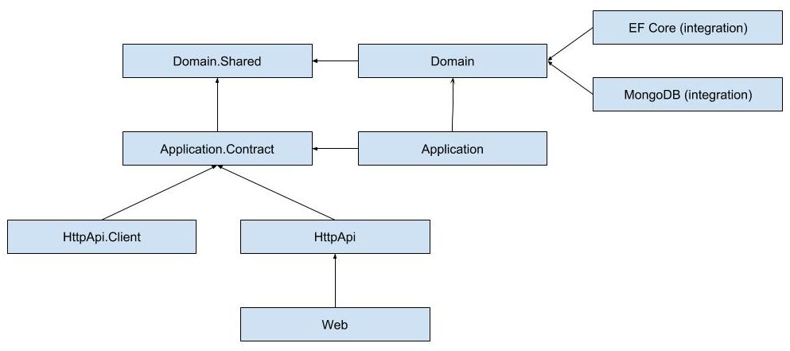

## 模块化架构最佳实践 & 约定

### 解决方案结构

* **推荐** 在Visual Sudio中为每个模块创建一个单独的解决方案.
* **推荐** 将解决方案命名为*CompanyName.ModuleName*(对于ABP核心模块来说,它的命名方式是*Volo.Abp.ModuleName*).
* **推荐** 一个模块做为分层项目开发,因为它有几个包(项目)是相互关联的.
  * 每个包都有自己的模块定义文件,并显式声明所依赖的包/模块的依赖关系.

### 层(layers) & 包(packages)

下面展示了一个分层良好的模块中的包以及它们之间的依赖关系:

最终的目地是让应用程序以灵活的方式使用该模块. 示例应用程序:

* **A)** **单体**应用程序;
  * 添加对**Web**和**Application**包的引用.
  * 根据需要添加对**EF Core** 或 **MongoDB** 包的引用.
  * 效果;
    * 应用程序可以显示**模块的UI**.
    * 它在**同一进程**中托管**应用层**和**领域层** (这就是为什么它引用对数据库集成包).
    * 此应用程序还提供了模块的**HTTP API**(因为它通过Web包引用了HttpApi包).
* **B)** 仅为**微服务**提供模块的应用程序;
  * 添加对**HttpApi**和**Application**包的引用.
  * 根据需要添加对**EF Core** 或 **MongoDB** 包的引用.
  * 效果;
    * 应用程序**无法显示模块的UI**, 因为它没有对Web包的引用.
    * 它在**同一进程**中托管**应用层**和**领域层** (这就是为什么它引用对数据库集成包).
    * 此应用程序提供了模块的**HTTP API**(它的主要目标).
* **C)** 显示模块**UI**但是不托管应用层的应用程序(仅将其用作由应用程序A或B托管的远程服务)
  * 添加对**Web**和**HttpApi.Client**包的引用.
  * 配置HttpApi.Client包的远程端点.
  * 效果;
    * 应用程序可以显示**模块的UI**.
    * 它不会在同一进程中托管模块的应用层和领域层. 而是将其用作**远程服务**.
    * 此应用程序还提供了模块的**HTTP API**(因为它通过Web包引用了HttpApi包).
* **D)** **客户端**应用程序 (或微服务) 只使用模块作为远程服务(由应用程序A,B或C托管);
  * 添加对**HttpApi.Client**包的引用.
  * 配置HttpApi.Client包的远程端点.
  * 效果;
    * 应用程序可以使用模块的所有功能作为**远程客户端**.
    * 应用程序只是一个客户端,**无法提供**模块的**HTTP API**.
    * 应用程序只是一个客户端,**无法显示**模块的**UI**.
* **E**) 托管模块的HTTP API但只是将所有请求转发给另一个应用程序的代理应用程序 (由应用程序A, B或C托管);
  * 添加对**HttpApi**和**HttpApi.Client**包的引用.
  * 配置HttpApi.Client包的远程端点.
  * 效果;
    * 应用程序可以将模块的所有功能用作**远程客户端**.
    * 应用程序也服务于模块的**HTTP API**, 但实际上它的工作方式与代理一样,将所有请求(模块)重定向到另一个远程服务器.

下一节将详细地介绍这些包.

#### 领域层

* **推荐** 将领域层划分为两个项目:
  * **Domain.Shared** 包(项目) 命名为*CompanyName.ModuleName.Domain.Shared*,包含常量,枚举和其他类型, 它不能包含实体,存储库,域服务或任何其他业务对象. 可以安全地与模块中的所有层使用. 此包也可以与第三方客户端使用.
  * **Domain** 包(项目) 命名为*CompanyName.ModuleName.Domain*, 包含实体, 仓储接口,领域服务接口及其实现和其他领域对象.
    * Domain 包依赖于 **Domain.Shared** 包.

#### 应用服务层

* **推荐** 将应用服务层划分为两个项目:
  * **Application.Contracts** 包(项目) 命名为*CompanyName.ModuleName.Application.Contracts,包含应用服务接口和相关的数据传输对象(DTO).
    * Application contract 包依赖于 **Domain.Shared** 包.
  * **Application** 包(项目)命名为*CompanyName.ModuleName.Application*,包含应用服务实现.
    * Application 包依赖于 **Domain** 包和 **Application.Contracts** 包.

#### 基础设施层

* **推荐** 为每个orm/数据库集成创建一个独立的集成包, 比如Entity Framework Core 和 MongoDB.
  * **推荐** 例如, 创建一个抽象Entity Framework Core集成的*CompanyName.ModuleName.EntityFrameworkCore* 包. ORM 集成包依赖于 **Domain** 包.
  * **不推荐** 依赖于orm/数据库集成包中的其他层.
* **推荐** 为每个主要的库创建一个独立的集成包, 在不影响其他包的情况下可以被另一个库替换.

#### HTTP 层

* **推荐** 创建命名为*CompanyName.ModuleName.HttpApi*的**HTTP API**包, 为模块开发REST风格的HTTP API.
  * HTTP API 包只依赖于 **Application.Contracts** 包. 不要依赖 Application 包.
  * **推荐** 为每个应用服务创建一个Controller (通常通过实现其接口). 这些控制器使用应用服务接口来委托操作. 它根据需要配置路由, HTTP方法和其他与Web相关的东西.
* **推荐** 创建一个为HTTP API包提供客户端服务的**HTTP API Client**包, 它的命名为*Companyname.ModuleName.HttpApi.Client*. 这些客户端服务将应用服务接口实现远程端点的客户端.
  * HTTP API Client 包仅依赖于 **Application.Contracts** 包.
  * **推荐** 使用ABP框架提供的动态代理HTTP C＃客户端的功能.

#### Web 层

* **推荐** 创建命名为*CompanyName.ModuleName.Web*的 **Web**包. 包含页面,视图,脚本,样式,图像和其他UI组件.
  * Web 包仅依赖于 **HttpApi** 包.