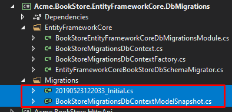

## Entity Framework Core PostgreSQL 集成

> 参阅 [Entity Framework Core 集成文档](../Entity-Framework-Core.md) 了解集成EF Core的基础知识.

### 更新 EntityFrameworkCore 项目

- 在 `Acme.BookStore.EntityFrameworkCore` 中将包 `Volo.Abp.EntityFrameworkCore.SqlServer` 替换为 `Volo.Abp.EntityFrameworkCore.PostgreSql` 
- 打开 `BookStoreEntityFrameworkCoreModule` 模块类
  - 将 `AbpEntityFrameworkCoreSqlServerModule` 替换为 `AbpEntityFrameworkCorePostgreSqlModule`
  - 将 `options.UseSqlServer()` 替换为 `options.UsePostgreSql()`
- 在其他的项目中将 `appsetting.json` 文件中的连接字符串更新为PostgreSQL链接字符串

#### 删除现有迁移

删除所有的现有迁移文件 (包括 `DbContextModelSnapshot`)



#### 生成生成迁移并更新数据库

设置正确的启动项目 (通常是Web项目),
打开 **程序包管理器控制台** (工具 -> Nuget包管理器 -> 程序包管理器控制台), 选择 `Acme.BookStore.EntityFrameworkCore.DbMigrations` 做为 **默认项目** 并执行以下命令:

运行 `Add-Migration` 命令.
````
PM> Add-Migration Initial
````

然后执行 `Update-Database` 执行更新数据库:

````
PM> Update-Database
````


