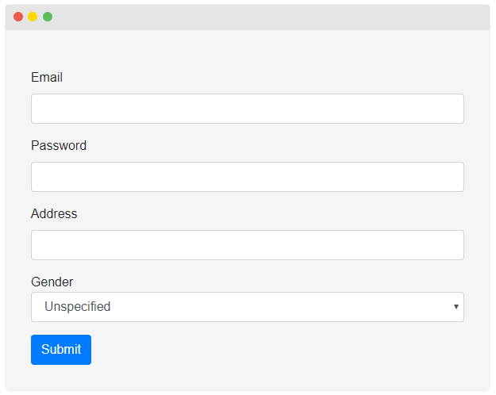

# ABP vNext介绍

## 介绍

过去的一段时间,我们正在设计一个新的主要版本的ASP.NET Boilerplate框架.现在,是时候与社区分享了.我们非常兴奋,相信你也是.

## 命名

框架的名称保持不变,除了我们将其仅称为“ABP”而不是“ASP.NET Boilerplate”.因为,“Boilerplate(样板)”会导致误解,并没反映出它是一个框架（而不是样板代码）.我们继续使用“ABP”名称,因为它是当前ASP.NET Boilerplate框架的继承者,除了它是完全重写的.

## 如何开始

我们已经创建了一个启动模板.你可以从[abp.io/Templates](https://abp.io/Templates)创建一个新项目并开始开发.欲了解更多信息,请访问[abp.io](https://abp.io/).

## 为什么要完全重写？

为什么我们花了宝贵的时间从头开始重写它而不是增量更改和改进.为什么？

### ASP.NET Core

当我们第一次介绍ABP框架时,那是2013年（5年前）！那时候没有.Net Core和ASP.NET Core,也没有Angular2 +.ABP发布后,它们都是从头开发的.

ASP.NET Core引入了许多内置解决方案（扩展库）,用于依赖注入,日志记录,缓存,本地化,配置等.它们实际上独立于ASP.NET Core,可用于任何类型的应用程序.

我们之前使用第三方库和我们自己的解决方案来满足这些要求.在它们发布后我们立即集成到ASP.NET Core功能中.但这是集成,而不是在这些扩展库之上构建ABP框架.例如,当前的ASP.NET Boilerplate依赖于Castle Windsor进行依赖注入,即使它已集成到ASP.NET Core的DI系统中.

我们希望依赖这些新的扩展库而不是第三方和自定义解决方案,这会改变框架的基本结构.

### 自身模块化

虽然目前的ABP本身已经是模块化的,并且包含许多包,但我们仍然希望将功能分解为更细粒度的nuget包.

例如,核心Abp包包含许多功能,如DDD类,审计,授权,后台作业,事件总线,json序列化,本地化,多租户,线程,时间等......我们希望将所有这些功能拆分到各自的包中并使它们可选.

### 放弃对传统技术的支持

是的,新的ABP框架将不支持ASP.NET MVC 5.x,Entity Framework 6.x和其他传统技术.

这些传统技术会由Microsoft维护,但不会再添加任何新功能.因此,如果你仍在使用这些技术,则可以继续使用当前的ASP.NET Boilerplate框架.我们将继续维护它,修复错误并添加新功能.

删除对这些传统库的支持将提高我们的开发速度（因为我们目前正在复制我们的某些功能的工作）并专注于.Net Core和ASP.NET Core.

新的ABP框架将基于.net standard.因此,仍然可以在新的ABP框架中使用完整的.net framework或.net core.

## 目标

我们从社区学到了很多东西,并且有开发当前ASP.NET Boilerplate框架的经验.新的ABP框架有着重要而令人兴奋的目标.

### 应用程序模块化

第一个目标是提供良好的基础设施来开发应用程序模块.我们将模块视为一组应用程序功能,具有自己的数据库,自己的实体,服务,API,UI页面,组件等.

我们将创建一个包含免费和付费应用程序模块的模块市场.你还可以在市场上发布自己的模块.更多信息即将推出.

### 微服务

我们正在设计新的ABP框架可方便的开发微服务并使它们相互通信.

我们正在设计应用程序模块,以便它们可以作为微服务单独部署,或者可以嵌入到单个应用程序中.

我们正在为此创建[规范/最佳实践文档](https://github.com/abpframework/abp/blob/master/docs/Best-Practices/Index.md)

### 主题和UI组合

新的ABP框架将基于最新的Twitter Bootstrap 4.x提供主题基础设施.我们开发了一个仅使用普通Bootstrap 4.x样式的基本主题.它是免费和开源的.我们还在开发高级和付费主题.

UI组合是主要目标之一.为此,主题系统将提供菜单,工具栏和其他可扩展区域,以允许其他模块交互(contribute).

### ORM / 数据库无关性和MongoDB集成

虽然当前的ASP.NET Boilerplate框架已经实现了ORM /数据库无关的存储库(Repository)模式,但身份集成模块（以Abp.Zero*命名的包）与EF以外的ORM一直运行的不太好.

使用新的ABP框架,最终目标是完全抽象的底层数据存储系统和开发与EF Core无关的模块.

我们将MongoDB作为第一级别的数据库,并在没有任何关系数据库或ORM假设的情况下设计实体和存储库.

### 更多可扩展性

新的ABP框架为内置服务提供了更多的扩展点和覆盖的能力.

## 一些功能

在本节中,我将介绍新ABP框架的一些令人兴奋的新功能.

### Bootstrap Tag Helpers

我们正在创建一个库将twitter bootstrap 4.x元素/组件包装到tag helper中.例:

~~~ html
<abp-card>
    
    <abp-card-body>
        <abp-card-title>Card title</abp-card-title>
        <abp-card-text>
            

                This is a sample card component built by ABP bootstrap
                card tag helper. ABP has tag helper wrappers for most of
                the bootstrap components.
            

        </abp-card-text>
        <a abp-button="Primary" href="#">Go somewhere &rarr;</a>
    </abp-card-body>
</abp-card>
~~~

“abp-*”标签是ABP tag helper,用于简化为Bootstrap 4.x编写HTML.

### 动态表单

动态表单tag helper允许你为给定的模型类动态地创建表单.例:

~~~ html
<abp-dynamic-form abp-model="@Model.PersonInput" submit-button="true" />
~~~

输出:

目前支持最常用的输入类型. 更多类型正在开发中.

### 虚拟文件系统

虚拟文件系统允许你将视图,页面,组件,javascript,css,json和其他类型的文件嵌入到模块程序集/包（dll）中,并在任何应用程序中使用.在应用程序中你的虚拟文件就像物理文件一样, 完全的集成在ASP.NET Core中.

更多信息请参阅[关于虚拟文件系统](https://medium.com/volosoft/designing-modularity-on-asp-net-core-virtual-file-system-2dd2cc2078bd)和[相关文档](https://github.com/abpframework/abp/blob/master/docs/Virtual-File-System.md).

### 动态捆绑和压缩系统

动态捆绑和压缩系统运行在虚拟文件系统上,并且允许模块以模块化,动态和强大的方式创建,修改和交互捆绑包.一个例子:

~~~ html
<abp-style-bundle>
    <abp-style type="@typeof(BootstrapStyleContributor)" />
    <abp-style src="/libs/font-awesome/css/font-awesome.css" />
    <abp-style src="/libs/toastr/toastr.css" />
</abp-style-bundle>
~~~

这段代码通过包含bootstrap（及其依赖项,如果有）和另外两个css文件来动态创建一个新的样式包.这些文件在生产环境中捆绑和压缩,但将在开发环境中单独添加.

有关更多信息,请参阅[文档](https://github.com/abpframework/abp/blob/master/docs/UI/AspNetCore/Bundling-Minification.md)

### 分布式事件总线(Distributed Event Bus)

在当前的ABP中,有一个IEventBus服务来触发和处理应用程序内的事件.除了这个本地事件总线,我们还创建了一个分布式事件总线抽象（和RabbitMQ集成）来实现分布式消息传递模式.

### 动态C# HTTP客户端代理

ABP已经为所有HTTP API创建动态JavaScript代理.该功能也存在于新的ABP框架中.此外,它现在可以为所有HTTP API创建动态C＃代理.

## 未来的工作

上面提到的所有东西都已经开发出来了.但是,我们还有一些想法尚未着手.

### 单页应用程序（Single Page Applications）

我们在设计新框架时考虑到了SPA这一点.但是,我们还没有尝试过任何SPA框架,我们还没有为它准备一个启动模板.

## ASP.NET Boilerplate（当前版本）和ASP.NET Zero会如何？

我们有专门的开发和支持团队积极致力于ASP.NET Boilerplate和ASP.NET Zero项目.这些项目有一个很大的社区,我们也从社区中获得了贡献.

我们将在很长一段时间内继续为这些项目进行改进,添加新功能和修复错误.因此,你可以安全地继续使用它们.

## 新的ABP可用在生产环境吗？

还没有.我们的第一个目标是使基本功能稳定,然后逐步完成其他功能.

我们会经常发布新版本,每个新版本都可能会有重大变化.我们将在发行说明中写下重大更改.

我们目前将其定义为实验性质.但我们希望这不会持续很长时间.我们无法确定一个准确的日期,请关注我们的发布.

## 包和版本控制

新的ABP框架将从v1.0开始,而不是遵循当前的ASP.NET Boilerplate版本, 以反映它是一个重写的事实.

我们会经常发布它.你可以期待许多重大变化,直到v1.0.从v1.0开始,我们将注意不要在1.x版本中引入重大更改.

当前ABP的包名称以Abp前缀开头（如Abp.EntityFrameworkCore）.新的包名称以Volo.Abp前缀开头（如Volo.Abp.EntityFrameworkCore）.

## 我应该用哪一个？

如果你正在创建一个新项目,我们建议你继续使用当前的ASP.NET Boilerplate框架,因为它非常成熟,功能丰富且可用于生产环境.

如果你愿意接受重大变化并希望体验新框架,那么你可以从新的ABP开始.我们不建议在临近截止日期和在短期内上线的项目上使用它.

## 贡献

就像当前的ABP框架一样,你可为新框架做出贡献.

* 你可以发送代码或文档的拉取请求.
* 你可以撰写关于它的博客文章或教程.
* 你可以尝试并分享你的经验.
* 你可以提出改进和功能请求.
* 你可以报告错误和其他问题.

## 联系/链接

* 官方网站:[abp.io](https://abp.io/)
* Github:[github.com/abpframework](https://github.com/abpframework)
* Twitter:[@abpframework](https://twitter.com/abpframework)
