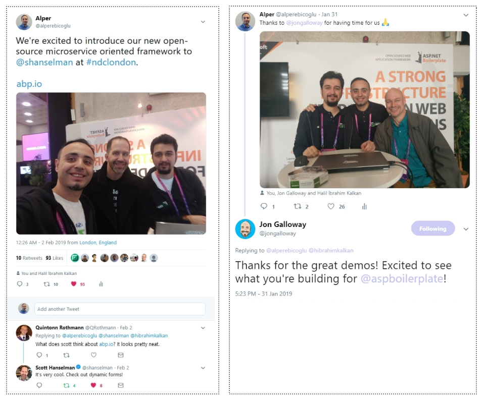

# 微服务演示,项目状态和路线图

在ABP vNext上的[第一个公告](https://abp.io/blog/abp/Abp-vNext-Announcement)之后,我们对代码库进行了很多改进([GitHub存储库](https://github.com/abpframework/abp)上的1100多次提交).我们已经创建了功能,示例,文档等等.在这篇文章中,我想告诉你一些新闻和项目的状态.

## 微服务演示解决方案

ABP框架的主要目标之一是提供[创建微服务解决方案的便利基础设施](https://abp.io/documents/abp/latest/Microservice-Architecture).

我们一直在努力开发微服务解决方案演示.初始版本已完成并[文档化](https://abp.io/documents/abp/latest/Samples/Microservice-Demo).该示例解决方案旨在演示一个简单而完整的微服务解决方案;

- 具有多个独立的,可自我部署的**微服务**.
- 多个**Web应用程序**,每个都使用不同的API网关.
- 使用[Ocelot](https://github.com/ThreeMammals/Ocelot)库开发了多个**网关** / BFF(后端为前端(Backend for Frontends)).
- 使用[IdentityServer](https://identityserver.io/)框架开发**身份验证服务**.它也是一个带有必要UI的SSO(单点登录)应用程序.
- 有**多个数据库**.一些微服务有自己的数据库,而一些服务/应用程序共享一个数据库(以演示不同的用例).
- 具有不同类型的数据库:**SQL Server**(使用**Entity Framework Core** ORM)和**MongoDB**.
- 有一个**控制台应用程序**来显示通过身份验证使用服务的最简单方法.
- 使用[Redis](https://redis.io/)进行**分布式缓存**.
- 使用[RabbitMQ](https://www.rabbitmq.com/)进行服务到服务(service-to-service)的**消息传递**.
- 使用[Docker](https://www.docker.com/)和[Kubernates](https://kubernetes.io/)**部署**并运行所有服务和应用程序.
- 使用[Elasticsearch](https://www.elastic.co/products/elasticsearch)和[Kibana](https://www.elastic.co/products/kibana)存储和可视化日志(使用[Serilog](https://serilog.net/)编写).

有关解决方案的详细说明,请参阅[其文档](https://abp.io/documents/abp/latest/Samples/Microservice-Demo). 

## 改进/功能

我们已经开发了许多功能,包括**分布式事件总线**(与RabbitMQ集成),**IdentityServer4集成**以及几乎所有功能的增强.我们不断重构和添加测试,以使框架更稳定和生产就绪.它正在[快速增长](https://github.com/abpframework/abp/graphs/contributors).

## 路线图

在第一个稳定版本(v1.0)之前还有很多工作要做.你可以在GitHub仓库上看到[优先的积压项目](https://github.com/abpframework/abp/issues?q=is%3Aopen+is%3Aissue+milestone%3ABacklog).

根据我们的估计,我们计划在2019年第二季度(可能在五月或六月)发布v1.0.所以,不用等待太长时间了.我们也对第一个稳定版本感到非常兴奋.

我们还将完善[文档](https://abp.io/documents/abp/latest),因为它现在还远未完成.

第一个版本可能不包含SPA模板.但是,如果可能的话,我们想要准备一个简单些的.SPA框架还没有确定下来.备选有:**Angular,React和Blazor**.请将你的想法写为对此帖的评论.

## 中文网

中国有一个大型的ABP社区.他们创建了一个中文版的abp.io网站:https://abp.io/. 他们一直在保持更新.感谢中国的开发人员,特别是[Liming Ma](https://github.com/maliming).

## NDC {London} 2019

很高兴作为合作伙伴参加[NDC {London}](https://ndc-london.com/)2019 .我们已经与许多开发人员讨论过当前的ASP.NET Boilerplate和ABP vNext,我们得到了很好的反馈.

我们还有机会与[Scott Hanselman](https://twitter.com/shanselman)和[Jon Galloway](https://twitter.com/jongalloway)交谈.他们参观了我们的展位,我们谈到了ABP vNext的想法.他们喜欢新的ABP框架的功能,方法和目标.在twitter上查看一些照片和评论:

## 跟上步伐

* 你可以标星并关注**GitHub**存储库:https://github.com/abpframework/abp
* 你可以关注官方**Twitter**帐户获取新闻:https://twitter.com/abpframework
