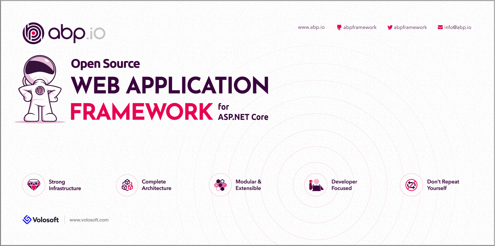

# 基于ASP.NET Core 3.0的ABP v0.21已发布

在微软发布仅仅一个小时后, 基于ASP.NET Core 3.0的ABP v0.21也紧跟着[发布了.](https://twitter.com/abpframework/status/1176185493119258624)

v0.21没有新功能.它只是升级到稳定的ASP.NET Core 3.0. 查看[v0.20发行说明](https://github.com/abpframework/abp/releases/tag/0.20.0)以获取新功能,增强功能和错误修复.

## 关于v1.0

ABP框架越来越接近v1.0.我们打算在今年10月中旬发布1.0. 现在,我们将完善测试和文档.

## .NET Conf 2019

微软已经在为期3天的虚拟会议.NET Conf 2019发布了ASP.NET Core 3.0. ABP的首席开发人员[Halil ibrahim Kalkan](https://twitter.com/hibrahimkalkan)在会议上也发表了讲话,介绍了ABP框架.能够参加这一重要活动真是太棒了.

## Techorama荷兰2019

[Techorama NL](https://techorama.nl/)是欧洲最大的会议之一.今年,Volosoft是会议的赞助商,并将有一个展位与软件开发人员讨论ABP框架和软件开发.我们的展位墙如下图所示：

如果您也参加会议,请到展位讨论ABP框架.我们还为您准备了一些私货:)
