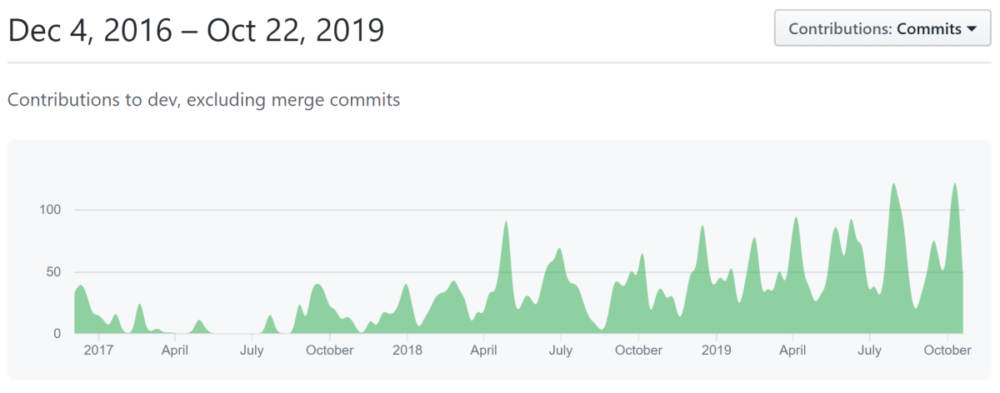

# ABP v1.0终于发布了!

今天是个大日子!经过约3年的不断开发,第一个稳定的ABP版本,1.0,已经发布了.感谢为该项目做出贡献或试用过的每个人.

立即开始使用新的ABP框架:[abp.io/get-started](https://abp.io/get-started)

## 统计

在这里,有关该项目的一些GitHub和NuGet统计信息:

* 2,360星.
* 5,917次提交.
* 72位贡献者.
* 关闭了1,136个问题,276个打开问题.
* 关闭了566个PR,5个打开的PR.
* 39次发布.
* 在NuGet上有122,795次下载.

甚至在第一个版本发布之前就有了非常好的需求.

## 路线图

首要任务是完成文档,因为框架功能和模块仍然缺少很多文档.然后,我们将根据标记的优先级继续在GitHub上解决问题.

请参阅[GitHub里程碑项目](https://github.com/abpframework/abp/milestones).

ABP是一个社区驱动的项目.因此,我们主要根据社区的反馈和需求确定问题的优先级.