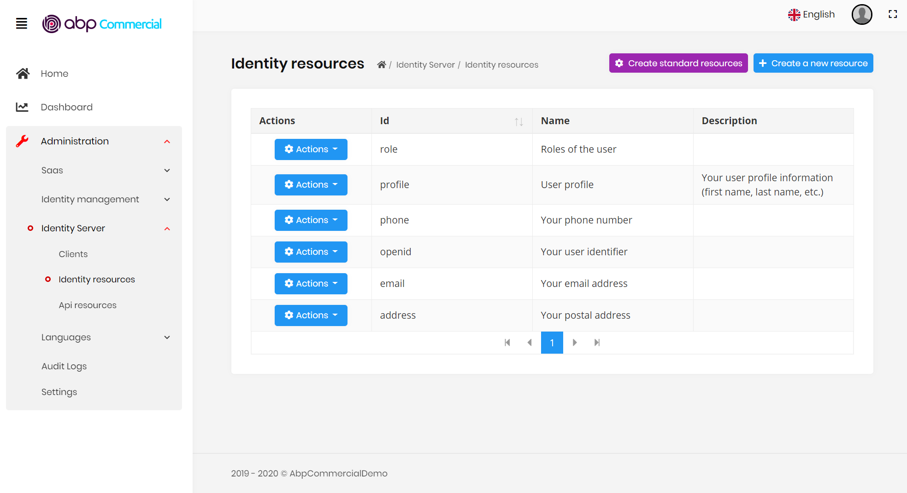
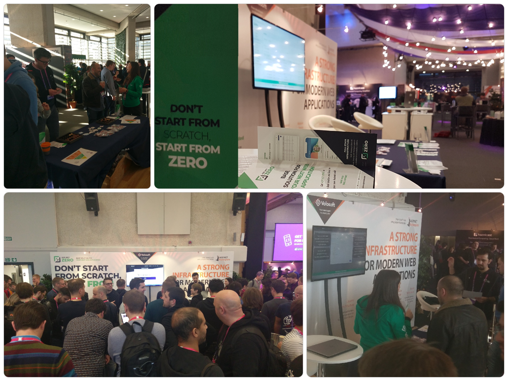

# ABP框架v2.0 和 ABP商业版

ABP框架2.0版已经在本周公布.这篇文章解释了为什么我们发布了一个**抢先主版本**,和2.0版本中的变化.

除了v2.0版本,我们很高兴地宣布**ABP商业版**,这是建立在开源ABP框架的之上的一套专业的模块,工具,主题和服务.

## ABP框架V2.0

### 为什么2.0,而不是1.2？

本来在[V1.1.2](https://github.com/abpframework/abp/releases/tag/1.1.2)发布后计划发布1.2版.然而,[有报告](https://github.com/abpframework/abp/issues/2026)称1.x版在Linux上有一些**性能**和**稳定性**问题,尤其是当应用程序部署在**低配CPU和内存**的**Linux**容器上.

我们深入研究了这一问题,并已查明问题的根本原因与**拦截`async`方法**的实现有关.此外,也有一些 **`async`套`sync`** 的用法影响了线程池的优化.

最后,在**社区**在大力协助下我们**解决了所有的问题**.但是,我们也有一些重要的**设计决策**导致了一些**破坏性变更**,因为[语义版本](https://semver.org/),我们不得不改变框架的主版号.

大多数的应用程序不会受到[破坏性变更](https://github.com/abpframework/abp/releases)的影响,或者只需要做一些微小的修改.

### 破坏性变更

#### 删除了一些同步的API

一些拦截器需要使用`async`的API.当他们拦截`sync`方法时,他们需要调用`async`套`sync`.这最终导致了`async`套`sync`的问题.这就是为什么我们[删除了一些同步的API](https://github.com/abpframework/abp/pull/2464).

当你需要**在`async`方法中调用`sync`方法**时, **`async`套`sync`** 这种模式是`C#`一个经典问题.虽然有一些解决方法,但是都有相应的**缺点**,并建议**不要写**这样的代码.你可以在网上找到关于这一话题的许多文档.

为了避免这个问题,我们已经移除:

- `sync`[仓储](https://docs.abp.io/en/abp/latest/Repositories)方法 (如`insert`, `update`, 等...),
- `sync`[工作单元](https://docs.abp.io/en/abp/latest/Unit-Of-Work)API,
- `sync`[后台作业](https://docs.abp.io/en/abp/latest/Background-Jobs)API,
- `sync`[审计日志](https://docs.abp.io/en/abp/latest/Audit-Logging)API,
 - 其他一些很少使用的`sync`API.

如果你遇到了编译错误,只需使用这些API的`async`版本.

#### 始终async!

从v2.0开始,ABP框架假设你以`async`方式编写你的应用程序代码.否则,一些框架的功能可能无法正常工作.

建议你的所有[应用服务](https://docs.abp.io/en/abp/latest/Application-Services), [仓储方法](https://docs.abp.io/en/abp/latest/Repositories), 控制器动作(ontroller actions), 页面处理器(page handlers)都是`async`.

即使你的应用服务方法并不需要是`async`,也将其设置为`async`,因为拦截器需要执行`async`操作（授权,工作单元等）.你可以在不调用`async`的方法中返回`Task.Completed`.

示例:

````csharp
public Task<int> GetValueAsync()
{
    //这个方法没有任何async调用
    return Task.CompletedTask(42);
}
````

上述例子通常并不需要是`async`因为它不执行`async`调用.然而,将它设置为`async`,这样可以帮助ABP框架运行拦截器时避免出现`async`套sync的调用.

此规则不强制你写的每一个方法都是`async`.这样并不好而且很乏味.只在拦截的服务上需要(特别是[应用服务](https://docs.abp.io/en/abp/latest/Application-Services)和[仓库方法](https://docs.abp.io/en/abp/latest/Repositories))

#### 其他破坏性变更

查看[发行说明](https://github.com/abpframework/abp/releases/tag/2.0.0)中的破坏性变更.他们中的大多数都不会影响你的应用程序代码.

### 新功能

本次发布还包含一些新的功能和一堆改进:

- [#2597](https://github.com/abpframework/abp/pull/2597) 新的`Volo.Abp.AspNetCore.Serilog`包.
- [#2526](https://github.com/abpframework/abp/issues/2526) `C#`客户端代理的客户端验证.
- [#2374](https://github.com/abpframework/abp/issues/2374) `async`后台作业.
- [#265](https://github.com/abpframework/abp/issues/265) 管理应用程序关闭.
- [#2472](https://github.com/abpframework/abp/issues/2472) `IdentityServer`模块实现`DeviceFlowCodes`和`TokenCleanupService`.

功能,改进和BUG修复的完整列表, 请查看[发布说明](https://github.com/abpframework/abp/releases/tag/2.0.0).

### 文档

随着v2.0的发布,我们也完成了一些缺少的文档.在接下来的几周内,我们将主要关注文档和教程.

## ABP商业版

[ABP商业版](https://commercial.abp.io/)是建立在开源ABP框架之上的一套专业的**模块,工具,主题和服务**.

 - 除了ABP框架免费和[开源模块](https://docs.abp.io/en/abp/latest/Modules/Index)之外, 提供[专业模块](https://commercial.abp.io/modules).
- 包含一个漂亮的[UI主题](https://commercial.abp.io/themes), 具有5种不同的样式.
- 提供[ABP套件](https://commercial.abp.io/tools/suite); 一个让开发更具有生产力的工具. 通过配置实体属性, 它可以在几秒内创建全栈的CRUD页面. 更多的功能陆续开发中.
- 为企业提供[高级支持](ttps://commercial.abp.io/support).

除了这些标准的功能,我们会将提供定制服务.更多细节请参见[commercial.abp.io](https://commercial.abp.io/)网站.

### ABP框架 vs ABP商业版

ABP商业版**不是付费版本**的ABP框架.可以把它当作为专业公司提供的**附加套餐**.你可以用它来节省时间和更快地开发产品.

ABP框架将永远是**开源免费**的!

一个原则是,我们创建的主要基础设施作为开源产品, 然后销售额外的预制应用程序功能,主题和工具.类似于[ASP.NET Boilerplate](https://aspnetboilerplate.com/)和[ASP.NET Zero](https://aspnetzero.com/)产品.

购买商业版许可极大地节省你的时间和精力,你可以专注于自己的业务,此外也可获得专门的和优先的支持.同时,你也在支持ABP核心团队,因为我们花了大部分时间来开发,维护和支持开源的ABP框架.

有了ABP商业版,ABP现在变为一个平台.我们称之为**ABP.IO平台**, 其中包括开源ABP框架和ABP商业版.

### 演示

如果你想知道ABP商业版应用程序的启动模板是什么样,你可以很容易地[创建一个演示](https://commercial.abp.io/demo),并看到它的实际效果.该演示包括所有的预制模块和主题.

下面是一张IdentityServer管理模块UI的截图:



这是一张来自使用material设计风格主题的演示应用程序的截图:


### 价格

你可以创建**无限个工程/产品**, 销售给**无限个客户**, 部署在**无限台服务器上**, 不受任何限制. 定价主要是基于**开发人员个数**,**支持等级**和**源代码**需求上.有三个标准包;

- **团队许可**: 包括所有的模块,主题和工具.允许最多3个开发者开发产品.可购买额外的开发者许可.
- **商业许可**: 允许下载所有的模块和主题的源代码.此外,默认包含了5个开发者许可.可购买额外的开发者许可.
- **企业许可**: 在商业许可上, 提供无限的专属支持.

请查看[价格页面](https://commercial.abp.io/pricing)了解详细信息.除了标准包以外,我们也提供定制服务和定制许可.如有任何问题,请[联系我们](https://commercial.abp.io/contact).

#### 许可比较

许可价格是根据开发者数量,支持等级和源代码访问而变化的.

##### 源代码

团队许可证不包括预制模块和主题的源代码.以**NuGet和NPM包**的方式使用所有这些模块.通过这种方式,你可以很容易地通过更新包的依赖得到**新功能和bug修复**仅.但是不能访问其源代码.所以不能嵌入模块的源代码到你的应用程序里,和随意修改源代码.

预制模块提供一定等级的**定制**和**扩展**,并允许你覆盖服务,UI部分等.我们正在努力使他们更加可定制和可扩展.如果你无需在预制模块中做很大修改的话,团队许可是你理想的选择,因为它更便宜,并且可轻松获得新的功能和bug修复.

商业和企业许可允许你在需要时**下载任何模块和主题的源代码**.它们使用与团队许可相同的启动模板,所以所有的模块都默认使用`NuGet`和`NPM`包.但是,在需要的情况下,你可以从一个模块中删除包的依赖,并嵌入它的源代码到你自己的解决方案中,然后完全定制它.在这种情况下,当一个新版本可用时, 升级模块将不会那么容易.当然, 你不必升级!但是,如果你愿意,你也可以使用一些合并工具或Git的分支系统来做到这一点.

#### 许可周期

ABP商业版许可是**永久的**,这意味着你可以**永远使用**它继续开发应用程序.

但是,下面的服务周期为一年:

- 高级**支持**一年后结束.你可以继续得到社区支持.
- 一年后将不会得到模块和主题的**更新**.你可以继续使用最后获得的版本.甚至可以在主版本内得到BUG修复和改进.
- 你可使用**ABP套件**一年.

如果想继续获得这些好处,可延长许可期限.续订价格比正常价格低20%.

## NDC London 2020

与[去年](https://medium.com/volosoft/impressions-of-ndc-london-2019-f8f391bb7a9c)一样, 我们是著名的软件开发会议[NDC London](https://ndc-london.com/)的合作伙伴! 去年, 我们开展了[ASP.NET Boilerplate](https://aspnetboilerplate.com/)和[ASP.NET Zero](https://aspnetzero.com/)主题:



今年,我们将着重于**ABP.IO平台**(开源ABP框架和ABP商业版).我们的展位会是这样的:


如果你参加会议,记得要参观我们的展位.我们将很高兴来谈一谈ABP平台的功能,目标和软件开发.

### 你想见ABP团队吗?

如果你在伦敦, 而且想和我们喝杯咖啡的话, 在2月1日的下午[@hibrahimkalkan](https://twitter.com/hibrahimkalkan)和[@ismcagdas](https://twitter.com/ismcagdas)会在那.

想见面就给info@abp.io写个邮件 :)