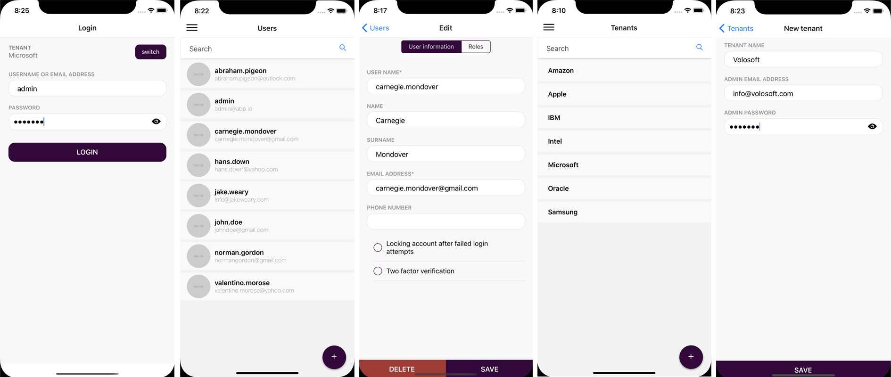

# ABP框架v2.3.0已经发布！

在**新冠病毒**的日子里,我们发布了**ABP框架v2.3**, 这篇文章将说明本次发布**新增内容**和过去的两周**我们做了什么**.

## 关于新冠病毒和我们的团队

关于冠状病毒的状况**我们很难过**.在[Volosoft](https://volosoft.com/)的团队,我们有不同国家的**远程工作者**在自己家里工作.从上周开始,我们已经**完全开始在家远程工作**,包括我们的主要办公室的员工.

我们相信并祈祷人类会在很短的时间内克服这个问题.

## 关于发布周期

从ABP v2.1.0开始,我们开始**每两周**的周四发布功能版本.本次是该决定后的第3次发布,我们看到这种方式目前运转良好,并提高了我们的灵活性.

我们将继续每两周发布**功能版本**(如v2.4,v2.5).另外,如果需要我们会随时发布**热修复版本**(如v2.3.1,v2.3.2).

## ABP框架v2.3.0新增内容

我们已在这两周的开发周期内通过**393次提交**完成和合并了 **[104](https://github.com/abpframework/abp/milestone/30?closed=1)个issue和pull request**.

我将介绍这个版本加入的一些新功能和改善.

### React Native移动应用程序

我们终于完成了**react native移动应用程序**.目前,它可以让你**登录**,管理**用户**和**租户**.它利用ABP框架相同的设置,授权和本地化系统.

应用程序的一些截图:



它没有太多的功能,但它是你的移动应用程序一个**完美的起点**,因为它是完全集成到后端并支持多租户.

### Angular TypeScript代理生成器

从我们的Angular应用程序中调用服务器中的REST端点是很常见的.这种情况下,我们一般创建**服务**(在服务器上包含各个服务的方法)和**模型对象**(对应服务器上的[DTO](https://docs.abp.io/en/abp/latest/Data-Transfer-Objects)).

除了手动创建这样的与服务器交互的服务外,我们可以使用像[NSWAG](https://github.com/RicoSuter/NSwag)工具来为我们生成服务代理.但是NSWAG有以下几个我们遇到的问题:

* 它产生一个**大,单一**的.ts文件;
  * 当你的应用程序增长时,它变得**太大**了.
  * 它不适合ABP框架的 **[模块化](https://docs.abp.io/en/abp/latest/Module-Development-Basics)方式**.
* 它创建了有点**丑陋的代码**.我们希望有一个干净的代码(就像我们手写的).
* 它不能生成服务器端声明的相同的**方法签名**(因为swagger.json不能准确地反映后端服务的方法签名).我们已创建了公开服务器端方法约定的端点,来允许客户端生成更好的客户端代理.

因此,我们决定创建一个ABP CLI命令来自动生成typescript客户端代理([#2222](https://github.com/abpframework/abp/issues/2222)),用于在ABP框架中开发REST API.

它用起来很简单.只需要在你Angular应用程序的**根文件夹**运行以下命令

````bash
abp generate-proxy
````

它只会为你自己的应用程序的服务创建代理.它(默认)不会为你使用的应用程序模块创建代理.有几个选项.参见[CLI文档](https://docs.abp.io/en/abp/latest/CLI).

### 复合主键的CRUD应用服务

` CrudAppService `是一个很有用的基类,用来为你的实体创建CRUD应用服务.不过,它不支持**复合主键**的实体. `AbstractKeyCrudAppService`是新开发的基类以支持复合主键的实体.更多信息请浏览[文档](https://docs.abp.io/en/abp/latest/Application-Services#abstractkeycrudappservice).

### 添加模块的源代码

应用程序启动模板带有一些[应用模块](https://docs.abp.io/en/abp/latest/Modules/Index), 以**Nuget和NPM包**的方式**预先安装了** .这样做有几个重要的优点:

* 当新版本可用时, 你可以 **轻松地[升级](https://docs.abp.io/en/abp/latest/CLI#update)** 这些模块.
* 你的解决方案**更干净**,这样你就可以专注于自己的代码.

但是,当你需要对一个依赖的模块**大量定制**时,就不如它的代码在你的应用程序中那么容易.为了解决这个问题,我们引入了一个[ABP CLI](https://docs.abp.io/en/abp/latest/CLI)的新命令, 在你的解决方案中用代码**替换**Nuget包.用法很简单:

````bash
abp add-module --with-source-code
````

该命令以源代码方式添加模块, 或者如果模块已经以包引用方式添加了, 则替换为源代码,.

> 建议在使用此命令前**保存你的更改**到源代码控制系统, 因为它会修改很多你的代码.

此外,我们也创建了文档来说明如何定制依赖的模块而不改变它们的源代码(见下面的部分).仍然建议以包的方式使用模块,以便在以后可以轻松升级.

> 免费模块的源代码是**MIT**许可,所以你可以自由更改它们并添加到你的解决方案中.

### 切换到预览版

ABP框架正在迅速发展,我们经常发布新版本.不过,如果你想更紧密地追随它,你可以使用**每日预览包**.

我们创建了一个ABP CLI命令来轻松地为你的解决方案**更新到最新的预览包**.在你的解决方案的根文件夹中运行以下命令:

````bash
abp switch-to-preview
````

它会修改所有ABP相关的NuGet和NPM包的版本.当你需要时你也可以**切换回最新稳定版**:

````bash
abp switch-to-stable
````

更多信息请浏览[ABP CLI文档](https://docs.abp.io/en/abp/latest/CLI#switch-to-preview).

### 文档改进

#### 扩展/定制依赖应用模块

我们创建了一个巨大的文档来说明如何定制模块依赖而不改变其源代码.参见[文档](https://docs.abp.io/en/abp/latest/Customizing-Application-Modules-Guide).

除了文档以外,我们已经修订了所有模块([#3166](https://github.com/abpframework/abp/issues/3166)),来使他们的服务更容易扩展和定制.

#### EF Core迁移指南

最近,我们创建了一个指南,说明ABP启动模板所使用的迁移系统. [该指南](https://docs.abp.io/en/abp/latest/Entity-Framework-Core-Migrations)还介绍了如何定制迁移结构,拆分你的模块跨多个数据库,复用一个模块的表,等等.

#### 从 ASP.NET Boilerplate迁移

如果你有建立在 ASP.NET Boilerplate的解决方案,我们[创建了一个指南](https://docs.abp.io/en/abp/latest/AspNet-Boilerplate-Migration-Guide),试着帮助迁移你的解决方案到新的ABP框架上.

### 其他一些功能

#### 框架

* 添加`IRepository.GetAsync`和`IRepository.FindAsync`方法([#3184](https://github.com/abpframework/abp/issues/3148)).

#### 模块

* 当创建新租户时获取管理员的密码和电子邮件地址,租户管理模块([#3088](https://github.com/abpframework/abp/issues/3088)).
* 集成Elastic全文检索, 文档模块([#2901](https://github.com/abpframework/abp/pull/2901)).
* 新的Quartz后台工作者模块([#2762](https://github.com/abpframework/abp/issues/2762))

#### 示例

* 微服务演示添加多租户支持([#3032](https://github.com/abpframework/abp/pull/3032)).

所有的功能, 改善和BUG修复, 请浏览[发布说明](https://github.com/abpframework/abp/releases/tag/2.3.0).

## 下一步?

我们未来几个月的目标如下:

* 完成**文档和示例**,写更多的教程.
* 使框架和现有模块的更加**可定制和可扩展**.
* 集成**gRPC**和为所有预置模块实现gRPC端点([＃2882](https://github.com/abpframework/abp/issues/2882)).
* 为ABP框架创建**Blazor UI**, 并在所有模块和启动模板中实现它([＃394](https://github.com/abpframework/abp/issues/394)).
* 为预置模块**添加新功能**,并为[ABP商业版](https://commercial.abp.io/)创建新模块.

更多细节请浏览[GitHub里程碑](https://github.com/abpframework/abp/milestones).