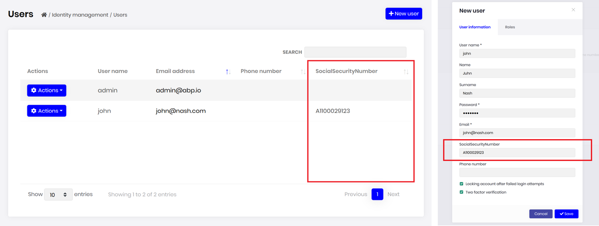
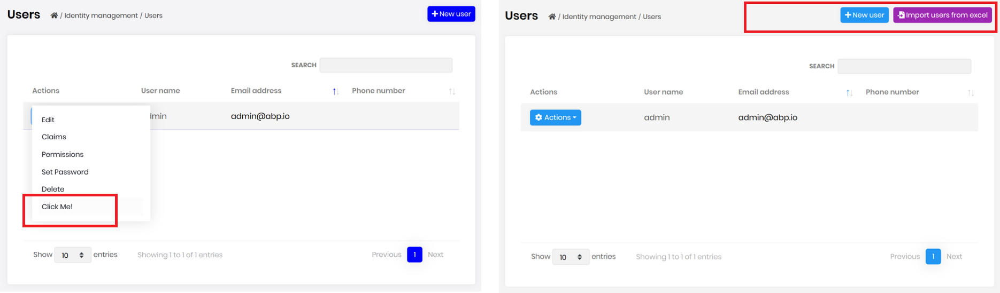
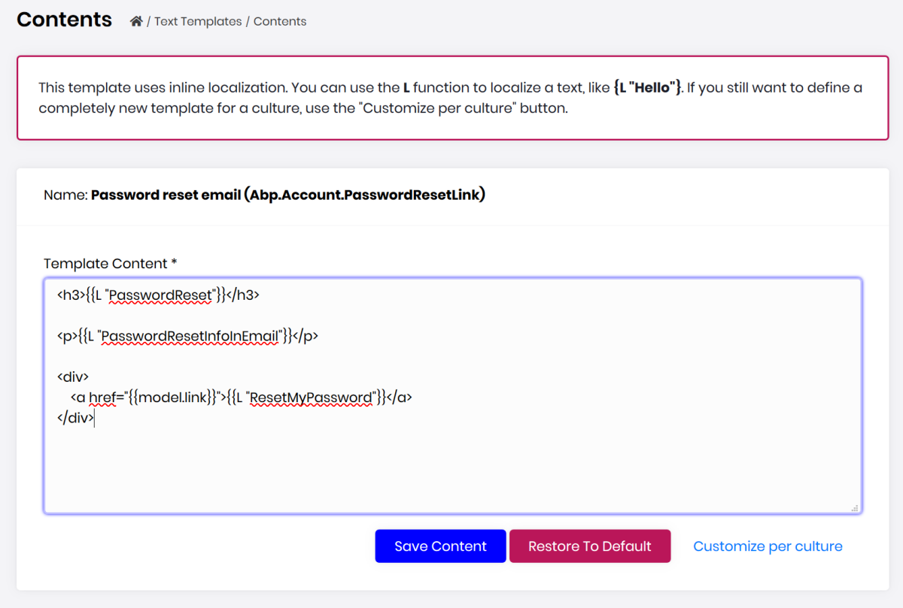
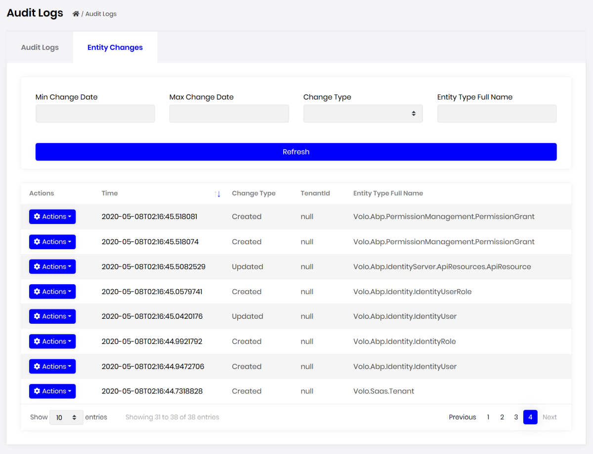
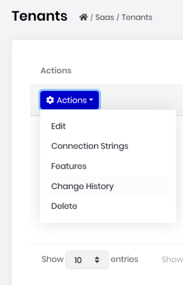
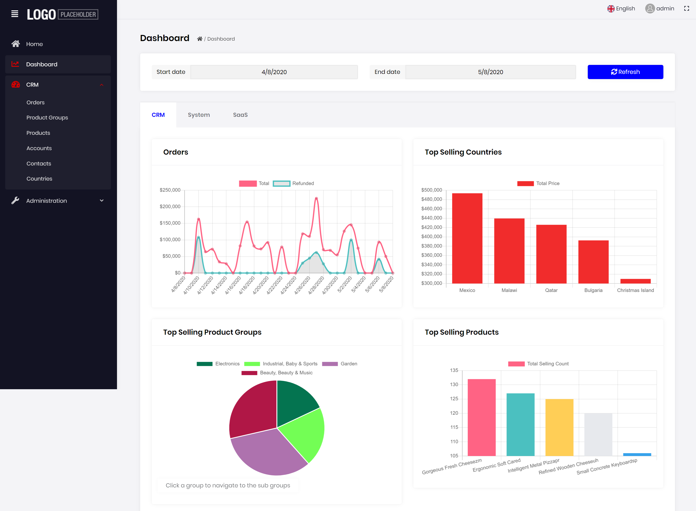

# ABP框架 v2.7.0已经发布!

**ABP框架**和**ABP商业版** v2.7已经发布.我们没有为2.4,2.5和2.6发布博客文章,所以这篇文章也将涵盖这几个版本中**新增内容**和过去的2个月里**我们完成了什么**.

## 关于发布周期与开发

之前说过我们已经开始**每两个星期**发布一个新的次要功能版本,一般在星期四.我们的目标是尽快提供新功能.

在过去的7-8周里, 我们在**1,300+次提交**中完成和合并了数百个issue和pull request, 这只是ABP框架的库.每日提交的次数不断增加：


ABP.IO平台正在快速增长,我们从社区获取的贡献越来越多.

## ABP框架有哪些新增内容?

### 对象扩展系统(Object Extending System)

在过去的几个版本中,我们主要集中在以NuGet/NPM包使用现有模块时, 提供扩展的方法,

对象扩展系统允许模块开发者创建可扩展的模块并允许应用开发者更容易地定制和扩展.

例如,你可以这样为Identity模块的User实体添加两个扩展属性:

````csharp
ObjectExtensionManager.Instance
    .AddOrUpdate<IdentityUser>(options =>
        {
            options.AddOrUpdateProperty<string>("SocialSecurityNumber");
            options.AddOrUpdateProperty<bool>("IsSuperUser");
        }
    );
````

也很容易为这些属性定义验证规则：

````csharp
ObjectExtensionManager.Instance
    .AddOrUpdateProperty<IdentityUserCreateDto, string>(
        "SocialSecurityNumber",
        options =>
        {
            options.Attributes.Add(new RequiredAttribute());
            options.Attributes.Add(
                new StringLengthAttribute(32) {
                    MinimumLength = 6
                }
            );
        });
````

你甚至可以编写自定义代码来验证属性.它会自动适用于应用服务, 控制器或页面的参数对象.

实体的扩展属性通常存储在数据库表的一个单独的JSON格式的字段中,但是你也可以轻松地使用EF Core映射配置该属性为一个表字段：

````csharp
ObjectExtensionManager.Instance
    .AddOrUpdateProperty<IdentityUser, string>(
        "SocialSecurityNumber",
        options =>
        {
            options.MapEfCore(b => b.HasMaxLength(32));
        }
    );
````

请参见有关该系统的详细信息[对象扩展文档](https://docs.abp.io/en/abp/latest/Object-Extensions).

也可参见[自定义现有模块](https://docs.abp.io/en/abp/latest/Customizing-Application-Modules-Guide)指南,以了解所有可能的自定义选项.

### 文本模板包

[Volo.Abp.TextTemplating](https://www.nuget.org/packages/Volo.Abp.TextTemplating)是v2.7.0中新加入的包.此前,[Volo.Abp.Emailing](https://www.nuget.org/packages/Volo.Abp.Emailing)包也有类似的功能,但它的功能是有限的,实验性质的并且和发送邮件紧密耦合在一起.

新文本模板包允许你定义基于文本的模板, 可以很容易地本地化和重用.你可以定义布局模板并且与其它模板共享.

目前,我们正在使用它发送邮件.一个需要发送邮件的模块通常定义了一个模板.如：

````xml
<h3>{{L "PasswordReset"}}</h3>

<p>{{L "PasswordResetInfoInEmail"}}</p>

<div>
    <a href="{{model.link}}">{{L "ResetMyPassword"}}</a>
</div>
````

这是一个典型的密码重置邮件模板.

* 模板系统是基于开源的[Scriban库](https://github.com/lunet-io/scriban).因此,它支持if条件,循环等等.
* `model`用于将数据传递到模板(就像ASP.NET Core MVC).
* `L`是一个特殊函数用于本地化给定的字符串.

为所有邮件使用相同的布局是一个典型应用.所以,你可以定义一个布局模板.这是框架自带的标准的布局：

````xml
<!DOCTYPE html>
<html lang="en" xmlns="http://www.w3.org/1999/xhtml">
<head>
    <meta charset="utf-8" />
</head>
<body>
    {{content}}
</body>
</html>
````

布局中应该有一个`{{content}}`区域用来呈现子内容(就像MVC中的`RenderBody()`).

最终应用程序可以很容易地通过覆盖模板内容来自定义它.

每当你需要渲染模板时,提供模板名称和model来使用`ITemplateRenderer`服务.详情请参见[文本模板文档](https://docs.abp.io/en/abp/latest/Text-Templating).我们甚至还为ABP商业版创建了UI(请参见下面的相关章节).

### 订阅异常

ABP框架的[异常处理系统](https://docs.abp.io/en/abp/latest/Exception-Handling)会自动处理异常并且为客户端返回相应的结果.在某些情况下,你可能希望每当异常发生时有一个回调.通过这种方式,例如,你可以发送邮件或采取基于异常的任何动作.

只需要在你的应用程序中创建一个从`ExceptionSubscriber`派生的类：

````csharp
public class MyExceptionSubscriber : ExceptionSubscriber
{
    public async override Task HandleAsync(ExceptionNotificationContext context)
    {
        //TODO...
    }
}
````

更多信息请参见[异常处理](https://docs.abp.io/en/abp/latest/Exception-Handling).

### 其他

在之前的发布中框架也有很多小的功能和改进.这里列举几个：

* 新增了`AbpLocalizationOptions.DefaultResourceType`用来设置应用程序的默认资源类型.通过这种方式,当资源未指定时, 本地化系统使用默认的资源.最新的应用程序启动模板已经配置了,你也可以为你现有的应用程序设置它.
* 权限定义新增了`IsEnabled`.通过这种方式,你可以从应用程序中完全禁用权限和隐藏相关功能.这可在一些应用程序中做为功能开关的方式.用法请参见[#3486](https://github.com/abpframework/abp/issues/3486).
* 框架中定义的所有本地化资源新增了荷兰语和德语本地化.感谢贡献者们.

## ABP商业版有哪些新增内容?

[ABP商业版](https://commercial.abp.io/)的目标是基于ABP框架项目提供预构建的应用程序功能,代码生成工具,专业的主题,先进的示例和高级支持.

我们正在并行工作于ABP商业版与ABP框架功能对齐,并提供更多的模块,主题选项和工具.

本节将介绍ABP商业版这边有哪些进展.

### 模块实体扩展系统

模块实体扩展系统是相对于对象扩展系统(上面介绍的)的一个更高级别的API,并提供了一种简单的方法来向现有实体中增加扩展属性.一个新的扩展属性可以很容易地自动成为HTTP API和用户界面的一部分.

例如：向Identity模块的User实体中添加`SocialSecurityNumber`

````csharp
ObjectExtensionManager.Instance.Modules()
    .ConfigureIdentity(identity =>
    {
        identity.ConfigureUser(user =>
        {
            user.AddOrUpdateProperty<string>( //属性类型: string
                "SocialSecurityNumber", //属性名
                property =>
                {
                    //验证规则
                    property.Attributes.Add(new RequiredAttribute());
                    property.Attributes.Add(
                        new StringLengthAttribute(64) {
                            MinimumLength = 4
                        }
                    );

                    //...该属性的其它配置
                }
            );
        });
    });
````

仅通过这样的配置,用户界面就将具有新的属性(在表中和在创建/编辑表单中)：



新属性可以轻松地本地化和验证.目前,它支持原始类型,如字符串,数字和布尔型,但我们计划添加更多高级场景(如导航/查找属性).

请参阅[模块实体扩展](https://docs.abp.io/en/commercial/latest/guides/module-entity-extensions)指南来了解如何使用和配置的详细信息.

#### 其他扩展点

还有其他一些预先定义的点来定制和扩展依赖模块的用户界面：

* 你可以为数据表中的实体添加新动作(下方左侧的图).
* 你可以向页面的工具栏中添加新的按钮(或其他控件)(下方右侧的图).
* 你可以向数据表中添加自定义列.



请参阅[自定义模块](https://docs.abp.io/en/commercial/latest/guides/customizing-modules)指南,以了解所有可能的方式来定制依赖模块.

### 文本模板管理模块

我们在v2.7中推出一个新的模块：[文本模板管理](https://docs.abp.io/en/commercial/latest/modules/text-template-management).它基本上是用来在用户界面上编辑文本/邮件模板(在ABP框架2.7中加入的),并保存更改到数据库中.

一个密码重置邮件模板的内容编辑截图：



当创建新工程时, 这个模块已经预装了.

### 实体历史视图

审计日志UI模块现在显示所有应用程序中的实体变更, 带有属性修改的细节.



当点击实体的动作菜单时, 你还可以查看实体的历史信息：



### 更多示例

我们正在创建ABP商业版更多高级的示例应用程序.其中一个是简易CRM, 将在几天内提供给商业客户.

这是一个简易CRM仪表盘的截图：



具有帐户,联系人,产品组,产品,订单等.

### 新模块

我们将继续改善现有模块和创建新的模块.除了上面介绍的新的[文本模板管理](https://docs.abp.io/en/commercial/latest/modules/text-template-management), 还有:

* 我们最近发布了[支付模块](https://commercial.abp.io/modules/Volo.Payment),目前对接了PayU和的2Checkout支付网关.更多网关陆续添加.
* 我们已经创建了一个简单的[Twilio短信集成](https://docs.abp.io/en/commercial/latest/modules/twilio-sms)模块,以通过Twilio发送短信.
* 我们正在开发一个**聊天模块**, 将在未来几周内可用.
* 我们正在致力于为Identity模块增加**组织单元管理**系统, 用于创建分层组织单元(Domain层将是开源和免费的).

更多ABP商业版和ABP框架的模块,主题和工具选项正在开发中.

## ABP框架 VS ABP商业版

我们([Volosoft](https://volosoft.com/) - ABP.IO平台背后的核心团队),在ABP框架和ABP商业版上花费几乎相同的精力,我们认为ABP.IO平台是一个整体.

[ABP框架](https://abp.io/)提供了所有的基础设施和应用程序的独立框架功能,使你更具生产力,专注于自己的业务代码,并实现软件开发最佳实践.它为你提供不重复作业的一个明确和舒适的开发经验.

[ABP商业版](https://commercial.abp.io/)提供内置功能,主题和工具, 如果你的需求涉及到这些, 就可以节省你的时间.除此之外还有框架的高级支持和预构建模块.
