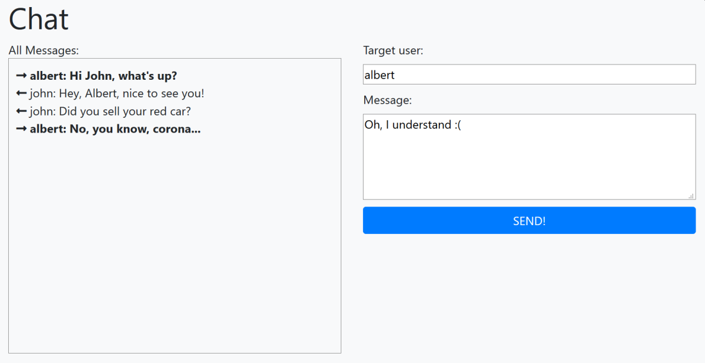
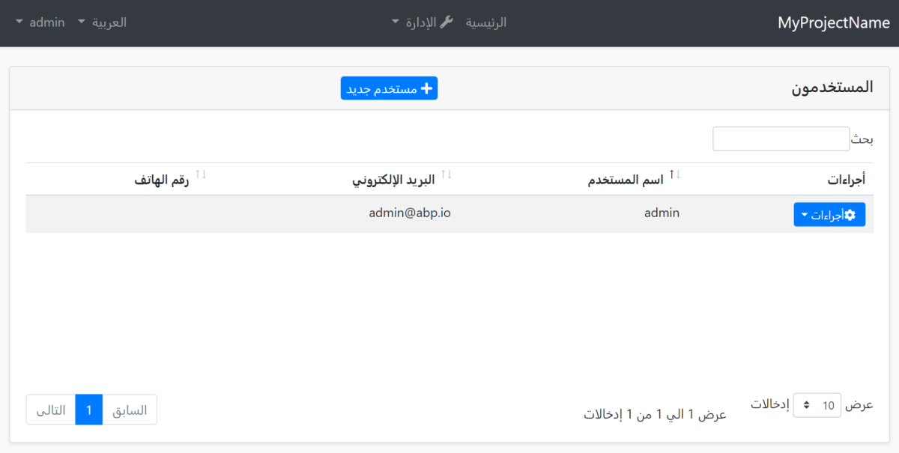
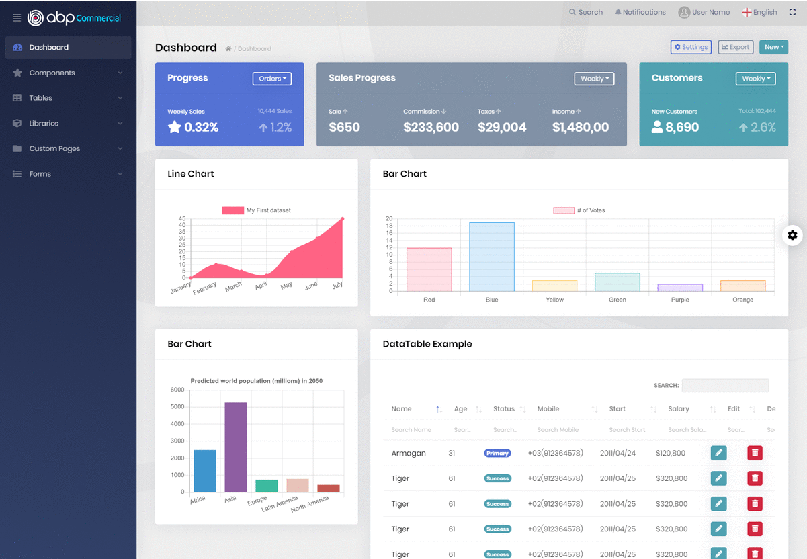
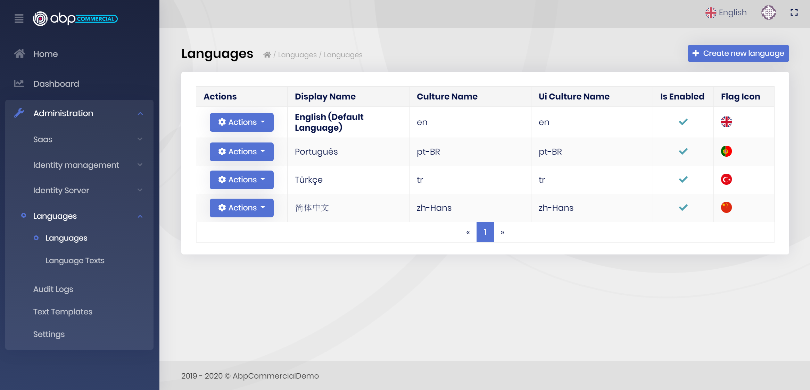
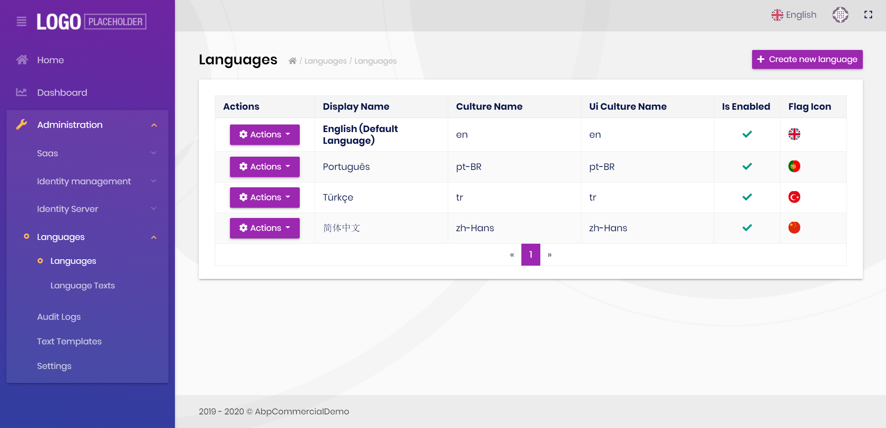
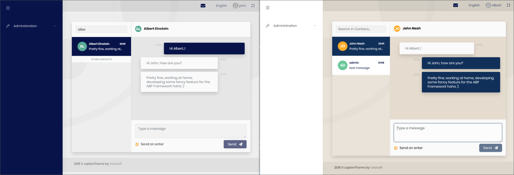

# ABP v2.8.0发布 & 路线图

**ABP框架**和**ABP商业版**v2.8已经发布.这篇文章将涵盖这些发布中的**新增内容**和项目的**中期路线图**.

## ABP框架2.8有哪些新增内容?

你可在[GitHub的发行说明](https://github.com/abpframework/abp/releases/tag/2.8.0)中看到所有的变更.这篇博客只包括重要的一些功能/变更.

### SignalR集成包

我们已经发布了[一个新的包](https://www.nuget.org/packages/Volo.Abp.AspNetCore.SignalR)用来集成SignalR到基于ABP框架应用程序中.

> 其实跟随[标准Microsoft教程](https://docs.microsoft.com/en-us/aspnet/core/tutorials/signalr)添加[SignalR](https://docs.microsoft.com/en-us/aspnet/core/signalr/introduction)到你的应用程序中已经可以实现.但是,ABP提供了SignalR集成包用来简化集成和使用.

参见[SignalR集成文档](https://docs.abp.io/en/abp/latest/SignalR-Integration)开始使用SignalR.

#### SignalR演示应用程序

我们也创建了一个简单的聊天应用程序来演示如何使用它.



参见[应用程序的源代码.](https://github.com/abpframework/abp-samples/tree/master/SignalRDemo)

### 控制台应用程序启动模板

新的控制台应用程序模板,可用来创建整合了ABP框架的控制台应用程序.

使用ABP CLI来创建新的控制台应用程序,并为`-t`(模板)选项指定`console`:

````bash
abp new MyApp -t console
````

感谢[@liangshiw](https://github.com/liangshiw)为此模板的贡献.

### 为MVC UI增加RTL支持和阿拉伯语本地化

[@kgamalseif](https://github.com/kgamalseif)为MVC UI贡献了RTL实现, 看起来很棒:



他还本地化了所有的框架和模块的资源.感谢他伟大的贡献.

### 其它

本次发布的其它一些亮点:

* 转换HttpApi.Client模块的包为.netstandard 2.0, 用来与其他类型的应用程序兼容.
* 改进的对象扩展系统,以更好地处理UI,本地化和验证.
* 为Hangfire和Quartz集成实现了禁用后台作业执行.
* 为MVC UI新增JsTree集成包.
* 移动所有示例到新的[ABP-示例](https://github.com/abpframework/abp-samples)库中并创建了[索引页](https://docs.abp.io/en/abp/latest/Samples/Index)来查看所有示例.

### 弃用

* 弃用了`app.UseMvcWithDefaultRouteAndArea()`,并引入了`app.UseConfiguredEndpoints()`(见[#3880](https://github.com/abpframework/abp/issues/3880)).
* 弃用了`UsePostgreSql()`,并为[Volo.Abp.EntityFrameworkCore.PostgreSql](http://nuget.org/packages/Volo.Abp.EntityFrameworkCore.PostgreSql)包引入了`UseNpgsql()`.如果你正在使用PostgreSQL, 切换到`UseNpgsql()`.

旧方法被标记为`Obsolete`,将在下一主要版本中删除.

## ABP商业版2.8中有哪些新增内容?

### 新的Lepton主题

我们已经彻底修改[lepton主题](https://commercial.abp.io/themes).来看下不同的风格:



ABP商业版中语言管理页面的截图:



(默认风格UI)



(Material风格UI)

[创建一个演示](https://commercial.abp.io/demo)来现场测试所有的风格.你可以设置页面更改风格.

### 新增聊天模块

第一版的[聊天模块](https://commercial.abp.io/modules/Volo.Chat)已经在本版本中发布.当前只有MVC / Razor PagesUI.Angular UI正在开发中.



目前,它有一个简单的**实时文本消息**功能.更多的功能,比如群组消息,发送图像/文件在路线图中.

### 其它

* 为Angular UI实现了[模块实体扩展](https://docs.abp.io/en/commercial/latest/guides/module-entity-extensions)系统.还提高该系统以更好地处理float/double/decimal,date,datetime,enum和bool属性.
* [EasyCRM示例应用程序](https://docs.abp.io/en/commercial/latest/samples/easy-crm)树形视图中管理产品组.

## 关于下一个版本

我们**每2周**发布一次.因此,下一个功能版本的计划的日期为**6月4日**, 版本号为**2.9**.这(可能)会是**最后的2.x版本**, 下个版本将是**3.0**.

### ABP框架 2.9 & 3.0

#### 组织单元系统

Identity模块的组织单元系统本来要在2.8中发布,但不幸的是我们不能肯定该功能的稳定性,所以推迟到了2.9.

#### gRPC

我们打算创建一个gPRC集成示例应用程序.然后,我们打算为所有[预构建模块](https://docs.abp.io/en/abp/latest/Modules/Index)和[启动模板](https://docs.abp.io/en/abp/latest/Startup-Templates/Index)创建gRPC端点.我们想为这些端点使用新计划的[Blazor](https://docs.microsoft.com/en-us/aspnet/core/blazor/) UI选项(我们知道Blazor UI有着[巨大的需求](https://github.com/abpframework/abp/issues/394).这并不意味着我们在3.0中会完成全部工作,但我们已经开始了, 并将在3.0+版本中继续.

#### Oracle与EF Core

我们看到,在ABP框架之外,人们使用Oracle与EF Core有一些痛点.这是因为EF Core 3.1目前还没有稳定并且免费的Oracle提供器.我们只看到了[Devart](https://www.devart.com/)创建了一个[付费的包](https://www.nuget.org/packages/Devart.Data.Oracle.EFCore).

[@ebicoglu](https://github.com/ebicoglu)[创建了一个gist](https://gist.github.com/ebicoglu/9f364c7eff9d87315af0178866186401)用来演示如何使用它. 我们[打算](https://github.com/abpframework/abp/issues/3983)创建一个集成包来让它更简单.

#### API文档

我们正[致力于](https://github.com/abpframework/abp/issues/1184)为框架创建一个API文档,并建立一个CD管线自动地在每次发布时公开它.这会更容易地探索框架中的类.

#### 示例应用程序:在分层/分布式系统上使用SignalR

在分布式/微服务系统上使用SignalR可能有一些麻烦,因为服务没有连接到客户端所以不能直接从服务器调用客户端函数.一个解决这个问题的方法是使用分布式消息总线(如RabbitMQ),用来向客户端转发从服务到Web应用程序的消息.

我们将创建一个示例应用程序和文档来阐述这样一个架构,和使用ABP框架它会多么的容易.

虽然这个话题与ABP框架没有直接关系, 而且这个问题不是ABP应用程序独有的,我们仍然觉得创建这样的指南对开发者是很有用的.

#### 还有...

我们会花更多的时间来写更多的文档,实现性能的提升,做更多的测试,创建更多的扩展点等等.

### ABP商业版 2.9 & 3.0

#### 组织单元系统

并行于ABP框架的组织单元系统(如上所述),我们正在创建一个UI用来管理组织单元,将在2.9中发布.

#### 聊天模块的Angular UI

聊天模块(如上所述)目前只有ASP.NET Core MVC / Razor Pages UI.我们正努力为该模块创建Angular UI

#### 新模块想法:文件管理

我们正在创建一个文件管理模块,用来管理(上传/下载)和在用户之间共享文件.你可将之视为一个轻量级的Google Drive :).

#### Easy CRM Angular UI

[Easy CRM](https://docs.abp.io/en/commercial/latest/samples/easy-crm)是我们之前发布的ABP商业版中的一个示例应用程序.在这个版本中,我们向这个应用程序中加入了更多的功能.在下一个版本中,我们会为它创建Angular UI.

我们发现这个应用程序非常有用,因为与简单的[图书商城](https://docs.abp.io/en/commercial/latest/samples/index#book-store)相比, 它非常接近现实世界的应用程序.

#### 还有..

我们正在致力于改进现有的[模块](https://commercial.abp.io/modules),[主题](https://commercial.abp.io/themes)和[工具](https://commercial.abp.io/tools), 旨在3.0版本中提供更舒适的开发者体验.

## 路线图

我们经常被问到的[ABP框架](https://abp.io/)和[ABP商业版](https://commercial.abp.io/)的路线图.虽然我们已经在各种平台上回答过,但在这次发布中,我们在这些产品的文档里增加了路线图页面:

* [ABP框架路线图](https://docs.abp.io/en/abp/latest/Road-Map)
* [ABP商业版路线图](https://docs.abp.io/en/commercial/latest/road-map)

我也把路线图写在下面的章节中:

### ABP框架路线图

你可随时在[GitHub的仓库](https://github.com/abpframework/abp/milestones)中检查里程碑规划和优先积压问题.

虽然我们会**继续添加其它令人激动的功能**,但我们在中期将主要致力于下列内容的工作:

* 为所有的预构建模块实现**gPRC集成**.
* 为框架和所有预构建的模块实现**Blazor UI**.
* **NET 5.0**！由于微软已经宣布了.NET 5.0将在2020年11月发布,在这之前我们会做好准备,并在微软发布后就迁移到.NET 5.0上, 我们希望能平稳过渡.

### ABP商业版路线图

我们将与ABP框架同步进行, 为ABP商业版实现一些相同的内容:

* gRPC集成
* Blazor UI
* .NET 5.0

除此之外,我们将在中期致力于下列内容:

* 一个用来创建微服务解决方案的启动模板(含有Ocelot,Redis,RabbitMQ,ElasticSearch,IdentityServer ..等等. 并且预先集成和配置好的).
* 更多的模块扩展点.
* 动态仪表板系统.
* 实时通知系统.
* SaaS的模块的认购及支付系统.
* 更多的身份认证选项.
* 新的应用模块(我们有几十个模块的想法, 将陆续与大家分享 - 上面宣布的"文件管理"就是其中之一).
* 新的主题与主题风格(包括公共/企业网站的主题).

## 彩蛋:ABP.IO平台路线图

ABP框架和ABP商业版是ABP.IO平台的基本组成部分,我们还想创造一个更大的平台将.NET社区聚集在一起,利用ABP框架的统一性和标准开发模型来创建可重用模块,分享知识,彼此互相帮助.

所以,我们有了新的*.abp.io网站的想法,我想分享给社区

#### market.abp.io

一个平台用于让开发者/公司发布他们基于ABP框架的可重用的应用模块,主题, 库和工具.这个网站上会有免费/开源和商业产品.

#### jobs.abp.io

我们收到了太多来自其它公司的电子邮件, 想聘请其它公司的开发者来打造基于ABP.IO平台的自己的产品.我们作为[Volosoft](https://volosoft.com/),想留在产品端,而不是客户的基础工程.我们一般会把有经验的开发者和公司介绍给他们.

我们计划创建一个网站来满足各方需要,这样你可以为你的项目找到开发者,或者找一个短期或长期的工作.

## 跟随ABP！

跟随社交媒体帐号,即可了解ABP.IO平台上发生的事情:

* [@abpframework](https://twitter.com/abpframework): ABP框架官方推特帐号
* [@abpcommercial](https://twitter.com/abpcommercial): ABP商业版官方推特帐号
