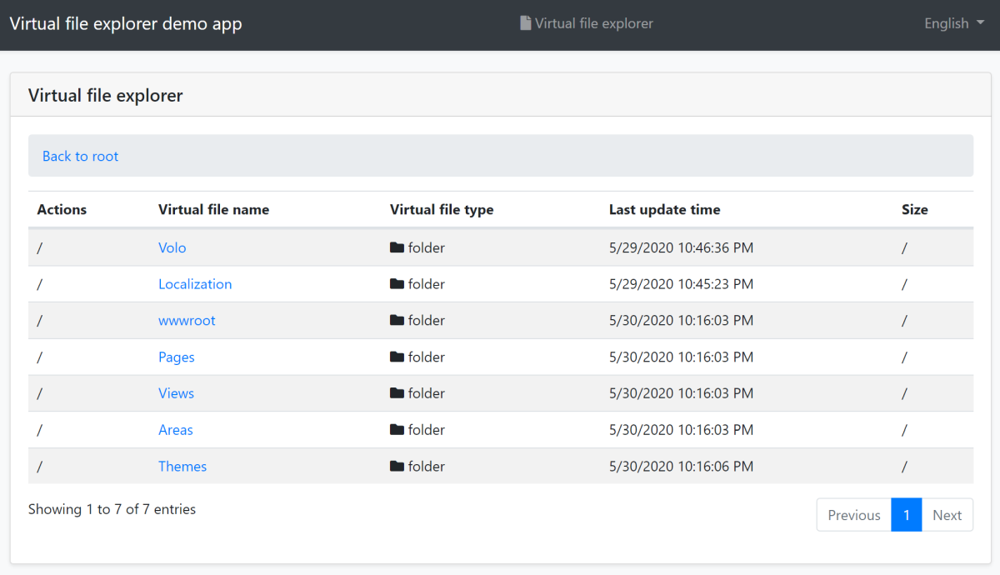
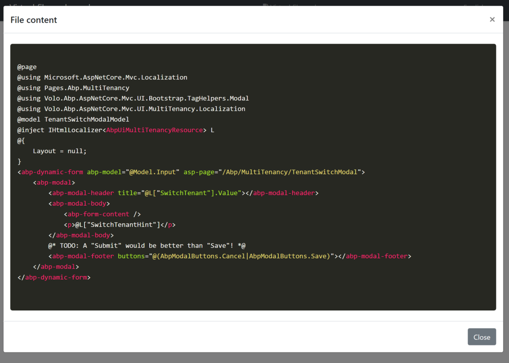
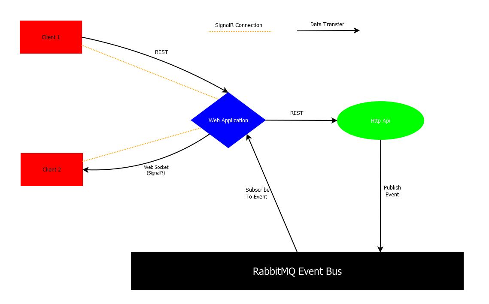
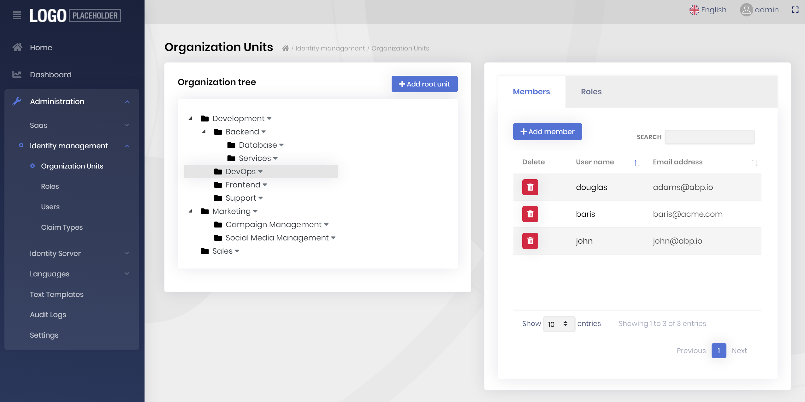
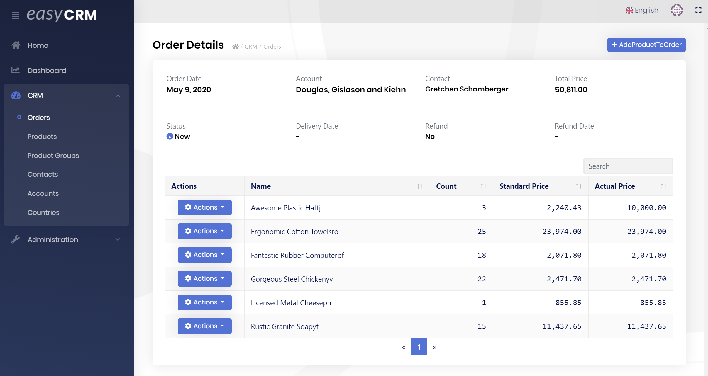
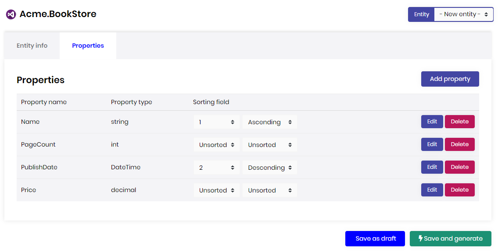
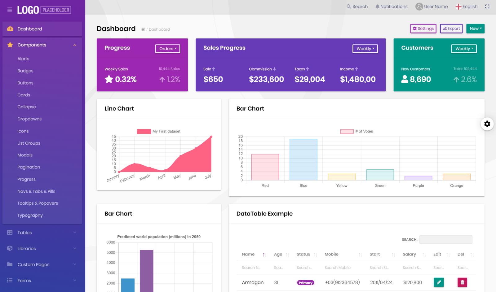

# ABP框架v2.9已经发布

**ABP框架**和**ABP商业版**2.9已经发布,这是3.0之前的最后一个版本!这篇文章将涵盖本次发布中的**新增内容**.

## ABP框架2.9有哪些新增内容？

你可以中[GitHub的发行说明](https://github.com/abpframework/abp/releases/tag/2.9.0)中看到所有的变更.这篇文章将只包括重要特征/变更.

### 预编译Razor Pages

在之前的版本, 预构建的页面(为[应用模块](https://docs.abp.io/en/abp/latest/Modules/Index))和视图组件是在运行时编译. 现在,它们使用了预编译. 我们测量的应用程序启动时间(尤其是MVC UI)已经减少了50%以上.换句话说,它比之前的版本快**两倍**.速度变化也影响你第一次访问某一个页面时.

这是一个v2.8和v2.9启动应用程序模板的对比结果:

````
### v2.8

2020-06-04 22:59:04.891 +08:00 [INF] Starting web host.
2020-06-04 22:59:07.662 +08:00 [INF] Now listening on: https://localhost:44391
2020-06-04 22:59:17.315 +08:00 [INF] Request finished in 7756.6218ms 200 text/html;

Total: 12.42s

### v2.9

2020-06-04 22:59:13.720 +08:00 [INF] Starting web host.
2020-06-04 22:59:16.639 +08:00 [INF] Now listening on: https://localhost:44369
2020-06-04 22:59:18.957 +08:00 [INF] Request finished in 1780.5461ms 200 text/html;

Total: 5.24s
````

你不用做任何改动就能获得新方法带来的益处.[重写UI页/组件](https://docs.abp.io/en/abp/latest/UI/AspNetCore/Customization-User-Interface)和之前一样也能正常工作.我们将在v3.0中继续致力于性能上的提升.

### 组织单元系统

[Identity模块](https://docs.abp.io/en/abp/latest/Modules/Identity)现在有了呼声最高的功能: 组织单元!

组织单元系统用来在应用程序中创建分层组织树.这样你可以使用该组织树来授权应用程序中的数据和功能.

文档将很快到来......

### 新的Blob存储包

我们创建了一个新的[Blob存储包](https://www.nuget.org/packages/Volo.Abp.BlobStoring)用来存储任意二进制对象.它一般用于在应用程序中存储文件.这个包提供了一个抽象,因此任何应用程序或[模块](https://docs.abp.io/en/abp/latest/Module-Development-Basics)都能以存储提供器无关的方式来保存和获取文件.

目前实现了两个存储提供器:

* [Volo.Abp.BlobStoring.FileSystem](https://www.nuget.org/packages/Volo.Abp.BlobStoring.FileSystem)包, 在本地文件系统中存储对象/文件.
* [Volo.Abp.BlobStoring.Database](https://github.com/abpframework/abp/tree/dev/modules/blob-storing-database)模块, 在数据库中存储对象/文件.目前支持[Entity Framework Core](https://docs.abp.io/en/abp/latest/Entity-Framework-Core)(因此,你可以使用[任何关系数据库](https://docs.abp.io/en/abp/latest/Entity-Framework-Core-Other-DBMS)和[MongoDB](https://docs.abp.io/en/abp/latest/MongoDB)).

[Azure BLOB提供器](https://github.com/abpframework/abp/issues/4098)将会在3.0中可用. 你可请求其他的云提供器或在[GitHub库](https://github.com/abpframework/abp/issues/new)上提交你自己的贡献.

Blob存储系统的一个好处是,它允许你创建多个容器(每个容器是一个Blob存储),并为每个容器使用不同的存储提供器.

**示例:使用默认的容器保存和取得一个字节数组**

````csharp
public class MyService : ITransientDependency
{
    private readonly IBlobContainer _container;

    public MyService(IBlobContainer container)
    {
        _container = container;
    }

    public async Task FooAsync()
    {
        //保存一个BLOB
        byte[] bytes = GetBytesFromSomeWhere();
        await _container.SaveAsync("my-unique-blob-name", bytes);

        //获取一个BLOB
        bytes = await _container.GetAllBytesAsync("my-unique-blob-name");
    }
}
````

它可以使用`byte[]`和`Stream`对象.

**示例:使用类型化(命名)容器来保存和获取stream**

````csharp
public class MyService : ITransientDependency
{
    private readonly IBlobContainer<TestContainer> _container;

    public MyService(IBlobContainer<TestContainer> container)
    {
        _container = container;
    }

    public async Task FooAsync()
    {
        //保存一个BLOB
        Stream stream = GetStreamFromSomeWhere();
        await _container.SaveAsync("my-unique-blob-name", stream);

        //获取一个BLOB
        stream = await _container.GetAsync("my-unique-blob-name");
    }
}
````

`TestContainer`只是一个用来标识容器的空类:

````csharp
[BlobContainerName("test")] //指定容器的名字
public class TestContainer
{

}
````

类型化(命名)容器可被配置为使用不同的存储提供器而不是默认的.在开发可复用的模块时, 始终使用类型化的容器是一个很好的做法,这样最终应用程序可以为这个容器配置提供器,而不影响其他容器.

**示例:为`TestContainer`配置文件系统提供器**

````csharp
Configure<AbpBlobStoringOptions>(options =>
{
    options.Containers.Configure<TestContainer>(configuration =>
    {
        configuration.UseFileSystem(fileSystem =>
        {
            fileSystem.BasePath = "C:\\MyStorageFolder";
        });
    });
});
````

查看[blob存储文档](https://docs.abp.io/en/abp/latest/Blob-Storing)以获取更多的信息.

### Entity Framework Core的Oracle集成包

我们创建了一个[Oralce集成包](https://www.nuget.org/packages/Volo.Abp.EntityFrameworkCore.Oracle.Devart),这样你就可以为EF Core轻松地切换到Oracle.它已经为框架和预构建的模块进行了测试.

[查看文档](https://docs.abp.io/en/abp/latest/Entity-Framework-Core-Oracle)开始使用Oracle集成包.

### 自动判断数据库提供器

当你用EF Core开发一个**可复用的应用程序模块**时,你通常要将你的模块开发为**DBMS无关**的.但是,不同的DBMS有一些微小的(有时是很大的)区别.现在如何你执行基于DBMS的自定义映射,可以使用`ModelBuilder.IsUsingXXX()`扩展方法:

````csharp
protected override void OnModelCreating(ModelBuilder modelBuilder)
{
    base.OnModelCreating(modelBuilder);

    modelBuilder.Entity<Phone>(b =>
    {
        //...
        if (modelBuilder.IsUsingPostgreSql()) //检查是否在使用PostgreSQL!
        {
            b.Property(x => x.Number).HasMaxLength(20);
        }
        else
        {
            b.Property(x => x.Number).HasMaxLength(32);
        }
    });
}
````

除了上面这种的傻傻的例子,你可以任意配置你的映射!

### ABP CLI:翻译命令

`abp translate`是一个新的命令,当你的源代码库中包含多个JSON本地化文件时, 它可用来简化翻译[本地化](https://docs.abp.io/en/abp/latest/Localization)文件,

该命令的主要目的是**翻译ABP框架**的本地化文件(因为[abp库](https://github.com/abpframework/abp)在不同的文件中含有成千上万个本地化文件需要翻译).

非常感谢如果你使用这个命令将框架资源翻译**为你的母语**.

查看[文档](https://docs.abp.io/en/abp/latest/CLI#translate)来学习如何使用它.也可查看[贡献指南](https://docs.abp.io/en/abp/latest/Contribution/Index).

### 新的虚拟文件系统浏览器模块

感谢[@liangshiw](https://github.com/liangshiw)创建并贡献了一个新的模块用来浏览[虚拟文件系统](https://docs.abp.io/en/abp/latest/Virtual-File-System)中的文件.它适用于MVC UI并显示所有应用程序中的虚拟文件.示例截图:





[查看文档](https://docs.abp.io/en/abp/latest/Modules/Virtual-File-Explorer)学习如何使用它.

### 示例应用程序:SignalR与分层架构

在分布式/分层架构中实施SignalR是具有挑战性的.我们创建了一个示例应用程序演示如何轻松地使用[SignalR集成](https://docs.abp.io/en/abp/latest/SignalR-Integration)和[分布式事件总线](https://docs.abp.io/en/abp/latest/Distributed-Event-Bus)系统

查看示例解决方案的[源代码](https://github.com/abpframework/abp-samples/tree/master/SignalRTieredDemo).

**一篇正在路上的文章**将深入地解释该解决方案.关注[@abpframework](https://twitter.com/abpframework)的Twitter帐号.



*一张文章中的图片,显示了该解决方案的通信图*

### 关于gRPC

我们创建了一个示例应用程序来说明如何在基于ABP的应用程序中创建和使用gRPC端点.

查看GitHub上的[源码](https://github.com/abpframework/abp-samples/tree/master/GrpcDemo).

我们本来计划为所有预构建的应用程序模块创建gRPC端点,但我们发现ASP.NET Core gRPC集成还不够成熟,不支持一些常见的部署场景.所以推迟到了下一个版本(更多内容[查看此评论](https://github.com/abpframework/abp/issues/2882#issuecomment-633080242)).但是,在你的应用程序中使用gRPC是非常标准的. ABP框架与gRPC没有问题.看一下[示例应用程序](https://github.com/abpframework/abp-samples/tree/master/GrpcDemo).

### 其它

* [时区系统](https://github.com/abpframework/abp/pull/3933)为应用程序支持不同的时区.
* 在IIS上支持[虚拟路径部署](https://github.com/abpframework/abp/issues/4089).
* 为Angular UI支持RTL.

其它更新请查看[GitHub发行说明](https://github.com/abpframework/abp/releases/tag/2.9.0).

## ABP商业版2.9有哪些新增内容

与往常一样, 除了ABP框架所有这些功能以外,ABP商业版在本次发布还有一些额外的功能.本节介绍[ABP商业版](https://commercial.abp.io/)在2.9版本中的亮点.

### 组织单元管理UI

我们为组织单元创建了UI,管理ABP商业版[Identity模块](https://commercial.abp.io/modules/Volo.Identity.Pro)的成员和角色:



OU管理适用于MVC(Razor Pages)和Angular用户界面.

### 聊天模块Angular UI

我们在前一个版本介绍了新的[聊天模块](https://commercial.abp.io/modules/Volo.Chat), 当时它只有ASP.NET Core MVC / Razor Pages UI. 现在它也包含了一个Angular UI选项.


*聊天模块的截图 - 两个用户互相发消息*

### Easy CRM Angular UI

Easy CRM是建立在ABP商业版上的一个示例应用程序, 用来为ABP商业版客户提供一个相对复杂的应用程序.在2.7版本中,我们已经发布了MVC / Razor Pages UI. 这次2.9版中, 我们为Easy CRM应用程序发布了Angular UI.



*Easy CRM应用程序中"订单详细"的截图.*

查看[Easy CRM文档](https://docs.abp.io/en/commercial/latest/samples/easy-crm)学习如何下载并运行它.

### ABP Suite模块代码生成

[ABP Suite](https://commercial.abp.io/tools/suite)是一个工具,主要功能是用来为一个实体[生成代码](https://docs.abp.io/en/commercial/latest/abp-suite/generating-crud-page), 从数据库到UI层具有完整的CRUD功能.



*ABP Suite的截图: 定义新实体的属性并且为你生成应用程序代码!*

在本次发布之前它只工作于[应用程序模板](https://docs.abp.io/en/commercial/latest/startup-templates/application/index).现在,它支持为[模块项目](https://docs.abp.io/en/commercial/latest/startup-templates/module/index)生成代码.利用代码生成的威力来创建可复用应用程序模块是很棒的一个做法.

除了这个主要功能,我们在这个版本中向ABP Suite添加了许多细微的改进.

>注意:模块模板代码生成目前处于测试阶段.如果你发现任何bug,请告知我们.

### Lepton主题

[Lepton主题](https://commercial.abp.io/themes)是我们为ABP商业版开发的一个商业主题.

* 与Bootstrap 100%兼容 - 让你不写主题特定的HTML!
* 提供不同类型的风格 - 看一下下图中的Material风格.
* 提供不同类型的布局(侧/顶部菜单,流式/盒式布局...).
* 轻量化,响应式和现代化.
* 还有...它是可升级的,没有成本!你只需更新NuGet / NPM包来获得新的功能.

我们创建了它的专属网站:[http://leptontheme.com/](http://leptontheme.com/)

在这里你可以查看所有的组件, 无需单独的应用程序.



这个网站目前正处于一个非常早期的阶段.我们将创建文档和和改进网站, 来为你的开发提供参考和探索主题的功能.

### 即将推出:文件管理模块

基于新的blob存储系统(上面介绍的),我们已经开始构建一个文件管理模块用来管理(浏览/上传/下载)你应用程序中分层文件系统并在用户与客户之间分享文件.

我们计划在ABP商业版v3.0中发行最初版本,并继续进行后续版本的改进.

## 关于下一个版本:3.0

我们在[v2.8](https://blog.abp.io/abp/ABP-v2.8.0-Releases-%26-Road-Map)和v2.9中增加了许多新的功能.在下一个版本中,我们将完全专注于**文档,性能优化**和其它改进,如bug修复.

长期以来,我们每2周发布一个新功能版本.我们在v3.0以后继续这种方式.但是,v3.0是一个例外,开发周期大概为4周.**v3.0的计划发布日期是2020年7月1日**.

## 彩蛋:文章!

除了开发我们的产品,我们的团队都在不断地撰写各种主题的文章/教程.你可以看一下最新的文章:

* [ASP.NET Core 3.1使用Pub/Sub实现WebHook](https://volosoft.com/blog/ASP.NET-CORE-3.1-Webhook-Implementation-Using-Pub-Sub)
* [ASP.NET Core使用Azure Key Vault](https://volosoft.com/blog/Using-Azure-Key-Vault-with-ASP.NET-Core)