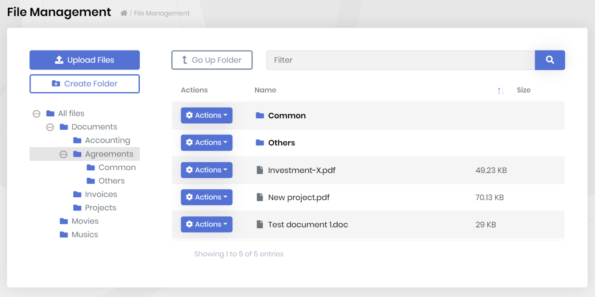

# ABP框架 v3.0 已发布

我们很高兴地宣布,**ABP框架**和**ABP商业版**3.0版已经发布.与常规的2周发布一个版本不同的是, 这个版本用了4周的时间.关闭了**119个[issue](https://github.com/abpframework/abp/issues?q=is%3Aopen+is%3Aissue+milestone%3A3.0)**,合并了**89个[pull request](https://github.com/abpframework/abp/pulls?q=is%3Aopen+is%3Apr+milestone%3A3.0)** 和主框架[仓库](https://github.com/abpframework/abp)中的**798次提交**.

由于这是一个**主要版本**,它也包括了一些**重大更改**.不要害怕,这些变化都容易对应,并且下面会详细解释.

> 详细更改日志请查看[GitHub的发布说明](https://github.com/abpframework/abp/releases/tag/3.0.0).

## ABP框架3.0有哪些新增内容？

这篇文章将只包括重要功能/更改.你可在[GitHub的发布说明](https://github.com/abpframework/abp/releases/tag/3.0.0)上看到所有的更改.

### Angular 10!

Angular 10刚刚[发布](https://blog.angular.io/version-10-of-angular-now-available-78960babd41),我们就立即迁移了[启动模板](https://docs.abp.io/en/abp/latest/Startup-Templates/Application)到Angular 10！所以,当你以Angular UI[创建一个新的解决方案](https://abp.io/get-started)时, 你将获得新Angular的优点.

我们为想要迁移到Angular 10的老版本项目准备了一份[迁移指南](https://github.com/abpframework/abp/blob/dev/docs/en/UI/Angular/Migration-Guide-v3.md).

### Oracle集成包

之前我们为使用Devart库, 基于EF Core for Oracle的应用程序创建了[一个集成包](https://www.nuget.org/packages/Volo.Abp.EntityFrameworkCore.Oracle.Devart), 因为官方的Oracle EF Core包还未支持EF Core 3.1. 现在它以[beta发布](https://www.nuget.org/packages/Oracle.EntityFrameworkCore/3.19.0-beta1).虽然是beta版,但我们已经创建了它的[集成包](https://www.nuget.org/packages/Volo.Abp.EntityFrameworkCore.Oracle),这样你就可以在你的应用程序中使用它.

更多细节请查看[文档](https://docs.abp.io/en/abp/latest/Entity-Framework-Core-Oracle).

### Azure BLOB存储提供器

在上一个版本中我们创建了一个[Blob存储系统](https://docs.abp.io/en/abp/latest/Blob-Storing), 包含一个文件系统和数据库存储提供器. 本次发布我们引入了Azure BLOB存储提供器.请查看[文档](https://docs.abp.io/en/abp/latest/Blob-Storing-Azure).

### 分布式缓存批量操作和新的Redis缓存包

ASP.NET Core的[标准IDistributeCache](https://docs.microsoft.com/en-us/aspnet/core/performance/caching/distributed)接口不包含**批量操作**,如使用单独方法/服务器调用设置多个项目. ABP框架引入了新的方法可用于在ABP的`IDistributedCache<T>`接口中进行批量操作：

* GetManyAsync / GetMany
* SetManyAsync / SetMany

然后,我们需要为Redis缓存实现这些新方法并且[必须创建](https://github.com/abpframework/abp/issues/4483)一个Redis集成包用于扩展微软的实现.

这些方法也被ABP框架所使用, 用来缓存某个用户/角色/租户的设置,功能和权限,并且带来了**显著的性能提升**.

更多细节请查看[缓存文档](https://docs.abp.io/en/abp/latest/Caching).

### 为虚拟文件系统支持嵌入文件清单

虚拟文件系统现在支持在项目中使用`GenerateEmbeddedFilesManifest`来添加编译程序集中嵌入资源的**真实的文件/目录结构**.所以,你现在可以访问文件,而没有任何文件名的限制(以前,目录名称中的一些特殊字符,比如`.`在某些情况会有问题)

查看[文档](https://docs.abp.io/en/abp/latest/Virtual-File-System)学习如何利用新系统的优点.

### 新示例

基于社区的需求,我们准备了两个新的示例应用程序：

* [StoredProcedureDemo](https://github.com/abpframework/abp-samples/tree/master/StoredProcedureDemo)演示了如何在自定义仓储库中调用存储过程,视图和函数.
* [OrganizationUnitSample](https://github.com/abpframework/abp-samples/tree/master/OrganizationUnitSample)演示了如何为你的实体使用[Identity模块](https://docs.abp.io/en/abp/latest/Modules/Identity)的组织单元系统.

### DynamicStringLength 和 DynamicMaxLength 属性

当类被用作模型或[DTO](https://docs.abp.io/en/abp/latest/Data-Transfer-Objects)时, 标准的`StringLength`和`MaxLength`数据注解属性用来验证类中的属性是很有用的. 但是, 就像任何其它的属性一样, 长度的值应该是一个**编译时**已知的字面值(常量).

**示例: 使用`StringLength`**

````csharp
public class CreateBookDto
{
    public const int MaxNameLength = 128; //常量!

    [StringLength(MaxNameLength)]
    public string Name { get; set; }
}
````

ABP框架现在有`DynamicStringLength` 和 `DynamicMaxLength`属性允许在**运行时**确定长度.

**示例: 使用`DynamicStringLength`**

````csharp
public class CreateBookDto
{
    public static int MaxNameLength { get; set; } = 128;

    [DynamicStringLength(typeof(CreateBookDto), nameof(MaxNameLength))]
    public string Name { get; set; }
}
````

`DynamicStringLength`通过类的**类型**和这个类的一个静态属性的**名字**来读取最大长度(也有一个最小长度的选项, 就像`StringLength`).

这样就允许你从配置中读取最大值并且在应用程序启动时设置(一般在[模块](https://docs.abp.io/en/abp/latest/Module-Development-Basics)的`PreConfigureServices`方法)

````csharp
CreateBookDto.MaxNameLength = 200;
````

[预建应用程序模块](https://docs.abp.io/en/abp/latest/Modules/Index)使用了这个功能,所以你现在可以覆盖这些模块中定义的属性的最大长度了.

### 自动分布式事件

ABP可以为所有的实体在创建,更新和删除时**自动发布分布式事件**. 这很有用因为在分布式系统中你通常会对这些基础事件感兴趣.

这个功能在v3.0中**已成熟并[文档化了](https://docs.abp.io/en/abp/latest/Distributed-Event-Bus#pre-defined-events)**. 你可以轻松地配置一部分或全部要发布事件的实体.

### IAsyncQueryableExecuter

使用LINQ扩展方法,当你在查询时需要调用`ToListAsync()`,`FirstOrDefaultAsync()`... 不幸的是,这些方法并不是**标准的**LINQ扩展方法.它们定义在[Microsoft.EntityFrameworkCore](https://www.nuget.org/packages/Microsoft.EntityFrameworkCore)包中(或在[MongoDB.Driver](https://www.nuget.org/packages/MongoDB.Driver/),如果你使用MongoDB的话).

所以,如果你想使用异步扩展方法, 你需要依赖这个包.这样做破坏了分层,并且使你的应用程序或领域层依赖于EF Core / MongoDB的包.

`IAsyncQueryableExecuter`是ABP框架定义的服务, 用来**不依赖特定提供器地执行异步查询**(EF Core / MongoDB包).

查看[文档](https://docs.abp.io/en/abp/latest/Repositories#iqueryable-async-operations)来获取细节和了解我们的建议.

### API 文档

现在我们为每次发布ABP框架和模块都公开[API文档](https://docs.abp.io/api-docs/abp/3.0/api/index.html).所以,你可以更容易地查看ABP框架的类.点击[文档](https://docs.abp.io/en/abp/latest/)导航菜单中的**API文档**的链接.

### 包列表

我们[创建了一个页面](http://abp.io/packages)列出所有ABP相关的官方NuGet和NPM包.

### 其他

* 为Identity Server实现了前端通道的服务端客户[登出](https://identityserver4.readthedocs.io/en/latest/topics/signout.html)
* `abp.currentUser`(Angular UI中的`CurrentUser`服务)现在有一个包含当前用户的角色名的`roles`数组.
* 升级所有的Nu​​Get和NPM软件包的依赖.
* 引入了`ReadOnlyAppService`基类(只包含get操作), 做为`CrudAppService`基类(其中有get,create,update和delete操作)的补充.

其他更新请查看[GitHub发行说明](https://github.com/abpframework/abp/releases/tag/3.0.0).

## ABP商业版3.0有哪些新增内容？

除了所有ABP框架的功能以外,ABP商业版同样在本次发布中有一些额外的功能.本节介绍3.0版本中[ABP商业版](https://commercial.abp.io/)的亮点.

### 新的文件管理模块

我们创建了一个用于在应用程序中存储和管理文件的新模块.这个新模块基于[BLOB存储系统](https://docs.abp.io/en/abp/latest/Blob-Storing),因此它可以使用不同的存储提供器来存储文件内容.

**示例截图**



您可以上传,下载和以分层文件夹结构组织文件.它也兼容多租户,你可以为租户限制总文件大小.在未来的版本中,我们将致力于“共享”系统, 用于以一个更可控的方式在用户之间或通过公开链接与你的客户共享文件.

> 文件管理模块是目前仅适用于MVC / Razor Pages UI.我们正工作于Angular UI,它会在未来的版本中发布.

## 重大更改

由于这是一个主要版本,我们重新设计了一些API,并引入了一些"容易解决"的重大更改.

### ABP框架

* 更改了一些预建应用程序模块的**常量**为静态属性, 这样你就可在你的代码中对它们修改. 如果你在属性中使用了这些常量,那么请使用上面介绍的`DynamicStringLength`.
* 更改`ConcurrencyStamp`最大长度为40. 你需要在更新ABP框架后**添加一个数据库迁移**并且更新数据库.
* NPM软件包的依赖关系使用`~`代替`^`,为了更加稳定.

### ABP商业版

* 更改了应用程序标识的文件名.此前,它为每个主题使用了单独的标识文件,如`theme1.png`,`theme1-reverse.png`,`theme2.png`,`theme2-reverse.png`(...`6`).现在,我们只有两个标识文件：`logo-light.png`和`logo-dark.png`.所以,重命名MVC UI的`wwwroot/images/logo/`和Angular UI的`/src/assets/images/logo/`下的标识.
* 我们也增加了ABP商业版的[API文档](https://docs.abp.io/api-docs/commercial/3.0/api/index.html).

> **此外,Angular UI请查看[迁移指南](https://github.com/abpframework/abp/blob/dev/docs/en/UI/Angular/Migration-Guide-v3.md)**.

## 已知问题

* 3.0.0版本有一个分层架构的问题.查看[这个issue](https://github.com/abpframework/abp/pull/4564)为你的应用程序解决它,直到我们发布V3.0.1.

## 关于未来的版本

我们将继续在每两个星期发布一个新的小功能版本.所以,下一个预计发布日期是**2020年7月16日**的**3.1**版本.

在接下来的几个版本中,我们将专注于**Blazor UI**,如[路线图](https://docs.abp.io/en/abp/latest/Road-Map)中承诺的.我们将继续改进文档,创建示例,添加其他新功能和改善.关注[ABP框架Twitter账号](https://twitter.com/abpframework)获取最新消息...

## 彩蛋: 文章!

除了开发我们的产品,我们的团队一直在不断书写各种主题的文章/教程.你可能感兴趣的最新文章：

* [Angular 10有哪些新增内容?](https://volosoft.com/blog/what-is-new-in-angular-10)
* [在分布式架构中使用ABP, SignalR和RabbitMQ构建实时消息系统](https://volosoft.com/blog/RealTime-Messaging-Distributed-Architecture-Abp-SingalR-RabbitMQ)
* [如何在Angular模板中使用Attribute Directives来避免重复](https://volosoft.com/blog/attribute-directives-to-avoid-repetition-in-angular-templates)
