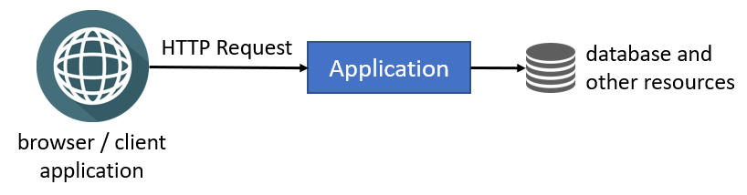
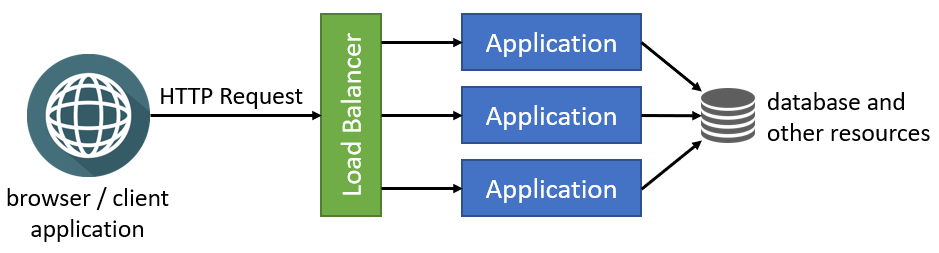

# 部署到集群环境

本文档介绍了在将应用程序部署到**多个应用程序实例同时运行**的集群环境中时应注意的内容, 并解释了如何在基于ABP的应用程序中处理这些内容. 

> 无论你使用的是单体式应用程序还是微服务解决方案, 本文档均有效. 适用于一个流程. 应用程序可以是单体式web应用程序、微服务解决方案中的服务、控制台应用程序或其他类型的可执行进程. 
>
> 例如, 如果你将应用程序部署到Kubernetes并把应用程序或服务在多个POD中运行, 那么应用程序或服务将在集群环境中运行. 

## 了解集群环境

> 如果你已经熟悉集群部署和负载均衡器, 可以跳过本节. 

### 单实例部署

考虑作为**单个实例**部署的应用程序, 如下图所示:

浏览器和其他客户端应用程序可以直接向应用程序发出HTTP请求. 你可以在客户端和应用程序之间放置一个web服务器(例如IIS或NGINX), 但仍有一个应用程序实例在单个服务器或容器中运行. 单实例的配置**限于规模**, 因为它在一台服务器上运行, 并且你受到服务器容量的限制. 

### 集群部署

**集群部署**是在一台或多台服务器上**同时运行**应用程序**多个实例**的方式. 通过这种方式, 不同的实例可以满足不同的请求, 并且可以通过在系统中添加新服务器来扩展. 下图显示了集群使用**负载均衡器**的典型实现:

### 负载均衡器

[负载均衡器](https://en.wikipedia.org/wiki/Load_balancing_(computing)) 有很多特性, 但它们基本上会将**传入的HTTP请求转发**给应用程序的实例, 并将响应返回给客户端应用程序.

负载平衡器可以使用不同的算法来选择应用程序实例, 同时确定用于传递传入请求的应用程序实例. **循环**是最简单、最常用的算法之一. 请求被轮流传递到应用程序实例. 第一个实例得到第一个请求, 第二个实例得到第二个请求, 依此类推. 在所有实例都被使用之后, 它返回到第一个实例, 并且下一个请求的算法也是类似的.

### 潜在问题

一旦应用程序的多个实例并行运行, 你应该仔细考虑以下内容:

* 当你有多个实例时, 存储在应用程序 **内存中的任何状态(数据)** 都将成为问题. 存储在应用程序实例内存中的状态可能在下一个请求中不可用, 因为下一个请求将由不同的应用程序实例处理. 虽然有一些解决方案(比如粘性会话)可以解决这个问题, 但如果你想在集群、容器或云中运行应用程序, **最好将其设计为无状态**. 
* **内存缓存** 是一种内存状态, 不应在集群应用程序中使用. 你应该使用**分布式缓存**.
* 你不应该在**本地文件系统**中存储应用程序所有实例都可以使用的数据. 不同的应用程序实例可能在不同的容器或服务器中运行, 并且它们可能无法访问同一个文件系统. 你可以使用**云或外部存储提供商**作为解决方案.
* 如果你有**后台工作者**或**作业队列管理器**, 则应小心, 因为多个实例可能会尝试执行同一作业或同时执行同一工作. 因此, 你可能会多次完成相同的工作, 或者在尝试访问和更改相同的资源时可能会出现很多错误.

集群部署可能会有更多问题, 但这些是最常见的问题. ABP被设计为与集群部署场景兼容. 以下各节介绍了将基于ABP的应用程序部署到集群环境时应执行的操作. 

## 切换分布式缓存

ASP.NET Core提供了不同类型的缓存功能. [内存缓存](https://docs.microsoft.com/en-us/aspnet/core/performance/caching/memory)将对象存储在本地服务器的内存中, 并且仅对存储该对象的应用程序可用. 集群环境中的非粘性会话应使用[分布式缓存](https://docs.microsoft.com/en-us/aspnet/core/performance/caching/distributed), 除了一些特定场景(例如, 你可以将本地CSS文件缓存到内存中. 它是只读数据, 在所有应用程序实例中都是相同的. 出于性能原因, 你可以将其缓存到内存中, 而不会出现任何问题).

[ABP的分布式缓存](../Caching.md)扩展了[ASP.NET Core的分布式缓存](https://docs.microsoft.com/en-us/aspnet/core/performance/caching/distributed)的基础设施. 默认情况下, 它在内存中工作. 当你要将应用程序部署到集群环境时, 应该配置实际的分布式缓存提供程序.

> 即使应用程序不直接使用`IDistributedCache`, 也应该为集群部署配置缓存提供程序. 因为ABP框架和预构建的[应用程序模块](../Modules/Index.md)正在使用分布式缓存.

ASP.NET Core提供了可以用作分布式缓存提供程序的多种集成, 如[Redis](https://redis.io/)和[NCache](https://www.alachisoft.com/ncache/). 你可以按照[微软文档](https://docs.microsoft.com/en-us/aspnet/core/performance/caching/distributed)了解如何在应用程序中使用它们.

如果你决定使用Redis作为分布式缓存提供程序, **请遵循[ABP的Redis缓存集成文档](../Redis-Cache.md)** 了解将其安装到应用程序并配置Redis所需遵循的步骤.

> 根据你在创建新ABP解决方案时的偏好, Redis缓存可能会预先安装在你的解决方案中. 例如, 如果你在MVC UI中选择了*Tiered*选项, Redis缓存将进行预装. 因为, 在这种情况下, 解决方案中有两个应用程序, 它们应该使用相同的缓存源来保持一致.

## 使用合适的BLOB存储提供程序

如果你在[文件系统提供程序](../Blob-Storing-File-System.md)中使用了ABP的[BLOB存储](../Blob-Storing.md)功能, 则应该在集群环境中使用另一个提供程序, 因为文件系统提供程序使用应用程序的本地文件系统.

[数据库BLOB提供程序](../Blob-Storing-Database)是最简单的方法, 因为它使用应用程序的主数据库(或另一个数据库, 如果你配置的话)来存储BLOB. 但是, 你应该记住, BLOB是大型对象, 可能会迅速增加数据库的大小.

> [ABP商业版](https://commercial.abp.io/)启动解决方案模板预装了数据库BLOB提供程序, 并将BLOB存储在应用程序的数据库中.

查看[BLOB Storing](../Blob-Storing.md)文档以查看所有可用的BLOB存储提供程序. 

## 配置后台作业

ABP的[后台作业系统](../Background-Jobs.md)将要在后台执行的任务进行排队. 后台作业队列是持久性的, 排队的任务能够保证执行(如果失败, 将重新尝试).

ABP的默认后台作业管理器与集群环境兼容. 它使用[分布式锁](../Distributed-Locking.md)来确保一次只能在单个应用程序实例中执行作业. 请参阅下面的*配置分布式锁提供程序*部分, 了解如何为应用程序配置分布式锁提供程序, 以便默认后台作业管理器在集群环境中正常工作.

如果不想使用分布式锁提供程序, 可以使用以下选项:

* 停止所有应用程序实例中的后台作业管理器(将`AbpBackgroundJobOptions.IsJobExecutionEnabled`设置为`false`)只保留其中一个应用程序实例, 以便只有单个实例执行作业(而其他应用程序实例仍可以对作业进行排队). 
* 在所有应用程序实例中停止后台作业管理器(将`AbpBackgroundJobOptions.IsJobExecutionEnabled`设置为`false`), 并创建一个专用的应用程序(可能是在自己的容器中运行的控制台应用程序或在后台运行的Windows服务)来执行所有后台作业. 如果你的后台作业占用大量系统资源(CPU、RAM或磁盘), 那么这是一个不错的选择, 这样你就可以将该后台应用程序部署到专用服务器上, 并且后台作业不会影响应用程序的性能.

> 如果你使用的是外部后台作业集成(例如[Hangfire](../Background-Workers-Hangfire.md)或[Quartz](../Background-Workers-Quartz.md))而不是默认的后台作业管理器, 请参阅提供程序的文档, 了解如何为集群环境配置它.

## 配置分布式锁提供程序

ABP通过[分布式锁](https://github.com/madelson/DistributedLock)库实现了一个抽象的分布式锁. 分布式锁用于控制多个应用程序对共享资源的并发访问, 以防止由于并发写入而导致资源损坏. ABP框架和一些预构建的[应用程序模块](../Modules/Index.md)出于一些原因正在使用分布式锁.

但是, 分布式锁系统默认在进程中工作. 这意味着它实际上不是分布式的, 除非配置分布式锁提供程序. 因此, 如果尚未配置应用程序的提供程序, 请按照[分布式锁](../Distributed-Locking.md)文档为其配置提供程序.

## 实现后台工作者

ASP.NET Core[托管服务](https://docs.microsoft.com/en-us/aspnet/core/fundamentals/host/hosted-services), ABP提供[后台工作者](../Background-Workers.md)在应用程序的后台线程中执行任务.

如果你的应用程序有在后台运行的任务, 你应该注意它们在集群环境中的行为, 尤其是在后台任务使用相同资源的情况下. 你应该设计后台任务, 以便它们在集群环境中继续正常工作.

假设SaaS应用程序中的后台工作者检查用户订阅, 并在订阅续订日期临近时发送电子邮件. 如果后台任务在多个应用程序实例中运行, 可能会多次向某些用户发送同一封电子邮件, 这会影响他们.

我们建议你使用以下方法之一来解决此问题:

* 实现你的后台工作者, 以便他们在集群环境中工作时不会出现任何问题. 使用[分布式锁](../Distributed-Locking.md)来确保并发控制是一种方法. 应用程序实例中的后台工作者可能会处理分布式锁, 因此其他应用程序实例中的工作者将等待该锁. 这样, 只有一个工作者在实际工作, 而其他的则在等待. 如果你实现了这一点, 你的后台工作者就可以安全地运行, 不必关心应用程序是如何部署的.
* 停止所有应用程序实例中的后台工作者(将`AbpBackgroundWorkerOptions.IsEnabled`设置为`false`), 只保留其中一个应用程序实例, 因此只有单个实例运行这些后台工作者.
* 停止所有应用程序实例中的后台工作者(将`AbpBackgroundWorkerOptions.IsEnabled`设置为`false`), 并创建一个专用的应用程序(可能是在自己的容器中运行的控制台应用程序或在后台运行的Windows服务)来执行所有后台任务. 如果你的后台工作者消耗大量系统资源(CPU、RAM或磁盘), 那么这是一个不错的选择, 这样你就可以将该后台应用程序部署到专用服务器上, 并且你的后台任务不会影响应用程序的性能.
