# 实现领域驱动设计

## 总述

本文是实现领域驱动设计(DDD)的**实用指南**.虽然在实现中依赖了ABP框架,但是本文中的概念,理论和设计模式同样适用于其它类型的项目,不仅限于.Net项目.

### 目标

本文的目标是:

* **介绍并解释**DDD的架构,概念,原理及构建.
* **解释**ABP框架的分层架构及解决方案结构.
* 通过**案例**,介绍实现DDD的一些**规则**及最佳实践.
* 展示**ABP框架**为DDD的实现提供了哪些基础设施.
* 最后,基于软件开发**最佳实践**和我们的经验提供**建议**来创建一个**可维护的代码库**.

### 简单的代码

> **踢足球**非常**简单**,但是**踢简单的足球**却**非常难**.&mdash; <cite>约翰·克鲁伊夫(Johan Cruyff)</cite>

在编码的世界中,引用此名言:

> **写代码**非常**简单**,但是**写简单的代码**却**非常难** &mdash; <cite>???</cite>

在本文中,我们将介绍一些容易实现的规则.

随着**应用程序的变化**,有时候,为了节省开发时间会**违反一些本应遵守的规则**,使得代码变得**复杂**且难以维护.短期来看确实节省了开发时间,但是后期可能需要花费更多的时间为之前的偷懒而**买单**.**无法对原有的代码进行维护**,导致大量的逻辑都需要进行**重写**.

如果你**遵循规则并按最佳实践的方式**进行编码,那么你的代码将易于维护,你的业务逻辑将**更快的满足**需求的变化.

## 什么是领域驱动设计?

领域驱动设计(DDD)是一种将实现与**持续进化**的模型连接在一起来满足**复杂**需求的软件开发方法.

DDD适用于**复杂领域**或**较大规模**的系统,而不是简单的CRUD程序.它着重与**核心领域逻辑**,而不是基础架构.这样有助于构建一个**灵活**,模块化,**可维护**的代码库.

### OOP & SOLID

实现DDD高度依赖面对对象编程思想(OOP)和[SOLID](https://zh.wikipedia.org/wiki/SOLID_(%E9%9D%A2%E5%90%91%E5%AF%B9%E8%B1%A1%E8%AE%BE%E8%AE%A1))原则.事实上,DDD已经**实现**并**延伸**了这些原则,因此,**深入了解**OOP和SOLID对实施DDD十分有利.

### DDD分层与整洁架构

基于DDD的架构分为四个基础层

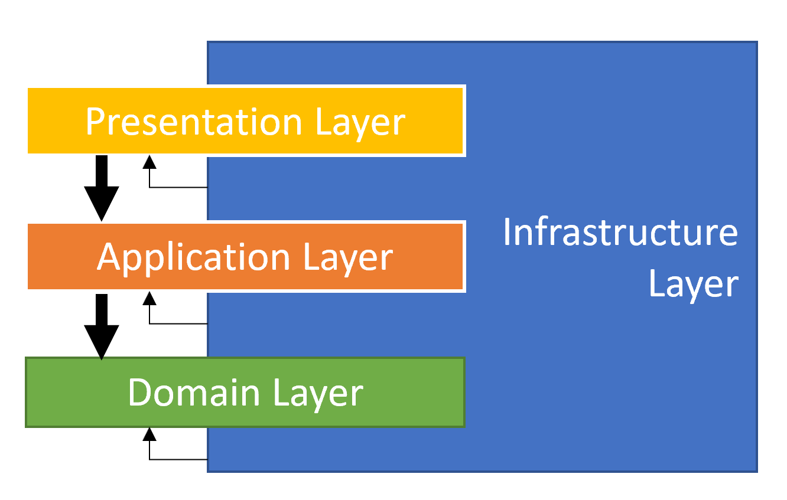

**业务逻辑**分为两层,分别为 *领域(Domain)* 层和 *应用(Application)* 层,它们包含不同类型的业务逻辑.

* **领域层**:只实现领域业务逻辑,与用例无关.
* **应用层**:基于领域层来实现满足用例的业务逻辑.用例可以看作是用户界面(UI)或外部应用程序的交互.
* **展现层**:包含应用程序的UI元素.
* **基础设施层**:通过对第三方库的集成或抽象,来满足其它层的非核心业务逻辑的实现.

同样的分层架构也可以如下图所示:被称为 **整洁架构**, 又或者称为 **洋葱架构**:

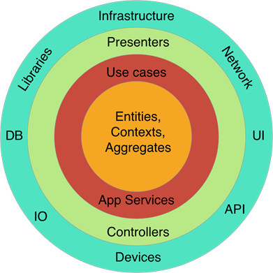

在整洁架构中,**每层只依赖内部的层**,独立的层在圆圈的最中心,也就是领域层.

### 核心构建组成

DDD的关注点在**领域层**和**应用层**上,而展现层和基础设施层则视为*细节*(这个词原文太抽象,自己体会吧),业务层不应依赖它们.

这并不意味着展现层和基础设施层不重要.它们非常重要,但*UI框架* 和 *数据库提供程序* 需要你自己定义规则和总结最佳实践.这些不在DDD的讨论范围中.

本节将介绍领域层和应用层的基本构建组件.

#### 领域层构建组成

* **实体(Entity)**: [实体](Entities.md)是种领域对象,它有自己的属性(状态,数据)和执行业务逻辑的方法.实体由唯一标识符(Id)表示,不同ID的两个实体被视为不同的实体.
* **值对象(Value Object)**: [值对象](Value-Objects.md)是另外一种类型的领域对象,使用值对象的属性来判断两个值对象是否相同,而非使用ID判断.如果两个值对象的属性值全部相同就被视为同一对象.值对象通常是不可变的,大多数情况下它比实体简单.
* **聚合(Aggregate) 和 聚合根(Aggregate Root)**: [聚合](Entities.md)是由**聚合根**包裹在一起的一组对象(实体和值对象).聚合根是一种具有特定职责的实体.
* **仓储(Repository)** (接口): [仓储](Repositories.md)是被领域层或应用层调用的数据库持久化接口.它隐藏了DBMS的复杂性,领域层中只定义仓储接口,而非实现.
* **领域服务(Domain Service)**: [领域服务](Domain-Services.md)是一种无状态的服务,它依赖多个聚合(实体)或外部服务来实现该领域的核心业务逻辑.
* **规约(Specification)**: [规约](Specifications.md)是一种**强命名**,**可重用**,**可组合**,**可测试**的实体过滤器.
* **领域事件(Domain Event)**: [领域事件](Event-Bus.md)是当领域某个事件发生时,通知其它领域服务的方式,为了解耦领域服务间的依赖.

#### 应用层构建组成

* **应用服务(Application Service)**: [应用服务](Application-Services.md)是为实现用例的无状态服务.展现层调用应用服务获取DTO.应用服务调用多个领域服务实现用例.用例通常被视为一个工作单元.
* **数据传输对象(DTO)**: [DTO](Data-Transfer-Objects.md)是一个不含业务逻辑的简单对象,用于应用服务层与展现层间的数据传输.
* **工作单元(UOW)**: [工作单元](Unit-Of-Work.md)是事务的原子操作.UOW内所有操作,当成功时全部提交,失败时全部回滚.

## 实现领域驱动:重点

### .NET解决方案分层

下图是使用[ABP的启动模板](Startup-Templates/Application.md)创建的解决方案:

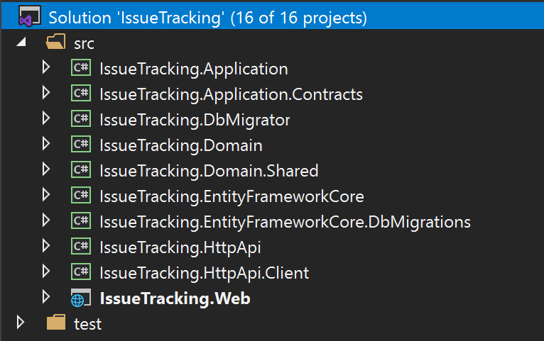

解决方案名为 `IssueTracking` ,它包含多个项目.该解决方案出于**DDD原则**及**开发**和**部署**的实践来进行分层.后面会在各小节中介绍解决方案中的项目.

> 在使用启动模板时,如果选择了其它类型的UI或*数据库提供程序*,解决方案的结构会略有不同.但是领域层和应用层是一样的,这才是DDD的重点.如果你想了解有关解决方案的更多信息,请参见[启动模板](Startup-Templates/Application.md).

#### 领域层

领域层分为两个项目:

* `IssueTracking.Domain`是**领域层中必需**的,它包含之前介绍的**构建组成**(实体,值对象,领域服务,规约,仓储接口等).
* `IssueTracking.Domain.Shared`是领域层中**很薄的项目**,它只包含领域层与其它层共享的数据类型的定义.例如,枚举,常量等.

#### 应用层

应用层也被分为了两个项目:

* `IssueTracking.Application.Contracts`包含**接口**的定义及接口依赖的**DTO**,此项目可以被展现层或其它客户端应用程序引用.
* `IssueTracking.Application`是**应用层中必需**的,它实现了`IssueTracking.Application.Contracts`项目中定义的接口.

#### 展现层

* `IssueTracking.Web`是一个ASP.NET Core MVC / Razor Pages应用程序.它是提供UI元素及API服务的可执行程序.

> ABP框架还支持其它类型的UI框架,包括[Angular](UI/Angular/Quick-Start.md)和[Blazor](UI/Blazor/Overall.md).当选择*Angular*或*Blazor*时,解决方案不会有`IssueTracking.Web`项目.但是会添加`IssueTracking.HttpApi.Host`在解决方案中,此项目会提供HTTP API供UI调用.

#### 远程服务层

* `IssueTracking.HttpApi`包含了HTTP API的定义.它通常包含*MVC Controller* 和 *Model*(如果有).因此,你可以在此项目中提供HTTP API.

> 大多数情况下,通过使用*API Controller* 包装应用服务,供客户端远程调用.ABP框架的[API自发现系统](API/Auto-API-Controllers.md)可以自动将应用服务公开为API,因此,通常不需要在此项目中再创建Controller.出于需要手动添加额外Controller的情况,也包含在模板解决方案中.

* `IssueTracking.HttpApi.Client`当C#客户端应用程序需要调用`IssueTracking.HttpApi`的API时,这个项目非常有用.客户端程序仅需引用此项目就可以通过依赖注入方式,远程调用应用服务.它是通过ABP框架的[动态C#客户端API代理系统](API/Dynamic-CSharp-API-Clients.md)来实现的.

> 在解决方案文件夹`test`下,有一个名为`IssueTracking.HttpApi.Client.ConsoleTestApp`的控制台程序.它演示了如何使用`IssueTracking.HttpApi.Client`项目来远程调用应用程序公开的API.因为只是演示,你可以删除此项目,再或者你认为`IssueTracking.HttpApi`不需要,同样可以删除.

#### 基础设施层

你可能只创建一个基础设施项目来完成所有抽象类的定义及外部类的集成,又或者为不同的依赖创建多个不同的项目.

我们建议采用一种平衡的方法:为主要的依赖的库(例如 Entity Framework Core)创建一个独立的项目,为其它的依赖库创建一个公共的基础设施项目.

ABP的启动解决方案中包含两个用于集成Entity Framework Core的项目:

* `IssueTracking.EntityFrameworkCore`是必需的,因为需要集成*EF Core*.应用程序的`数据库上下文(DbContext)`,数据库对象映射,仓储接口的实现,以及其它与*EF Core*相关的内容都位于此项目中.
* `IssueTracking.EntityFrameworkCore.DbMigrations`是管理Code First方式数据库迁移记录的特殊项目.此项目定义了一个独立的`DbContext`来追踪迁移记录.只有当添加一个新的数据库迁移记录或添加一个新的[应用模块](Modules/Index.md)时,才会使用此项目,否则,其它情况无需修改此项目内容.

> 你可能想知道为什么会有两个EF Core项目,主要是因为[模块化](Module-Development-Basics.md).每个应用模块都有自己独立的`DbContext`,你的应用程序也有自己`DbContext`.`DbMigrations`项目包含**合并**所有模块迁移记录的**单个迁移路径**.虽然大多数情况下你无需过多了解,但也可以查看[EF Core迁移](Entity-Framework-Core-Migrations.md)了解更多信息. 

#### 其它项目

另外还有一个项目`IssueTracking.DbMigrator`,它是一个简单的控制台程序,用来执行数据库迁移,包括**初始化**数据库及创建**种子数据**.这是一个非常实用的应用程序,你可以在开发环境或生产环境中使用它.

### 项目间的依赖关系

下图展示了解决方案中项目间的依赖关系(有些项目比较简单就未展示):

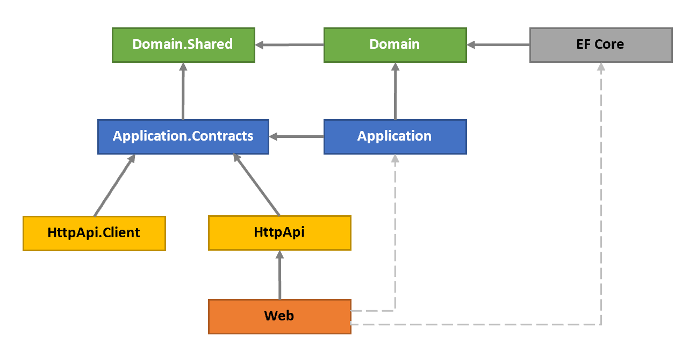

之前已介绍了这些项目.现在,我们来解释依赖的原因:

* `Domain.Shared` 所有项目直接或间接依赖此项目.此项目中的所有类型都可以被其它项目所引用.
* `Domain` 仅依赖`Domain.Shared`项目,因为`Domain.Shared`本就属于领域层的一部分.例如,`Domain.Shared`项目中的枚举类型 `IssueType` 被`Domain`项目中的`Issue`实体所引用.
* `Application.Contracts` 依赖`Domain.Shared`项目,可以在DTO中重用`Domain.Shared`中的类型.例如,`Domain.Shared`项目中的枚举类型 `IssueType` 同样被`Contracts`项目中的`CreateIssueDto`DTO所引用.
* `Application` 依赖`Application.Contracts`项目,因为此项目需要实现应用服务的接口及接口使用的DTO.另外也依赖`Domain`项目,因为应用服务的实现必须依赖领域层中的对象.
* `EntityFrameworkCore` 依赖`Domain`项目,因为此项目需要将领域对象(实体或值对象)映射到数据库的表,另外还需要实现`Domain`项目中的仓储接口.
* `HttpApi` 依赖`Application.Contracts`项目,因为Controllers需要注入应用服务.
* `HttpApi.Client` 依赖`Application.Contracts`项目,因为此项目需要是使用应用服务.
* `Web` 依赖`HttpApi`项目,因为此项目对外提供HTTP APIs.另外Pages或Components 需要使用应用服务,所以还间接依赖了`Application.Contracts`项目

#### 虚线依赖

你在上图中会发现用虚线表示了另外两个依赖.`Web`项目依赖了 `Application` and `EntityFrameworkCore`,理论上`Web`不应该依赖这两个项目,但实际上依赖了.原因如下:

`Web`是最终的运行程序,是负责托管Web的宿主,它在运行时需要**应用服务和仓储的实现类**.

这种依赖关系的设计,可能会让你有机会在展现层直接使用到EF Core的对象,**应该严格禁止这样的做法**.如果想在解决方案分层上规避这种问题,有下面两种方式,相对复杂一些:

* 将`Web`项目类型改为razor类库,并创建一个新项目,比如`Web.Host`,`Web.Host`依赖`Web`,`Application`,`EntityFrameworkCore`三个项目,并作为Web宿主程序运行.注意,不要写任何与UI相关的代码,只是作为**宿主运行**.
* 在`Web`项目中移除对`Application`和`EntityFrameworkCore`的引用,`Web`在启动时,再动态加载程序集``IssueTracking.Application.dll`和`IssueTracking.EntityFrameworkCore.dll`.可以使用ABP框架的[插件模块](PlugIn-Modules.md)来动态加载程序集.

### DDD模式的应用程序执行顺序

下图展示了基于DDD模式下的Web应用程序执行顺序:

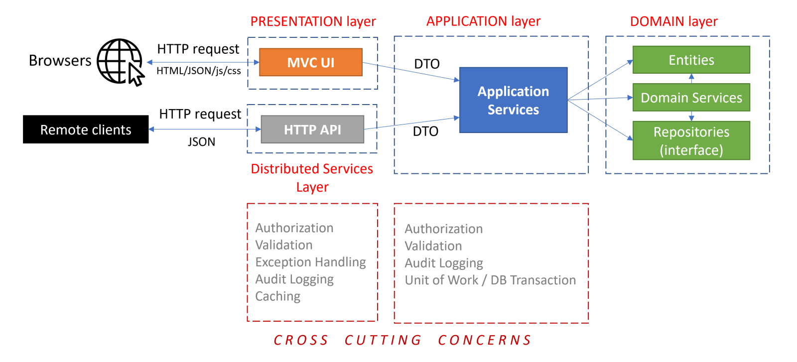

* 通常由UI(用例)发起一个HTTP请求到服务器.
* 由展现层(或分布式服务层)中的一个*MVC Controller*或*Razor Page Handler*处理请求,在这个阶段可以执行一些AOP逻辑([授权](Authorization.md),[验证](Validation.md),[异常处理](Exception-Handling.md)等),*MVC Controller*或*Razor Page Handler*调用注入的应用服务接口,并返回其调用后的结果(DTO)..
* 应用服务使用领域层的对象(实体,仓储接口,领域服务等)来实现UI(用例)交互.此阶段同样可以执行一些AOP逻辑(授权,验证等).应用服务中的每个方法应该是一个[工作单元](Unit-Of-Work.md),代表它是一次原子性操作.

跨域问题大多数由**ABP框架自动实现**,通常不需要为此额外编码.

### 通用原则

在详细介绍之前,我们先来看一些DDD的总体原则.

#### 数据库提供程序 / ORM 独立原则

领域层和应用层应该与*数据库提供程序 / ORM*无关.领域层和应用层仅依赖仓储接口,并且仓储接口不依赖特定的ORM对象.

原因如下:

1. 未来领域层或应用层的基础设施会发生改变,例如,需要支持另外一种数据库类型,因此需要保持**领域层或应用层的基础设施是独立的**.
2. 将基础设施的实现隐藏在仓储中,使得领域层或应用层更**专注于业务逻辑代码**.
3. 可以通过模拟仓储接口,使得自动化测试更为方便.

> 关于此原则, `EntityFrameworkCore`项目只被启动程序项目所引用,解决方案中其它项目均未引用.

##### 关于数据库独立原则的讨论

**原因1**会非常影响你**领域对象的建模**(特别是实体间的关系)及**应用程序的代码**.假如,开始选择了关系型数据库,并使用了[Entity Framework Core](Entity-Framework-Core.md),后面尝试切换到[MongoDB](MongoDB.md),那么 **EF Core 中一些非常用的特性**你就不能使用了,例如:

* 无法使用[变更追踪](https://docs.microsoft.com/zh-cn/ef/core/querying/tracking) ,因为*MongoDB provider*没有提供此功能,因此,你始终需要显式的更新已变更的实体.
* 无法在不同的聚合间使用[导航属性](https://docs.microsoft.com/zh-cn/ef/core/modeling/relationships),因为文档型数据库是不支持的.有关更多信息,请参见"规则:聚合间仅通过Id关联".

如果你认为这些功能对你很**重要**,并且你永远都不会**离开** *EF Core*,那么我们认为你可以忽略这一原则.假如你在设计实体关系时使用了*EF Core*,你甚至可以在应用层引用*EF Core Nuget*包,并直接使用异步的LINQ扩展方法,例如 `ToListAsync()`(有关更多信息,请参见[仓储](Repositories.md)文档中的*IQueryable*和*Async Operations*).

但是我们仍然建议采用仓储模式来隐藏基础设施中实现过程.

#### 展现层技术无关原则

展现层技术(UI框架)时现代应用程序中最多变的部分之一.**领域层和应用层**应该对展现层所采用的技术或框架**一无所知**.使用ABP启动模板就非常容易实现此原则.

在某些情况下,你可能需要在应用层和展现层中写重复的逻辑,例如,参数验证和授权检查.展现层检查出于**用户体验**,应用层或领域层检查出于**数据安全性**和**数据完整性**.

#### 关注状态的变化,而不是报表/查询

DDD关注领域对象的**变化和相互作用**,如何创建或修改一个具有数据**完整性,有效性**,符合**业务规则**的实体对象.

DDD忽略**领域对象的数据展示**,这并不意味着它们并不重要,如果应用程序没有精美的看板和报表,谁会愿意用呢?但是报表是另外一个讨论话题,你可以通过使用SQL Server报表功能或ElasticSearch来提供数据展示,又或者使用优化后的SQL查询语句,创建数据库索引或存储过程.唯一的原则是不要将这些内容混入领域的业务逻辑中.

## 实现领域驱动:构建组成

这是本指南的重要部分,我们将通过示例介绍并解释一些**明确的规则**,在实现领域驱动设计时,你可以遵循这些规则并将其应用于解决方案中.

### 领域

示例中会使用一些概念,这些概念在Github中被使用,例如, `Issue`(问题), `Repository`(仓库), `Label`(标签) 和`User`(用户).下图中展示了一些聚合,聚合根,实体,值对象以及它们之间的关系:

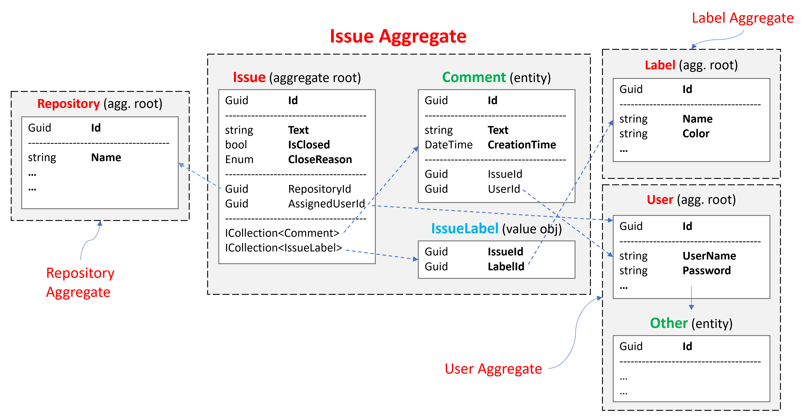

**问题聚合** 由`Issue` 聚合根,及其包含的 `Comment` 和`IssueLabel` 集合组成.我们将重要讨论 `Issue` 聚合根:

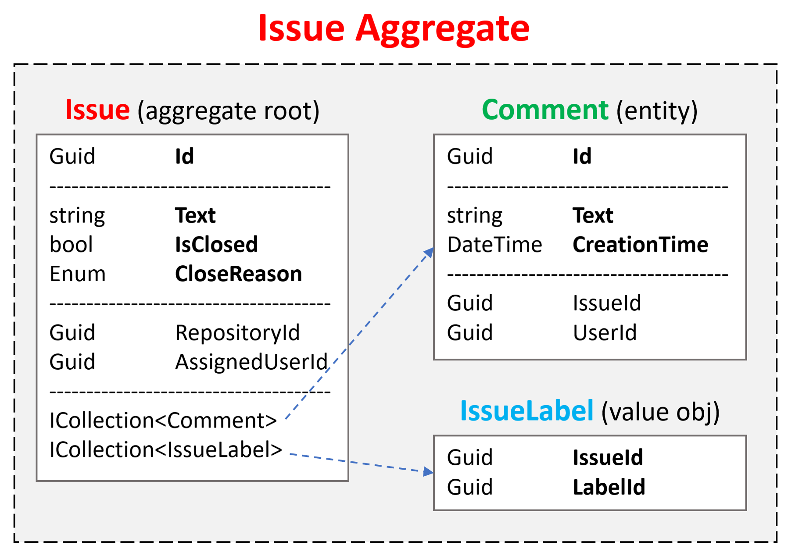

### Aggregates

如前所述, [聚合](Entities.md)是由**聚合根**包裹在一起的一组对象(实体和值对象).本节将介绍于聚合的有关原理和规则.

> 后面的文档中,我们将使用 *实体* 替代 *聚合根* 或 *子集合实体* ,除非我们明确指明使用 *聚合根* 或 *子集合实体* .

#### 聚合 / 聚合根 原则

##### 业务规则

实体负责实现与其自身属性相关的业务规则.同时*聚合根实体*还负责它们的子集合实体.

聚合应该通过领域规则和约束来保证自身的**完整性**和**有效性**.这意味着,实体与DTO是不同的,实体应该比DTO多了些**实现业务逻辑的方法**.我们应该尽可能地在实体上实现业务规则.

##### 独立单元

应该在一个独立的单元中完成**一个聚合的获取及保存**,包括自身属性及其子集合.假如我们需要在`Issue`中添加一个新的`Comment`,步骤如下:

* 从数据库中获取一个 `Issue` 对象,包括所有子集合(`Comments`和`IssueLabels`).
* 使用 `Issue` 实体上的添加新`Comment`的方法,例如 `Issue.AddComment(...);`.
* 在数据库的单次操作中完成整个 `Issue`对象(包括子集合)的保存.

对于在关系型数据库上用过 **EF Core** 的开发人员会认为,获取`Issue`的同时加载子集合没有必要并且还影响性能.为什么不使用SQL语句`Insert`来直接插入记录呢?

这样做的原因是我们需要执行业务规则来保证数据的一致性和完整性.假如有一个业务规则:"用户不能对已锁定的问题进行评论".那如何在不查询数据库的情况下,获取问题是否已被锁定?所以,只有关联的对象都被加载了的时候,我们才可以执行业务规则.

另外,使用**MongoDB**的开发人员就认为此原则很好理解.在MongoDB中,聚合对象(包含子集合)会被保存到一个`collection`中.因而,无需任何其它配置,就可以实现查询一个聚合,同时所有子对象.

ABP框架有助于你实现这一原则

**例子: 问题追加评论**

````csharp
public class IssueAppService : ApplicationService, IIssueAppService
{
    private readonly IRepository<Issue, Guid> _issueRepository;

    public IssueAppService(IRepository<Issue, Guid> issueRepository)
    {
        _issueRepository = issueRepository;
    }

    [Authorize]
    public async Task CreateCommentAsync(CreateCommentDto input)
    {
        var issue = await _issueRepository.GetAsync(input.IssueId);
        issue.AddComment(CurrentUser.GetId(), input.Text);
        await _issueRepository.UpdateAsync(issue);
    }
}
````

通过`_issueRepository.GetAsync`方法来获取`Issue`对象时,默认就已经加载了所有子集合.对于MongoDB很简单,EF Core 则需要额外配置,一旦配置,ABP仓储类会自动处理.`_issueRepository.GetAsync`方法还有个可选参数`includeDetails`,可以传`false`,手动禁止加载子集合.

> 如何配置及替代方案,请参考[EF Core document](Entity-Framework-Core.md)的*加载关联实体*  章节.

`Issue.AddComment`接收两个参数,分别是`userId`和`text`,再执行自己的业务规则,最终将评论添加到`Issue`的评论集合中.

最后,我们使用`_issueRepository.UpdateAsync`方法,将对象保存到数据库中.

> EF Core 具有**变更追踪**的功能,因此,不需要调用`_issueRepository.UpdateAsync`方法.ABP的工作单元会再方法结束时,自动执行`DbContext.SaveChanges()`的.如果使用MongoDB则需要显式手动调用.
>
> 因此,当需要额外编写仓储层的实现,应该在实体变化时始终调用 `UpdateAsync` 方法.

##### 事务边界

通常认为一个聚合就是一个事务边界.如果用例只涉及单个聚合,那么读取及修改就是一个操作单元.对聚合内所有对象的修改都将作为原子操作一起保存,无需显式创建数据库事务.

但是,实际上,可能需要在一个用例中更改**多个聚合对象的实例**,并且还要求创建事务来保证**原子更新**和**数据一致性**.因此,ABP框架提供了为每个用例(应用服务中的方法),可以创建显式事务的功能.有关更多信息,请参见文档[工作单元](Unit-Of-Work.md).

##### 序列化

一个聚合(包含聚合根及子集合)可以被序列化或反序列化.例如,MongoDB在保存对象到数据库时,会将聚合序列化为JSON文件,读取时再进行反序列化.

> 使用关系型数据库+ORM时,这个原则不是必须的,但是,这是领域驱动设计的重要实践.

以下规则遵循序列化原则

#### 聚合/聚合根规则及最佳实践

以下规则是遵循上述原则.

##### 聚合间只通过ID相互引用

聚合应该只引用其它聚合的ID,也就是说,不允许定义导航属性关联至其它聚合.

* 该规则遵循了可序列化原则.
* 该规则还可以避免不同聚合彼此间的相互操作以及业务逻辑的暴露.

下图中,可以看到两个聚合根,`GitRepository` 和`Issue` :

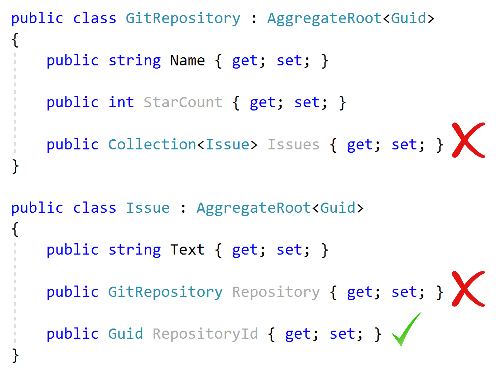

* `GitRepository` 不应该包含 `Issue`的集合,因为`Issue`属于不同的聚合.
* `Issue` 不应该包含导航属性至 `GitRepository` .因为 `GitRepository`属于不同的聚合.
* `Issue` 可以有 `RepositoryId` 的引用.

因此,若要获取`Issue`关联的 `GitRepository`对象,需要使用`Issue`的`RepositoryId`在数据库中进行一次查询.

###### 对于EF Core和关系型数据库

MongoDB中不适合使用导航属性或集合的,原因是:当前源聚合对象会被序列化为JSON,其中会保存导航目标聚合的副本.

在使用EF Core在关系型数据库上进行操作时,开发者可能认为此规则没必要.但是我们认为这是一条非常重要的规则,有助于降**低领域的复杂性**减少风险.我们强烈建议遵守此规则.如果你确定要忽略此规则,请参见上面的"关于数据库独立原理的讨论"章节.

##### 保持聚合尽量的小

保持聚合简单而小巧是一个比较好的做法.因为聚合的读取与保存是一个整体,当处理较大对象时会出现性能问题,如下所示:

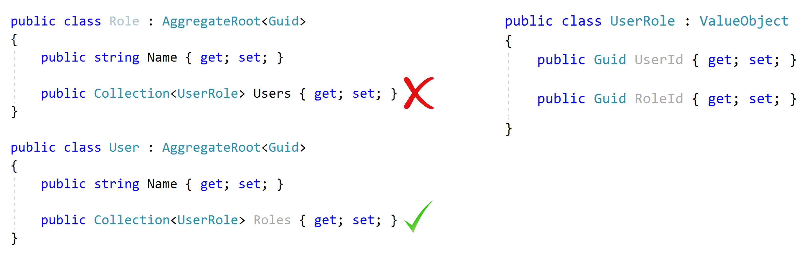

角色聚合包含`UserRole`值对象集合,方便查询该角色下有哪些用户.注意,`UserRole`不是聚合,并且也遵守了*聚合间只通过ID相互引用*的规则.但是在现实场景中,一个角色可能被给成千上万个用户,当从数据库中加载一个角色时,会关联加载数千个用户对象,这里会有 严重的性能问题.

反过来看,`User`也可以有`Roles` 集合,现实中一个用户不会具有太多的角色,因此采用`User`关联`Roles`这种方式比较合适.

当使用**非关系型数据库时**,`User`和`Role` 同时都有关联子集合,会出现另外一个问题.相同的记录会被重复记录在不同的集合中,并且难以保证数据一致性(需要添加记录到`User.Roles`和`Role.Users`中)

因此,请根据以下注意事项来确定聚合的边界:

* 同时被使用的对象.
* 查询(读取/保存)性能和内存消耗.
* 数据完整性,有效性,一致性.

现实情况:

* 大多数聚合根**没有子集合**.
* 子集合的数量控制在**100-150个**.如果集合数量超过150个,考虑将子对象改成聚合根.

##### 聚合根 / 实体的主键

* 聚合根通常具有唯一的标识符ID (主键: PK).我们建议使用 `Guid`作为聚合根的主键类型. (原因请参见[Guid生成文档](Guid-Generation.md)).
* 聚合中的实体(非聚合根)可以使用联合主键.

如图所示:

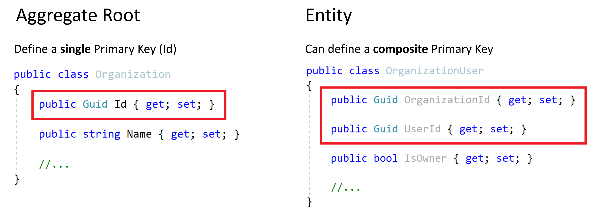

* `Organization`有一个`Guid`的标识符 (`Id`).
* `OrganizationUser`是一个子集合,使用 `OrganizationId` 和`UserId`作为联合主键.

并不是所有的子集合的主键都是联合主键,有些情况下,可以使用单独的`Id`作为主键.

> 联合主键实际上时关系型数据库中的概念,因为子集合对象有与之对应的数据库表,而表也要有主键.但是在非关系型数据库中,无需为子集合实体定义主键,因为它们本身就已属于一个聚合根.

##### 聚合根 / 实体的构造函数

构造函数是实体生命周期的开始被执行.以下是构造函数的编写建议:

* 将实体的**必填属性**作为构造函数参数,这样可以创建一个**有效(符合规则)的实体**.另外,将非必填属性作为构造函数的可选参数.
* 参数必须**检查有效性**.
* 所有**子集合**对象必须被初始化.

**示例: `Issue` (聚合根) 构造函数**

````csharp
using System;
using System.Collections.Generic;
using System.Collections.ObjectModel;
using Volo.Abp;
using Volo.Abp.Domain.Entities;

namespace IssueTracking.Issues
{
    public class Issue : AggregateRoot<Guid>
    {
        public Guid RepositoryId { get; set; }
        public string Title { get; set; }
        public string Text { get; set; }
        public Guid? AssignedUserId { get; set; }
        public bool IsClosed { get; set; }
        public IssueCloseReason? CloseReason { get; set; } //enum

        public ICollection<IssueLabel> Labels { get; set; }

        public Issue(
            Guid id,
            Guid repositoryId,
            string title,
            string text = null,
            Guid? assignedUserId = null
            ) : base(id)
        {
            RepositoryId = repositoryId;
            Title = Check.NotNullOrWhiteSpace(title, nameof(title));
            
            Text = text;
            AssignedUserId = assignedUserId;
            
            Labels = new Collection<IssueLabel>();
        }

        private Issue() { /* for deserialization & ORMs */ }
    }
}
````

* `Issue` 通过构造函数的参数,对必填属性进行赋值,而从创建一个有效的实体对象.
* 构造函数对参数进行**验证**(`Check.NotNullOrWhiteSpace(...)`必填项为空,抛出异常).
* 初始化子集合.在实例化`Issue`对象后,访问 `Labels` ,不会出现空指针异常.
* 构造函数还将 `id`传递给父类,不要在构造函数内生成 `Guid`(参阅 [Guid生成](Guid-Generation.md)).
* 为ORM保留**私有的无参构造函数**.防止编写代码时,意外使用了无参构造函数.

> 参见 [实体](Entities.md) 文档,了解更多使用ABP框架创建实体的信息.

##### 实体属性访问器和方法

上面的示例中,我们在构造函数中对 `Title` 进行了非空检查.但是开发人员可以再次对`Title`进行赋值.

如果我们使用**公开的属性**,则无法在实体控制数据的**有效性**和**完整性**.建议:

* 如果某个属性具有业务逻辑,则将该属性的**setter**改为私有.
* 定义公开的方法来修改属性.

**示例:提供方法修改属性**

````csharp
using System;
using Volo.Abp;
using Volo.Abp.Domain.Entities;

namespace IssueTracking.Issues
{
    public class Issue : AggregateRoot<Guid>
    {
        public Guid RepositoryId { get; private set; } //Never changes
        public string Title { get; private set; } //Needs validation
        public string Text { get; set; } //No validation
        public Guid? AssignedUserId { get; set; } //No validation
        public bool IsClosed { get; private set; } //Should change with CloseReason
        public IssueCloseReason? CloseReason { get; private set; } //Should change with IsClosed

        //...

        public void SetTitle(string title)
        {
            Title = Check.NotNullOrWhiteSpace(title, nameof(title));
        }

        public void Close(IssueCloseReason reason)
        {
            IsClosed = true;
            CloseReason = reason;
        }

        public void ReOpen()
        {
            IsClosed = false;
            CloseReason = null;
        }
    }
}
````

* `RepositoryId` setter是私有的.创建后无法变更,业务规则不允许将已有的问题移到其它仓库.
* `Title` setter是私有的.它的修改时需要加以验证.
* `Text` 和 `AssignedUserId` setter 是公开的.因为业务规则允许它们为空或任意值.我们认为没必要将它们改为私有的,如果将来业务发生变化,再将setter改为私有,并提供公开的方法进行修改.另外实体属于领域层,不会直接暴露属性给应用层(或其它层),目前将其公开不是什么大问题.
* `IsClosed` 和 `IssueCloseReason` 它们是一组属性.定义 `Close` 和 `ReOpen` 方法来同时对这两个属性进行赋值.这样可以防止问题被无故关闭.

##### 业务逻辑与实体异常

对实体进行验证,或执行业务逻辑时,通常需要抛出异常:

* 领域中定义的**特定的异常**.
* 实体方法中**抛出的异常**.

**示例**

````csharp
public class Issue : AggregateRoot<Guid>
{
    //...
    
    public bool IsLocked { get; private set; }
    public bool IsClosed { get; private set; }
    public IssueCloseReason? CloseReason { get; private set; }

    public void Close(IssueCloseReason reason)
    {
        IsClosed = true;
        CloseReason = reason;
    }

    public void ReOpen()
    {
        if (IsLocked)
        {
            throw new IssueStateException(
                "Can not open a locked issue! Unlock it first."
            );
        }

        IsClosed = false;
        CloseReason = null;
    }

    public void Lock()
    {
        if (!IsClosed)
        {
            throw new IssueStateException(
                "Can not open a locked issue! Unlock it first."
            );
        }

        IsLocked = true;
    }

    public void Unlock()
    {
        IsLocked = false;
    }
}
````

这里有两个业务规则:

* 已锁定的问题无法重新开启.
* 无法锁定已开打的问题.

当违反业务规则时,`Issue` 会抛出 `IssueStateException` 异常:

````csharp
using System;

namespace IssueTracking.Issues
{
    public class IssueStateException : Exception
    {
        public IssueStateException(string message)
            : base(message)
        {
            
        }
    }
}
````

抛出异常会引发两个问题:

1. 当异常发生时,**用户**应该看到异常(错误)信息吗?如果需要看到,异常消息如何实现本地化? user** see the exception (error) message? If so, how do you **localize** the exception message? 实体中无法注入[本地化](Localization.md)的 `IStringLocalizer` 接口.
2. 对于Web应用或HTTP API,应向客户端返回什么**HTTP状态代码**.

ABP框架的 [异常处理](Exception-Handling.md) 可以解决上述问题.

**示例:使用异常编码**

````csharp
using Volo.Abp;

namespace IssueTracking.Issues
{
    public class IssueStateException : BusinessException
    {
        public IssueStateException(string code)
            : base(code)
        {
            
        }
    }
}
````

* `IssueStateException` 继承至 `BusinessException` .对于`BusinessException`的派生类,ABP框架默认返回的HTTP状态码是403 (默认是服务器内部错误 状态码 500)
*  将`code` 作为Key,在本地化资源中查找对应的文字.

现在,我们修 `ReOpen` 方法:

````csharp
public void ReOpen()
{
    if (IsLocked)
    {
        throw new IssueStateException("IssueTracking:CanNotOpenLockedIssue");
    }

    IsClosed = false;
    CloseReason = null;
}
````

> 使用常量而不是魔法字符串.

在本地化资源文件中添加对应的记录:

````json
"IssueTracking:CanNotOpenLockedIssue": "Can not open a locked issue! Unlock it first."
````

* 异常发生时,ABP将自动使用本地化消息(基于当前语言).
* 异常编码 (`IssueTracking:CanNotOpenLockedIssue` )会被发送到客户端.同样可以以编程方式处理此异常.

> 你可以无需定义 `IssueStateException`,直接抛出`BusinessException`异常.详细信息,参见[异常处理文档](Exception-Handling.md)

##### 实体中业务逻辑依赖外部服务时

仅依赖实体本身的属性执行的业务规非常简单.但是有时候,复杂的业务逻辑会**查询数据库**或使用[依赖注入](Dependency-Injection.md)中的其它服务,这该怎么办?注意:**实体是无法注入服务的**.

实现这种业务逻辑有两种方式:

* 将依赖的服务以**方法的参数**,传递到实体的业务逻辑方法中.
* 定义一个**领域服务**.

领域服务我们后面再说.我们先看看在实体类中如何实现:

**示例:业务规则: 不允许将3个以上未解决的问题关联到一个用户**

````csharp
public class Issue : AggregateRoot<Guid>
{
    //...
    public Guid? AssignedUserId { get; private set; }

    public async Task AssignToAsync(AppUser user, IUserIssueService userIssueService)
    {
        var openIssueCount = await userIssueService.GetOpenIssueCountAsync(user.Id);

        if (openIssueCount >= 3)
        {
            throw new BusinessException("IssueTracking:ConcurrentOpenIssueLimit");
        }

        AssignedUserId = user.Id;
    }

    public void CleanAssignment()
    {
        AssignedUserId = null;
    }
}
````

* `AssignedUserId` 私有的属性setter.此属性只能通过`AssignToAsync` 和`CleanAssignment` 方法来修改.
* `AssignToAsync` 通过 `user.Id` 属性获取一个 `AppUser` 实体.
* `IUserIssueService` 是获取用户未解决问题的服务.
* `AssignToAsync` 当不满足业务规则时抛出异常.
* 最后,符合规则,就对属性`AssignedUserId` 进行赋值.

这样就解决了将问题关联到用户时,需要调用外部服务的问题,但是它也存在几个问题:

* 实体**依赖了外部服务**,实体变得**复杂**.
* 实体调用变的复杂.在调用`AssignToAsync` 方法时还需要传递 `IUserIssueService` 服务.

实现这种业务逻辑另外一种方案,使用领域服务,后面将详细说明.

### 仓储

[仓储](Repositories.md)是一个类集合的接口,它通常被领域层或应用层调用,负责访问持久化系统(数据库),读取写入业务对象(聚合).

仓储的原则:

* 在**领域层**中定义仓储接口,因为仓储会被领域层或应用层调用,在**基础设施层中实现**(*EntityFrameworkCore* 项目).
* 仓储中**不要写任何业务逻辑**.
* 仓储接口不依赖 **数据库提供程序 / ORM**.例如,不要在仓储中返回 `DbSet` 类型,因为 `DbSet`是EF Core中的对象.
* **仅为聚合根定义仓储**,非聚合根对象不要提供仓储,因为子集合可以通过聚合根来进行持久化.

#### 仓储中不要写任何业务逻辑

我们经常不小心把业务逻辑编写到了仓储层.

**示例:从仓储中获取非活动的问题**

````csharp
using System;
using System.Collections.Generic;
using System.Threading.Tasks;
using Volo.Abp.Domain.Repositories;

namespace IssueTracking.Issues
{
    public interface IIssueRepository : IRepository<Issue, Guid>
    {
        Task<List<Issue>> GetInActiveIssuesAsync();
    }
}
````

`IIssueRepository`继承至`IRepository<...>`接口,并新增一个新接口`GetInActiveIssuesAsync`.此仓储为聚合根`Issue`提供查询的实现.

````csharp
public class Issue : AggregateRoot<Guid>, IHasCreationTime
{
    public bool IsClosed { get; private set; }
    public Guid? AssignedUserId { get; private set; }
    public DateTime CreationTime { get; private set; }
    public DateTime? LastCommentTime { get; private set; }
    //...
}
````

(上面的属性仅为了演示此示例)

原则要求仓储不包含业务逻辑,上面的示例"**什么是非活动的问题?**"这个属于业务规则吗?

````csharp
using System;
using System.Collections.Generic;
using System.Linq;
using System.Threading.Tasks;
using IssueTracking.EntityFrameworkCore;
using Microsoft.EntityFrameworkCore;
using Volo.Abp.Domain.Repositories.EntityFrameworkCore;
using Volo.Abp.EntityFrameworkCore;

namespace IssueTracking.Issues
{
    public class EfCoreIssueRepository : 
        EfCoreRepository<IssueTrackingDbContext, Issue, Guid>,
        IIssueRepository
    {
        public EfCoreIssueRepository(
            IDbContextProvider<IssueTrackingDbContext> dbContextProvider) 
            : base(dbContextProvider)
        {
        }

        public async Task<List<Issue>> GetInActiveIssuesAsync()
        {
            var daysAgo30 = DateTime.Now.Subtract(TimeSpan.FromDays(30));

            return await DbSet.Where(i =>

                //Open
                !i.IsClosed &&

                //Assigned to nobody
                i.AssignedUserId == null &&

                //Created 30+ days ago
                i.CreationTime < daysAgo30 &&

                //No comment or the last comment was 30+ days ago
                (i.LastCommentTime == null || i.LastCommentTime < daysAgo30)

            ).ToListAsync();
        }
    }
}
````

(使用EF Core来实现. 如何使用EF Core实现仓储,请参见[EF Core集成文档](Entity-Framework-Core.md) )

来看一下`GetInActiveIssuesAsync`的实现,可以看到定义了一个**非活动问题的业务规则**:

- 是*open*的(非*IsClosed* )
- 没有关联到任何人
- 创建时间大于30天
- 最近30天没有评论

这个业务逻辑就被实现在了仓储内部,当我们需要重用这个业务规则时就会出现问题.

例如:我们需要再实体`Issue`上添加一个方法来判断是否非活动`bool IsInActive()`,以方便我们在`Issue`实例上获取.

代码如下:

````csharp
public class Issue : AggregateRoot<Guid>, IHasCreationTime
{
    public bool IsClosed { get; private set; }
    public Guid? AssignedUserId { get; private set; }
    public DateTime CreationTime { get; private set; }
    public DateTime? LastCommentTime { get; private set; }
    //...

    public bool IsInActive()
    {
        var daysAgo30 = DateTime.Now.Subtract(TimeSpan.FromDays(30));
        return
            //Open
            !IsClosed &&

            //Assigned to nobody
            AssignedUserId == null &&

            //Created 30+ days ago
            CreationTime < daysAgo30 &&

            //No comment or the last comment was 30+ days ago
            (LastCommentTime == null || LastCommentTime < daysAgo30);
    }
}
````

我们需要拷贝代码来实现,如果将来业务规则发送变化,我们就必须修改这两处的代码,这样做非常危险.

这里有一个很好的解决方案,就是使用*规约模式*.

### 规约模式

[规约](Specifications.md)是一种**强命名**,**可重用**,**可组合**,**可测试**的实体过滤器.

ABP框架提供了基础设施来轻松定义规约类,你可以在代码中方便使用.我们来将非活动问题使用规约方式实现:

````csharp
using System;
using System.Linq.Expressions;
using Volo.Abp.Specifications;

namespace IssueTracking.Issues
{
    public class InActiveIssueSpecification : Specification<Issue>
    {
        public override Expression<Func<Issue, bool>> ToExpression()
        {
            var daysAgo30 = DateTime.Now.Subtract(TimeSpan.FromDays(30));
            return i =>

                //Open
                !i.IsClosed &&

                //Assigned to nobody
                i.AssignedUserId == null &&

                //Created 30+ days ago
                i.CreationTime < daysAgo30 &&

                //No comment or the last comment was 30+ days ago
                (i.LastCommentTime == null || i.LastCommentTime < daysAgo30);
        }
    }
}
````

基类`Specification<T>`通过表达式简化了创建规约的过程,仅需要将仓储中的表达式迁移至规约中.

现在,我们可以在`Issue` 和 `EfCoreIssueRepository`中重用规约`InActiveIssueSpecification`了.

#### 在实体内使用规约

`Specification` 类提供了一个`IsSatisfiedBy`方法,在实例对象上应用规约检查,判断是否满足规约的要求.代码如下:

````csharp
public class Issue : AggregateRoot<Guid>, IHasCreationTime
{
    public bool IsClosed { get; private set; }
    public Guid? AssignedUserId { get; private set; }
    public DateTime CreationTime { get; private set; }
    public DateTime? LastCommentTime { get; private set; }
    //...

    public bool IsInActive()
    {
        return new InActiveIssueSpecification().IsSatisfiedBy(this);
    }
}
````

实例化一个新的规约`InActiveIssueSpecification`实例,并通过`IsSatisfiedBy` 方法进行规约检查.

#### 在仓储内使用规约

首先,我们先修改一下仓储接口:

````csharp
public interface IIssueRepository : IRepository<Issue, Guid>
{
    Task<List<Issue>> GetIssuesAsync(ISpecification<Issue> spec);
}
````

先将`GetInActiveIssuesAsync` 方法改名为`GetIssuesAsync` ,因为我们改为使用规约方式,现在就无需为不同的查询条件创建不同的接口方法(例如:`GetAssignedIssues(...)`,`GetLockedIssues(...)`)

再修改下仓储实现:

````csharp
public class EfCoreIssueRepository :
    EfCoreRepository<IssueTrackingDbContext, Issue, Guid>,
    IIssueRepository
{
    public EfCoreIssueRepository(
        IDbContextProvider<IssueTrackingDbContext> dbContextProvider)
        : base(dbContextProvider)
    {
    }

    public async Task<List<Issue>> GetIssuesAsync(ISpecification<Issue> spec)
    {
        return await DbSet
            .Where(spec.ToExpression())
            .ToListAsync();
    }
}
````

由于`ToExpression()`方法返回一个表达式,因此可以直接将其传递给`Where`方法来过滤实体.

我们可以在调用`GetIssuesAsync`方法时,传递任何规约的实例.

````csharp
public class IssueAppService : ApplicationService, IIssueAppService
{
    private readonly IIssueRepository _issueRepository;

    public IssueAppService(IIssueRepository issueRepository)
    {
        _issueRepository = issueRepository;
    }

    public async Task DoItAsync()
    {
        var issues = await _issueRepository.GetIssuesAsync(
            new InActiveIssueSpecification()
        );
    }
}
````

##### 默认仓储使用规约

实际上,我们不必非要创建一个自定义仓储来使用规约方式,泛型仓储`IRepository`同样可以使用规约,因为`IRepository`已扩展了`IQueryable`对象,因此可以在泛型仓储上使用,代码如下:

````csharp
public class IssueAppService : ApplicationService, IIssueAppService
{
    private readonly IRepository<Issue, Guid> _issueRepository;

    public IssueAppService(IRepository<Issue, Guid> issueRepository)
    {
        _issueRepository = issueRepository;
    }

    public async Task DoItAsync()
    {
        var issues = AsyncExecuter.ToListAsync(
            _issueRepository.Where(new InActiveIssueSpecification())
        );
    }
}
````

`AsyncExecuter`是ABP框架提供的一个异步LINQ扩展方法(与`ToListAsync`类似),这个方法不依赖依赖EF Core,请参见[仓储文档](Repositories.md).

#### 组合规约

规约强大的能力就是可组合.假设我们还有一个业务规则:`Issue` 仅在里程碑中才返回`true`:

````csharp
public class MilestoneSpecification : Specification<Issue>
{
    public Guid MilestoneId { get; }

    public MilestoneSpecification(Guid milestoneId)
    {
        MilestoneId = milestoneId;
    }

    public override Expression<Func<Issue, bool>> ToExpression()
    {
        return i => i.MilestoneId == MilestoneId;
    }
}
````

此规约与`InActiveIssueSpecification`的区别,它是有参数的.我们可以组合两种规约来实现获取指定里程碑下的非活动问题列表

````csharp
public class IssueAppService : ApplicationService, IIssueAppService
{
    private readonly IRepository<Issue, Guid> _issueRepository;

    public IssueAppService(IRepository<Issue, Guid> issueRepository)
    {
        _issueRepository = issueRepository;
    }

    public async Task DoItAsync(Guid milestoneId)
    {
        var issues = AsyncExecuter.ToListAsync(
            _issueRepository
                .Where(
                    new InActiveIssueSpecification()
                        .And(new MilestoneSpecification(milestoneId))
                        .ToExpression()
                )
        );
    }
}
````

上面的示例使用了`And`扩展方法来组合规约.还有更多的组合方法,如:`Or(...)`和`AndNot(...)`.

> 有关ABP框架提供的规约更多信息,请参见[规约文档](Specifications.md).

### 领域服务

领域服务主要来实现本领域的逻辑:

* 依赖**服务和仓储**.
* 需要使用多个聚合.

领域服务和领域对象一起使用.领域服务可以获取并返回**实体**,**值对象**等,它们不返回**DTO**.DTO属于应用层的一部分.

**示例:用户关联一个问题**

需要在`Issue`实体中实现问题的关联:

````csharp
public class Issue : AggregateRoot<Guid>
{
    //...
    public Guid? AssignedUserId { get; private set; }

    public async Task AssignToAsync(AppUser user, IUserIssueService userIssueService)
    {
        var openIssueCount = await userIssueService.GetOpenIssueCountAsync(user.Id);

        if (openIssueCount >= 3)
        {
            throw new BusinessException("IssueTracking:ConcurrentOpenIssueLimit");
        }

        AssignedUserId = user.Id;
    }

    public void CleanAssignment()
    {
        AssignedUserId = null;
    }
}
````

现在我们把逻辑迁移到领域服务中实现.

首先,修改一下 `Issue` 类:

````csharp
public class Issue : AggregateRoot<Guid>
{
    //...
    public Guid? AssignedUserId { get; internal set; }
}
````

* 删除关联的相关方法.
* 修改属性 `AssignedUserId` 的 setter 为 `internal`,以允许领域服务可以修改.

下一步是创建一个名为`IssueManager`的领域服务,此领域服务的`AssignToAsync`方法负责将问题关联至指定的用户.

````csharp
public class IssueManager : DomainService
{
    private readonly IRepository<Issue, Guid> _issueRepository;

    public IssueManager(IRepository<Issue, Guid> issueRepository)
    {
        _issueRepository = issueRepository;
    }

    public async Task AssignToAsync(Issue issue, AppUser user)
    {
        var openIssueCount = await _issueRepository.CountAsync(
            i => i.AssignedUserId == user.Id && !i.IsClosed
        );

        if (openIssueCount >= 3)
        {
            throw new BusinessException("IssueTracking:ConcurrentOpenIssueLimit");
        }

        issue.AssignedUserId = user.Id;
    }
}
````

`IssueManager`可以注入其它服务,来查询指定用户已经关联的未解决问题数量.

> 我们建议使用 `Manager` 后缀来命名领域服务.

这种设计的唯一缺陷是可以在类`Issue`外部修改`Issue.AssignedUserId`属性.但是它的访问级别是`internal`而非`public`,在`IssueTracking.Domain`项目内部才能被修改,我们认为这样是合理的:

* 开发人员清楚领域层的开发规则,他们会使用`IssueManager`来执行业务逻辑.
* 应用层开发人员只能使用`IssueManager`,因此他们无法直接修改实体属性.

尽管两种方式有各自的优势,但我们更喜欢创建领域服务并注入其它服务来执行业务逻辑这种方式.

### 应用服务

应用服务是实现**用例**的无状态服务.应用服务通常**获取并返回DTO**.应用服务被展现层所使用,应用服务**调用领域对象**(实体,仓储等)来实现用例.

应用服务的通用原则:

* 实现特定用例的**应用程序逻辑**,不要在应用服务内实现核心领域的逻辑.
* 应用服务的方法**不要返回实体**.始终只返回DTO.

**示例:用户关联一个问题**

````csharp
using System;
using System.Threading.Tasks;
using IssueTracking.Users;
using Microsoft.AspNetCore.Authorization;
using Volo.Abp.Application.Services;
using Volo.Abp.Domain.Repositories;

namespace IssueTracking.Issues
{
    public class IssueAppService : ApplicationService, IIssueAppService
    {
        private readonly IssueManager _issueManager;
        private readonly IRepository<Issue, Guid> _issueRepository;
        private readonly IRepository<AppUser, Guid> _userRepository;

        public IssueAppService(
            IssueManager issueManager,
            IRepository<Issue, Guid> issueRepository,
            IRepository<AppUser, Guid> userRepository)
        {
            _issueManager = issueManager;
            _issueRepository = issueRepository;
            _userRepository = userRepository;
        }

        [Authorize]
        public async Task AssignAsync(IssueAssignDto input)
        {
            var issue = await _issueRepository.GetAsync(input.IssueId);
            var user = await _userRepository.GetAsync(input.UserId);

            await _issueManager.AssignToAsync(issue, user);

            await _issueRepository.UpdateAsync(issue);
        }
    }
}
````

应用服务的方法通常包含三个步骤:

1. 从数据库获取用例所需的领域对象.
2. 使用领域对象(领域服务,实体等)执行业务逻辑.
3. 将实体的变更持久化至数据库.

> 如果使用的是EF Core,第三步不是必须的,因为EF Core有追踪实体变化的功能.如果要利用此功能,请参阅上面的"关于数据库独立原则的讨论"章节.

`IssueAssignDto` 是本示例中一个简单的DTO对象:

````csharp
using System;

namespace IssueTracking.Issues
{
    public class IssueAssignDto
    {
        public Guid IssueId { get; set; }
        public Guid UserId { get; set; }
    }
}
````

### 数据传输对象

[DTO](Data-Transfer-Objects.md)是应用层与展现层间传输数据的简单对象.应用服务方法获取并返回Dto.

#### DTO通用原则和最佳实践

* DTO应该是**可被序列化**的.因为大所数情况下,DTO是通过网络传输的,因此它应该具有**无参的构造函数**.
* 不应该包含任何**业务逻辑**.
* **切勿**继承或引用**实体**.

**输入DTO**(应用服务方法的参数)与 **输出DTO** (应用服务方法的返回对象)具有不同的作用,因此,它们应该区别对待. 

#### 输入DTO 最佳实践

##### 不要在输入DTO中定义不使用的属性

**仅**在输入DTO中定义用例**所需要的属性**！否则,会造成调用应用服务的客户端产生困惑.

这个规则好像没什么必要,因为没人会在方法参数(输入DTO)中添加无用的属性.但是,有时候,特别是在重用DTO时,输入DTO会包含无用的属性.

##### 不要重用输入DTO

**为每个用例**(应用服务的方法)单独定义一个**专属的输入DTO**.否则,在一些情况下,会添加一些不被使用的属性,这样就违反上面的规则:不要在输入DTO中定义不使用的属性.

在两个用例中重用相同的DTO似乎很有吸引力,因为它们的属性是一模一样的.现阶段它们是一样的,但是随着业务变化,可能它们会产生差异,届时你可能还是需要进行拆分.**和用例间的耦合相比,代码的复制可能是更好的做法**.

重用输入DTO的另外一种方式是**继承**DTO,这同样会产生上面描述的问题.

**示例:用户应用服务**

````csharp
public interface IUserAppService : IApplicationService
{
    Task CreateAsync(UserDto input);
    Task UpdateAsync(UserDto input);
    Task ChangePasswordAsync(UserDto input);
}
````

`UserDto`作为`IUserAppService`所有方法的输入DTO,代码如下:

````csharp
public class UserDto
{
    public Guid Id { get; set; }
    public string UserName { get; set; }
    public string Email { get; set; }
    public string Password { get; set; }
    public DateTime CreationTime { get; set; }
}
````

对于上面的示例:

* `Id` 属性在 *Create* 方法中,没有被使用,因为`Id`由服务器生成.
* `Password` 属性在 *Update* 方法中,没有被使用.因为有修改密码的单独方法.
* `CreationTime` 属性未被使用,因为不允许客户端发送创建时间属性,这个应该由服务器生成.

较好的做法应该这样:

````csharp
public interface IUserAppService : IApplicationService
{
    Task CreateAsync(UserCreationDto input);
    Task UpdateAsync(UserUpdateDto input);
    Task ChangePasswordAsync(UserChangePasswordDto input);
}
````

下面是输入DTO的定义:

````csharp
public class UserCreationDto
{
    public string UserName { get; set; }
    public string Email { get; set; }
    public string Password { get; set; }
}

public class UserUpdateDto
{
    public Guid Id { get; set; }
    public string UserName { get; set; }
    public string Email { get; set; }
}

public class UserChangePasswordDto
{
    public Guid Id { get; set; }
    public string Password { get; set; }
}
````

虽然编写了更多的代码,但是这样可维护性更高.

**例外情况:**该规则有一些例外的情况,例如,你想开发两个方法,它们共用相同的输入DTO(通过继承或重用),有一个报表页面有多个过滤条件,多个应用服务使用相同的输入参数返回不同的结果(如,大屏展示数据,Excel报表,csv报表).这种情况下,你是需要修改一个参数,多个应用服务都应该一起被修改.

##### 输入DTO中验证逻辑

- 仅在DTO内执行**简单验证**.使用数据注解验证属性或通过`IValidatableObject` 方式.
- **不要执行领域验证**.例如,不要在DTO中检查用户名是否唯一的验证.

**示例:使用注解方式**

````csharp
using System.ComponentModel.DataAnnotations;

namespace IssueTracking.Users
{
    public class UserCreationDto
    {
        [Required]
        [StringLength(UserConsts.MaxUserNameLength)]
        public string UserName { get; set; }

        [Required]
        [EmailAddress]
        [StringLength(UserConsts.MaxEmailLength)]
        public string Email { get; set; }

        [Required]
        [StringLength(UserConsts.MaxEmailLength,
        MinimumLength = UserConsts.MinPasswordLength)]
        public string Password { get; set; }
    }
}
````

当输入无效时,ABP框架会自动验证输入DTO,抛出`AbpValidationException`异常,并向客户返回`400`的HTTP状态码.

> 一些开发人员认为最好将验证规则和DTO分离.我们认为声明性(数据注解)方式是比较实用的,不会引起任何设计问题.如果你喜欢其它方式,ABP还支持[FluentValidation继承](FluentValidation.md).有关所有验证的详细文档,请参见[验证文档](Validation.md).

#### 输出DTO最佳实践

* 保持**数量较少**的输出DTO,尽可能**重用输出DTO**(例外:不要将输入DTO作为输出DTO).
* 输出DTO可以包含比用例需要的属性**更多**的属性.
* 针对 **Create** 和 **Update** 方法,返回实体的DTO.

以上建议的原因是:

* 使客户端代码易于开发和扩展:
  * 客户端处理**相似但不相同**的DTO是有问题的.
  * 将来UI或客户端通常会使用到DTO上的**其它属性**.返回实体的所有属性,可以在无需修改服务端代码的情况下,只修改客户端代码.
  * 在开放API给**第三方客户端**时,避免不同需求的返回不同的DTO.
* 使服务器端代码易于开发和扩展:
  * 你需要**维护**的类的数量较少.
  * 你可以重用Entity->DTO**对象映射**的代码.
  * 不同的方法返回相同的类型,可以使得在**添加新方法**时变的简单明了.

**示例:不同的方法返回不同的DTO**

````csharp
public interface IUserAppService : IApplicationService
{
    UserDto Get(Guid id);    
    List<UserNameAndEmailDto> GetUserNameAndEmail(Guid id);    
    List<string> GetRoles(Guid id);
    List<UserListDto> GetList();
    UserCreateResultDto Create(UserCreationDto input);
    UserUpdateResultDto Update(UserUpdateDto input);
}
````

> 这里我们没有使用异步方式,是为了示例更清晰,你实际代码中应该使用异步方式)

上面的示例代码中,每个方法都返回了不同的DTO类型,这样处理,会导致查询数据,映射对象都会有很多重复的代码.

应用服务`IUserAppService` 可以简化成如下代码:

````csharp
public interface IUserAppService : IApplicationService
{
    UserDto Get(Guid id);
    List<UserDto> GetList();
    UserDto Create(UserCreationDto input);
    UserDto Update(UserUpdateDto input);
}
````

只需使用一个DTO对象

````csharp
public class UserDto
{
    public Guid Id { get; set; }
    public string UserName { get; set; }
    public string Email { get; set; }
    public DateTime CreationTime { get; set; }
    public List<string> Roles { get; set; }
}
````

* 删除 `GetUserNameAndEmail`和`GetRoles` 方法,因为,返回的DTO中已经包含了对应的信息.
* `GetList`方法的返回的泛型类型与`Get`方法的返回类型一致.
* `Create` 与 `Update`的返回类型都是 `UserDto`.

如上所述,使用相同的DTO有很多优点.例如,我们在UI上使用**表格**展现用户集合,再用户数据更新后,我们可以获取到返回对象,并对**表格数据源进行更新**.因此,我们无需再次调用`GetList`来获取全部数据.这就是我们为什么建议`Create` 与 `Update`方法都返回相同`UserDto`的原因.

##### 讨论

输出DTO的建议并不适用于所有情况.出于**性能**原因,我们可以忽略这些建议,尤其是在返回**大量数据**,为UI定制,**并发量较高**时.

在这些情况下,你可以定制仅包含**必要信息的DTO**.上面的建议只适用于额外多些属性并**不会损失太多性能**,并关注代码**可维护**的应用系统.

#### 对象映射到对象

当两个对象具有相同或相似的属性,自动将[对象映射到对象](Object-To-Object-Mapping.md)是一种将值从一个对象复制到另外一个对象非常有用的方法.

DTO和实体通常具有相同或相似的属性,你经常需要从一个实体创建一个DTO对象.相较于手动映射,基于[AutoMapper](http://automapper.org/)的ABP[对象映射系统](Object-To-Object-Mapping.md),更加方便简单.

* **仅**在**实体=>输出DTO**的时候使用自动映射.
* 不要在**输入DTO=>Entity**的时候使用自动映射.

因为以下原因,你不应该在输入DTO=>Entity的时候使用自动映射:

1. 实体类通常具有一个**构造函数**,该构造函数带有参数,确保创建有效的对象,而自动对象映射通常需要一个无参构造函数.
2. 大多数实体中的属性setter是**私有的**,你只能调用实体上的方法来修改属性.
3. 另外,需要进行对用户或客户端的**输入参数进行验证**,而不是盲目映射到实体属性上.

尽管其中一些问题可以额外配置映射来解决(如,AutoMapper允许自定义映射规则),但这样会使业务逻辑被**耦合到基础设施代码中**.我们认为业务代码应该明确,清晰且易于理解.

有关此部分的建议,请参加下面的"*实体创建*"部分

## 用例

本节将演示一些用例,并讨论替代方案

### 实体创建

实体或聚合根的创建,是实体生命周期的开始."*聚合/聚合根规则及最佳实践*"章节中建议为Entity类定义**一个主构造函数**,以确保创建一个**有效的实体**.因此,需要创建该实体对象实例时,都应该**使用该构造函数**.

 `Issue` 聚合根的代码如下:

````csharp
public class Issue : AggregateRoot<Guid>
{
    public Guid RepositoryId { get; private set; }
    public string Title { get; private set; }
    public string Text { get; set; }
    public Guid? AssignedUserId { get; internal set; }

    public Issue(
        Guid id,
        Guid repositoryId,
        string title,
        string text = null
        ) : base(id)
    {
        RepositoryId = repositoryId;
        Title = Check.NotNullOrWhiteSpace(title, nameof(title));
        Text = text; //Allow empty/null
    }
    
    private Issue() { /* Empty constructor is for ORMs */ }

    public void SetTitle(string title)
    {
        Title = Check.NotNullOrWhiteSpace(title, nameof(title));
    }

    //...
}
````

* 通过其非空参数的构造函数创建有效的实体.
* 如需修改 `Title` 属性,必须通过`SetTitle` 方法,来确保被设置值的有效性.
* 如需将此问题关联至用户,则需要使用`IssueManager`(关联前需要执行一些业务逻辑,相关逻辑参见上面的"*领域服务*"部分)
* `Text` 属性setter是公开的,因为它可以为null,并且本示例中也没有验证规则,它在构造函数中也是可选的.

创建问题的应用服务代码:

````csharp
public class IssueAppService : ApplicationService, IIssueAppService
{
    private readonly IssueManager _issueManager;
    private readonly IRepository<Issue, Guid> _issueRepository;
    private readonly IRepository<AppUser, Guid> _userRepository;

    public IssueAppService(
        IssueManager issueManager,
        IRepository<Issue, Guid> issueRepository,
        IRepository<AppUser, Guid> userRepository)
    {
        _issueManager = issueManager;
        _issueRepository = issueRepository;
        _userRepository = userRepository;
    }

    public async Task<IssueDto> CreateAsync(IssueCreationDto input)
    {
        // Create a valid entity
        var issue = new Issue(
            GuidGenerator.Create(),
            input.RepositoryId,
            input.Title,
            input.Text
        );

        // Apply additional domain actions
        if (input.AssignedUserId.HasValue)
        {
            var user = await _userRepository.GetAsync(input.AssignedUserId.Value);
            await _issueManager.AssignToAsync(issue, user);
        }

        // Save
        await _issueRepository.InsertAsync(issue);

        // Return a DTO represents the new Issue
        return ObjectMapper.Map<Issue, IssueDto>(issue);
    }
}
````

`CreateAsync` 方法;

* 使用 `Issue` **构造函数** 创建一个有效的问题.`Id` 属性通过[IGuidGenerator](Guid-Generation.md)服务生成.此处没有使用对象自动映射.
* 如果需要将**问题关联至用户**,则通过 `IssueManager`来执行关联逻辑.
* **保存** 实体至数据库.
* 最后,使用 `IObjectMapper` 将`Issue`实体**映射**为 `IssueDto` 并返回.

#### 在创建实体时执行领域规则

`Issue`除了在构造函数中进行了一些简单验证外,示例中没其它业务验证.在有些情况下,在创建实体时会有一些其它业务规则.

假如,已经存在一个完全相同的问题,那么就不要再创建问题.这个规则应该在哪里执行?在**应用服务中执行是不对的**,因为它是**核心业务(领域)的规则**,应该将此规则在领域服务中执行.在这种情况下,我们应该在`IssueManager`中执行此规则,因此应该强制应用服务调用领域服务`IssueManager`来新建`Issue`.

首先修改 `Issue` 构造函数的访问级别为 `internal`:

````csharp
public class Issue : AggregateRoot<Guid>
{
    //...

    internal Issue(
        Guid id,
        Guid repositoryId,
        string title,
        string text = null
        ) : base(id)
    {
        RepositoryId = repositoryId;
        Title = Check.NotNullOrWhiteSpace(title, nameof(title));
        Text = text; //Allow empty/null
    }
        
    //...
}
````

这样可以防止,应用服务直接使用`Issue` 的构造函数去创建`Issue` 实例,必须使用 `IssueManager`来创建.然后我们再添加一个`CreateAsync`方法:

````csharp
using System;
using System.Threading.Tasks;
using Volo.Abp;
using Volo.Abp.Domain.Repositories;
using Volo.Abp.Domain.Services;

namespace IssueTracking.Issues
{
    public class IssueManager : DomainService
    {
        private readonly IRepository<Issue, Guid> _issueRepository;

        public IssueManager(IRepository<Issue, Guid> issueRepository)
        {
            _issueRepository = issueRepository;
        }

        public async Task<Issue> CreateAsync(
            Guid repositoryId,
            string title,
            string text = null)
        {
            if (await _issueRepository.AnyAsync(i => i.Title == title))
            {
                throw new BusinessException("IssueTracking:IssueWithSameTitleExists");
            }

            return new Issue(
                GuidGenerator.Create(),
                repositoryId,
                title,
                text
            );
        }
    }
}
````

* `CreateAsync` 方法会检查标题是否已经存在,当有相同标题的问题时,会抛出业务异常.
* 如果标题没有重复的,则创建并返回一个新的 `Issue`对象.

再修改`IssueAppService` 的代码,来调用 `IssueManager`的 `CreateAsync` 方法:

````csharp
public class IssueAppService : ApplicationService, IIssueAppService
{
    private readonly IssueManager _issueManager;
    private readonly IRepository<Issue, Guid> _issueRepository;
    private readonly IRepository<AppUser, Guid> _userRepository;

    public IssueAppService(
        IssueManager issueManager,
        IRepository<Issue, Guid> issueRepository,
        IRepository<AppUser, Guid> userRepository)
    {
        _issueManager = issueManager;
        _issueRepository = issueRepository;
        _userRepository = userRepository;
    }

    public async Task<IssueDto> CreateAsync(IssueCreationDto input)
    {
        // Create a valid entity using the IssueManager
        var issue = await _issueManager.CreateAsync(
            input.RepositoryId,
            input.Title,
            input.Text
        );

        // Apply additional domain actions
        if (input.AssignedUserId.HasValue)
        {
            var user = await _userRepository.GetAsync(input.AssignedUserId.Value);
            await _issueManager.AssignToAsync(issue, user);
        }

        // Save
        await _issueRepository.InsertAsync(issue);

        // Return a DTO represents the new Issue
        return ObjectMapper.Map<Issue, IssueDto>(issue);
    }    
}

// *** IssueCreationDto class ***
public class IssueCreationDto
{
    public Guid RepositoryId { get; set; }
    [Required]
    public string Title { get; set; }
    public Guid? AssignedUserId { get; set; }
    public string Text { get; set; }
}
````

##### 讨论:为什么`IssueManager`中没有执行`Issue`的保存?

你可能会问"**为什么`IssueManager`中没有执行`Issue`的保存?**".我们认为这是应用服务的职责.

因为,应用服务可能在保存`Issue`对象之前,需要对其它对象进行修改.如果领域服务执行了保存,那么*保存*操作就是重复的.

* 会触发两次数据库会交互,这会导致性能损失.
* 需要额外添加显式的事务来包含这两个操作,才能保证数据一致性.
* 如果因为业务规则取消了实体的创建,则应该在数据库事务中回滚事务,取消所有操作.

假如在`IssueManager.CreateAsync`中先保存一次数据,那么数据会先执行一次*Insert*操作,后面关联用户的逻辑执行后,又会再执行一次*Update*操作.

如果不在`IssueManager.CreateAsync`中保存数据,那么,新建`Issue`和关联用户,只会执行一次*Insert*操作.

##### 讨论:为什么没有在应用服务中执行标题是否重复的检查?

简单地说"因为它是**核心领域逻辑**,应该在领域层实现".这又带来一个新问题,"**如何确定**是领域层逻辑,还是应用层逻辑"?(这个我们后面再详细讨论)

对于此示例,可以用一个简单的问题来判断到底是领域逻辑还是应用逻辑:"如果还有另外一种创建`Issue`的方式(用例),我们是否还需要执行?如果需要执行,就属于领域层逻辑,不需要执行就是应用层逻辑".你可能认为为什么还有别的用例来创建`Issue`呢?

* 应用程序的**最终用户**可能会在UI上创建`Issue`.
* 系统内部人员,可以在**后台管理**端采用另外一种方式创建`Issue`(这种情况下,可能使用不同的业务规则).
* 对**第三方客户端**开放的API,它们的规则又有所不同.
* 还有**后台作业系统**会执行某些操作时创建`Issue`,这样,它是在没有任何用户交互情况下创建`Issue`.
* 还有可能是UI上某个按钮,可以将某些内容(例如,讨论)转为`Issue`.

我们还可以举更多例子.所有这些都应该通过**不同的应用服务方法来实现**(请参见下面的"*多个应用服务层*"部分),但是它们**始终遵循**以下的规则:

新的问题标题不能与任何已有的问题标题相同.这就是为什么说的"*标题是否重复的检查*"属于核心领域逻辑的原因,这个逻辑应该在领域层,而**不应该**在应用层的所有方法中**去重复**定义.

### 修改实体

创建实体后,将根据用例对实体进行修改,直到将其从系统中删除.可以有不同的用例直接或间接的修改实体.

在本节中,我们将讨论一种典型的修改操作,该操作会修改`Issue`的多个属性.

从*Update* DTO开始:

````csharp
public class UpdateIssueDto
{
    [Required]
    public string Title { get; set; }
    public string Text { get; set; }
    public Guid? AssignedUserId { get; set; }
}
````

对比`IssueCreationDto`,可以发现,缺少了`RepositoryId`属性,因为我们不允许跨仓库移动`Issue`.仅`Title`属性是必填的.

`IssueAppService`中*Update*的实现如下::

````csharp
public class IssueAppService : ApplicationService, IIssueAppService
{
    private readonly IssueManager _issueManager;
    private readonly IRepository<Issue, Guid> _issueRepository;
    private readonly IRepository<AppUser, Guid> _userRepository;

    public IssueAppService(
        IssueManager issueManager,
        IRepository<Issue, Guid> issueRepository,
        IRepository<AppUser, Guid> userRepository)
    {
        _issueManager = issueManager;
        _issueRepository = issueRepository;
        _userRepository = userRepository;
    }

    public async Task<IssueDto> UpdateAsync(Guid id, UpdateIssueDto input)
    {
        // Get entity from database
        var issue = await _issueRepository.GetAsync(id);

        // Change Title
        await _issueManager.ChangeTitleAsync(issue, input.Title);

        // Change Assigned User
        if (input.AssignedUserId.HasValue)
        {
            var user = await _userRepository.GetAsync(input.AssignedUserId.Value);
            await _issueManager.AssignToAsync(issue, user);
        }

        // Change Text (no business rule, all values accepted)
        issue.Text = input.Text;

        // Update entity in the database
        await _issueRepository.UpdateAsync(issue);

        // Return a DTO represents the new Issue
        return ObjectMapper.Map<Issue, IssueDto>(issue);
    }
}
````

* `UpdateAsync` 方法参数 `id`被作为独立参数,放置在`UpdateIssueDto`之外.这是一项设计决策,当你将此应用服务[自动导出](API/Auto-API-Controllers.md)为HTTP API时,API端点时帮助ABP正确定义HTTP路由,这与DDD无关.
* 首先从数据库中**获取** `Issue` 实体.
* 通过 `IssueManager`的 `ChangeTitleAsync`方法修改标题,而非直接通过 `Issue.SetTitle(...)`直接修改.因为我们需要像创建时那样,**执行标题的重复检查逻辑**.这需要对`Issue`类和`IssueManager`类进行一些调整(将在下面说明).
* 通过 `IssueManager`的 `AssignToAsync` 方法来**关联用户**.
* 直接设置 `Issue.Text`属性,因为它本身没有任何业务逻辑需要执行.如果以后需要可以再进行重构.
* **保存修改**至数据库.同样,保存修改后的实体属于应用服务的职责,它可以协调业务对象和事务.如果在`IssueManager`内部的 `ChangeTitleAsync` 和 `AssignToAsync` 方法中进行保存,则会导致两次数据库操作(请参见上面的*讨论:为什么`IssueManager`中没有执行`Issue`的保存?*) 
* 最后,使用 `IObjectMapper` 将`Issue`实体**映射**为 `IssueDto` 并返回.

如前所述,我们需要对`Issue`类和`IssueManager`类进行一些调整:

首先,修改 `SetTitle`方法的访问级别为internal:

````csharp
internal void SetTitle(string title)
{
    Title = Check.NotNullOrWhiteSpace(title, nameof(title));
}
````

再在`IssueManager`中添加一个新方法来修改标题:

````csharp
public async Task ChangeTitleAsync(Issue issue, string title)
{
    if (issue.Title == title)
    {
        return;
    }

    if (await _issueRepository.AnyAsync(i => i.Title == title))
    {
        throw new BusinessException("IssueTracking:IssueWithSameTitleExists");
    }

    issue.SetTitle(title);
}
````

## 领域逻辑和应用逻辑

如前所述,领域驱动设计中的*业务逻辑*分为两部分(各层):领域逻辑和应用逻辑

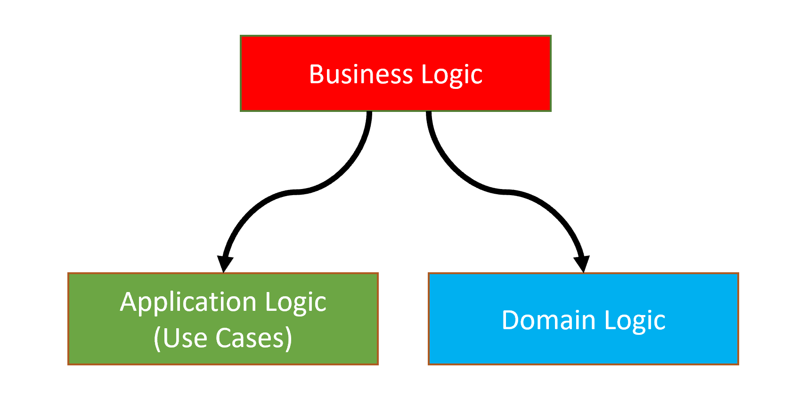

领域逻辑是系统的*核心领域规则*组成,而应用逻辑则满足特定的*用例*.

虽然定义很明确,但是实施起来却并不容易.你可能无法确定哪些代码应该属于领域层,哪些代码应该属于应用层,本节会尝试解释差异.

### 多应用层

当你的系统很大时,DDD有助于**处理复杂问题**.尤其是,**单个领域**需要多个**应用程序运行**,那么**领域逻辑与应用逻辑分离**就变的非常重要.

假设你正在构建一个具有多个应用程序的系统:

* 一个**公开的应用网站**,使用ASP.NET Core MVC构建,展示商品给来访者.这样的网站不需要身份验证即可查看商品.来访者只有执行了某些操作(例如,将商品添加到购物车)后,才需要登录网站.
* 一个**后台管理系统**,UI使用Angular,通过REST API请求数据.内部员工使用这个系统来维护数据(例如,编辑商品说明).
* 一个**移动端应用程序**,它比公开的网站UI上更加简洁.它通过REST API或其它技术(例如,TCP sockets)请求数据.

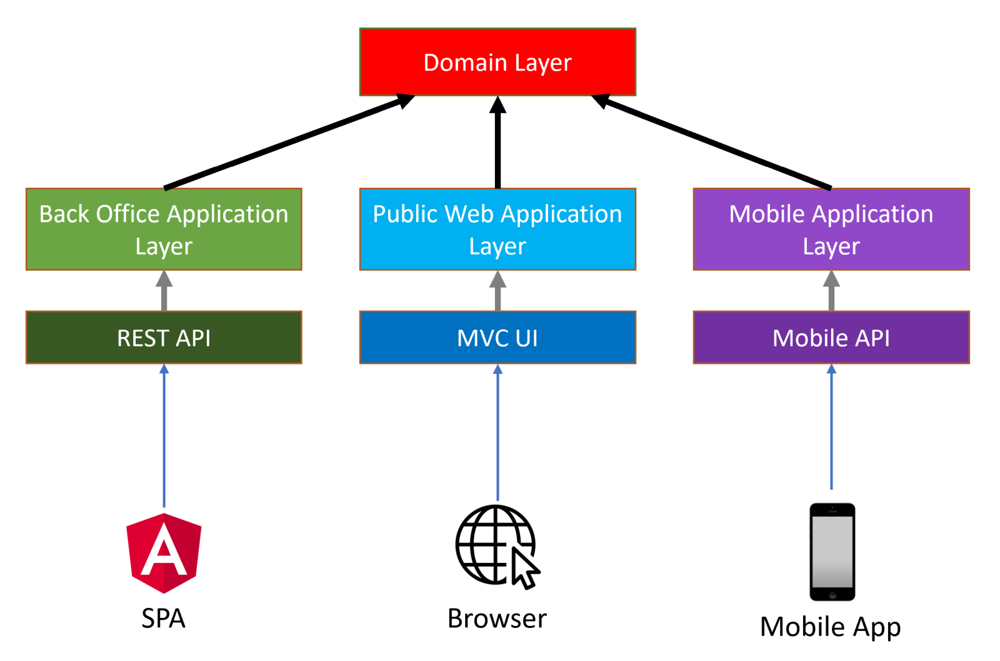

每个应用程序都有不同的**需求**,不同的**用例**(应用服务方法),不同的DTO,不同的**验证**和**授权**规则等.

将所有这些逻辑都集中到一个应用层中,会使你的服务包含太多的`if`条件分支及**复杂的业务逻辑**,从而使你的代码开发,**维护**,测试,引发各种问题.

如果你在一个领域中有多个应用程序

- 为每种应用程序或客户端创建独立的应用层,并在这些单独层中执行特定于应用业务逻辑.
- 使用共享的核心领域逻辑

为了实现这样的设计,首先我们需要区分领域逻辑和应用逻辑.

为了更清楚的实现,你可以为不同的应用类型创建不同的项目(`.csproj`):

* `IssueTracker.Admin.Application` 和 `IssueTracker.Admin.Application.Contracts` 为后台管理系统提供服务.
* `IssueTracker.Public.Application` 和 `IssueTracker.Public.Application.Contracts` 为公开网站提供服务.
* `IssueTracker.Mobile.Application` 和 `IssueTracker.Mobile.Application.Contracts` 为移动端应用提供服务.

### 示例

本节包含一些应用服务及领域服务的示例,讨论业务逻辑应该放置在哪一层

**示例:在领域服务中创建`Organization`**

````csharp
public class OrganizationManager : DomainService
{
    private readonly IRepository<Organization> _organizationRepository;
    private readonly ICurrentUser _currentUser;
    private readonly IAuthorizationService _authorizationService;
    private readonly IEmailSender _emailSender;

    public OrganizationManager(
        IRepository<Organization> organizationRepository, 
        ICurrentUser currentUser, 
        IAuthorizationService authorizationService, 
        IEmailSender emailSender)
    {
        _organizationRepository = organizationRepository;
        _currentUser = currentUser;
        _authorizationService = authorizationService;
        _emailSender = emailSender;
    }

    public async Task<Organization> CreateAsync(string name)
    {
        if (await _organizationRepository.AnyAsync(x => x.Name == name))
        {
            throw new BusinessException("IssueTracking:DuplicateOrganizationName");
        }

        await _authorizationService.CheckAsync("OrganizationCreationPermission");

        Logger.LogDebug($"Creating organization {name} by {_currentUser.UserName}");

        var organization = new Organization();

        await _emailSender.SendAsync(
            "systemadmin@issuetracking.com",
            "New Organization",
            "A new organization created with name: " + name
        );

        return organization;
    }
}
````

我们来逐个检查`CreateAsync`方法中的代码,讨论是否应该在领域服务中

* **正确**:首先检查有**无重复的组织名称**,并抛出异常.这与核心领域规则有关,因为我们绝对不允许重复的名称.
* **错误**:领域服务不应该执行**授权检查**,[授权](Authorization.md)应该在应用层处理. 
* **错误**:它记录了日志,包括[当前用户](CurrentUser.md)的`UserName`.领域服务不应该依赖当前用户,即便系统中没有用户,领域服务也应可用.当前用户应该是与展现层或应用层有关的概念.
* **错误**:它发送了有关新组织被创建的[邮件](Emailing.md),我们认为这也是特定用例的业务逻辑,你可能像在不同的用例中创建不同的邮件,又或者某些情况无需发送邮件.

**示例:应用服务中创建`Organization`**

````csharp
public class OrganizationAppService : ApplicationService
{
    private readonly OrganizationManager _organizationManager;
    private readonly IPaymentService _paymentService;
    private readonly IEmailSender _emailSender;

    public OrganizationAppService(
        OrganizationManager organizationManager,
        IPaymentService paymentService, 
        IEmailSender emailSender)
    {
        _organizationManager = organizationManager;
        _paymentService = paymentService;
        _emailSender = emailSender;
    }

    [UnitOfWork]
    [Authorize("OrganizationCreationPermission")]
    public async Task<Organization> CreateAsync(CreateOrganizationDto input)
    {
        await _paymentService.ChargeAsync(
            CurrentUser.Id,
            GetOrganizationPrice()
        );

        var organization = await _organizationManager.CreateAsync(input.Name);
        
        await _organizationManager.InsertAsync(organization);

        await _emailSender.SendAsync(
            "systemadmin@issuetracking.com",
            "New Organization",
            "A new organization created with name: " + input.Name
        );

        return organization; // !!!
    }

    private double GetOrganizationPrice()
    {
        return 42; //Gets from somewhere else...
    }
}
````

我们来逐个检查`CreateAsync`方法中的代码,讨论是否应该在应用服务中

* **正确**:应用服务的方法应该是一个工作单元(事务).ABP的[工作单元](Unit-Of-Work.md)系统可以使得此工作自动进行(甚至无需`[UnitOfWork]`注解).
* **正确**: [授权](Authorization.md)应该在应用层处理.这里通过使用`[Authorize]`来完成.
* **正确**:调用付款(基础设施服务)为此操作收取费用(创建组织是我们业务中的付费服务).
* **正确**:应用服务负责将变更的数据保存到数据库.
* **正确**:我们可以将[邮件](Emailing.md)作为通知发送给管理员.
* **错误**:请勿从应用服务中返回实体,应该返回DTO.

**讨论:为什么不将支付逻辑移到领域服务中?**

你可能想知道为什么付款逻辑代码不在`OrganizationManager`中.付款是非常**重要的事情**,我们不能**遗漏任何一次付款**.

它确实非常重要,但是,它不能放到领域服务中.我们可能还有**其它用例**来创建组织但不收取任何费用.例如:

* 管理员可以在后台管理系统创建新组织,而无需支付任何费用.
* 后台作业系统导入,集成,同步组织而无需支付费用.

如你所见,**付款不是创建有效组织的必要操作**.它是特定的应用服务逻辑.

**示例:CRUD操作**

````csharp
public class IssueAppService
{
    private readonly IssueManager _issueManager;

    public IssueAppService(IssueManager issueManager)
    {
        _issueManager = issueManager;
    }

    public async Task<IssueDto> GetAsync(Guid id)
    {
        return await _issueManager.GetAsync(id);
    }

    public async Task CreateAsync(IssueCreationDto input)
    {
        await _issueManager.CreateAsync(input);
    }

    public async Task UpdateAsync(UpdateIssueDto input)
    {
        await _issueManager.UpdateAsync(input);
    }

    public async Task DeleteAsync(Guid id)
    {
        await _issueManager.DeleteAsync(id);
    }
}
````

该应用服务本身**不执行任何操作**,并将所有**操作转发给** *领域服务*.它甚至将DTO传递给`IssueManager`

* 如果没有**任何业务逻辑**,只有简单的**CRUD**操作,**请勿**创建领域服务.
* **切勿**将**DTO**传递给领域服务,或从领域服务返回**DTO**.

可以在应用服务中直接注入仓储,实现查询,创建,更新及删除操作.除非在这些操作过程中需要执行某些业务逻辑,在这种情况下,请创建领域服务.

> 不要创建"将来可能需要"这种CRUD领域服务方法([YAGNI](https://en.wikipedia.org/wiki/You_aren%27t_gonna_need_it)),在需要时重构它并重构现有代码. 由于应用层优雅地抽象了领域层,因此重构过程不会影响UI层和其他客户端.

## 相关书籍

如果你对领域驱动设计和构建大型系统有兴趣,建议将以下书籍作为参考书籍:

* "*Domain Driven Design*" by Eric Evans
* "*Implementing Domain Driven Design*" by Vaughn Vernon
* "*Clean Architecture*" by Robert C. Martin
