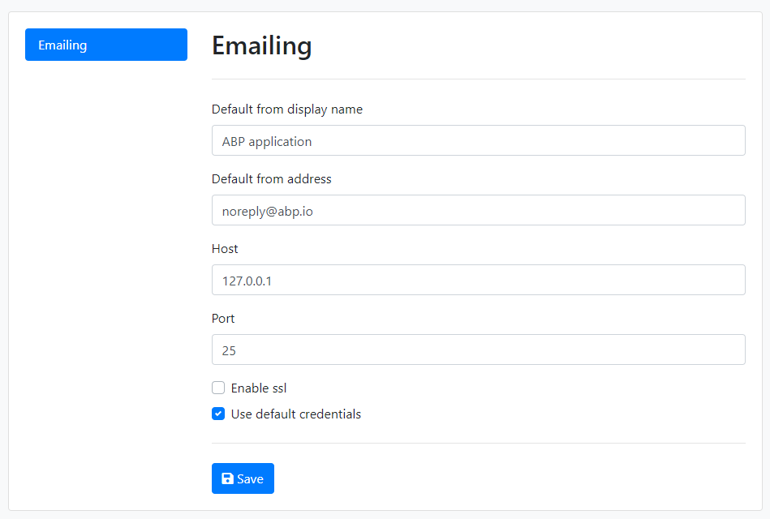

# 邮件发送系统

ABP 框架为发送电子邮件提供各种服务、设置和集成;

* 提供用于发送电子邮件的`IEmailSender`服务.
* 定义 [settings](Settings.md)来配置电子邮件发送.
* 集成到[后台作业系统](Background-Jobs.md)以通过后台作业发送电子邮件.
* 提供[MailKit 集成](MailKit.md)包.

## 安装

> 如果您使用的是[应用程序启动模板](Startup-Templates/Application.md)，则该软件包已安装。
> 
建议使用 [ABP CLI](CLI.md) 安装此包。在项目文件夹（.csproj 文件）中打开命令行窗口并键入以下命令：

````bash
abp add-package Volo.Abp.Emailing
````
如果你还没有做到这一点，您首先需要安装 ABP CLI。有关其他安装选项，请参阅 [包描述页面](https://abp.io/package-detail/Volo.Abp.Emailing)。

## 发送电子邮件

### IEmailSender

[Inject](Dependency-Injection.md) 将 `IEmailSender` 注入任何服务并使用 `SendAsync` 方法发送电子邮件。
**Example**

````csharp
using System.Threading.Tasks;
using Volo.Abp.DependencyInjection;
using Volo.Abp.Emailing;

namespace MyProject
{
    public class MyService : ITransientDependency
    {
        private readonly IEmailSender _emailSender;

        public MyService(IEmailSender emailSender)
        {
            _emailSender = emailSender;
        }

        public async Task DoItAsync()
        {
            await _emailSender.SendAsync(
                "target@domain.com",     // target email address
                "Email subject",         // subject
                "This is email body..."  // email body
            );
        }
    }
}
````

`SendAsync` 方法具有重载以提供更多参数，例如；

* **from**:您可以将其设置为设置发件人电子邮件地址。如果未提供，则使用默认发件人地址（请参阅下面的电子邮件设置）
* **isBodyHtml**: 表示邮件正文是否可以包含HTML标签。**默认：true**。

> `IEmailSender` 是建议的发送邮件的方式，因为它使你的代码提供者独立。

#### 邮件消息

除了原始参数之外，您还可以传递一个**标准的 `MailMessage` 对象**（[参见](https://docs.microsoft.com/en-us/dotnet/api/system.net.mail.mailmessage) ) 到 `SendAsync` 方法以设置更多选项，例如添加附件。

### ISmtpEmailSender

默认情况下，发送电子邮件由标准的 `SmtpClient` 类（[参见](https://docs.microsoft.com/en-us/dotnet/api/system.net.mail.smtpclient)）实现。实现类是`SmtpEmailSender`。此类还公开了 `ISmtpEmailSender` 服务（除了 `IEmailSender`）。

大多数时候你想直接使用`IEmailSender`来让你的代码提供者独立。但是，如果要创建具有相同电子邮件设置的 `SmtpClient` 对象，可以注入 `ISmtpEmailSender` 并使用其 `BuildClientAsync` 方法获取 `SmtpClient` 对象并自己发送电子邮件。

## 发送邮件任务队列/后台作业

`IEmailSender`有一个`QueueAsync`方法，可以用来将邮件添加到后台作业队列中，在后台线程中发送。通过这种方式，你不会因为等待发送邮件而占用用户的时间。`QueueAsync`方法得到的参数与`SendAsync`方法相同。

发送邮件任务队列可以容忍错误，因为后台作业系统具有重试机制来克服临时网络/服务器问题。

有关后台作业系统的更多信息，请参阅[后台作业文档](Background-Jobs.md)。

## 电子邮件设置

电子邮件发送使用 [设置系统](Settings.md) 来定义设置并在运行时获取这些设置的值。 `Volo.Abp.Emailing.EmailSettingNames` 定义了设置名称的常量，如下所示：

* **Abp.Mailing.DefaultFromAddress**: 当您在发送电子邮件时未指定发件人时,用作发件人的电子邮件地址（就像上面的示例一样）.
* **Abp.Mailing.DefaultFromDisplayName**: 当您在发送电子邮件时未指定发件人时,用作发件人的显示名称（就像在上面的示例中一样）.
* **Abp.Mailing.Smtp.Host**: SMTP 服务器的 IP/域（默认值：127.0.0.1）。
* **Abp.Mailing.Smtp.Port**: SMTP 服务器的端口（默认值：25）.
* **Abp.Mailing.Smtp.UserName**: 用户名，如果 SMTP 服务器需要身份验证需要。
* **Abp.Mailing.Smtp.Password**: 密码，如果 SMTP 服务器需要身份验证需要。 **此值已加密**（请参阅下面的部分）.
* **Abp.Mailing.Smtp.Domain**:  账号域，如果 SMTP 服务器需要身份验证需要.
* **Abp.Mailing.Smtp.EnableSsl**: 指示 SMTP 服务器是否使用 SSL 的值（“true”或“false”。默认值：“false”）.
* **Abp.Mailing.Smtp.UseDefaultCredentials**:如果为 true，则使用默认凭据,而不是提供的用户名和密码（“true”或“false”。默认值：“true”）。.

可以从[设置管理](Modules/Setting-Management.md)模块的*设置页面*管理电子邮件设置：



>如果您已从 ABP 启动模板创建解决方案，则已安装设置管理模块。

如果您不使用设置管理模块，您可以简单地在 `appsettings.json` 文件中定义设置：

````json
"Settings": {
  "Abp.Mailing.Smtp.Host": "127.0.0.1",
  "Abp.Mailing.Smtp.Port": "25",
  "Abp.Mailing.Smtp.UserName": "",
  "Abp.Mailing.Smtp.Password": "",
  "Abp.Mailing.Smtp.Domain": "",
  "Abp.Mailing.Smtp.EnableSsl": "false",
  "Abp.Mailing.Smtp.UseDefaultCredentials": "true",
  "Abp.Mailing.DefaultFromAddress": "noreply@abp.io",
  "Abp.Mailing.DefaultFromDisplayName": "ABP application"
}
````

You can set/change these settings programmatically using the `ISettingManager` and store values in a database. See the [setting system document](Settings.md) to understand the setting system better.
您可以使用 `ISettingManager` 以编程方式设置/更改这些设置，并将值存储在数据库中。请参阅 [设置系统文档](Settings.md)更好地了解设置系统。

### 加密 SMTP 密码

*Abp.Mailing.Smtp.Password* 必须是一个**加密**值。如果您使用 `ISettingManager` 设置密码，您不必担心。它在内部加密 set 上的值并在 get 上解密。

如果使用 `appsettings.json` 存储密码，则应手动注入 `ISettingEncryptionService` 并使用其 `Encrypt` 方法获取加密值。这可以通过在您的应用程序中创建一个简单的代码来完成。然后你可以删除代码。更好的是，您可以在应用程序中创建一个 UI 来配置电子邮件设置。在这种情况下，您可以直接使用 `ISettingManager` 而不用担心加密。

### ISmtpEmailSenderConfiguration

如果您不想使用设置系统来存储电子邮件发送配置，您可以将 `ISmtpEmailSenderConfiguration` 服务替换为您自己的实现，以从任何其他来源获取配置。 `ISmtpEmailSenderConfiguration` 默认由 `SmtpEmailSenderConfiguration` 实现，如上所述，它从设置系统中获取配置。

## 文本模板集成

ABP 框架提供了一个强大而灵活的[文本模板系统](Text-Templating.md)。您可以使用文本模板系统来创建动态电子邮件内容。注入 `ITemplateRenderer` 并使用 `RenderAsync` 渲染模板。然后将结果用作电子邮件正文。

虽然您可以定义和使用自己的文本模板，但电子邮件发送系统提供了两个简单的内置文本模板。

**示例：使用标准和简单的消息模板发送电子邮件**

````csharp
using System.Threading.Tasks;
using Volo.Abp.DependencyInjection;
using Volo.Abp.Emailing;
using Volo.Abp.Emailing.Templates;
using Volo.Abp.TextTemplating;

namespace Acme.BookStore.Web
{
    public class MyService : ITransientDependency
    {
        private readonly IEmailSender _emailSender;
        private readonly ITemplateRenderer _templateRenderer;

        public MyService(
        IEmailSender emailSender,
        ITemplateRenderer templateRenderer)
        {
            _emailSender = emailSender;
            _templateRenderer = templateRenderer;
        }

        public async Task DoItAsync()
        {
            var body = await _templateRenderer.RenderAsync(
                StandardEmailTemplates.Message,
                new
                {
                    message = "This is email body..."
                }
            );
            
            await _emailSender.SendAsync(
                "target-address@domain.com",
                "Email subject",
                body
            );
        }
    }
}
````

生成的电子邮件正文将如下所示：

````html
<!DOCTYPE html>
<html lang="en" xmlns="http://www.w3.org/1999/xhtml">
<head>
    <meta charset="utf-8" />
</head>
<body>
    This is email body...
</body>
</html>
````

电子邮件系统定义了具有给定名称的内置文本模板：

"**Abp.StandardEmailTemplates.Message**" 是最简单的带有文本消息的模板：

````html

````

此模板使用“Abp.StandardEmailTemplates.Layout”作为其布局.

"**Abp.StandardEmailTemplates.Layout**" 是一个提供 HTML 文档布局的简单模板：

````html
<!DOCTYPE html>
<html lang="en" xmlns="http://www.w3.org/1999/xhtml">
<head>
    <meta charset="utf-8" />
</head>
<body>
    
</body>
</html>
````

最终呈现的消息如上所示。

> 这些模板名称是在 `Volo.Abp.Emailing.Templates.StandardEmailTemplates` 类中定义的。

### 覆盖/替换标准模板

You typically want to replace the standard templates with your own ones, so you can prepare a branded email messages. To do that, you can use the power of the [virtual file system](Virtual-File-System.md) (VFS) or replace them in your own template definition provider.
您希望用自己的模板替换标准模板，这样您就可以准备电子邮件模板文件。您可以使用 [虚拟文件系统](Virtual-File-System.md) (VFS),或在您自己的模板定义提供程序中替换它们。

虚拟文件系统中模板的路径如下图所示：

* `/Volo/Abp/Emailing/Templates/Layout.tpl`
* `/Volo/Abp/Emailing/Templates/Message.tpl`

如果您将文件添加到虚拟文件系统中的相同位置，您的文件将覆盖它们。

模板是内联本地化的，这意味着您可以利用 [本地化系统](Localization.md) 的强大功能使您的模板具有多元文化。

详见[文本模板系统](Text-Templating.md) 文档。

> 请注意，您可以为应用程序定义和使用自己的模板，而不是使用标准的简单模板。这些标准模板主要用于可重用的模块，它们不定义自己的模板，而是依赖内置的模板。只需覆盖标准的电子邮件布局模板，就可以轻松自定义使用的模块发送的电子邮件。

## NullEmailSender

`NullEmailSender` 是实现 `IEmailSender` 的内置类，但将电子邮件内容写入 [标准日志系统](Logging.md)，而不是实际发送电子邮件。

这个类特别有用，尤其是在您开发是不想发送真实电子邮件。 [应用启动模板](Startup-Templates/Application.md)已经在**DEBUG模式**中使用了这个类，在领域层配置如下：

````csharp
#if DEBUG
  context.Services.Replace(ServiceDescriptor.Singleton<IEmailSender, NullEmailSender>());
#endif
````

So, don't confuse if you don't receive emails on DEBUG mode. Emails will be sent as expected on production (RELEASE mode). Remove these lines if you want to send real emails on DEBUG too.
因此，如果您在 DEBUG 模式下没有收到电子邮件，请不要紧张。电子邮件将在生产时按预期发送（RELEASE 模式）。如果您也想在 DEBUG 上发送真实电子邮件，请删除这些行。

## 其他

* [用于发送电子邮件的MailKit集成](MailKit.md)
