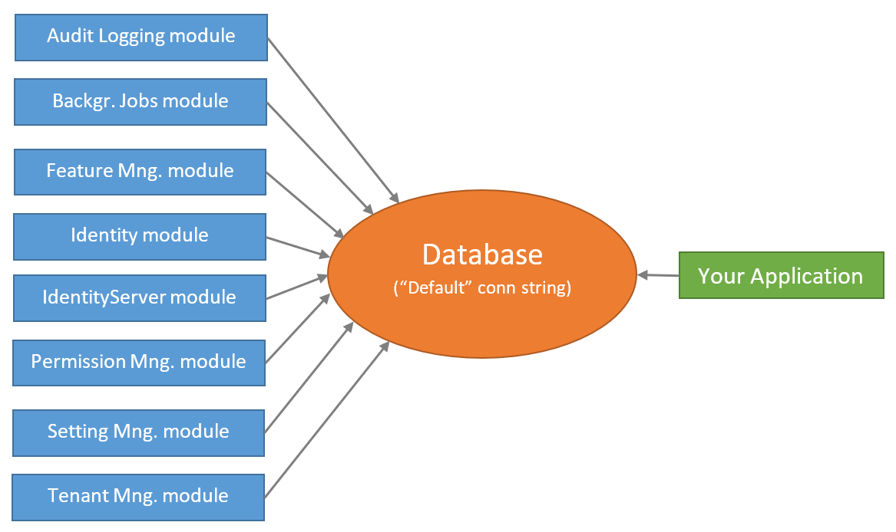


# EF核心高级数据库迁移

本文首先介绍[应用程序启动模板](Startup-Templates/Application.md)提供的**默认结构**,并讨论您可能希望为自己的应用程序实现的**各种场景**.

> 本文档适用于希望完全理解和自定义[应用程序启动模板](Startup-Templates/Application.md)附带的数据库结构的人员. 如果你只是想创建实体和管理代码优先(code first)迁移,只需要遵循[启动教程](Tutorials/Index.md).

## 关于EF Core 代码优先迁移

Entity Framework Core 提供了一种简单强大[数据库迁移系统](https://docs.microsoft.com/zh-cn/ef/core/managing-schemas/migrations/). ABP框架[启动模板](Startup-Templates/Index.md)使用这个系统,让你以标准的方式开发你的应用程序.

但是EF Core迁移系统在[模块化环境中不是很好],在模块化环境中,每个模块都维护**自己的数据库架构**,而实际上两个或多个模块可以**共享一个数据库**.

由于ABP框架在所有方面都关心模块化,所以它为这个问题提供了**解决方案**. 如果你需要**自定义数据库结构**,那么应当了解这个解决方案.

> 参阅[EF Core文档](https://docs.microsoft.com/en-us/ef/core/managing-schemas/migrations/)充分了解EF Core Code First迁移,以及为什么需要这样的系统.

## 默认解决方案与数据库配置

当你[创建一个新的Web应用程序](https://abp.io/get-started)(使用EF Core,它是默认的数据库提供程序),你的解决方案结构类似下图:


> 实际的解决方案结构可能会根据你的偏好有所不同,但是数据库部分是相同的.

### 数据库架构

启动模板已预安装了一些[应用程序模块](Modules/Index.md). 解决方案的每一层都有相应的模块包引用. 所以 `.EntityFrameworkCore` 项目含有使用 `EntityFrameworkCore` 模块的Nuget的引用:


通过这种方式,你可以看到所有的`.EntityFrameworkCore`项目下的EF Core的依赖.

> 除了模块引用之外,它还引用了 `Volo.Abp.EntityFrameworkCore.SqlServer` 包,因为启动模板预配置的是Sql Server. 参阅文档了解如何[切换到其它DBMS](Entity-Framework-Core-Other-DBMS.md).

虽然每个模块在设计上有自己的`DbContext`类,并且可以使用其自己的**物理数据库**,但解决方案的配置是使用**单个共享数据库**如下图所示:



这是**最简单的配置**,适用于大部分的应用程序.  `appsettings.json` 文件有名为`Default`**单个连接字符串**:

````json
"ConnectionStrings": {
  "Default": "..."
}
````

所以你有一个**单一的数据库模式**,其中包含**共享**此数据库的模块的所有表.

ABP框架的[连接字符串](Connection-Strings.md)系统允许你轻松为所需的模块**设置不同的连接字符串**:

````json
"ConnectionStrings": {
  "Default": "...",
  "AbpAuditLogging": "..."
}
````

示例配置告诉ABP框架[审计日志模块](Modules/Audit-Logging.md)应使用第二个连接字符串.

然而这仅仅只是开始. 你还需要创建第二个数据库以及里面审计日志表并使用code frist的方法维护数据库表. 本文档的主要目的之一就是指导你了解这样的数据库分离场景.

#### 模块表

每个模块都使用自己的数据库表. 例如[身份模块](Modules/Identity.md)有一些表来管理系统中的用户和角色.

#### 表前缀

由于所有模块都允许共享一个数据库(这是默认配置),所以模块通常使用前缀来对自己的表进行分组.

基础模块(如[身份](Modules/Identity.md), [租户管理](Modules/Tenant-Management.md) 和 [审计日志](Modules/Audit-Logging.md))使用 `Abp` 前缀, 其他的模块使用自己的前缀. 如[Identity Server](Modules/IdentityServer.md) 模块使用前缀 `IdentityServer`.

如果你愿意,你可以为你的应用程序的模块更改数据库表前缀.
例:

````csharp
Volo.Abp.IdentityServer.AbpIdentityServerDbProperties.DbTablePrefix = "Ids";
````

这段代码更改了[Identity Server](Modules/IdentityServer.md)的前缀. 在应用程序的最开始编写这段代码.

> 每个模块还定义了 `DbSchema` 属性,你可以在支持schema的数据库中使用它.

### 项目

从数据库的角度来看.有三个重要的项目将在下一节中解释.

#### .EntityFrameworkCore 项目

这个项目有应用程序的 `DbContext`类(本例中的 `BookStoreDbContex` ).

每个模块都使用自己的 `DbContext` 类来访问数据库。同样你的应用程序有它自己的 `DbContext`. 通常在应用程序中使用这个 `DbContet`(如果你遵循最佳实践,应该在自定义[仓储](Repositories.md)中使用). 它几乎是一个空的 `DbContext`,因为你的应用程序在一开始没有任何实体,除了预定义的 `AppUser` 实体:

````csharp
[ConnectionStringName("Default")]
public class BookStoreDbContext : AbpDbContext<BookStoreDbContext>
{
    public DbSet<AppUser> Users { get; set; }

    /* Add DbSet properties for your Aggregate Roots / Entities here. */

    public BookStoreDbContext(DbContextOptions<BookStoreDbContext> options)
        : base(options)
    {

    }

    protected override void OnModelCreating(ModelBuilder builder)
    {
        base.OnModelCreating(builder);

        /* Configure the shared tables (with included modules) here */

        builder.Entity<AppUser>(b =>
        {
            //Sharing the same table "AbpUsers" with the IdentityUser
            b.ToTable("AbpUsers");

            //Configure base properties
            b.ConfigureByConvention();
            b.ConfigureAbpUser();

            //Moved customization of the "AbpUsers" table to an extension method
            b.ConfigureCustomUserProperties();
        });

        /* Configure your own tables/entities inside the ConfigureBookStore method */
        builder.ConfigureBookStore();
    }
}
````

这个简单的 `DbContext` 类仍然需要一些解释:

* 它定义了一个 `[connectionStringName]` Attribute,它告诉ABP始终为此 `Dbcontext` 使用 `Default` 连接字符串.
* 它从 `AbpDbContext<T>` 而不是标准的 `DbContext` 类继承. 你可以参阅[EF Core集成](Entity-Framework-Core.md)文档了解更多. 现在你需要知道 `AbpDbContext<T>` 基类实现ABP框架的一些约定,为你自动化一些常见的任务.
* 它为 `AppUser` 实体定义了 `DbSet` 属性. `AppUser` 与[身份模块]的 `IdentityUser` 实体共享同一个表(默认名为 `AbpUsers`). 启动模板在应用程序中提供这个实体,因为我们认为用户实体一般需要应用程序中进行定制.
* 构造函数接受一个 `DbContextOptions<T>` 实例.
* 它覆盖了 `OnModelCreating` 方法定义EF Core 映射.
  * 首先调用 `base.OnModelCreating` 方法让ABP框架为我们实现基础映射.
  * 然后它配置了 `AppUser` 实体的映射. 这个实体有一个特殊的情况(它与Identity模块共享一个表),在下一节中进行解释.
  * 最后它调用 `builder.ConfigureBookStore()` 扩展方法来配置应用程序的其他实体.

在介绍其他数据库相关项目之后,将更详细地说明这个设计.

#### .EntityFrameworkCore.DbMigrations 项目

正如前面所提到的,每个模块(和你的应用程序)有**它们自己**独立的 `DbContext` 类. 每个 `DbContext` 类只定义了自身模块的实体到表的映射,每个模块(包括你的应用程序)在**运行时**都使用相关的 `DbContext` 类.

如你所知,EF Core Code First迁移系统依赖于 `DbContext` 类来跟踪和生成Code First迁移.  那么我们应该使用哪个 `DbContext` 进行迁移? 答案是它们都不是. `.EntityFrameworkCore.DbMigrations` 项目中定义了另一个 `DbContext` (示例解决方案中的 `BookStoreMigrationsDbContext`).

##### MigrationsDbContext

`MigrationsDbContext` 仅用于创建和应用数据库迁移. **不在运行时使用**. 它将所有使用的模块的所有实体到表的映射以及应用程序的映射**合并**.

通过这种方式你可以创建和维护**单个数据库迁移路径**. 然而这种方法有一些困难,接下来的章节将解释ABP框架如何克服这些困难. 首先以 `BookStoreMigrationsDbContext` 类为例:

````csharp
/* This DbContext is only used for database migrations.
 * It is not used on runtime. See BookStoreDbContext for the runtime DbContext.
 * It is a unified model that includes configuration for
 * all used modules and your application.
 */
public class BookStoreMigrationsDbContext : AbpDbContext<BookStoreMigrationsDbContext>
{
    public BookStoreMigrationsDbContext(
        DbContextOptions<BookStoreMigrationsDbContext> options)
        : base(options)
    {

    }

    protected override void OnModelCreating(ModelBuilder builder)
    {
        base.OnModelCreating(builder);

        /* Include modules to your migration db context */
        builder.ConfigurePermissionManagement();
        builder.ConfigureSettingManagement();
        builder.ConfigureBackgroundJobs();
        builder.ConfigureAuditLogging();
        builder.ConfigureIdentity();
        builder.ConfigureIdentityServer();
        builder.ConfigureFeatureManagement();
        builder.ConfigureTenantManagement();

        /* Configure customizations for entities from the modules included  */
        builder.Entity<IdentityUser>(b =>
        {
            b.ConfigureCustomUserProperties();
        });

        /* Configure your own tables/entities inside the ConfigureBookStore method */
        builder.ConfigureBookStore();
    }
}
````

##### 共享映射代码

第一个问题是: 一个模块使用自己的 `DbContext` 这就需要到数据库的映射. 该 `MigrationsDbContext` 也需要相同的映射创建此模块的数据库表. 我们绝对不希望复制的映射代码.

解决方案是定义一个扩展方法(在`ModelBuilder`)由两个 `DbContext` 类调用. 所以每个模块都定义了这样的扩展方法.

For example, the `builder.ConfigureBackgroundJobs()` method call configures the database tables for the [Background Jobs module](Modules/Background-Jobs.md). The definition of this extension method is something like that:

例如，`builder.ConfigureBackgroundJobs()` 方法调用[后台作业模块]配置数据库表. 扩展方法的定义如下:

````csharp
public static class BackgroundJobsDbContextModelCreatingExtensions
{
    public static void ConfigureBackgroundJobs(
        this ModelBuilder builder,
        Action<BackgroundJobsModelBuilderConfigurationOptions> optionsAction = null)
    {
        var options = new BackgroundJobsModelBuilderConfigurationOptions(
            BackgroundJobsDbProperties.DbTablePrefix,
            BackgroundJobsDbProperties.DbSchema
        );

        optionsAction?.Invoke(options);

        builder.Entity<BackgroundJobRecord>(b =>
        {
            b.ToTable(options.TablePrefix + "BackgroundJobs", options.Schema);

            b.ConfigureCreationTime();
            b.ConfigureExtraProperties();

            b.Property(x => x.JobName)
                .IsRequired()
                .HasMaxLength(BackgroundJobRecordConsts.MaxJobNameLength);

            //...
        });
    }
}
````

此扩展方法还获取选项用于更改此模块的数据库表前缀和模式,但在这里并不重要.

最终的应用程序在 `MigrationsDbContext` 类中调用扩展方法, 因此它可以确定此 `MigrationsDbContext` 维护的数据库中包含哪些模块. 如果要创建第二个数据库并将某些模块表移动到第二个数据库,则需要有第二个`MigrationsDbContext` 类,该类仅调用相关模块的扩展方法. 下一部分将详细介绍该主题.

同样 `ConfigureBackgroundJobs` 方法也被后台作业模块的 `DbContext` 调用:

````csharp
[ConnectionStringName(BackgroundJobsDbProperties.ConnectionStringName)]
public class BackgroundJobsDbContext
    : AbpDbContext<BackgroundJobsDbContext>, IBackgroundJobsDbContext
{
    public DbSet<BackgroundJobRecord> BackgroundJobs { get; set; }

    public BackgroundJobsDbContext(DbContextOptions<BackgroundJobsDbContext> options) 
        : base(options)
    {

    }

    protected override void OnModelCreating(ModelBuilder builder)
    {
        base.OnModelCreating(builder);

        //Reuse the same extension method!
        builder.ConfigureBackgroundJobs();
    }
}
````

以这种方式,可以在 `DbContext` 类之间共享模块的映射配置.

##### 重用模块的表

您可能想在应用程序中重用依赖模块的表. 在这种情况下你有两个选择:

1. 你可以直接使用模块定义的实体.
2. 你可以创建一个新的实体映射到同一个数据库表。

###### 使用由模块定义的实体

使用实体定义的模块有标准用法非常简单. 例如身份模块定义了 `IdentityUser` 实体. 你可以为注入 `IdentityUser` 仓储,为此实体执行标准仓储操作.
例:

````csharp
using System;
using System.Threading.Tasks;
using Volo.Abp.DependencyInjection;
using Volo.Abp.Domain.Repositories;
using Volo.Abp.Identity;

namespace Acme.BookStore
{
    public class MyService : ITransientDependency
    {
        private readonly IRepository<IdentityUser, Guid> _identityUserRepository;

        public MyService(IRepository<IdentityUser, Guid> identityUserRepository)
        {
            _identityUserRepository = identityUserRepository;
        }

        public async Task DoItAsync()
        {
            //Get all users
            var users = await _identityUserRepository.GetListAsync();
        }
    }
}
````

示例注入了 `IRepository<IdentityUser,Guid>`(默认仓储). 它定义了标准的存储库方法并实现了 `IQueryable` 接口.

另外，身份模块定义了 `IIdentityUserRepository`(自定义仓储)， 你的应用程序也可以注入和使用它.  `IIdentityUserRepository` 为 `IdentityUser` 实体提供了额外的定制方法,但它没有实现 `IQueryable`.

###### 创建一个新的实体

TODO

##### 讨论另一种场景:每个模块管理自己的迁移路径

TODO