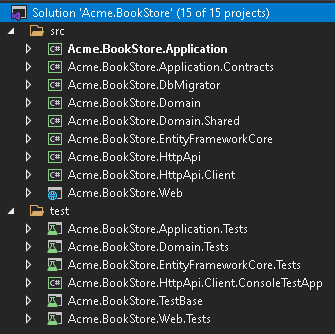
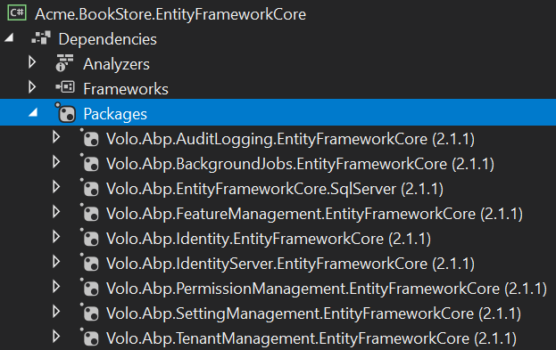
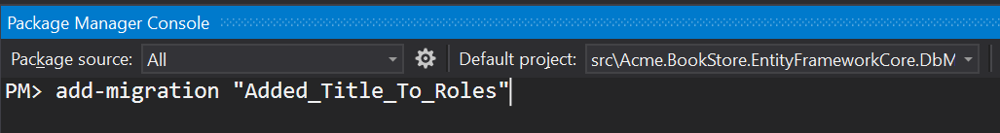
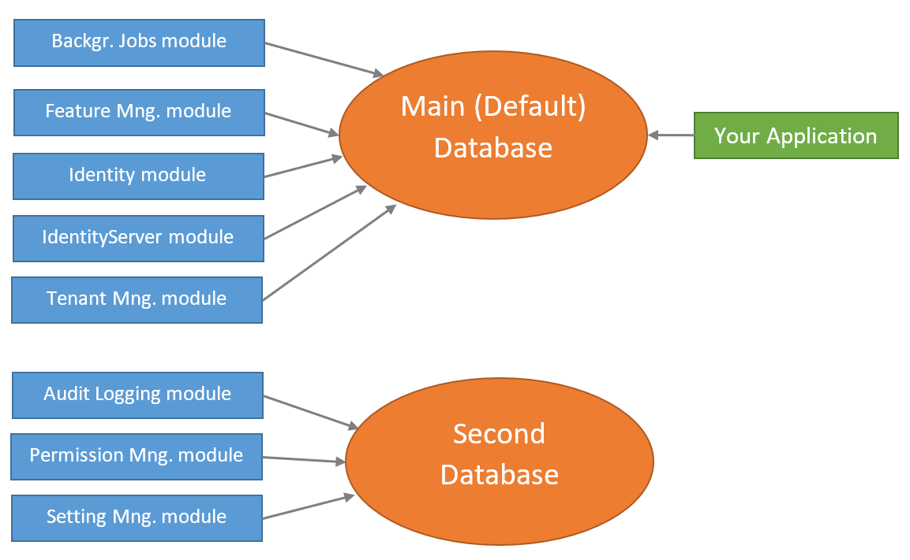
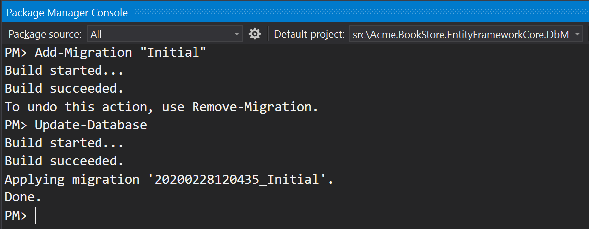
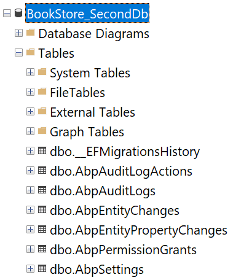

# EF Core数据库迁移

本文首先介绍[应用程序启动模板](Startup-Templates/Application.md)提供的**默认结构**,并讨论你可能希望为自己的应用程序实现的**各种场景**.

> 本文档适用于希望完全理解和自定义[应用程序启动模板](Startup-Templates/Application.md)附带的数据库结构的人员. 如果你只是想创建实体和管理代码优先(code first)迁移,只需要遵循[启动教程](Tutorials/Part-1.md).

### 源码

你可以在[这里](https://github.com/abpframework/abp-samples/tree/master/EfCoreMigrationDemo)找到本文引用的示例项目的源代码; 但是为了理解示例项目的源代码,你需要阅读和理解这个文档.

## 关于EF Core 代码优先迁移

Entity Framework Core 提供了一种简单强大[数据库迁移系统](https://docs.microsoft.com/zh-cn/ef/core/managing-schemas/migrations/). ABP框架[启动模板](Startup-Templates/Index.md)使用这个系统,让你以标准的方式开发你的应用程序.

但是EF Core迁移系统在**模块化环境中不是很好**,在模块化环境中,每个模块都维护**自己的数据库模式**,而实际上两个或多个模块可以**共享一个数据库**.

由于ABP框架在所有方面都关心模块化,所以它为这个问题提供了**解决方案**. 如果你需要**自定义数据库结构**,那么应当了解这个解决方案.

> 参阅[EF Core文档](https://docs.microsoft.com/en-us/ef/core/managing-schemas/migrations/)充分了解EF Core Code First迁移,以及为什么需要这样的系统.

## 默认解决方案与数据库配置

当你[创建一个新的Web应用程序](https://abp.io/get-started)(使用EF Core,它是默认的数据库提供程序),你的解决方案结构类似下图:



实际的解决方案结构可能会根据你的偏好有所不同,但是数据库部分是相同的.

> 本文档将使用 `Acme.BookStore` 示例项目名称来引用项目和类. 你需要在解决方案中找到相应的类/项目.

### 数据库模式

启动模板已预安装了一些[应用程序模块](Modules/Index.md). 解决方案的每一层都有相应的模块包引用. 所以 `.EntityFrameworkCore` 项目含有使用 `EntityFrameworkCore` 模块的Nuget的引用:



通过这种方式,你可以看到所有的 `.EntityFrameworkCore` 项目下的**EF Core的依赖**.

> 除了模块引用之外,它还引用了 `Volo.Abp.EntityFrameworkCore.SqlServer` 包,因为启动模板预配置的是Sql Server. 参阅文档了解如何[切换到其它DBMS](Entity-Framework-Core-Other-DBMS.md).

虽然每个模块在设计上有自己的 `DbContext` 类,并且可以使用其自己的**物理数据库**,但解决方案的配置是使用**单个共享数据库**如下图所示:


这是**最简单的配置**,适用于大部分的应用程序.  `appsettings.json` 文件有名为`Default`**单个连接字符串**:

````json
"ConnectionStrings": {
  "Default": "..."
}
````

所以你有一个**单一的数据库模式**,其中包含**共享**此数据库的模块的所有表.

ABP框架的[连接字符串](Connection-Strings.md)系统允许你轻松为所需的模块**设置不同的连接字符串**:

````json
"ConnectionStrings": {
  "Default": "...",
  "AbpAuditLogging": "..."
}
````

示例配置告诉ABP框架[审计日志模块](Modules/Audit-Logging.md)应使用第二个连接字符串.

**然而这仅仅只是开始**. 你还需要创建第二个数据库以及里面审计日志表并使用code frist迁移的方法维护数据库表. 本文档的主要目的之一就是指导你了解这样的数据库分离场景.

#### 模块表

每个模块都使用**自己的数据库表**. 例如[身份模块](Modules/Identity.md)有一些表来管理系统中的用户和角色.

##### 表前缀

由于所有模块都允许共享一个数据库(这是默认配置),所以模块通常使用**表前缀**来对自己的表进行分组.

基础模块(如[身份](Modules/Identity.md), [租户管理](Modules/Tenant-Management.md) 和 [审计日志](Modules/Audit-Logging.md))使用 `Abp` 前缀, 其他的模块使用自己的前缀. 如[Identity Server](Modules/IdentityServer.md) 模块使用前缀 `IdentityServer`.

如果你愿意,你可以为你的应用程序的模块**更改数据库表前缀**.
例:

````csharp
Volo.Abp.IdentityServer.AbpIdentityServerDbProperties.DbTablePrefix = "Ids";
````

这段代码更改了[Identity Server](Modules/IdentityServer.md)的前缀. 在应用程序的**最开始**编写这段代码.

> 每个模块还定义了 `DbSchema` 属性,你可以在支持schema的数据库中使用它.

### 项目

从数据库的角度来看.有三个重要的项目将在下一节中解释.

#### .EntityFrameworkCore 项目

这个项目有应用程序的 `DbContext`类(本例中的 `BookStoreDbContex` ).

**每个模块都使用自己的 `DbContext` 类**来访问数据库.同样你的应用程序有它自己的 `DbContext`. 通常在应用程序中使用这个 `DbContet`(如果你遵循最佳实践,应该在[仓储](Repositories.md)中使用). 它几乎是一个空的 `DbContext`,因为你的应用程序在一开始没有任何实体,除了预定义的 `AppUser` 实体:

````csharp
[ConnectionStringName("Default")]
public class BookStoreDbContext : AbpDbContext<BookStoreDbContext>
{
    public DbSet<AppUser> Users { get; set; }

    /* Add DbSet properties for your Aggregate Roots / Entities here. */

    public BookStoreDbContext(DbContextOptions<BookStoreDbContext> options)
        : base(options)
    {

    }

    protected override void OnModelCreating(ModelBuilder builder)
    {
        base.OnModelCreating(builder);

        /* Configure the shared tables (with included modules) here */

        builder.Entity<AppUser>(b =>
        {
            //Sharing the same Users table with the IdentityUser
            b.ToTable(AbpIdentityDbProperties.DbTablePrefix + "Users");

            b.ConfigureByConvention();
            b.ConfigureAbpUser();

            /* Configure mappings for your additional properties
             * Also see the MyProjectNameEntityExtensions class
             */
        });

        /* Configure your own tables/entities inside the ConfigureBookStore method */
        builder.ConfigureBookStore();
    }
}
````

这个简单的 `DbContext` 类仍然需要一些解释:

* 它定义了一个 `[connectionStringName]` Attribute,它告诉ABP始终为此 `Dbcontext` 使用 `Default` 连接字符串.
* 它从 `AbpDbContext<T>` 而不是标准的 `DbContext` 类继承. 你可以参阅[EF Core集成](Entity-Framework-Core.md)文档了解更多. 现在你需要知道 `AbpDbContext<T>` 基类实现ABP框架的一些约定,为你自动化一些常见的任务.
* 它为 `AppUser` 实体定义了 `DbSet` 属性. `AppUser` 与[身份模块](Modules/Identity.md)的 `IdentityUser` 实体共享同一个表(默认名为 `AbpUsers`). 启动模板在应用程序中提供这个实体,因为我们认为用户实体一般需要应用程序中进行定制.
* 构造函数接受一个 `DbContextOptions<T>` 实例.
* 它覆盖了 `OnModelCreating` 方法定义EF Core 映射.
  * 首先调用 `base.OnModelCreating` 方法让ABP框架为我们实现基础映射.
  * 然后它配置了 `AppUser` 实体的映射. 这个实体有一个特殊的情况(它与Identity模块共享一个表),在下一节中进行解释.
  * 最后它调用 `builder.ConfigureBookStore()` 扩展方法来配置应用程序的其他实体.

在介绍其他数据库相关项目之后,将更详细地说明这个设计.

#### .EntityFrameworkCore.DbMigrations 项目

正如前面所提到的,每个模块(和你的应用程序)有**它们自己**独立的 `DbContext` 类. 每个 `DbContext` 类只定义了自身模块的实体到表的映射,每个模块(包括你的应用程序)在**运行时**都使用相关的 `DbContext` 类.

如你所知,EF Core Code First迁移系统依赖于 `DbContext` 类来跟踪和生成Code First迁移.  那么我们应该使用哪个 `DbContext` 进行迁移? 答案是它们都不是. `.EntityFrameworkCore.DbMigrations` 项目中定义了另一个 `DbContext` (示例解决方案中的 `BookStoreMigrationsDbContext`).

##### MigrationsDbContext

`MigrationsDbContext` 仅用于创建和应用数据库迁移. **不在运行时使用**. 它将所有使用的模块的所有实体到表的映射以及应用程序的映射**合并**.

通过这种方式你可以创建和维护**单个数据库迁移路径**. 然而这种方法有一些困难,接下来的章节将解释ABP框架如何克服这些困难. 首先以 `BookStoreMigrationsDbContext` 类为例:

````csharp
/* This DbContext is only used for database migrations.
 * It is not used on runtime. See BookStoreDbContext for the runtime DbContext.
 * It is a unified model that includes configuration for
 * all used modules and your application.
 */
public class BookStoreMigrationsDbContext : AbpDbContext<BookStoreMigrationsDbContext>
{
    public BookStoreMigrationsDbContext(
        DbContextOptions<BookStoreMigrationsDbContext> options)
        : base(options)
    {

    }

    protected override void OnModelCreating(ModelBuilder builder)
    {
        base.OnModelCreating(builder);

        /* Include modules to your migration db context */
        builder.ConfigurePermissionManagement();
        builder.ConfigureSettingManagement();
        builder.ConfigureBackgroundJobs();
        builder.ConfigureAuditLogging();
        builder.ConfigureIdentity();
        builder.ConfigureIdentityServer();
        builder.ConfigureFeatureManagement();
        builder.ConfigureTenantManagement();

        /* Configure your own tables/entities inside the ConfigureBookStore method */
        builder.ConfigureBookStore();
    }
}
````

##### 共享映射代码

第一个问题是: 一个模块使用自己的 `DbContext` 这就需要到数据库的映射. 该 `MigrationsDbContext` 也需要相同的映射创建此模块的数据库表. 我们绝对**不希望复制**的映射代码.

解决方案是定义一个**扩展方法**(在`ModelBuilder`)由两个 `DbContext` 类调用. 所以每个模块都定义了这样的扩展方法.

例如 `builder.ConfigureBackgroundJobs()` 方法调用[后台作业模块](Modules/Background-Jobs.md)配置数据库表. 扩展方法的定义如下:

````csharp
public static class BackgroundJobsDbContextModelCreatingExtensions
{
    public static void ConfigureBackgroundJobs(
        this ModelBuilder builder,
        Action<BackgroundJobsModelBuilderConfigurationOptions> optionsAction = null)
    {
        var options = new BackgroundJobsModelBuilderConfigurationOptions(
            BackgroundJobsDbProperties.DbTablePrefix,
            BackgroundJobsDbProperties.DbSchema
        );

        optionsAction?.Invoke(options);

        builder.Entity<BackgroundJobRecord>(b =>
        {
            b.ToTable(options.TablePrefix + "BackgroundJobs", options.Schema);

            b.ConfigureCreationTime();
            b.ConfigureExtraProperties();

            b.Property(x => x.JobName)
                .IsRequired()
                .HasMaxLength(BackgroundJobRecordConsts.MaxJobNameLength);

            //...
        });
    }
}
````

此扩展方法还提供了选项用于更改此模块的数据库表前缀和模式,但在这里并不重要.

最终的应用程序在 `MigrationsDbContext` 类中调用扩展方法, 因此它可以确定此 `MigrationsDbContext` 维护的数据库中包含哪些模块. 如果要创建第二个数据库并将某些模块表移动到第二个数据库,则需要有第二个`MigrationsDbContext` 类,该类仅调用相关模块的扩展方法. 下一部分将详细介绍该主题.

同样 `ConfigureBackgroundJobs` 方法也被后台作业模块的 `DbContext` 调用:

````csharp
[ConnectionStringName(BackgroundJobsDbProperties.ConnectionStringName)]
public class BackgroundJobsDbContext
    : AbpDbContext<BackgroundJobsDbContext>, IBackgroundJobsDbContext
{
    public DbSet<BackgroundJobRecord> BackgroundJobs { get; set; }

    public BackgroundJobsDbContext(DbContextOptions<BackgroundJobsDbContext> options) 
        : base(options)
    {

    }

    protected override void OnModelCreating(ModelBuilder builder)
    {
        base.OnModelCreating(builder);

        //Reuse the same extension method!
        builder.ConfigureBackgroundJobs();
    }
}
````

通过这种方式,可以在 `DbContext` 类之间共享模块的映射配置. 上面的代码在相关的模块NuGet包中,所以你不需要关心它.

##### 重用模块的表

你可能想在应用程序中**重用依赖模块的表**. 在这种情况下你有两个选择:

1. 你可以**直接使用模块定义的实体**(你仍然可以在某种程度上[扩展实体](Customizing-Application-Modules-Extending-Entities.md)).
2. 你可以**创建一个新的实体**映射到同一个数据库表.

###### 使用由模块定义的实体

使用实体定义的模块有标准用法非常简单. 例如身份模块定义了 `IdentityUser` 实体. 你可以为注入 `IdentityUser` 仓储,为此实体执行标准仓储操作.
例:

````csharp
using System;
using System.Threading.Tasks;
using Volo.Abp.DependencyInjection;
using Volo.Abp.Domain.Repositories;
using Volo.Abp.Identity;

namespace Acme.BookStore
{
    public class MyService : ITransientDependency
    {
        private readonly IRepository<IdentityUser, Guid> _identityUserRepository;

        public MyService(IRepository<IdentityUser, Guid> identityUserRepository)
        {
            _identityUserRepository = identityUserRepository;
        }

        public async Task DoItAsync()
        {
            //Get all users
            var users = await _identityUserRepository.GetListAsync();
        }
    }
}
````

示例注入了 `IRepository<IdentityUser,Guid>`(默认仓储). 它定义了标准的存储库方法并实现了 `IQueryable` 接口.

另外,身份模块定义了 `IIdentityUserRepository`(自定义仓储),你的应用程序也可以注入和使用它. `IIdentityUserRepository` 为 `IdentityUser` 实体提供了额外的定制方法,但它没有实现 `IQueryable`.

###### 创建一个新的实体

如果你只是按原样使用实体,那么使用模块的实体是很容易的. 但是在下面的情况下你可能需要定义自己的实体并映射到模块实体相同的数据库表.

* 你想要**添加一个新的字段**到表中并将其映射到实体的属性. 你无法使用模块的实体,因为它没有相关的属性.
* 你想要**使用的表字段的一个子集**. 你不希望访问实体的所有属性并隐藏不相关的属性(从安全的角度或仅出于设计目的).
* 你不希望直接**依赖于**模块实体类.

无论哪一种情况,流程都是一样的. 假如你想要创建一个名为 `AppRole` 的实体,将其映射到与[身份模块](Modules/Identity.md)的 `IdentityRole` 实体相同的表

在这里我们将介绍实现方式, 然后**将讨论这种方法的局限性**.

首先,在你的 `.Domain` 项目一个新的 `AppRole` 类:

````csharp
using System;
using Volo.Abp.Domain.Entities;
using Volo.Abp.MultiTenancy;

namespace Acme.BookStore.Roles
{
    public class AppRole : AggregateRoot<Guid>, IMultiTenant
    {
        // Properties shared with the IdentityRole class

        public Guid? TenantId { get; private set; }
        public string Name { get; private set; }

        //Additional properties

        public string Title { get; set; }

        private AppRole()
        {

        }
    }
}
````

* 它继承了[`AggregateRoot<Guid>`类](Entities.md)和实现了[`IMultiTenant`]接口(Multi-Tenancy.md),因为 `IdentityRole` 也做了同样的继承.
* 你可以添加 `IdentityRole` 实体定义的任何属性. 本例只加了 `TenantId` 和 `Name` 属性,因为我们这里只需要它们. 你可以把setters设置为私有(如同本例)以防意外更改身份模块的属性.
* 你可以添加自定义(附加)属性. 本例添加了 `Title` 属性.
* **构造函数是私有的**,所以它不允许直接创建一个新的 `AppRole` 实体.创建角色身份模块的责任. 你可以查询角色,设置/更新自定义属性,但做为最佳实践你不应该在代码中创建和删除角色(尽管没有强制的限制).

现在是时候定义EF Core映射. 打开应用程序的 `DbContext` (此示例中是 `BookStoreDbContext` )添加以下属性:

````csharp
public DbSet<AppRole> Roles { get; set; }
````

然后在 `OnModelCreating` 方法中配置映射(调用 `base.OnModelCreating(builder)` 之后):

````csharp
protected override void OnModelCreating(ModelBuilder builder)
{
    base.OnModelCreating(builder);

    /* Configure the shared tables (with included modules) here */

    //CONFIGURE THE AppRole ENTITY
    builder.Entity<AppRole>(b =>
    {
        b.ToTable("AbpRoles");
        b.ConfigureByConvention();
        b.Property(x => x.Title).HasMaxLength(128);
    });

    ...

    /* Configure your own tables/entities inside the ConfigureBookStore method */

    builder.ConfigureBookStore();
}
````

我们添加了以下几行:

````csharp
builder.Entity<AppRole>(b =>
{
    b.ToTable("AbpRoles");
    b.ConfigureByConvention();
    b.Property(x => x.Title).HasMaxLength(128);
});
````

* 它映射到 `AbpRoles` 表,与 `IdentityRole` 实体共享.
* `ConfigureByConvention()` 配置了标准/基本属性(像`TenantId`),建议总是调用它.

你已经为你的 `DbContext` 配置自定义属性,该属性在应用程序运行时使用.
与其直接更改 `MigrationsDbContext`,我们应该使用ABP框架的实体扩展系统,在解决方案的 `.EntityFrameworkCore` 项目中找到 `YourProjectNameEntityExtensions` 类(本示例中是 `BookStoreEntityExtensions`)并且进行以下更改:

````csharp
public static class MyProjectNameEntityExtensions
{
    private static readonly OneTimeRunner OneTimeRunner = new OneTimeRunner();

    public static void Configure()
    {
        OneTimeRunner.Run(() =>
        {
            ObjectExtensionManager.Instance
                .MapEfCoreProperty<IdentityRole, string>(
                    "Title",
                    (entityBuilder, propertyBuilder) =>
                    {
                        propertyBuilder.HasMaxLength(128);
                    }
                );
        });
    }
}
````

> 我们建议使用 `nameof(AppRole.Title)` 而不是硬编码 "Title" 字符串

`ObjectExtensionManager` 用于添加属性到现有的实体. 由于 `ObjectExtensionManager.Instance` 是静态实例(单例),因此应调用一次. `OneTimeRunner` 是ABP框架定义简单的工具类.

参阅[EF Core集成文档](Entity-Framework-Core.md)了解更多关于实体扩展系统.

我们在两个类中都重复了类似的数据库映射代码,例如 `HasMaxLength(128)`.

现在你可以在包管理控制台(记得选择 `.EntityFrameworkCore.DbMigrations` 做为PMC的默认项目并将 `.Web` 项目设置为启动项目)使用标准的 `Add-Migration` 命令添加一个新的EF Core数据库迁移.



命令将创建一个新的Code First迁移类,如下所示:

````csharp
public partial class Added_Title_To_Roles : Migration
{
    protected override void Up(MigrationBuilder migrationBuilder)
    {
        migrationBuilder.AddColumn<string>(
            name: "Title",
            table: "AbpRoles",
            maxLength: 128,
            nullable: true);
    }

    protected override void Down(MigrationBuilder migrationBuilder)
    {
        migrationBuilder.DropColumn(
            name: "Title",
            table: "AbpRoles");
    }
}
````

全部完成,只运行在PMC运行`Update-Database` 命令或运行你解决方案中的`.DbMigrator` 项目应用数据库更改.

现在你可以像使用应用程序的其他实体一样使用 `AppRole` 实体. 下面是查询和更新角色的[应用服务](Application-Services.md).
示例:

````csharp
public class AppRoleAppService : ApplicationService, IAppRoleAppService
{
    private readonly IRepository<AppRole, Guid> _appRoleRepository;

    public AppRoleAppService(IRepository<AppRole, Guid> appRoleRepository)
    {
        _appRoleRepository = appRoleRepository;
    }

    public async Task<List<AppRoleDto>> GetListAsync()
    {
        var roles = await _appRoleRepository.GetListAsync();

        return roles
            .Select(r => new AppRoleDto
            {
                Id = r.Id,
                Name = r.Name,
                Title = r.Title
            })
            .ToList();
    }

    public async Task UpdateTitleAsync(Guid id, string title)
    {
        var role = await _appRoleRepository.GetAsync(id);

        role.Title = title;

        await _appRoleRepository.UpdateAsync(role);
    }
}
````

创建新实体并将其映射到依赖模块的表存在一些**限制**:

* 你的**自定义属性必须是可空的**. 例如 `AppRole.Title` 在这里是可空的. 否则身份模块会抛出异常,因为它在向数据库插入新角色时不知道如何如何填充标题.
* 好的做法是,你不应更新**模块定义的属性**,尤其是在需要业务逻辑的情况下. 通常你可以管理自己(自定义)的属性.

##### 替代方法

你可以使用以下方法替代创建实体添加自定义属性.

###### 使用ExtraProperties

所有从 `AggregateRoot` 派生的实体都可以在 `ExtraProperties` 属性(因为它们都实现了 `IHasExtraProperties` 接口)中存储键值对, 它是 `Dictionary<string, object>` 类型在数据库中被序列化为JSON. 所以你可以在字典中添加值用于查询,无需更改实体.

例如你可以将查询属性 `Title` 存储在 `IdentityRole` 中,而不是创建一个新的实体.
例:

````csharp
public class IdentityRoleExtendingService : ITransientDependency
{
    private readonly IIdentityRoleRepository _identityRoleRepository;

    public IdentityRoleExtendingService(IIdentityRoleRepository identityRoleRepository)
    {
        _identityRoleRepository = identityRoleRepository;
    }

    public async Task<string> GetTitleAsync(Guid id)
    {
        var role = await _identityRoleRepository.GetAsync(id);
        return role.GetProperty<string>("Title");
    }

    public async Task SetTitleAsync(Guid id, string newTitle)
    {
        var role = await _identityRoleRepository.GetAsync(id);
        role.SetProperty("Title", newTitle);
        await _identityRoleRepository.UpdateAsync(role);
    }
}
````

* `GetProperty` 和 `SetProperty` 方法是在 `role.ExtraProperties` 词典中获取和设置值的简化写法,推荐使用.

通过这种方式你可以轻松任何类型的值附加到依赖模块的实体. 不过这种方法也有一些缺点:

* 所有的额外属性都存储在数据库中的一个**JSON对象**,它们不是作为表的字段存储,与简单的表字段相比创建索引和针对此属性使用SQL查询将更加困难.
* 属性名称是字符串,他们**不是类型安全的**. 建议这些类型的属性定义常量,以防止拼写错误.

###### 使用实体扩展系统

实体扩展系统解决了额外属性主要的问题: 它可以将额外属性做为**标准表字段**存储到数据库.

你需要做的就是如上所诉使用 `ObjectExtensionManager` 定义额外属性, 然后你就可以使得 `GetProperty` 和 `SetProperty` 方法对实体的属性进行get/set,但是这时它存储在数据库表的单独字段中.

参阅[实体扩展系统](Customizing-Application-Modules-Extending-Entities.md)了解更多.

###### 创建新表

你可以创建**自己的表**来存储属性,而不是创建新实体并映射到同一表. 你通常复制原始实体的一些值. 例如可以将 `Name` 字段添加到你自己的表中,它是原表中 `Name` 字段的副本.

在这种情况下你不需要处理迁移问题,但是需要处理数据复制问题. 当重复的值发生变化时,你应该在表中同步相同的变化. 你可以使用本地或分布式[事件总线](Event-Bus.md)订阅原始实体的更改事件. 这是根据来自另一个微服务的数据推荐的方法,特别是如果它们有单独的物理数据库(你可以在网络中搜索关于微服务设计的数据共享,这是一个广泛的主题).

#### 讨论另一种场景:每个模块管理自己的迁移路径

上面提到, `.EntityFrameworkCore.DbMigrations` 合并所有模块的所有数据库映射(加上应用程序映射)创建统一的迁移路径.

另一种方法是允许每个模块拥有自己的迁移来维护其数据库表. 虽然它在一开始看起来更模块化,但它有一些重要的缺点:

* **EF Core迁移系统依赖于数据库DBMS提供程序**. 例如,如果一个模块为SQL Server创建迁移,那么你就不能使用MySQL使用这个迁移代码,对于模块而言为所有可用的DBMS提供程序维护迁移是不切实际的. 将迁移留给应用程序代码(如本文档中所解释的),你就可以在**应用程序代码中选择DBMS**.
* 在模块之间 **共享表** 或在应用程序中 **重用模块的表** 会更加困难. 因为EF Core迁移系统不能处理它,并会抛出异常,例如"数据库中已存在表XXX".
* **自定义/增强** 映射和生成迁移代码会更加困难.
* 当你使用多个模块时更难跟踪和**应用数据库更改**.

## 使用多个数据库

默认的启动模板被组织为所有模块和应用程序使用单个数据库. 但是ABP框架和所有预构建的模块都被设计为**可以使用多个数据库**. 每个模块可以使用自己的数据库,也可以将模块分组到几个数据库中.

本节将说明如何将审计日志,设置管理和权限管理模块表移至**第二个数据库**,而其余模块继续使用主("Default")数据库.

结构如下图所示:



### 更改连接字符串部分

第一步是更改所有 `appsettings.json` 文件的连接字符串部分. 最初它是这样的:

````json
"ConnectionStrings": {
  "Default": "Server=localhost;Database=BookStore;Trusted_Connection=True"
}
````

更改如下所示:

````json
"ConnectionStrings": {
  "Default": "Server=localhost;Database=BookStore;Trusted_Connection=True",
  "AbpPermissionManagement": "Server=localhost;Database=BookStore_SecondDb;Trusted_Connection=True",
  "AbpSettingManagement": "Server=localhost;Database=BookStore_SecondDb;Trusted_Connection=True",
  "AbpAuditLogging": "Server=localhost;Database=BookStore_SecondDb;Trusted_Connection=True"
}
````

为相关模块添加了**另外三个连接字符串**,以针对 `BookStore_SecondDb` 数据库(它们都是相同的).  例如 `AbpPermissionManagement` 是权限管理模块的连接字符串.

`AbpPermissionManagement` 是权限管理模块[定义](https://github.com/abpframework/abp/blob/97eaa6ff5a044f503465455c86332e5a277b077a/modules/permission-management/src/Volo.Abp.PermissionManagement.Domain/Volo/Abp/PermissionManagement/AbpPermissionManagementDbProperties.cs#L11)的一个常量. 如果定义值,ABP框架[连接字符串选择系统](Connection-Strings.md)将为权限管理模块选择此连接字符串. 如果不定义它将回退到 `Default` 连接字符串.

### 创建第二个迁移项目

在**运行时**上定义如上所述的连接字符串就足够了. 但是 `BookStore_SecondDb` 数据库还不存在. 你需要为相关模块创建数据库表.

就像主数据库我们要使用的EF Core Code Frist迁移系统创建和维护第二个数据库.

一种简单的方法是为第二个迁移 `DbContext` 创建第二个项目(`.csproj`).

在你的解决方案中创建一个名为 `Acme.BookStore.EntityFrameworkCore.DbMigrationsForSecondDb` 的**类库项目**(如果不喜欢你可以进行其他命名).

`.csproj` 内容应该和以下类似:

````xml
<Project Sdk="Microsoft.NET.Sdk">

  <Import Project="..\..\common.props" />

  <PropertyGroup>
    <TargetFramework>netcoreapp3.1</TargetFramework>
    <RootNamespace>Acme.BookStore.DbMigrationsForSecondDb</RootNamespace>
  </PropertyGroup>

  <ItemGroup>
    <ProjectReference Include="..\Acme.BookStore.EntityFrameworkCore\Acme.BookStore.EntityFrameworkCore.csproj" />
  </ItemGroup>

  <ItemGroup>
    <PackageReference Include="Microsoft.EntityFrameworkCore.Design" Version="3.1.0" />
  </ItemGroup>

</Project>
````

你可以仅复制和修改原始 `.DbMigrations` 项目的内容. 该项目引用 `.EntityFrameworkCore` 项目. **唯一的区别**是 `RootNamespace` 值.

从 `.Web` 项目中添加对该项目的引用(否则,EF Core Tool不允许使用`Add-migration`命令).

### 创建第二个DbMigrationDbContext

为迁移创建一个新的 `DbContext` 并调用模块的**扩展方法**为相关模块配置数据库表:

````csharp
[ConnectionStringName("AbpPermissionManagement")]
public class BookStoreSecondMigrationsDbContext :
               AbpDbContext<BookStoreSecondMigrationsDbContext>
{
    public BookStoreSecondMigrationsDbContext(
        DbContextOptions<BookStoreSecondMigrationsDbContext> options)
        : base(options)
    {
    }

    protected override void OnModelCreating(ModelBuilder builder)
    {
        base.OnModelCreating(builder);

        /* Include modules to your migration db context */

        builder.ConfigurePermissionManagement();
        builder.ConfigureSettingManagement();
        builder.ConfigureAuditLogging();
    }
}
````

> `[ConnectionStringName(...)` Attribute 在这里非常重,它告诉ABP框架应该为这个 `DbContext` 使用哪个连接字符串. 我们使用了 `AbpPermissionManagement`.

创建一个**Design Time Db Factory**类, EF Core Tool需要使用它(例如`Add-Migration`和`Update-Database` PCM命令):

````csharp
/* This class is needed for EF Core console commands
 * (like Add-Migration and Update-Database commands) */
public class BookStoreSecondMigrationsDbContextFactory
    : IDesignTimeDbContextFactory<BookStoreSecondMigrationsDbContext>
{
    public BookStoreSecondMigrationsDbContext CreateDbContext(string[] args)
    {
        var configuration = BuildConfiguration();

        var builder = new DbContextOptionsBuilder<BookStoreSecondMigrationsDbContext>()
            .UseSqlServer(configuration.GetConnectionString("AbpPermissionManagement"));

        return new BookStoreSecondMigrationsDbContext(builder.Options);
    }

    private static IConfigurationRoot BuildConfiguration()
    {
        var builder = new ConfigurationBuilder()
            .SetBasePath(Directory.GetCurrentDirectory())
            .AddJsonFile("appsettings.json", optional: false);

        return builder.Build();
    }
}
````

它与 `.EntityFrameworCore.DbMigrations` 项目中的类相似, 除了它使用 `AbpPermissionManagement` 连接字符串.

现在你可以打开包管理器控制台, 选择 `.EntityFrameworkCore.DbMigrationsForSecondDb` 项目为默认项目(确保`.Web`项目是启动项目),运行 `Add-Migration "Initial` 和 `Update-Database` 命令,如下所示:



现在你应该有一个包含相关数据库表的新数据库.



### 从主数据库中删除模块

我们 **创建第二个数据库** 包含了审计日志,权限管理和设置管理模块表. 我们应该从**主数据库中删除这些表**,这是很容易的.
S
首先移除从 `MigrationsDbContext` 类以下行(本例中是`BookStoreMigrationsDbContext`):

````csharp
builder.ConfigurePermissionManagement();
builder.ConfigureSettingManagement();
builder.ConfigureAuditLogging();
````

打开包管理器控制台, 选择 `.EntityFrameworkCore.DbMigrations` 为默认的项目(确保`.Web`项目是启动项目)运行以下命令:

````
Add-Migration "Removed_Audit_Setting_Permission_Modules"
````

此命令将创建一个如下所示的迁移类:

````csharp
public partial class Removed_Audit_Setting_Permission_Modules : Migration
{
    protected override void Up(MigrationBuilder migrationBuilder)
    {
        migrationBuilder.DropTable(
            name: "AbpAuditLogActions");

        migrationBuilder.DropTable(
            name: "AbpEntityPropertyChanges");

        migrationBuilder.DropTable(
            name: "AbpPermissionGrants");

        migrationBuilder.DropTable(
            name: "AbpSettings");

        migrationBuilder.DropTable(
            name: "AbpEntityChanges");

        migrationBuilder.DropTable(
            name: "AbpAuditLogs");
    }

    ...
}
````

在这一步需要小心:

* 如果你是 **已经在生产的系统**, 那么你应该关心**数据丢失**,在删除表之前需要将表的内容移动到第二个数据库.
* 如果你还 **没有开始** 你的项目, 你可以考虑 **删除所有的迁移** 并且重新生成初始版本,让迁移历史更加清晰.

运行 `Update-Database` 命令从主数据库中删除表.

请注意如果你还没有将其复制到新数据库,那么还会**删除了一些初始种子数据**(例如授予管理员角色的权限). 如果你运行应用程序可能无法再登录. 解决方案很简单:在解决方案中重新运行 `.DbMigrator` 控制台应用程序,它会为新数据库添加种子数据.

### 自动化第二个数据库模式迁移

`.DbMigrator` 控制台应用程序可以跨多个数据库运行数据库种子代码无需任何其他配置. 但它不能在第二个数据库迁移项目中运行EF Core First迁移. 下面介绍如何配置控制台迁移应用程序以处理两个数据库.

#### 实现 IBookStoreDbSchemaMigrator

`Acme.BookStore.EntityFrameworkCore.DbMigrations` 项目中的 `EntityFrameworkCoreBookStoreDbSchemaMigrator` 类负责为 `BookStoreMigrationsDbContext` 迁移数据库模式. 它应该是这样的:

````csharp
[Dependency(ReplaceServices = true)]
public class EntityFrameworkCoreBookStoreDbSchemaMigrator
    : IBookStoreDbSchemaMigrator, ITransientDependency
{
    private readonly IServiceProvider _serviceProvider;

    public EntityFrameworkCoreBookStoreDbSchemaMigrator(
        IServiceProvider serviceProvider)
    {
        _serviceProvider = serviceProvider;
    }

    public async Task MigrateAsync()
    {
        /* We are intentionally resolving the BookStoreMigrationsDbContext
         * from IServiceProvider (instead of directly injecting it)
         * to properly get the connection string of the current tenant in the
         * current scope.
         */

        await _serviceProvider
            .GetRequiredService<BookStoreMigrationsDbContext>()
            .Database
            .MigrateAsync();
    }
}
````

它实现了 `IBookStoreDbSchemaMigrator` 并**替换现有服务**(见第一行).

删除 `[Dependency(ReplaceServices = true)]`,因为我们有这个接口的两个实现并且希望同时使用它们.

在新的迁移项目(`Acme.BookStore.EntityFrameworkCore.DbMigrationsForSecondDb`)创建它的一个副本,内部使用 `BookStoreSecondMigrationsDbContext` . 示例实现:

````csharp
public class EntityFrameworkCoreSecondBookStoreDbSchemaMigrator
    : IBookStoreDbSchemaMigrator, ITransientDependency
{
    private readonly IServiceProvider _serviceProvider;

    public EntityFrameworkCoreSecondBookStoreDbSchemaMigrator(
        IServiceProvider serviceProvider)
    {
        _serviceProvider = serviceProvider;
    }

    public async Task MigrateAsync()
    {
        /* We are intentionally resolving the BookStoreSecondMigrationsDbContext
         * from IServiceProvider (instead of directly injecting it)
         * to properly get the connection string of the current tenant in the
         * current scope.
         */

        await _serviceProvider
            .GetRequiredService<BookStoreSecondMigrationsDbContext>()
            .Database
            .MigrateAsync();
    }
}
````

> 类的名称对于[依赖注入](Dependency-Injection.md)非常重要. 为了可以使用 `IBookStoreDbSchemaMigrator` 引用注入它的结尾应该是 `BookStoreDbSchemaMigrator`.

现在我们有 `IBookStoreDbSchemaMigrator` 接口的两个实现,每个实现负责迁移相关的数据库模式.

#### 为第二个迁移项目定义一个模块类

是时候为第二次迁移(`Acme.BookStore.EntityFrameworkCore.DbMigrationsForSecondDb`)项目定义[模块](Module-Development-Basics.md)类了:

````csharp
[DependsOn(
    typeof(BookStoreEntityFrameworkCoreModule)
    )]
public class BookStoreEntityFrameworkCoreSecondDbMigrationsModule : AbpModule
{
    public override void ConfigureServices(ServiceConfigurationContext context)
    {
        context.Services.AddAbpDbContext<BookStoreSecondMigrationsDbContext>();
    }
}
````

在 `Acme.BookStore.DbMigrator` 项目中引用 `Acme.BookStore.EntityFrameworkCore.DbMigrationsForSecondDb` 项目并且将 `typeof(BookStoreEntityFrameworkCoreSecondDbMigrationsModule)` 依赖项添加到 `BookStoreDbMigratorModule` 的依赖项列表中. `BookStoreDbMigratorModule` 类应该是这样的:

````csharp
[DependsOn(
    typeof(AbpAutofacModule),
    typeof(BookStoreEntityFrameworkCoreDbMigrationsModule),
    typeof(BookStoreEntityFrameworkCoreSecondDbMigrationsModule), // ADDED THIS!
    typeof(BookStoreApplicationContractsModule)
    )]
public class BookStoreDbMigratorModule : AbpModule
{
    ...
}
````

#### 运行数据库迁移程序

你可以运行 `.DbMigrator` 应用程序应用迁移和初始化种子数据. 你可以删除这两个数据库进行测试,然后再次运行 `.DbMigrator` 应用程序,它会创建两个数据库.

## 结论

本文档说明了如何拆分数据库以及管理Entity Framework Core解决方案的数据库迁移. 简而言之,你需要为每个不同的数据库创建一个单独的迁移项目.
