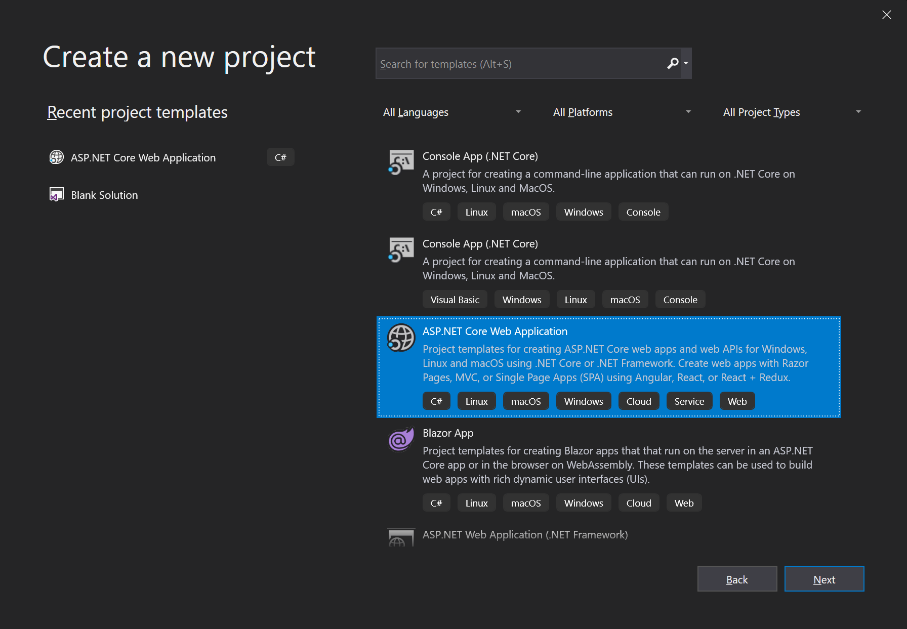
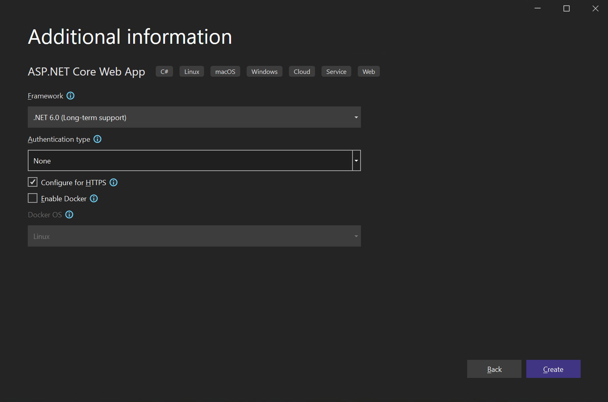

# 在AspNet Core MVC Web Application中使用ABP 

本教程将介绍如何开始以最少的依赖关系开始使用ABP开发. 

通常情况下你需要下载一个 **[启动模板](Getting-Started-AspNetCore-MVC-Template.md)**

## 创建一个新项目

1. 使用Visual Studio 2019 (16.4.0+)创建一个新的AspNet Core Web Application:



2. 配置新的项目:


3. 完成创建:




## 安装 Volo.Abp.AspNetCore.Mvc 包

Volo.Abp.AspNetCore.Mvc是ABP集成AspNet Core MVC的包,请安装它到你项目中:

````
Install-Package Volo.Abp.AspNetCore.Mvc
````

## 创建ABP模块

ABP是一个模块化框架,它需要一个**启动 (根) 模块**继承自``AbpModule``:

````C#
using Microsoft.AspNetCore.Builder;
using Microsoft.Extensions.Hosting;
using Volo.Abp;
using Volo.Abp.AspNetCore.Mvc;
using Volo.Abp.Modularity;

namespace BasicAspNetCoreApplication
{
    [DependsOn(typeof(AbpAspNetCoreMvcModule))]
    public class AppModule : AbpModule
    {
        public override void OnApplicationInitialization(
            ApplicationInitializationContext context)
        {
            var app = context.GetApplicationBuilder();
            var env = context.GetEnvironment();

            if (env.IsDevelopment())
            {
                app.UseDeveloperExceptionPage();
            }
            else
            {
                app.UseExceptionHandler("/Error");
            }

            app.UseStaticFiles();
            app.UseRouting();
            app.UseConfiguredEndpoints();
        }
    }
}
````

``AppModule`` 是应用程序启动模块的好名称.

ABP的包定义了这个模块类,模块可以依赖其它模块.在上面的代码中 ``AppModule`` 依赖于 ``AbpAspNetCoreMvcModule`` (模块存在于[Volo.Abp.AspNetCore.Mvc](https://www.nuget.org/packages/Volo.Abp.AspNetCore.Mvc)包中). 安装新的ABP的包后添加``DependsOn``是很常见的做法.

我们在此模块类中配置ASP.NET Core管道,而不是Startup类中.

### 启动类

接下来修改启动类集成ABP模块系统:

````C#
using Microsoft.AspNetCore.Builder;
using Microsoft.Extensions.DependencyInjection;

namespace BasicAspNetCoreApplication
{
    public class Startup
    {
        public void ConfigureServices(IServiceCollection services)
        {
            services.AddApplication<AppModule>();
        }

        public void Configure(IApplicationBuilder app)
        {
            app.InitializeApplication();
        }
    }
}

````
 
``services.AddApplication<AppModule>()``添加了所有``AppModule``模块中定义的全部服务.

``Configure``方法中的``app.InitializeApplication()``完成初始化并启动应用程序.

## 运行应用程序!

启动该应用，它将按预期运行.

## 使用 Autofac 依赖注入框架

虽然AspNet Core的依赖注入(DI)系统适用于基本要求,但[Autofac](https://autofac.org/)提供了属性注入和方法拦截等高级功能,这些功能是ABP执行高级应用程序框架功能所必需的.

用Autofac取代AspNet Core的DI系统并集成到ABP非常简单.

1. 安装 [Volo.Abp.Autofac](https://www.nuget.org/packages/Volo.Abp.Autofac) 包

````
Install-Package Volo.Abp.Autofac
````

2. 添加 ``AbpAutofacModule`` 依赖

````C#
[DependsOn(typeof(AbpAspNetCoreMvcModule))]
[DependsOn(typeof(AbpAutofacModule))] // 在模块上添加依赖AbpAutofacModule
public class AppModule : AbpModule
{
    ...
}
````

3. 修改``Program.cs``以使用Autofac:

````C#
using Microsoft.AspNetCore.Hosting;
using Microsoft.Extensions.Hosting;

namespace BasicAspNetCoreApplication
{
    public class Program
    {
        public static void Main(string[] args)
        {
            CreateHostBuilder(args).Build().Run();
        }

        public static IHostBuilder CreateHostBuilder(string[] args) =>
            Host.CreateDefaultBuilder(args)
                .ConfigureWebHostDefaults(webBuilder =>
                {
                    webBuilder.UseStartup<Startup>();
                })
                .UseAutofac();  // 添加这一行
    }
}
````

## 源码

从[此处](https://github.com/abpframework/abp-samples/tree/master/BasicAspNetCoreApplication)获取本教程中创建的示例项目的源代码.
