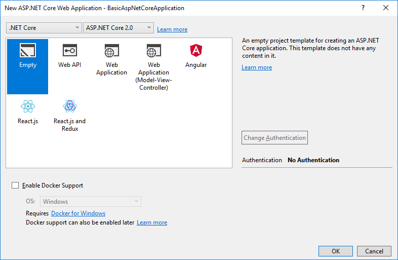

## 在AspNet Core MVC Web Application中使用ABP 

本教程将介绍如何开始以最少的依赖关系开始使用ABP开发. 

通常情况下你需要下载一个 ***[启动模板](https://abp.io/Templates)***

### 创建一个新项目

1. 使用Visual Studio创建一个空的AspNet Core Web Application:


2. 选择空模板



你可以选择其它模板,但是我想要从一个简洁的项目演示它.

### 安装 Volo.Abp.AspNetCore.Mvc 包

Volo.Abp.AspNetCore.Mvc是ABP集成AspNet Core MVC的包,请安装它到你项目中:

````
Install-Package Volo.Abp.AspNetCore.Mvc
````

### 创建ABP模块

ABP是一个模块化框架,它需要一个**启动 (根) 模块**继承自``AbpModule``:

````C#
using Microsoft.AspNetCore.Builder;
using Microsoft.AspNetCore.Hosting;
using Microsoft.Extensions.DependencyInjection;
using Volo.Abp;
using Volo.Abp.AspNetCore.Modularity;
using Volo.Abp.AspNetCore.Mvc;
using Volo.Abp.Modularity;

namespace BasicAspNetCoreApplication
{
    [DependsOn(typeof(AbpAspNetCoreMvcModule))]
    public class AppModule : AbpModule
    {
        public override void OnApplicationInitialization(ApplicationInitializationContext context)
        {
            var app = context.GetApplicationBuilder();
            var env = context.GetEnvironment();

            if (env.IsDevelopment())
            {
                app.UseDeveloperExceptionPage();
            }

            app.UseMvcWithDefaultRoute();
        }
    }
}
````

``AppModule`` 是应用程序启动模块的好名称(建议你的启动模块也使用这个命名).

ABP的包定义了这个模块类,模块可以依赖其它模块.在上面的代码中 ``AppModule`` 依赖于 ``AbpAspNetCoreMvcModule`` (模块存在于Volo.Abp.AspNetCore.Mvc包中). 安装新的ABP的包后添加``DependsOn``是很常见的做法.

我们在此模块类中配置ASP.NET Core管道,而不是Startup类中.

### 启动类

接下来修改启动类集成ABP模块系统:

````C#
using System;
using Microsoft.AspNetCore.Builder;
using Microsoft.Extensions.DependencyInjection;

namespace BasicAspNetCoreApplication
{
    public class Startup
    {
        public IServiceProvider ConfigureServices(IServiceCollection services)
        {
            services.AddApplication<AppModule>();

            return services.BuildServiceProviderFromFactory();
        }

        public void Configure(IApplicationBuilder app)
        {
            app.InitializeApplication();
        }
    }
}

````

修改``ConfigureServices``方法的返回值为``IServiceProvider``(默认是``void``).这个修改允许我们替换AspNet Core的依赖注入框架. (参阅下面的Autofac集成部分).  ``services.AddApplication<AppModule>()``添加了所有模块中定义的全部服务.

``app.InitializeApplication()`` 调用 ``Configure`` 方法初始化并启动应用程序

### Hello World!

上面的应用程序没有什么功能,让我们创建一个MVC控制器实现一些功能:

````C#
using Microsoft.AspNetCore.Mvc;
using Volo.Abp.AspNetCore.Mvc;

namespace BasicAspNetCoreApplication.Controllers
{
    public class HomeController : AbpController
    {
        public IActionResult Index()
        {
            return Content("Hello World!");
        }
    }
}

````

如果运行这个应用程序你会在页面中看到"Hello World!".

Derived ``HomeController`` from ``AbpController`` instead of standard ``Controller`` class. This is not required, but ``AbpController`` class has useful base properties and methods to make your development easier.

从``AbpController``派生``HomeController`` 而不是继承自``Controller``类.虽然这不是强制要求,但是``AbpController``类有很多有用的有属性和方法,使你的开发更容易.

### 使用 Autofac 依赖注入框架

虽然AspNet Core的依赖注入(DI)系统适用于基本要求,但Autofac提供了属性注入和方法拦截等高级功能,这些功能是ABP执行高级应用程序框架功能所必需的.

用Autofac取代AspNet Core的DI系统并集成到ABP非常简单.

1. 安装 Volo.Abp.Autofac 包

````
Install-Package Volo.Abp.Autofac
````

2. 添加 ``AbpAutofacModule`` 依赖

````C#
[DependsOn(typeof(AbpAspNetCoreMvcModule))]
[DependsOn(typeof(AbpAutofacModule))] // 在模块上添加依赖AbpAutofacModule
public class AppModule : AbpModule
{
    ...
}
````

3. 修改在``Startup``类下的``services.AddApplication<AppModule>();``如下所示:

````C#
services.AddApplication<AppModule>(options =>
{
    options.UseAutofac(); // 集成 Autofac
});
````

4. 更新 `Program.cs`代码, 不再使用`WebHost.CreateDefaultBuilder()`方法(因为它使用默认的DI容器)：

 ````csharp
public class Program
{
    public static void Main(string[] args)
    {
        /*
            https://github.com/aspnet/AspNetCore/issues/4206#issuecomment-445612167
            CurrentDirectoryHelpers 文件位于: \framework\src\Volo.Abp.AspNetCore.Mvc\Microsoft\AspNetCore\InProcess\CurrentDirectoryHelpers.cs
            当升级到ASP.NET Core 3.0的时候将会删除这个类.
        */
        CurrentDirectoryHelpers.SetCurrentDirectory();

        BuildWebHostInternal(args).Run();
    }
     public static IWebHost BuildWebHostInternal(string[] args) =>
        new WebHostBuilder()
            .UseKestrel()
            .UseContentRoot(Directory.GetCurrentDirectory())
            .UseIIS()
            .UseIISIntegration()
            .UseStartup<Startup>()
            .Build();
}
````


### 源码

从[此处](https://github.com/abpframework/abp/tree/dev/samples/BasicAspNetCoreApplication)获取本教程中创建的示例项目的源代码.
