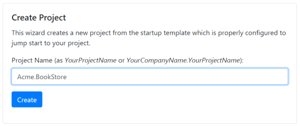

## ASP.NET Core MVC 模板

### 创建新项目

访问[模板创建页面](https://abp.io/Templates), 输入项目名称并创建项目, 如下所示:



单击 *create* 按钮时,将使用你提供的名称创建一个新的Visual Studio解决方案并开始下载.

#### 预先要求

下载的项目需要:

* [Visual Studio 2017 (v15.7.0+)](https://visualstudio.microsoft.com/tr/downloads/)
* [.NET Core 2.1.1+](https://www.microsoft.com/net/download/dotnet-core/)

### 解决方案结构

下载后解压文件并在 **Visual Studio 2017(15.7.0 +)** 中打开:


该解决方案具有分层结构(基于域驱动设计), 其中:

* ``.Domain`` 为领域层.
* ``.Application`` 为应用层.
* ``.Web`` 为是表示层.
* ``.EntityFrameworkCore`` 是EF Core集成.

The solution also contains unit & integration test projects properly configured to work with **EF Core** & **SQLite in-memory** database.

解决方案还包含配置好的的单元&集成测试项目, 以便与 **EF Core** 和 **SQLite内存中** 数据库配合使用.

### 创建数据库

查看`.Web`项目下`appsettings.json`文件中的 **连接字符串**:

````json
{
  "ConnectionStrings": {
    "Default": "Server=localhost;Database=BookStore;Trusted_Connection=True"
  }
}
````

The solution is configured to use **Entity Framework Core** with **MS SQL Server**. EF Core supports [various](https://docs.microsoft.com/en-us/ef/core/providers/) database providers, so you can use another DBMS if you want.

解决方案使用 **Entity Framework Core** 和 **MS SQL Server**. EF Core支持[各种](https://docs.microsoft.com/en-us/ef/core/providers/)数据库提供程序,因此你可以根据实际需要使用其他DBMS.

右键单击`.Web`项目并**设置启动项目**


打开**包管理器控制台(Package Manager Console)**, 选择`.EntityFrameworkCore`项目作为**默认项目**并运行`Update-Database`命令:


这将基于配置的连接字符串创建新数据库.

### 运行应用程序

您现在可以运行应用程序,它将会打开**home**页面:


单击 **登录** 按钮, 输入用户名`admin`, 密码`1q2w3E*`, 登录应用程序.

启动模板包括 **身份管理(identity management)** 模块. 登录后将提供身份管理菜单,你可以在其中管理**角色**,**用户**及其**权限**.


### 下一步是什么?

* [应用程序开发教程](Tutorials/AspNetCore-Mvc/Part-I.md)
