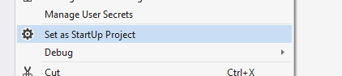
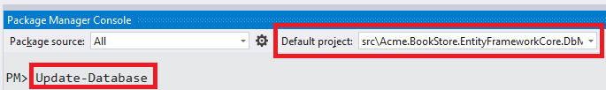
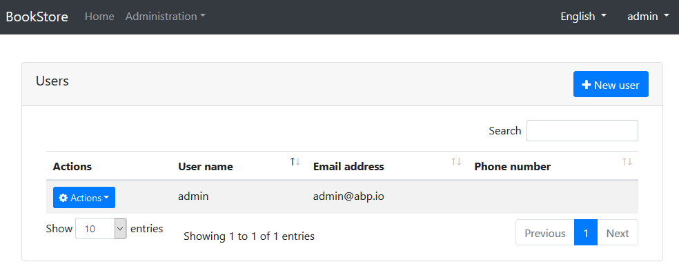

## ASP.NET Core MVC 模板入门

### 创建新项目

本教程使用 **ABP CLI** 创建一个新项目. 更多选项, 请参阅[入门](https://cn.abp.io/get-started)页面.

如果你之前未安装，请使用命令行安装ABP CLI:

````bash
dotnet tool install -g Volo.Abp.Cli
````

在空文件夹中使用 `abp new` 命令来创建项目:

````bash
abp new Acme.BookStore
````

> 你可以使用不同级别的命名空间; 例如BookStore, Acme.BookStore或Acme.Retail.BookStore.

`new` 命令创建**分层MVC应用程序**, **Entity Framework Core**作为数据库提供程序. 但是,它还有其他选择. 有关所有可用选项,请参见[CLI文档](CLI.md)

#### 预先要求

创建项目的要求:

* [Visual Studio 2017 (v15.9.0+)](https://visualstudio.microsoft.com/tr/downloads/)
* [.NET Core 2.2+](https://www.microsoft.com/net/download/dotnet-core/)

### 解决方案结构

在**Visual Studio**中打开解决方案:


该解决方案具有分层结构(基于[Domain Driven Design](Domain-Driven-Design.md)), 并包含配置好的的单元&集成测试项目,可与**EF Core**和**SQLite**数据库内存一起使用.

> 请参阅[应用程序模板文档](Startup-Templates/Application.md)以详细了解解决方案结构.

### 数据库连接字符串

查看`.Web`项目下`appsettings.json`文件中的 **连接字符串**:

````json
{
  "ConnectionStrings": {
    "Default": "Server=localhost;Database=BookStore;Trusted_Connection=True"
  }
}
````

解决方案使用 **Entity Framework Core** 和 **MS SQL Server**. EF Core支持[各种](https://docs.microsoft.com/zh-cn/ef/core/providers/)数据库提供程序,因此你可以根据实际需要使用其他DBMS. 如果需要,请更改连接字符串.

### 创建数据库并应用数据库迁移

你有两个选项来创建数据库.

#### 使用DbMigrator应用程序

该解决方案包含一个控制台应用程序(在此示例中名为`Acme.BookStore.DbMigrator`),可以创建数据库,应用迁移和初始化数据. 它对开发和生产环境都很有用.

> `.DbMigrator`项目有自己的`appsettings.json`. 因此,如果你更改了上面的连接字符串,则还应更改此字符串.

右键单击`.DbMigrator`项目并选择 **设置为启动项目**:



按F5(或Ctrl + F5)运行应用程序. 它将具有如下所示的输出:


#### 使用EF Core Update-Database命令

Ef Core具有`Update-Database`命令, 可根据需要创建数据库并应用挂起的迁移. 右键单击`.Web`项目并选择**设置为启动项目**:


打开**包管理器控制台(Package Manager Console)**, 选择`.EntityFrameworkCore.DbMigrations`项目作为**默认项目**并运行`Update-Database`命令:



这将基于配置的连接字符串创建新数据库.

> 使用`.Migrator`工具是建议的方法, 因为它还能初始化初始数据能够正确运行Web应用程序.

### 运行应用程序

你现在可以运行应用程序,它将会打开**home**页面:


单击 **登录** 按钮, 输入用户名`admin`, 密码`1q2w3E*`, 登录应用程序.

启动模板包括**身份管理**和**租户管理**模块. 登录后,将显示"管理"菜单, 你可以在其中管理**租户**,**角色**,**用户**和**权限**. 用户管理页面如下所示:



### 下一步是什么?

* [应用程序开发教程](Tutorials/AspNetCore-Mvc/Part-I.md)
