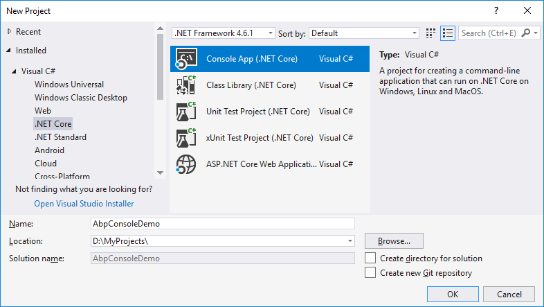

## 在控制台应用中使用ABP

本教程将介绍如何从头开始以最小的依赖关系启动ABP. 你通常希望以 **[启动模板](https://abp.io/Templates)** 开头.

### 创建一个新项目

使用Visual Studio创建一个新的.Net Core Console应用程序:



### 安装 Volo.Abp 包

Volo.Abp.Core是创建基于ABP的应用程序的核心nuget包. 所以,将它安装到你的项目中:

````
Install-Package Volo.Abp.Core
````

### 创建第一个ABP模块

ABP是一个模块化框架, 它需要一个从``AbpModule``类派生的 **启动(根)模块** 类:

````C#
using Microsoft.Extensions.DependencyInjection;
using Volo.Abp.Modularity;

namespace AbpConsoleDemo
{
    public class AppModule : AbpModule
    {
        
    }
}
````

``AppModule`` 是应用程序启动模块的好名称.

### 初始化应用程序

下一步是使用上面创建的启动模块引导应用程序:

````C#
using System;
using Volo.Abp;

namespace AbpConsoleDemo
{
    class Program
    {
        static void Main(string[] args)
        {
            using (var application = AbpApplicationFactory.Create<AppModule>())
            {
                application.Initialize();

                Console.WriteLine("Press ENTER to stop application...");
                Console.ReadLine();
            }
        }
    }
}

````

``AbpApplicationFactory`` 用于创建应用程序并加载所有以``AppModule``作为启动模块的模块. ``Initialize()``方法启动应用程序.

### Hello World!

上面的应用程序什么都不做, 让我们创建一个服务做一些事情:

````C#
using System;
using Volo.Abp.DependencyInjection;

namespace AbpConsoleDemo
{
    public class HelloWorldService : ITransientDependency
    {
        public void SayHello()
        {
            Console.WriteLine("Hello World!");
        }
    }
}

````

``ITransientDependency``是ABP的一个特殊接口, 它自动将服务注册为**Transient**(参见[依赖注入文档](Dependency-Injection.md)).

现在,我们可以解析``HelloWorldService``并调用``SayHello``. 更改Program.cs, 如下所示:

````C#
using System;
using Microsoft.Extensions.DependencyInjection;
using Volo.Abp;

namespace AbpConsoleDemo
{
    class Program
    {
        static void Main(string[] args)
        {
            using (var application = AbpApplicationFactory.Create<AppModule>())
            {
                application.Initialize();

                // 解析服务并使用它
                var helloWorldService = 
                    application.ServiceProvider.GetService<HelloWorldService>();
                helloWorldService.SayHello();

                Console.WriteLine("Press ENTER to stop application...");
                Console.ReadLine();
            }
        }
    }
}
````

这对于这个简单的代码示例已足够, 如果是直接从``IServiceProvider``解析建议创建**Scoped**依赖.(参见[依赖注入文档](Dependency-Injection.md)).

### 源码

从[这里](https://github.com/abpframework/abp/tree/dev/samples/BasicConsoleApplication)获取本教程中创建的示例项目的源代码.