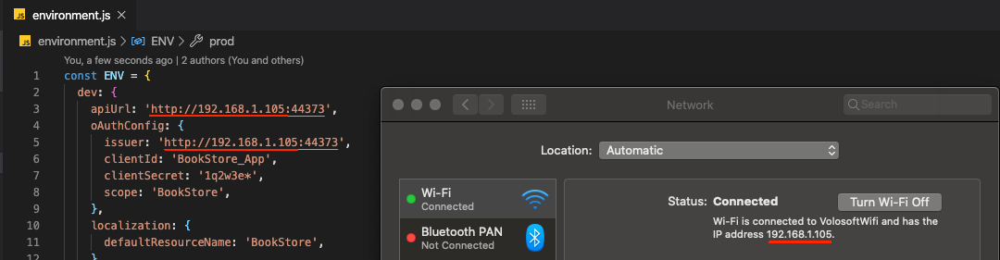

# React Native入门

ABP平台提供了[React Native](https://reactnative.dev/)模板用于开发移动应用程序.

当你按照[入门文档](Getting-Started.md)中所述**创建新应用程序**时, 你应该使用`-m react-native`选项以在解决方案中包含`react-native`项目.

## 配置你的本地IP地址

运行在Android模拟器或真机上的React Native应用程序无法连接到 `localhost` 上的后.要修复此问题,需要在本地IP上运行后端.

{{ if Tiered == "No"}}


* 打开 `.HttpApi.Host` 文件夹下的 `appsettings.json` 文件. 将  `SelfUrl` 和 `Authority` 属性的 `localhost` 替换为你本地的IP地址.
* 打开 `.HttpApi.Host/Properties` 文件夹下的 `launchSettings.json` 文件. 将 `applicationUrl` 属性的 `localhost` 替换为你本地的IP地址.

{{ else if Tiered == "Yes" }}


* 打开 `.IdentityServer` 文件夹下的 `appsettings.json` 文件. 将 `SelfUrl` 属性的 `localhost` 替换为你本地的IP地址.
* 打开 `.IdentityServer/Properties` 文件夹下的 `launchSettings.json` 文件. 将 `applicationUrl` 属性的 `localhost` 替换为你本地的IP地址.
* 打开 `.HttpApi.Host` 文件夹下的 `appsettings.json` 文件. 将 `Authority` 属性的 `localhost` 替换为你本地的IP地址.
* 打开 `.HttpApi.Host/Properties` 文件夹下的 `launchSettings.json` 文件. 将 `applicationUrl` 属性的 `localhost` 替换为你本地的IP地址.

{{ end }}

按照**运行HTTP API Host (服务端口)**那样运行后端.

> React Native应用程序不信任自动生成的.NET HTTPS证书,你可以在开发期间使用HTTP.

在 `react-native` 文件夹打开命令行终端,输入 `yarn` 命令(我们推荐使用[yarn](https://yarnpkg.com/)包管理, `npm install` 在大多数情况下也可以工作).

```bash
yarn
```

* 打开 `react-nativer` 文件夹下的 `Environment.js` 文件. 将 `apiUrl` 和 `issuer` 属性的 `localhost` 替换为你本地的IP地址:



{{ if Tiered == "Yes" }}

> 确保 `issuer` 与正在运行的 `.IdentityServer` 项目匹配, `apiUrl` 与正在运行的 `.HttpApi.Host` 项目匹配.

{{else}}

> 确保 `issuer` 和 `apiUrl` 与正在运行的 `.HttpApi.Host` 项目匹配

{{ end }}

等到所有node模块加载成功,  执行 `yarn start` (或 `npm start`) 命令:

```bash
yarn start
```

等待Expo CLI启动后Expo CLI在 `http://localhost:19002/` 地址要开管理页面.


在上面的管理界面中,可以通过使用[Expo Client](https://expo.io/tools#client)扫描二维码,使用Android模拟器,iOS模拟器或真机来启动应用程序.

> 请参阅expo.io上的[Android Studio模拟器](https://docs.expo.io/workflow/android-simulator/)和[iOS模拟器文档](https://docs.expo.io/workflow/ios-simulator/).


输入用户名 **admin**,密码  **1q2w3E*** 登录到应用程序.

应用程序已经启动并执行,你可以基于该启动模板开发应用程序.
