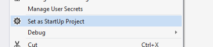
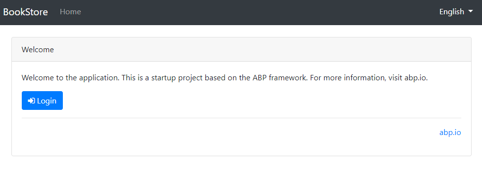
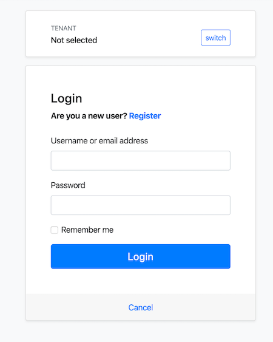

# 入门教程

````json
//[doc-params]
{
    "UI": ["MVC", "Blazor", "BlazorServer", "NG"],
    "DB": ["EF", "Mongo"],
    "Tiered": ["Yes", "No"]
}
````

> 本文档假设你更喜欢使用 **{{ UI_Value }}** 作为 UI 框架, 使用 **{{ DB_Value }}** 作为数据库提供程序. 对于其他选项, 请更改本文档顶部的首选项.

## 创建数据库

### 连接字符串

检查在 {{if Tiered == "Yes"}}`.IdentityServer` 和`.HttpApi.Host` 项目{{else}}{{if UI=="MVC"}}`.Web` 项目{{else if UI=="BlazorServer"}}`.Blazor` 项目{{else}}`.HttpApi.Host` 项目{{end}}{{end}} 中 `appsettings.json` 文件里的**连接字符串**.

{{ if DB == "EF" }}

````json
"ConnectionStrings": {
  "Default": "Server=(LocalDb)\MSSQLLocalDB;Database=BookStore;Trusted_Connection=True"
}
````

> **关于连接字符串和数据库管理系统**
> 
> 解决方案配置为默认使用 **Entity Framework Core** 与 **MS SQL Server**. 但是, 如果在执行ABP CLI 的`new`命令时使用了`-dbms`参数来选择其他DBMS (如`-dbms MySQL`), 那么连接字符串可能不同.
> 
> EF Core 支持 [多种](https://docs.microsoft.com/en-us/ef/core/providers/) 据库提供程序, 因此你可以使用任何受支持的DBMS. 你可以需要时候参阅[Entity Framework 集成文档](Entity-Framework-Core.md) 来学习如何[切换到另一个DBMS](Entity-Framework-Core-Other-DBMS.md).

### 数据库迁移

该解决方案使用[Entity Framework Core Code First 迁移](https://docs.microsoft.com/en-us/ef/core/managing-schemas/migrations/?tabs=dotnet-core-cli). 带有 `.DbMigrator` 的控制台程序用于 **应用迁移** 和 **初始化种子数据**. 它在**开发**和**生产**环境中都很有用.

> `.dbMigator` 项目有自己的 `appsettings.json`. 因此, 如果你更改了之前的连接字符串, 那么也应该更改这个连接字符串.

### 初次迁移

`.dbMigator` 应用程序在首次运行时自动**创建初始迁移**.

**如果你使用的是 Visual Studio, 你可以跳到 *运行 dbMigrator* 部分.** 但是, 其他 IDE (例如 Rider) 在首次运行时可能会遇到问题, 因为它会添加初始迁移并编译项目. 在这种情况下, 请在 `.dbMigration` 项目的文件夹中打开命令行终端, 然后运行以下命令:

````bash
dotnet run
````

下次, 你可以像往常一样在 IDE 中运行它.

### 运行迁移

右键单击 `.dbMigration` 项目, 然后选择 **设置为启动项目**



 按F5(或Ctrl + F5) 运行应用程序. 它将具有如下所示的输出:

 

> 初始的[种子数据](Data-Seeding.md)在数据库中创建了 `admin` 用户(密码为`1q2w3E*`) 用于登录应用程序. 所以, 对于新数据库至少使用 `.DbMigrator` 一次.

{{ else if DB == "Mongo" }}

````json
"ConnectionStrings": {
  "Default": "mongodb://localhost:27017/BookStore"
}
````

该解决方案配置为在本地计算机中使用 **MongoDB**, 因此你需要启动并运行 MongoDB 服务器实例, 或者将连接字符串更改为另一台 MongoDB 服务器.

### 种子初始数据

该解决方案带有 `.DbMigrator` 的控制台程序用于 **初始化种子数据**. 它在**开发**和**生产**环境中都很有用.

> `.dbMigator` 项目有自己的 `appsettings.json`. 因此, 如果你更改了之前的连接字符串, 那么也应该更改这个连接字符串.

右键单击 `.dbMigration` 项目, 然后选择 **设置为启动项目**


 按F5(或Ctrl + F5) 运行应用程序. 它将具有如下所示的输出:

 

> 初始的[种子数据](Data-Seeding.md)在数据库中创建了 `admin` 用户(密码为`1q2w3E*`) 用于登录应用程序. 所以, 对于新数据库至少使用 `.DbMigrator` 一次.

{{ end }}

## 运行应用程序

{{ if UI == "MVC" || UI == "BlazorServer" }}

{{ if Tiered == "Yes" }}

> 分层解决方案使用 **Redis** 作为分布式缓存. 确保它已安装并在本地计算机上运行. 如果你使用的是远程 Redis 服务器, 请修改项目的 ` appsettings.json` 文件中的配置.

1. 确保 `.IdentityServer` 项目是启动项目. 运行此应用程序, 它将在浏览器中打开 **登录** 页面.

> 在 Visual Studio 中使用 Ctrl+F5(而不是F5) 在不进行调试的情况下运行应用程序. 如果你没有调试目的, 这会更快.

你可以登录, 但不能在这里进入主应用程序. 这 **只是身份验证服务器**.

2. 确保 `.httpapi.Host` 项目是启动项目, 然后运行应用将在浏览器中打开 **Swagger UI**.


这是 Web 应用程序使用的 HTTP API.

3. 最后, 确保 {{if UI=="MVC"}}`.Web`{{else}}`.Blazor`{{end}} 项目是启动项目,然后运行应用程序,它将在浏览器中打开 **欢迎** 页面



单击 **login** 按钮, 它将重定向到 *身份验证服务器* 以登录到应用程序:



{{ else # Tiered != "Yes" }}

确保 {{if UI=="MVC"}}`.Web`{{else}}`.Blazor`{{end}} 项目是启动项目. 运行应用程序将会在浏览器中打开 **login** 页面:

> 在 Visual Studio 中使用 Ctrl+F5(而不是F5) 在不进行调试的情况下运行应用程序. 如果你没有调试目的, 这会更快.


{{ end # Tiered }}

{{ else # UI != MVC || BlazorServer }}

### 运行 HTTP API 主机(服务器端)

{{ if Tiered == "Yes" }}

> 分层解决方案使用 Redis 作为分布式缓存. 确保它已安装并在本地计算机上运行. 如果你使用的是远程 Redis 服务器, 请修改项目的 `appsettings.json` 文件中的配置.

确保 `.IdentityServer` 项目是启动项目. 运行此应用程序, 它将在浏览器中打开 **登录** 页面.

> 在 Visual Studio 中使用 Ctrl+F5(而不是F5) 在不进行调试的情况下运行应用程序. 如果你没有调试目的, 这会更快.

你可以登录, 但不能在这里进入主应用程序. 这 **只是身份验证服务器**.

确保 `.HttpApi.Host` 项目是启动项目, 然后运行应用程序将打开 Swagger UI 的:

{{ else # Tiered == "No" }}

确保 `.HttpApi.Host` 项目是启动项目, 然后运行应用程序将打开 Swagger UI 的:

> 在 Visual Studio 中使用 Ctrl+F5(而不是F5) 在不进行调试的情况下运行应用程序. 如果你没有调试目的, 这会更快.

{{ end # Tiered }}


你可以在这里查看应用程序的API并测试它们. 获取Swagger UI的[更多信息](https://swagger.io/tools/swagger-ui/).

{{ end # UI }}

{{ if UI == "Blazor" }}

### 运行 Blazor 应用程序 (客户端)

确保 `.Blazor` 项目是启动项目并运行应用程序.

> 在 Visual Studio 中使用 Ctrl+F5(而不是F5) 在不进行调试的情况下运行应用程序. 如果你没有调试目的, 这会更快.

应用程序启动后, 单击页头上的 **Login** 链接, 你将重定向到身份验证服务器以输入用户名和密码:


{{ else if UI == "NG" }}

### 运行 Angular 应用程序 (客户端)

转到 `Angular` 文件夹, 打开命令行终端, 键入 `yarn` 命令(我们建议使用 [yarn](https://yarnpkg.com/) 软件包管理器, 而 `npm install` 也可以使用)

```bash
yarn
```

当所有node模块加载完毕后, 执行 `yarn start` (或 `npm start`) 命令：

```bash
yarn start
```

初次构建可能需要更长的时间. 完成后, 它会在默认浏览器中使用 [localhost:4200](http://localhost:4200/) 地址打开 Angular UI.


{{ end }}

输入用户名 **admin** 和 密码 **1q2w3E*** 登录应用程序. 应用程序已启动并正在运行. 你可以根据此启动模板开始开发应用程序.

## 另请参见

* [Web 应用程序开发教程](Tutorials/Part-1.md)
* [应用程序启动模板](Startup-Templates/Application.md)
