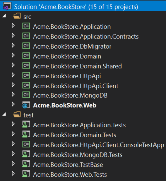
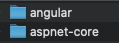
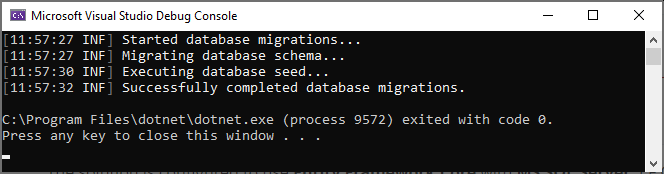
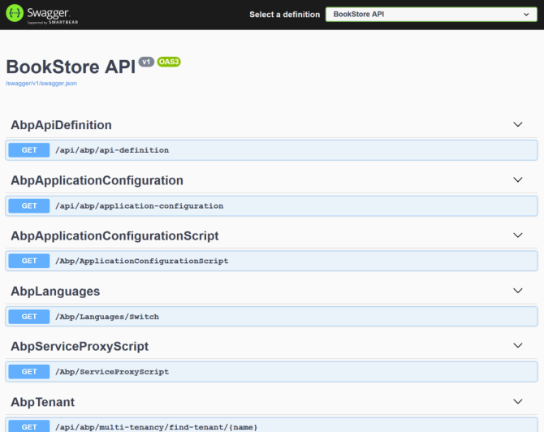
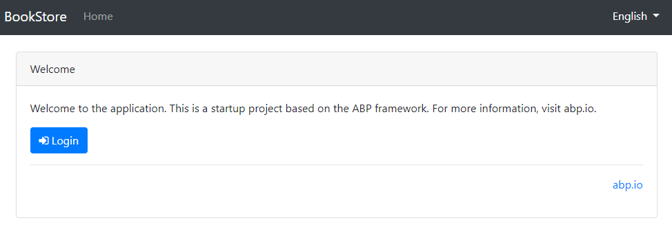
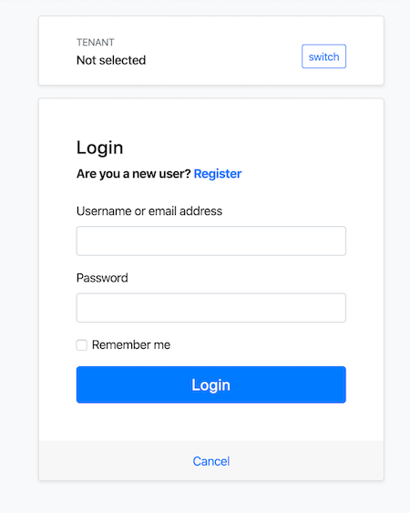

## 入门

````json
//[doc-params]
{
    "UI": ["MVC","NG"],
    "DB": ["EF", "Mongo"],
    "Tiered": ["Yes", "No"]
}
````

本教程介绍了如何创建一个新的{{if UI == "MVC"}} ASP.NET Core MVC web {{else if UI == "NG"}} Angular {{end}}. 配置并运行它.

## 设置你的开发环境

创建第一个项目之前,需要正确的设置你的开发环境.

### 预先要求

你需要安装以下工具:

* [Visual Studio 2019 (v16.4+)](https://visualstudio.microsoft.com/vs/) for Windows / [Visual Studio for Mac](https://visualstudio.microsoft.com/vs/mac/).<sup id="a-editor">[1](#f-editor)</sup>
* [.NET Core 3.1+](https://www.microsoft.com/net/download/dotnet-core/)

* [Node v12 或 v14](https://nodejs.org/en/)
* [Yarn v1.19+](https://classic.yarnpkg.com/)
* [Yarn v1.20+ (not v2)](https://classic.yarnpkg.com/en/docs/install) <sup id="a-yarn">[2](#f-yarn)</sup> 或 npm v6+ (与Node一起安装)
{{ if Tiered == "Yes" }}

* [Redis](https://redis.io/): 入门解决方案将Redis用作[分布式缓存](Caching.md). 因此你需要安装并运行Redis.

{{ end }}

<sup id="f-editor"><b>1</b></sup> _只要支持.NET Core和ASP.NET Core,就可以使用其他编辑器代替Visual Studio._ <sup>[↩](#a-editor)</sup>

<sup id="f-yarn"><b>2</b></sup> _Yarn v2 的工作方式不同,不受支持._ <sup>[↩](#a-yarn)</sup>

### 安装ABP CLI

[ABP CLI](./CLI.md)是一个命令行页面,用于自动执行一些基于ABP的应用程序的常见任务.

> ABP CLI是ABP框架一个免费开源的工具.

你需要使用以下命令安排ABP CLI:

````shell
dotnet tool install -g Volo.Abp.Cli
````

如果你已经安装,你可以使用以下命令更新到最新版本:

````shell
dotnet tool update -g Volo.Abp.Cli
````

## 创建新项目

> 本文假设你使用 **{{ UI_Value }}** 做为UI框架 **{{ DB_Value }}** 做为数据库提供程序,对于其它选项,你可以更改文档顶部的首选项.

### 使用ABP CLI创建一个新项目

使用ABP CLI的 `new` 命令创建新项目:

````shell
abp new Acme.BookStore{{if UI == "NG"}} -u angular {{end}}{{if DB == "Mongo"}} -d mongodb{{end}}{{if Tiered == "Yes" && UI != "NG"}} --tiered {{else if Tiered == "Yes" && UI == "NG"}}--separate-identity-server{{end}} --mobile react-native
````

* 此命令还会在解决方案文件夹内创建一个React Native移动应用程序. 如果你不想要它,可以安全地删除它或从`abp new`命令中删除`--mobile react-native`选项, 以使其完全不包含在解决方案中.

{{ if UI == "NG" }}

* `-u` 指定UI框架, 本例中是 `angular`.

{{ if Tiered == "Yes" }}

* `--separate-identity-server` 参数用于将Identity服务器应用程序与API主机应用程序分隔开. 如果未指定,则服务器上将只有一个端点.

{{ end }}

{{ end }}

{{ if DB == "Mongo" }}

* `-d` 指定数据库提供程序, 本例中是 `mongodb`.

{{ end }}

{{ if Tiered == "Yes" && UI != "NG" }}

* `--tiered` 参数用于创建n层解决方案,其中身份验证服务器层,UI层和API层在物理上是分离的.

{{ end }}

> 你可以使用不同级别的命令空间; 例如. BookStore, Acme.BookStore or Acme.Retail.BookStore.

#### ABP CLI 命令 & 选项

[ABP CLI文档](./CLI.md)涵盖了ABP CLI的所有可用命令和选项. 本文档使用[应用程序启动模板](Startup-Templates/Application.md)创建新的Web应用程序. 有关其他模板,请参见[ABP启动模板](Startup-Templates/Index.md)文档.

> 或者,您可以从[ABP Framework网站](https://abp.io/get-started)中选择"直接下载"选项卡创建新的解决方案.

## 解决方案结构

{{ if UI == "MVC" }}

创建项目后你会有以下解决方案目录和文件:


在Visual Studio中打开 `.sln` 文件时,将看到以下解决方案结构:

{{if DB == "Mongo"}}



{{else}}


{{end}}

{{ else if UI == "NG" }}

在创建的解决方案中有三个文件夹:



* `angular` 文件夹包含Angular UI应用程序.
* `aspnet-core` 文件夹包含后端应用程序.
* `react-native` 文件夹包含React Native UI 应用程序.

打开 `aspnet-core` 文件夹下的 `.sln`(`Visual Studio`解决方案)文件:


{{ end }}

> ###### 关于解决方案中的项目
>
> 根据你的**UI**,**数据库**和其他选项,你的解决方案的结构可能略有不同.

该解决方案具有分层结构(基于[Domain Driven Design](Domain-Driven-Design.md)), 并包含配置好的的单元&集成测试项目.

{{ if DB == "EF" }}

集成测试项目已配置为可与 **EF Core** & **SQLite 内存** database同时使用.

{{ else if DB == "Mongo" }}

集成测试项目已配置为每个测试创建的内存中的**MongoDB**数据库(使用的[Mongo2Go](https://github.com/Mongo2Go/Mongo2Go)库).

{{ end }}

> 请参阅[应用程序模板文档](Startup-Templates/Application.md)详细了解解决方案结构.

{{ if DB == "Mongo" }}

> [启动模板](Startup-templates/Index.md)默认在 `.MongoDB` 项目中**禁用**了工作单元事务. 如果你的MongoDB服务器支持事务,你可以手动启用工作单元的事务:

  ```csharp
  Configure<AbpUnitOfWorkDefaultOptions>(options =>
  {
      options.TransactionBehavior = UnitOfWorkTransactionBehavior.Enabled;
  });
  ```

{{ end }}

## 创建数据库

### 连接字符串

检查 {{if UI == "MVC"}}{{if Tiered == "Yes"}}`.IdentityServer` 和 `.HttpApi.Host` 项目{{else}}`.Web` 项目{{end}}{{else if UI == "NG" }}`.HttpApi.Host` 项目{{end}}下 `appsettings.json` 文件中的 **链接字符串**:

{{ if DB == "EF" }}

````json
"ConnectionStrings": {
  "Default": "Server=localhost;Database=BookStore;Trusted_Connection=True"
}
````

该解决方案配置为**Entity Framework Core**与**MS SQL Server**一起使用. EF Core支持[各种](https://docs.microsoft.com/en-us/ef/core/providers/)数据库提供程序,因此你可以使用任何受支持的DBMS. 请参阅[Entity Framework集成文档](https://docs.abp.io/en/abp/latest/Entity-Framework-Core)了解如何切换到另一个DBMS.

### 数据库连接字符串

查看`.Web`项目下`appsettings.json`文件中的 **连接字符串**:

````json
{
  "ConnectionStrings": {
    "Default": "Server=localhost;Database=BookStore;Trusted_Connection=True"
  }
}
````

解决方案使用 **Entity Framework Core** 和 **MS SQL Server**. EF Core支持[各种](https://docs.microsoft.com/zh-cn/ef/core/providers/)数据库提供程序,因此你可以根据实际需要使用其他DBMS. 如果需要,请更改连接字符串.

### 应用迁移

该解决方案使用[Entity Framework Core Code First 迁移](https://docs.microsoft.com/en-us/ef/core/managing-schemas/migrations/?tabs=dotnet-core-cli). 你需要应用迁移来创建数据库,有两种方法迁移数据库.

#### 使用DbMigrator应用程序应用迁移

该解决方案包含一个控制台应用程序(在此示例中名为`Acme.BookStore.DbMigrator`),可以创建数据库,应用迁移和初始化数据. 它对开发和生产环境都很有用.

> `.DbMigrator`项目有自己的`appsettings.json`. 因此,如果你更改了上面的连接字符串,则还应更改此字符串.

右键单击`.DbMigrator`项目并选择 **设置为启动项目**:


按F5(或Ctrl + F5)运行应用程序. 它将具有如下所示的输出:


#### 使用EF Core Update-Database命令

Ef Core具有`Update-Database`命令, 可根据需要创建数据库并应用挂起的迁移. 右键单击`.Web`项目并选择**设置为启动项目**:

{{ if UI == "MVC" }}

右键单击{{if Tiered == "Yes"}}`.IdentityServer`{{else}}`.Web`{{end}}项目并选择**设置为启动项目**:

{{ else if UI != "MVC" }}

右键单击`.HttpApi.Host`项目并选择**设置为启动项目**:

{{ end }}


打开**包管理器控制台(Package Manager Console)**, 选择`.EntityFrameworkCore.DbMigrations`项目作为**默认项目**并运行`Update-Database`命令:


这将基于配置的连接字符串创建新数据库.

> **使用`.DbMigrator`工具是建议的方法**, 因为它能初始化初始数据能够正确运行Web应用程序.
>
> 如果你只是使用 `Update-Database` 命令,你会得到一个空数据库,所以你无法登录到应用程序因为数据库中没有初始管理用户. 不需要种子数据库时,可以在开发期间使用 `Update-Database` 命令. 但是使用 `.DbMigrator` 应用程序会更简单,你始终可以使用它来迁移模式并为数据库添加种子.

{{ else if DB == "Mongo" }}

````json
"ConnectionStrings": {
  "Default": "mongodb://localhost:27017/BookStore"
}
````

该解决方案被配置为在你的本地计算机中使用 **MongoDB**,因此你需要启动并运行一个MongoDB服务器实例或者将连接字符串更改为另一个MongoDB服务器.

### 初始化种子数据

该解决方案附带一个 `.DbMigrator` 控制台应用程序,该应用程序为初始数据提供了种子. 它对于开发以及生产环境都很有用.

> `.DbMigrator` 项目有自己的 `appsettings.json`.如果你更改了其他项目的 `appsettings.json`,也应该更改这个.

右键点击 `.DbMigrator` 并选择 **设置为启动项目**.


 按F5(或Ctrl+F5)启动应用程序,你会看到以下输出:

 

> 数据库创建后会初始化[种子数据](Data-Seeding.md), 其中包含用于登录的 `admin` 用户. 所以你至少使用 `.DbMigrator` 一次.

{{ end }}

### 运行应用程序

{{ if UI == "MVC" }}

{{ if Tiered == "Yes" }}

确保 `.IdentityServer` 是启动项目,运行应用程序后会在你的浏览器打开一个 **login** 页面.

> 在Visual Studio中使用Ctrl+F5(而不是F5)运行应用,如果你不用于调试,这会减少启动时间.

你可以登录,但是不能在这里进入主应用程序,它仅是验证服务器.

确保 `.HttpApi.Host` 是启动项目,运行应用程序后会在你的浏览器打开一个 **Swagger UI** 页面.



这里是Web应用程序使用的API应用程序.

最后确保 `.Web` 是启动项目,运行应用程序后会在你的浏览器打开一个 **welcome** 页面.



点击 **login** 按钮重定向到 `Identity Server` 来登录应用程序.



{{ else }}

最后确保 `.Web` 是启动项目,运行应用程序后会在你的浏览器打开一个 **login** 页面.

> 在Visual Studio中使用Ctrl+F5(而不是F5)运行应用,如果你不用于调试,这会减少启动时间.


{{ end }}

{{ else if UI != "MVC" }}

#### 运行HTTP API Host (服务器端)

{{ if Tiered == "Yes" }}

确保 `.IdentityServer` 是启动项目,运行应用程序后会在你的浏览器打开一个 **login** 页面.

> 在Visual Studio中使用Ctrl+F5(而不是F5)运行应用,如果你不用于调试,这会减少启动时间.

你可以登录,但是不能在这里进入主应用程序,它仅是验证服务器.

{{ end }}

确保 `.HttpApi.Host` 是启动项目,运行应用程序后会在你的浏览器打开一个 **Swagger UI** 页面.

{{ if Tiered == "No" }}

> 在Visual Studio中使用Ctrl+F5(而不是F5)运行应用,如果你不用于调试,这会减少启动时间.

{{ end }}


你可以看到应用程序的API并进行测试. 更多信息,请参阅[Swagger UI](https://swagger.io/tools/swagger-ui/).

> ##### Swagger UI 授权
>
> 大多数的HTTP API都需要身份验证和授权. 如果你要测试授权API, 请手动进入 `/Account/Login` 页面, 输入用户名: `admin` 和密码: `1q2w3E*` 登录到应用程序. 然后你可以访问授权API.

{{ end }}

{{ if UI == "NG" }}
#### 运行 Angular 应用程序 (客户端)

在 `angular` 下打开命令行终端, 输入 `yarn` 命令(我们推荐使用[yarn](https://yarnpkg.com/)包管理, `npm install` 在大多数情况下也可以工作).

```bash
yarn
```

等到所有node模块加载成功,  执行 `yarn start` (或 `npm start`) 命令:

```bash
yarn start
```

等待 `Angular CLI` 使用 `BrowserSync` 启动 `Webpack` dev-server.
它会负责编译你的 `TypeScript`代码, 并自动重新加载浏览器.
完成后 `Angular Live Development Server` 会监听 localhost:4200.
打开你的浏览器并导航到[localhost:4200](http://localhost:4200/).


{{ end }}

输入用户名 **admin**,密码 **1q2w3E*** 登录到应用程序,应用程序已经启动并执行,你可以基于此启动模板开始开发应用程序.

#### 移动开发

当你创建一个新的应用程序时. 可以添加`-m react-native`选项以在解决方案中包含 `react-native`项目. 这是一个基础的[React Native](https://reactnative.dev/)启动模板,用于开发与基于ABP的后端集成的移动应用程序.


请参阅"[React Native入门](Getting-Started-React-Native.md)"文档了解如何配置和运行React Native应用程序.

## 下一步是什么?

[Web应用程序开发教程](Tutorials/Part-1.md)
