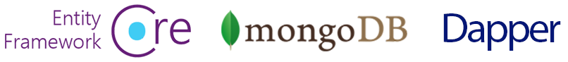
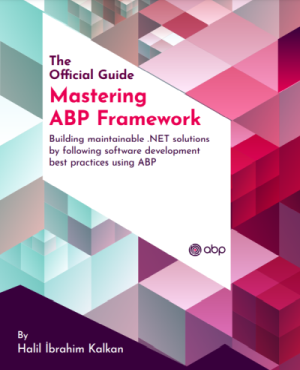

# ABP 文档

ABP 框架提供了一个固执己见的架构，用于在 **.NET** 和 **ASP.NET Core** 平台之上构建具有 **最佳实践** 的企业软件解决方案。它提供了基本的基础架构，生产就绪的启动模板，模块，主题，工具，指南和文档，以正确实现该架构并自动化细节和重复性工作。

## 开始

* [快速入门](Tutorials/Todo/Overall.md) 是一个由单部分组成的快速入门教程，使用 ABP 框架构建一个简单的应用程序。如果您想快速了解 ABP 的工作原理，请从本教程开始。

* [开始](Getting-Started.md) 指南可用于创建和运行具有不同选项和详细信息的基于 ABP 的解决方案。

* [Web 应用程序开发教程](Tutorials/Part-1.md)是一个完整的教程，用于开发具有实际解决方案各个方面的全栈Web应用程序。

### 选择 UI 框架

ABP 框架可以与任何 UI 框架配合使用，同时开箱即用地支持以下框架：

### 选择数据库提供程序

ABP 框架可以与任何数据库提供程序配合使用，同时开箱即用地支持以下提供程序：

## 浏览文档

ABP 有一个**全面的文档**，它不仅解释了ABP框架，还包括**指南**和**示例**，通过介绍和讨论常见的**软件开发原则和最佳实践**，帮助您创建**可维护的解决方案**。

### 架构

ABP提供基于[领域驱动设计](Domain-Driven-Design.md) 原则和模式的完整，模块化和分层的软件架构。它还提供了实现此体系结构所需的基础结构

* 请参阅 [模块化](Module-Development-Basics.md) 文档以了解模块系统。

* [实现领域驱动设计书](https://abp.io/books/implementing-domain-driven-design?ref=doc) 是想要理解和使用ABP框架实现DDD的最终指南。

* [微服务架构](Microservice-Architecture.md) 文档解释了 ABP 如何帮助创建微服务解决方案。

* [多租户](Multi-Tenancy.md) 文档介绍了多租户并探讨了 ABP 多租户基础结构。

### 基础设施

ABP 框架提供了许多功能来更轻松地实现现实世界的场景，例如 [事件总线](Event-Bus.md)、[后台作业系统](Background-Jobs.md)、[审核日志记录](Audit-Logging.md)、[BLOB 存储](Blob-Storing.md)、[数据种子设定](Data-Seeding.md)、[数据过滤](Data-Filtering.md)。

### 跨领域关注的问题

ABP还简化了（甚至在可能的情况下自动化）横切关注点和常见的非功能性需求，如[异常处理](Exception-Handling.md)，[验证](Validation.md)，[授权](Authorization.md)，[本地化](Localization.md)，[缓存](Caching.md)，[依赖注入](Dependency-Injection.md)，[设置管理](Settings.md) 等。

### 应用模块

应用程序模块提供预构建的应用程序功能;

* [**Account**](Modules/Account.md): 提供用于帐户管理的 UI，并允许用户登录/注册应用程序。

* **[Identity](Modules/Identity.md)**：基于 Microsoft Identity 库，管理组织单位、角色、用户及其权限。

* [**OpenIddict**](Modules/OpenIddict.md): 集成到 OpenIddict。

* [**Tenant Management**](Modules/Tenant-Management.md): 管理[多租户](Multi-Tenancy.md)应用程序(SaaS)的租户

请参阅 [应用程序模块](Modules/Index.md) 文档，了解所有预构建模块

### 项目启动模板

[启动模版](Startup-Templates/Index.md) 是预构建的 Visual Studio 解决方案模板。您可以基于这些模板创建自己的解决方案，**立即开始开发**。

## 书

### 掌握 ABP 框架

**Mastering ABP Framework** (掌握ABP框架) 是ABP框架入门和专业知识的终极指南。它由 *Halil İbrahim Kalkan* (ABP框架的创建者,首席开发人员) 撰写。

**[您现在可以从亚马逊订购](https://www.amazon.com/Mastering-ABP-Framework-maintainable-implementing-dp-1801079242/dp/1801079242)!**

### 免费电子书：实现领域驱动设计

实现领域驱动设计 (DDD) 的**实用指南**。虽然实现细节基于ABP框架基础结构，但基本概念、原则和模型可以应用于任何解决方案，即使它不是 .NET 解决方案。

**[单击此处获取免费副本](https://abp.io/books/implementing-domain-driven-design?ref=doc).**

## ABP 社区

### 源代码

ABP 托管在 GitHub 上。查看 [源代码](https://github.com/abpframework).

### ABP 社区网站
[ABP社区](https://community.abp.io/) 是一个发布文章和分享有关ABP框架知识的网站。您还可以为社区创建内容！
### 博客

关注 [ABP博客](https://blog.abp.io/) 了解 ABP 框架的最新动态。

### 示例

请参阅使用 ABP 框架构建的 [示例项目](Samples/Index.md)

### 想做出贡献吗？

ABP 是一个由社区驱动的开源项目。如果你想成为这个项目的一部分，请参阅[贡献指南](Contribution/Index.md)。
