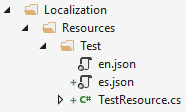

## 本地化

ABP的本地化系统与`Microsoft.Extensions.Localization`无缝集成,并与[AspnetCore的本地化文档](https://docs.microsoft.com/zh-cn/aspnet/core/fundamentals/localization?view=aspnetcore-2.1)兼容. 它添加了一些实用功能和增强功能, 使其更易于在实际开发中应用.

### Volo.Abp.Localization Package

> 启动模板默认已经安装了此nuget包, 所以在大多数情况下, 你不需要手动安装它.

Volo.Abp.Localization是本地化系统的核心包. 使用程序包管理器控制台 (PMC) 将其安装到项目中:

```
Install-Package Volo.Abp.Localization
```

然后, 你可以将 **AbpLocalizationModule** 依赖项添加到模块:

```c#
using Volo.Abp.Modularity;
using Volo.Abp.Localization;

namespace MyCompany.MyProject
{
    [DependsOn(typeof(AbpLocalizationModule))]
    public class MyModule : AbpModule
    {
        //...
    }
}
```

#### 创建本地化资源

本地化资源用于将相关的本地化字符串组合在一起,并将它们与应用程序的其他本地化字符串分开.通常一个模块会定义自己的本地化资源. 本地化资源就是一个普通的类. 例如:

````C#
public class TestResource
{
}
````

然后应该使用 `AbpLocalizationOptions` 添加如下所示:

````C#
[DependsOn(typeof(AbpLocalizationModule))]
public class MyModule : AbpModule
{
    public override void ConfigureServices(ServiceConfigurationContext context)
    {
        context.Services.Configure<VirtualFileSystemOptions>(options =>
        {
            options.FileSets.AddEmbedded<MyModule>();
        });

        context.Services.Configure<AbpLocalizationOptions>(options =>
        {
            options.Resources
                .Add<TestResource>("en")
                .AddVirtualJson("/Localization/Resources/Test");
        });
    }
}
````

在这个例子中;

* 添加了一个新的本地化资源, 使用"en"（英语）作为默认的本地化.
* 用JSON文件存储本地化字符串.
* 使用[虚拟文件系统](Virtual-File-System.md) 将JSON文件嵌入到程序集中.

JSON文件位于 "/Localization/Resources/Test" 项目文件夹下, 如下图所示:



本地化文件内容如下所示:

````json
{
  "culture": "en",
  "texts": {
    "HelloWorld": "Hello World!"
  }
}
````

* 每个本地化文件都需要定义 `culture` (文化) 代码  (例如 "en" 或 "en-US").
* `texts` 部分只包含本地化字符串的键值集合 (键也可能有空格).

##### 简短的本地化资源名称

本地化资源也可以在客户端(JavaScript)使用. 因此, 为本地化资源设置一个简短的名称可以更方便的本地化文本. 例如:

````C#
[LocalizationResourceName("Test")]
public class TestResource
{
}
````

请参阅下面的获取本地化资源Test中客户端部分.

##### 继承其他资源

资源可以从其他资源继承,这使得可以在不引用现有资源的情况下重用现有的本地化字符串. 例如:

````C#
[InheritResource(typeof(AbpValidationResource))]
public class TestResource
{
}
````

也可以通过 `AbpLocalizationOptions` 配置:

````C#
services.Configure<AbpLocalizationOptions>(options =>
{
    options.Resources
        .Add<TestResource>("en") //Define the resource by "en" default culture
        .AddVirtualJson("/Localization/Resources/Test") //Add strings from virtual json files
        .AddBaseTypes(typeof(AbpValidationResource)); //Inherit from an existing resource
});
````

* 资源可以从多个资源继承.
* 如果新的本地化资源定义了相同的本地化字符串, 那么它会覆盖该字符串

##### 扩展现有资源

继承资源可以创建新的资源, 无需修改现有的资源. 但是在某些情况下,  你可能不想创建新资源,而是直接扩展现有资源. 例如:

````C#
services.Configure<AbpLocalizationOptions>(options =>
{
    options.Resources
        .Get<TestResource>()
        .AddVirtualJson("/Localization/Resources/Test/Extensions");
});
````

* 如果扩展文件定义了相同的本地化字符串, 那么它会覆盖该字符串.

#### 获取本地化文本

##### 服务器端

在服务端获取本地化文本的用法是非常标准的(它与AspNetCore提供的获取本地化资源方式无缝集成).

###### 在类中简单的用法

````C#
public class MyService
{
    private readonly IStringLocalizer<TestResource> _localizer;

    public MyService(IStringLocalizer<TestResource> localizer)
    {
        _localizer = localizer;
    }

    public void Foo()
    {
        var str = _localizer["HelloWorld"];
    }
}
````

###### 在Razor视图/Page中简单的用法

````c#
@inject IHtmlLocalizer<TestResource> Localizer

<h1>@Localizer["HelloWorld"]</h1>
````

有关在服务器端使用本地化的详细使用方法, 请参阅[AspNetCore的本地化文档](https://docs.microsoft.com/zh-cn/aspnet/core/fundamentals/localization)

##### 客户端

ABP提供了JavaScript服务, 可以在客户端使用相同的本地化文本.

获取本地化资源:

````js
var testResource = abp.localization.getResource('Test');
````

本地化字符串:

````js
var str = testResource('HelloWorld');
````
