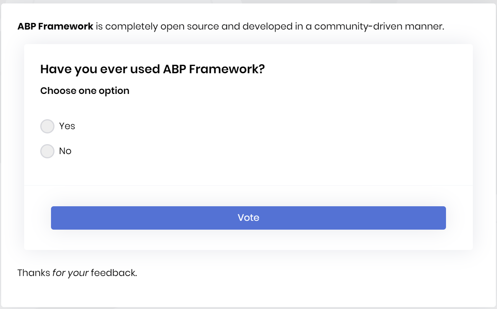
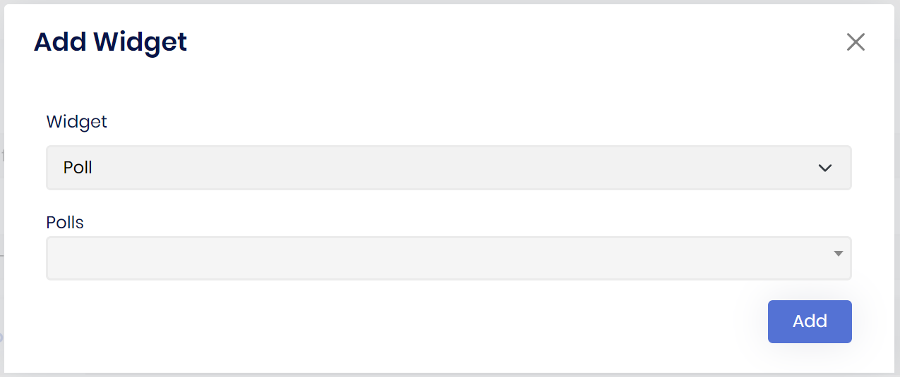

# 动态部件

CMS kit提供了组件系统在页面和博客文章和生成动态部件. 这是一个在 `Page` 端的示例投票部件截图

> 重要提示: 投票部件是ABP Commercial实现的唯一部件


> 你也可以对其他小部件执行相同的操作.这只是一个例子.
要添加部件,你应该去页面或博客创建或更新, 然后单击 `W` 按钮添加一个动态部件, 如下图所示. 不要忘了这是设计模态框,你需要在保存后查看你的页面. 此外 `预览` 选项卡可以轻松的查看部件配置的部件输出.



在这张图中, 选择投票后(在其他情况下,它根据你的配置自动改变, 这里是投票组件,它的参数名是 `editorWidgetName`),你看到下一个部件, 输入值或选择值或选择并单击 `添加`. 你将看到以下输出

> [Widget Type="Poll" Code="SelectedValue"]
如果编码有任何错误(错误的值或拼写错误)你可以手动修改输出.

## 选项

使添加的部件工作,你必须在模块类中进行配置:

```csharp
Configure<CmsKitContentWidgetOptions>(options =>
{
    options.AddWidget("widgetKey", "widgetName", "editorWidgetName");
}); 
```

* `widgetKey` 用于最终用户更具有可读性的名称.
    [Widget Type="**Poll**" Code="SelectedValue"]
* `widgetName` 用于代码中通过 `[widget]` Attribute使用的小部件名称

```csharp
[Widget]
public class WidgetNameViewComponent : AbpViewComponent
{
    public IViewComponentResult Invoke()
    {
        return View();
    }
}
    
```

* `editorWidgetName` 用于编辑器组件端，在 `添加部件` 模态框中查看.

另请参阅[部件](https://docs.abp.io/zh-Hans/abp/latest/UI/AspNetCore/Widgets).