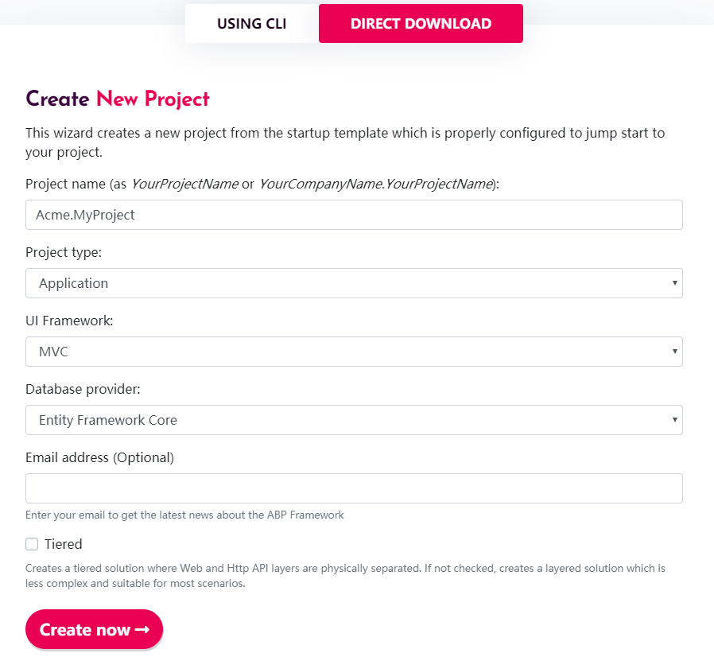
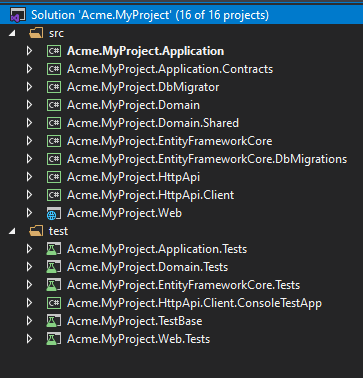
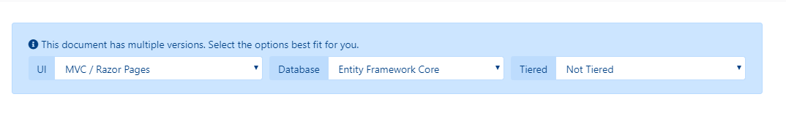
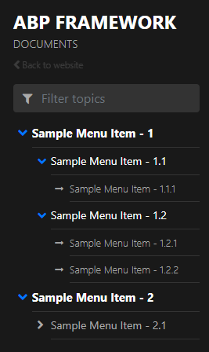

# 文档模块

## 什么是文档模块?

文档模块是ABP框架的一个应用程序模块. 它简化了软件文档的制作. 这个模块是开源免费的.

### 集成

目前文档模块提供提供了两种支持的存储,Github与文件系统. 

### 托管

文档模块是一个应用程序模块,不提供任何托管的解决方案,你可以在本地或云上托管文档.

### 版本

当你使用GitHub存储文档时,文档模块支持多版本. 如果你的文档具有多个版本, UI上有一个组合框,用于切换版本. 如果你选择使用文件系统存储文档, 那么它不支持多版本.

ABP框架的[文档](docs.abp.io)也是使用的此模块.

> 文档模块遵循 [模块化架构最佳实践](../Best-Practices/Module-Architecture.md) 指南.

## 安装

### 1- 下载

如果你没有现有的ABP项目, 这个步骤向你展示如何在[abp.io](https://abp.io)创建一个新项目并添加文档模块. 如果你本地已经有了一个ABP项目, 那么你可以跳过这一步.

推荐使用ABP CLI创建新项目,使用以下命令行:

`abp new Acme.MyProject`

你也可以在浏览器中导航到 https://abp.io/get-started. 输入项目名称为 `Acme.MyProject`, 其它保持默认选项.

请注意,本文档包含了 `Entity Framework Core` 提供者 不过你也可以选择 `MongoDB` 做为数据库提供者.



### 2- 运行这个空项目

下载项目后, 解压压缩文档并且打开 `Acme.MyProject.sln`. 你可以看到这个解决方案包含了 `Application`, `Application.Contrawcts`, `DbMigrator`, `Domain`, `Domain.Shared`, `EntityFrameworkCore`, `EntityFrameworkCore.DbMigations`, `HttpApi`, `HttpApi.Client` 和 `Web` 项目. 右键选择 `Acme.MyProject.Web` 项目**设置为启动项目**.



数据库连接字符串位于`Acme.MyProject.Web`项目的`appsettings.json`中. 如果你有不同的数据库配置, 可以修改这个连接字符串.

```json
{
  "ConnectionStrings": {
    "Default": "Server=(LocalDb)\\MSSQLLocalDB;Database=MyProject;Trusted_Connection=True"
  }
}
```

运行 `Acme.MyProject.DbMigrator` 项目,它会负责应用迁移与初始化种子数据. 数据库`MyProject`将在数据库服务器中创建.

现在一个空的ABP项目已经创建完成! 现在你可以运行项目并且查看网站.

输入用户名 `admin` 密码 `1q2w3E*` 登录到网站.

### 3- 安装模块

文档模块包托管在Nuget上面. 需要有四个包安装到你的应用程序中. 每个包必须安装到相关的项目.

#### 3.1- 使用ABP CLI

建议使用ABP CLI安装模块,在解决方案文件 (`.sln`) 目录打开 `CMD` 窗口,运行以下命令:

`abp add-module Volo.Docs`

#### 3.2- 手动安装

或者你也可以手动安装nuget包到每个项目:

* 安装[Volo.Docs.Domain](https://www.nuget.org/packages/Volo.Docs.Domain/) nuget包到 `Acme.MyProject.Domain` 项目.

  `Install-Package Volo.Docs.Domain`

* 安装[Volo.Docs.EntityFrameworkCore](https://www.nuget.org/packages/Volo.Docs.EntityFrameworkCore/) nuget包到 `Acme.MyProject.EntityFrameworkCore` 项目.

  `Install-Package Volo.Docs.EntityFrameworkCore`

* 安装[Volo.Docs.Application](https://www.nuget.org/packages/Volo.Docs.Application/) nuget包到 `Acme.MyProject.Application` 项目.

  `Install-Package Volo.Docs.Application`

* 安装[Volo.Docs.Web](https://www.nuget.org/packages/Volo.Docs.Domain/) nuget包到 `Acme.MyProject.Web` 项目.
  `Install-Package Volo.Docs.Web`

##### 3.2.1- 添加模块依赖

一个ABP模块必须声明 `[DependsOn]` attribute 如果它依赖于另一个模块. 每个模块都必须在相关的项目的`[DependsOn]`Attribute 中添加.

* 打开 `MyProjectDomainModule.cs`并且添加 `typeof(DocsDomainModule)` 如下所示;

  ```csharp
   [DependsOn(
          typeof(DocsDomainModule),
          typeof(AbpIdentityDomainModule),
          typeof(AbpAuditingModule),
          typeof(BackgroundJobsDomainModule),
          typeof(AbpAuditLoggingDomainModule)
          )]
      public class MyProjectDomainModule : AbpModule
      {
          //...
      }
  ```

* 打开 `MyProjectEntityFrameworkCoreModule.cs`并且添加 `typeof(DocsEntityFrameworkCoreModule)` 如下所示;

  ```csharp
      [DependsOn(
          typeof(DocsEntityFrameworkCoreModule),
          typeof(MyProjectDomainModule),
          typeof(AbpIdentityEntityFrameworkCoreModule),
          typeof(AbpPermissionManagementEntityFrameworkCoreModule),
          typeof(AbpSettingManagementEntityFrameworkCoreModule),
          typeof(AbpEntityFrameworkCoreSqlServerModule),
          typeof(BackgroundJobsEntityFrameworkCoreModule),
          typeof(AbpAuditLoggingEntityFrameworkCoreModule)
          )]
      public class MyProjectEntityFrameworkCoreModule : AbpModule
      {
          //...
      }
  ```

* 打开 `MyProjectApplicationModule.cs`并且添加 `typeof(DocsApplicationModule)` 如下所示;

  ```csharp
     [DependsOn(
          typeof(DocsApplicationModule),
          typeof(MyProjectDomainModule),
          typeof(AbpIdentityApplicationModule))]
      public class MyProjectApplicationModule : AbpModule
      {
          public override void ConfigureServices(ServiceConfigurationContext context)
          {
              Configure<PermissionOptions>(options =>
              {
                  options.DefinitionProviders.Add<MyProjectPermissionDefinitionProvider>();
              });
  
              Configure<AbpAutoMapperOptions>(options =>
              {
                  options.AddProfile<MyProjectApplicationAutoMapperProfile>();
              });
          }
      }
  ```

* 打开 `MyProjectWebModule.cs`并且添加 `typeof(DocsWebModule)` 如下所示;

  ```csharp
     [DependsOn(
          typeof(DocsWebModule),
          typeof(MyProjectApplicationModule),
          typeof(MyProjectEntityFrameworkCoreModule),
          typeof(AbpAutofacModule),
          typeof(AbpIdentityWebModule),
          typeof(AbpAccountWebModule),
          typeof(AbpAspNetCoreMvcUiBasicThemeModule)
      )]
      public class MyProjectWebModule : AbpModule
      {
          //...
      }
  ```

##### 3.2.2- 添加NPM包

打开 `package.json` 添加 `@abp/docs` 如下所示:
  
  ```json
    {
        "version": "1.0.0",
        "name": "my-app",
        "private": true,
        "dependencies": {
            "@abp/aspnetcore.mvc.ui.theme.basic": "^2.9.0",
            "@abp/docs": "^2.9.0"
        }
    }
  ```

  然后在 `Acme.MyProject.Web` 项目目录打开命令行终端运行以下命令:

````bash
abp install-libs
````

### 4- 数据库集成

#### 4.1- Entity Framework 集成

如果你选择了Entity Framework 做为数据库供应者,你需要配置文档模块. 做以下操作;

* 打开 `MyProjectMigrationsDbContext.cs` 并且添加 `builder.ConfigureDocs()` 到 `OnModelCreating()` 方法中

  ```csharp
  public class MyProjectMigrationsDbContext : AbpDbContext<MyProjectMigrationsDbContext>
    {
        public MyProjectMigrationsDbContext(DbContextOptions<MyProjectMigrationsDbContext> options)
            : base(options)
        {

        }

        protected override void OnModelCreating(ModelBuilder builder)
        {
            base.OnModelCreating(builder);

            /* Include modules to your migration db context */

            builder.ConfigurePermissionManagement();
            builder.ConfigureSettingManagement();
            builder.ConfigureBackgroundJobs();
            builder.ConfigureAuditLogging();
            builder.ConfigureIdentity();
            builder.ConfigureIdentityServer();
            builder.ConfigureFeatureManagement();
            builder.ConfigureTenantManagement();
            builder.ConfigureDocs(); //Add this line to configure the Docs Module

            /* Configure customizations for entities from the modules included  */

            builder.Entity<IdentityUser>(b =>
            {
                b.ConfigureCustomUserProperties();
            });

            /* Configure your own tables/entities inside the ConfigureQaDoc method */

            builder.ConfigureMyProject();
        }
    }
  ```

* 打开 `Visual Studio` 的 `包管理控制台` 选择 `Acme.MyProject.EntityFrameworkCore.DbMigrations` 做为默认项目. 然后编写以下命令为文档模块添加迁移.

  ```csharp
  add-migration Added_Docs_Module
  ```

  当命令执行成功后 , 你会看到`Acme.MyProject.EntityFrameworkCore.DbMigrations\Migrations` 目录下有名为 `20181221111621_Added_Docs_Module` 的迁移文件.

  现在更新数据库. 在 `Visual Studio` 的 `包管理控制台` 中执行以下代码. 要确认已 `Acme.MyProject.EntityFrameworkCore.DbMigrations` 项目设置为默认项目.

  ```csharp
  update-database
  ```

  最后你可以查看数据库中创建的新表,例如你可以看到 `DocsProjects` 表已经添加到数据库中.

### 5- 链接文档模块

文档模块的默认路由是;

```
/Documents
```

添加文档模块的链接到你的应用程序菜单中;

* 打开 `MyProjectMenuContributor.cs` 并且在 `ConfigureMainMenuAsync()` 方法方法中添加以下代码.

  ```csharp
  context.Menu.Items.Add(new ApplicationMenuItem("MyProject.Docs", l["Menu:Docs"], "/Documents"));
  ```

  最后 **MyProjectMenuContributor.cs** 有以下内容

  ```csharp
      private async Task ConfigureMainMenuAsync(MenuConfigurationContext context)
      {
          var l = context.ServiceProvider.GetRequiredService<IStringLocalizer<MyProjectResource>>();
  
          context.Menu.Items.Insert(0, new ApplicationMenuItem("MyProject.Home", l["Menu:Home"], "/"));
  
          context.Menu.Items.Add(new ApplicationMenuItem("MyProject.Docs", l["Menu:Docs"], "/Documents"));
      }
  ```

`Menu:Docs` 关键词是本地化的Key. 要本地化菜单文本, 打开`Acme.MyProject.Domain` 中的 `Localization\MyProject\zh-Hans.json`. 添加以下行.

```json
"Menu:Docs": "文档"
```

最后 **zh-Hans.json** 有以下内容

```json
{
  "culture": "zh-Hans",
  "texts": {
    "Menu:Home": "首页",
      "Welcome": "欢迎",
      "LongWelcomeMessage": "欢迎来到该应用程序. 这是一个基于ABP框架的启动项目. 有关更多信息, 请访问 abp.io.",
    "Menu:Docs": "文档"
  }
}
```

现在菜单中已经添加了文档模块项. 运行Web应用程序并且在浏览器中打开 `http://localhost:YOUR_PORT_NUMBER/documents` URL.

你会看到一个警告;

```
There are no projects yet!
```

这个警告是正常的,因为我们还没有添加任何项目.

### 6- 添加文档项目

在数据库中打开 `DocsProjects`, 并且插入包含以下字段的新记录;

* **Name**: 在Web页面上文档的显示名称.
* **ShortName**: 在文档URL中使用的友好的简短URL名称.
* **Format**: 文档的格式 ( Markdown: `md`,  HTML: `html`)
* **DefaultDocumentName**: 文档的初始页面.
* **NavigationDocumentName**: 导航菜单(索引)的文档.
* **MinimumVersion**: 显示文档的最低版本. 低于此的版本不会列出.
* **DocumentStoreType**: 文档的来源 ( GitHub:`GitHub`,文件系统`FileSystem`).
* **ExtraProperties**: 序列化的`JSON`, 它存储所选 `DocumentStoreType` 的特殊配置.
* **MainWebsiteUrl**: 用户单击文档模块页面Logo时跳转的URL.你只需设置为`/`即可链接到网站根地址.
* **LatestVersionBranchName**: 这是GitHub的配置.它是检索文档的分支名称.你可以将其设置为`master`.

#### "GitHub" 项目的示例记录

你可以使用 [ABP Framework](https://github.com/abpframework/abp/) GitHub文档来配置Github文档存储.

- Name: `ABP framework (GitHub)`

- ShortName: `abp`

- Format: `md`

- DefaultDocumentName: `Index`

- NavigationDocumentName: `docs-nav.json`

- MinimumVersion: `<NULL>` (no minimum version)

- DocumentStoreType: `GitHub`

- ExtraProperties: 

  ```json
  {"GitHubRootUrl":"https://github.com/abpframework/abp/tree/{version}/docs/zh-Hans/","GitHubAccessToken":"***","GitHubUserAgent":""}
  ```

  注意 `GitHubAccessToken` 用 `***` 掩盖. 这是一个私人令牌,你必须从GitHub获取它. 请参阅 https://help.github.com/articles/creating-a-personal-access-token-for-the-command-line/

- MainWebsiteUrl: `/` 

- LatestVersionBranchName: `master`

对于 `SQL` 数据库,你可以使用下面的 `T-SQL` 命令将指定的示例插入到 `DocsProjects` 表中:

```mssql
INSERT [dbo].[DocsProjects] ([Id], [Name], [ShortName], [Format], [DefaultDocumentName], [NavigationDocumentName], [MinimumVersion], [DocumentStoreType], [ExtraProperties], [MainWebsiteUrl], [LatestVersionBranchName], [ParametersDocumentName]) VALUES (N'12f21123-e08e-4f15-bedb-ae0b2d939658', N'ABP framework (GitHub)', N'abp', N'md', N'Index', N'docs-nav.json', NULL, N'GitHub', N'{"GitHubRootUrl":"https://github.com/abpframework/abp/tree/{version}/docs","GitHubAccessToken":"***","GitHubUserAgent":""}', N'/', N'master', N'')
```

请注意,`GitHubAccessToken` 被屏蔽了.它是一个私人令牌,你必须获得自己的令牌并替换 `***` 字符串.

现在你可以运行应用程序并导航到 `/Documents`.

#### "FileSystem" 项目的示例记录

你可以使用 [ABP Framework](https://github.com/abpframework/abp/) GitHub文档来配置你的文件系统存储.

- Name: `ABP framework (FileSystem)`

- ShortName: `abp`

- Format: `md`

- DefaultDocumentName: `Index`

- NavigationDocumentName: `docs-nav.json`

- MinimumVersion: `<NULL>` (no minimum version)

- DocumentStoreType: `FileSystem`

- ExtraProperties: 

  ```json
  {"Path":"C:\\Github\\abp\\docs"}
  ```

  请注意 `Path` 必须使用本地docs目录替换. 你可以从https://github.com/abpframework/abp/tree/master/docs获取ABP Framework的文档并且复制到该目录 `C:\\Github\\abp\\docs` 使其正常工作.

- MainWebsiteUrl: `/`

- LatestVersionBranchName: `<NULL>`

对于 `SQL` 数据库,你可以使用下面的 `T-SQL` 命令将指定的示例插入到 `DocsProjects` 表中:

```mssql
INSERT [dbo].[DocsProjects] ([Id], [Name], [ShortName], [Format], [DefaultDocumentName], [NavigationDocumentName], [MinimumVersion], [DocumentStoreType], [ExtraProperties], [MainWebsiteUrl], [LatestVersionBranchName], [ParametersDocumentName]) VALUES (N'12f21123-e08e-4f15-bedb-ae0b2d939659', N'ABP framework (FileSystem)', N'abp', N'md', N'Index', N'docs-nav.json', NULL, N'FileSystem', N'{"Path":"C:\\Github\\abp\\docs"}', N'/', NULL, N'')
```

添加上面的一个示例项目后运行该应用程序. 在菜单中你会看到`文档` 链接,点击菜单链接打开文档页面.

到目前为止, 我们已经从abp.io网站创建了一个新的应用程序,并为Docs模块做好准备.

### 7- 添加一个新文档

在示例项目记录中, 你可以看到 `Format` 被指定为 `md` 指的是 [Mark Down](https://en.wikipedia.org/wiki/Markdown).  你可以打开下面的链接查看语法;

https://github.com/adam-p/markdown-here/wiki/Markdown-Cheatsheet

ABP文档模块可以把MarkDown渲染为HTML.

现在让我们看一下Markdown格式的示例文档.

~~~markdown
# This is a header

Welcome to Docs Module.

## This is a sub header

 [This is a link](https://abp.io) 


## This is a code block

```csharp
public class Person
{
    public string Name { get; set; }

    public string Address { get; set; }
}
```
~~~

你可以使用 ABP Framework 的文档做为示例:

[https://github.com/abpframework/abp/blob/master/docs/zh-Hans/](https://github.com/abpframework/abp/blob/master/docs/zh-Hans/)

#### 有条件的部分功能(使用Scriban)

文档模块使用[Scriban](<https://github.com/lunet-io/scriban/tree/master/doc>)有条件的显示或隐藏文档的某些部分. 使用该功能你需要为每一种语言创建一个JSON文件做为**参数文档**. 它包含所有键值以及它们的显示名称.

例如 [en/docs-params.json](https://github.com/abpio/abp-commercial-docs/blob/master/en/docs-params.json):

```json
{
    "parameters": [{
        "name": "UI",
        "displayName": "UI",
        "values": {
          "MVC": "MVC / Razor Pages",
          "NG": "Angular"
        }
      },
      {
        "name": "DB",
        "displayName": "Database",
        "values": {
          "EF": "Entity Framework Core",
          "Mongo": "MongoDB"
        }
      },
      {
        "name": "Tiered",
        "displayName": "Tiered",
        "values": {
          "No": "Not Tiered",
          "Yes": "Tiered"
        }
      }]
}
```

因为并不是项目中的每个文档都有章节或者不需要所有的参数,你必须声明哪些参数将用于对文档进行分段,在文档的任何地方都可以使用JSON块.

例如 [Getting-Started.md](https://github.com/abpio/abp-commercial-docs/blob/master/en/getting-started.md):

```
.....

​````json
//[doc-params]
{
    "UI": ["MVC","NG"],
    "DB": ["EF", "Mongo"],
    "Tiered": ["Yes", "No"]
}
​````

........
```

这个部分会在渲染时自动删除.前提是这些键值必须与**参数文档**中的键值匹配.



现在你可以使用 **Scriban** 语法在文档中创建章节.

示例 :

````
{{ if UI == "NG" }}

* `-u` argument specifies the UI framework, `angular` in this case.

{{ end }}

{{ if DB == "Mongo" }}

* `-d` argument specifies the database provider, `mongodb` in this case.

{{ end }}

{{ if Tiered == "Yes" }}

* `--tiered` argument is used to create N-tiered solution where authentication server, UI and API layers are physically separated.

{{ end }}

````

还可以在文本中使用变量,在其键中添加 **_Value** 后缀:

````
This document assumes that you prefer to use **{{ UI_Value }}** as the UI framework and **{{ DB_Value }}** as the database provider.
````

如果你想要得到的当前文档的语言或版本,可以使用预定义的 **Document_Language_Code** 和 **DOCUMENT_VERSION** 键(这对于创建重定向到另一个地区中另一个文档系统的链接很有用).

------

**重要提示**: Scriban 的语法是 "{{" and "}}". 如果要在文档(如Angular文档)中使用转义,则必须使用转义块. 参阅 [Scriban文档](<https://github.com/lunet-io/scriban/blob/master/doc/language.md#13-escape-block> ) 了解更多信息.

### 8- 创建文档导航

导航文档是文档页面的主菜单. 它位于页面的左侧,是一个`JSON` 文件. 请查看以下示例导航文档以了解结构.

```json
{  
   "items":[  
      {  
         "text":"Sample Menu Item - 1",
         "items":[  
            {  
               "text":"Sample Menu Item - 1.1",
               "items":[  
                  {  
                     "text":"Sample Menu Item - 1.1.1",
                     "path":"SampleMenuItem_1_1_1.md"
                  }
               ]
            },
            {  
               "text":"Sample Menu Item - 1.2",
               "items":[  
                  {  
                     "text":"Sample Menu Item - 1.2.1",
                     "path":"SampleMenuItem_1_2_1.md"
                  },
                  {  
                     "text":"Sample Menu Item - 1.2.2",
                     "path":"SampleMenuItem_1_2_2.md"
                  }
               ]
            }
         ]
      },
      {  
         "text":"Sample Menu Item - 2",
         "items":[  
            {  
               "text":"Sample Menu Item - 2.1",
               "items":[  
                  {  
                     "text":"Sample Menu Item - 2.1.1",
                     "path":"SampleMenuItem_2_1_1.md"
                  }
               ]
            }
         ]
      }
   ]
}
```

上面的示例 `JSON` 文件将下面的导航菜单呈现为 `HTML` .



最后,为你的项目添加了一个新的Docs模块, 该模块由GitHub提供.

## 全文搜索(Elastic Search)

文档模块支持使用Elastic Search对内容进行全文搜索. 默认没有启用, 你可以配置`DocsElasticSearchOptions`启用它.

```
Configure<DocsElasticSearchOptions>(options =>
{
    options.Enable = true;
    options.IndexName = "your_index_name"; //default IndexName is abp_documents
});
```

应用程序启动后如果`Index`不存在则会自动创建`Index`.

`DefaultElasticClientProvider`负责创建`IElasticClient`, 默认情况下它会从`IConfiguration`中读取Elastic Search的`Url`.
如果你的 `IElasticClient` 需要其它配置请使用重写 `IElasticClientProvider` 服务并在[依赖注入](../Dependency-Injection.md)系统中替换它.
```
{
  "ElasticSearch": {
    "Url": "http://localhost:9200"
  }
}
```

## 下一步

文档模块也可以做为独立的应用程序. 查看 [VoloDocs](../Apps/VoloDocs).