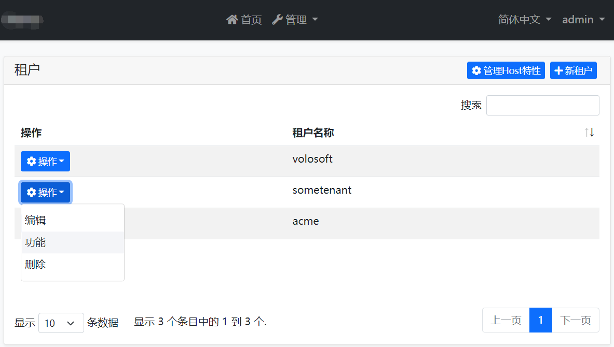

# 功能管理模块

功能管理模块实现了 [功能系统](../Features.md) 定义的 `IFeatureManagementStore` 接口.

> 此文档仅介绍了将功能值持续保存到数据库的功能管理模块. 请参阅 [功能](../Features.md) 来了解功能系统.

## 如何安装

当你使用 ABP 框架 [创建一个新的解决方案](https://abp.io/get-started) 时, 此模块将被预安装(作为 NuGet/NPM 包). 你可以继续用其作为包并轻松地获取更新, 也可以将其源代码包含在解决方案中 (请参阅 `get-source` [CLI](../CLI.md) 命令) 以开发自定义模块.

### 源代码

可以 [在此处](https://github.com/abpframework/abp/tree/dev/modules/feature-management) 访问源代码。源代码使用 [MIT](https://choosealicense.com/licenses/mit/) 许可, 所以你可以免费使用和自定义它.

## 用户界面

### 功能管理对话框

功能管理模块提供了一个可重用的对话框来管理与对象相关的功能. 例如: [租户管理模块](Tenant-Management.md) 用它在租户管理页面管理租户的功能.



当你点击租户的 *操作* -> *功能* 时, 将打开功能管理对话框. 下面是定义了两个功能的对话框示例截图:


在对话框中, 你可以为租户启用, 禁用或设置功能值.

## IFeatureManager

`IFeatureManager` 是此模块提供的主要服务. 在多租户应用程序中, 它常用来读取和更改功能值. `IFeatureManager` 通常被 *租户管理对话框* 使用. 但如果需要设置功能值, 你也可以注入它.

> 如果你只是想要读取或检查功能值, 请如 [功能文档](../Features.md) 中所述那样使用 `IFeatureChecker`.

**示例: 为租户获取或设置功能值**

````csharp
using System;
using System.Threading.Tasks;
using Volo.Abp.DependencyInjection;
using Volo.Abp.FeatureManagement;

namespace Demo
{
    public class MyService : ITransientDependency
    {
        private readonly IFeatureManager _featureManager;

        public MyService(IFeatureManager featureManager)
        {
            _featureManager = featureManager;
        }

        public async Task SetFeatureDemoAsync(Guid tenantId, string value)
        {
            await _featureManager
                .SetForTenantAsync(tenantId, "Feature1", value);
            
            var currentValue = await _featureManager
                .GetOrNullForTenantAsync("Feature1", tenantId);
        }
    }
}
````

## 功能管理提供程序

功能管理模块是可扩展的, 就像 [功能系统](../Features.md) 一样. 你可以通过定义功能管理提供程序来扩展它. 有3个预编译的功能管理提供程序已按下面的顺序注册:

* `DefaultValueFeatureManagementProvider`: 从功能定义的默认值中获取功能值. 它无法设置默认值, 因为默认值是在功能定义中硬编码的.
* `EditionFeatureManagementProvider`: 获取或设置版本的功能值. 版本是分配给租户的一个功能分组. 租户管理模块没有实现版本系统. 你可以自己实现它, 或者购买已实现它并且提供更多SaaS功能的 ABP 商业版 [SaaS 模块](https://commercial.abp.io/modules/Volo.Saas), 像订阅和支付.
* `TenantFeatureManagementProvider`: 获取或设置租户的功能.

`IFeatureManager` 在获取和设置的方法中使用了这些提供程序. 通常, 在 `IFeatureManager` 服务中, 每个功能管理提供程序都定义了扩展方法 (像租户功能管理提供程序就定义了 `SetForTenantAsync`).

如果想要自定义提供程序, 你需要实现 `IFeatureManagementProvider` 接口或从 `FeatureManagementProvider` 基类继承:

````csharp
public class CustomFeatureProvider : FeatureManagementProvider
{
    public override string Name => "Custom";

    public CustomFeatureProvider(IFeatureManagementStore store)
        : base(store)
    {
    }
}
````

`FeatureManagementProvider` 基类 (使用 `IFeatureManagementStore`) 为你做了默认的实现. 你可以按需重写基础方法. 在这个 `Custom` 的示例中, 每个提供程序必须有一个唯一的名称 (请保持简短, 因为每个功能值记录都会被保存到数据库中).

创建提供程序类后, 你应该用 `FeatureManagementOptions` [选项类](../Options.md) 注册它:

````csharp
Configure<FeatureManagementOptions>(options =>
{
    options.Providers.Add<CustomFeatureProvider>();
});
````

提供程序的顺序很重要. 提供程序按相反的顺序被执行. 这意味着在此示例中 `CustomFeatureProvider` 是第一个被执行的. 你可以在 `Providers` 列表的任意位置插入你的提供程序.

## 另请参见

* [功能](../Features.md)
