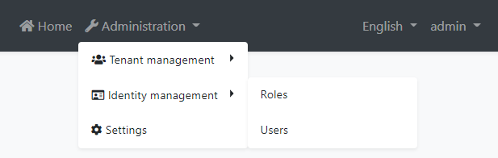
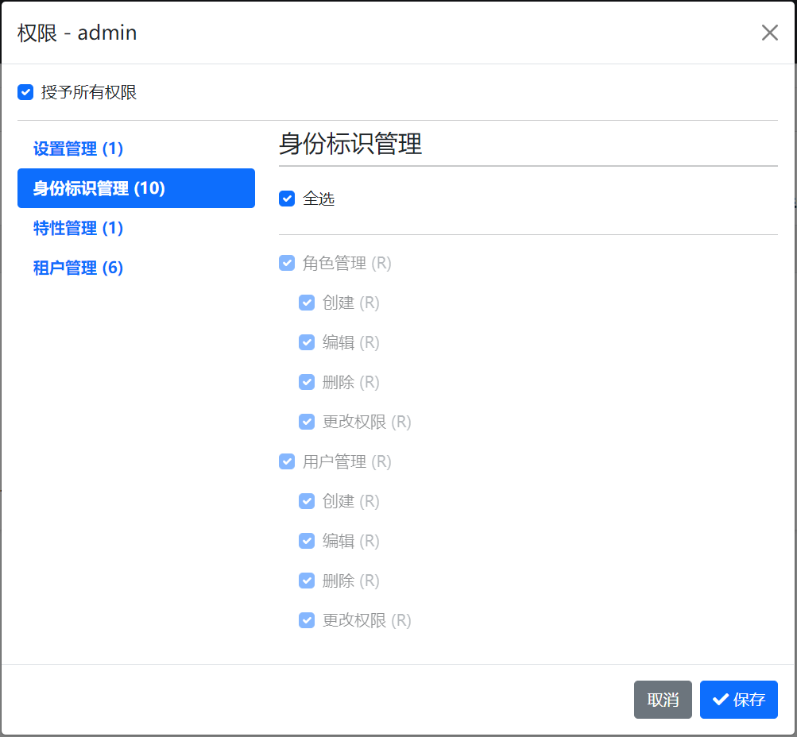
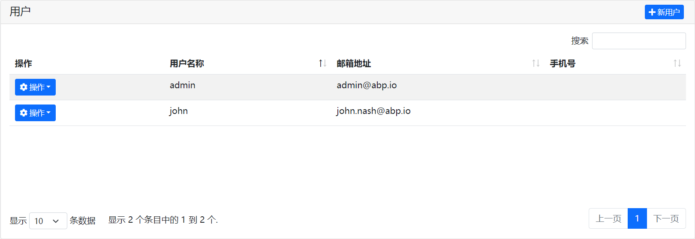
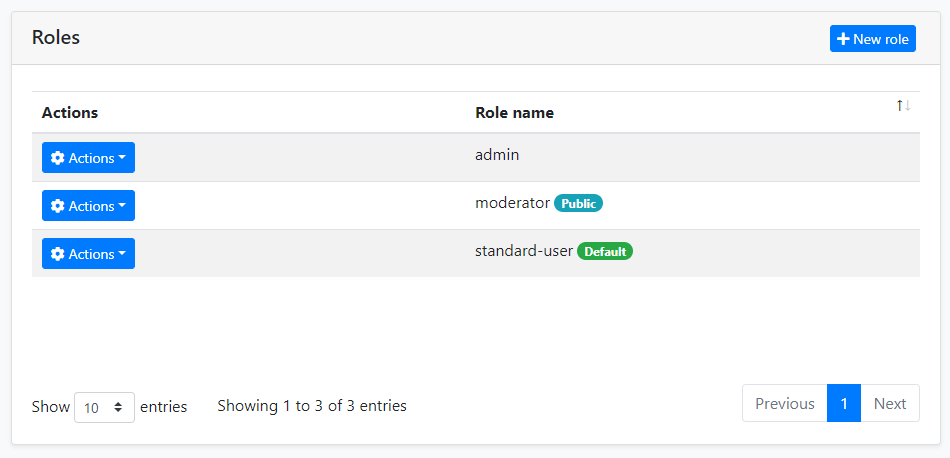

# 身份管理模块

身份模块基于 [Microsoft Identity 库](https://docs.microsoft.com/zh-cn/aspnet/core/security/authentication/identity) 用于管理角色,用户及其权限.

## 如何安装

当你使用 ABP 框架 [创建一个新的解决方案](https://abp.io/get-started) 时，此模块将被预安装（作为 NuGet/NPM 包）。你可以继续用其作为包并轻松地获取更新，也可以将其源代码包含在解决方案中（请参阅 `get-source` [CLI](../CLI.md)）以开发自定义模块。

### 源代码

可以 [在此处](https://github.com/abpframework/abp/tree/dev/modules/identity) 访问源代码。源代码使用 [MIT](https://choosealicense.com/licenses/mit/) 许可, 所以你可以免费使用和自定义它.

## 用户界面

此模块提供了 [Blazor](../UI/Blazor/Overall.md), [Angular](../UI/Angular/Quick-Start.md) 和 [MVC / Razor Pages](../UI/AspNetCore/Overall.md) 的 UI 可选.

### 菜单项

此模块在 *管理* 菜单下添加了一个 *身份管理* 菜单项:



这个菜单项和相关页面已获得授权. 这意味着当前用户必须拥有相关权限才能使其可见. `admin` 角色 (和拥有此角色的用户, 如 `admin` 用户) 已经拥有这些权限. 如果你想要使其他角色/用户也启用权限, 请打开 *角色* 或 *用户* 页面的 *权限* 对话框, 并检查如下所示的权限:



请参阅 [授权文档](../Authorization.md) 以了解权限系统.

### 页面

本节介绍此模块提供的主要页面.

#### 用户

此页用于查看用户列表. 您可以创建/编辑和删除用户, 将角色分配给用户.



一个用户可以有零个或多个角色. 用户从其角色继承权限. 此外, 你可以给用户直接分配权限 (通过点击 *操作* 按钮, 然后选择 *权限*) .

#### 角色

角色用于按分组给用户分配权限.



角色除了角色名称之外还有2个属性:

* `Default`: 如果某个角色被标记为 "default", 那么当新用户 (使用 [账户模块](Account.md)) 注册到应用程序时, 其将被作为默认角色分配给新用户.
* `Public`: 用户的公共角色可以被应用程序中的其他用户看到. 这个功能在身份模块中没有用到, 但被提供作为你可能希望在你自己的应用程序中使用的功能.

## 其他功能

本节包括此模块提供的没有 UI 页面的其他功能.

### 组织单元

组织单元 (OU) 可被用于 **按层级对用户和实体进行分组**. 

#### 组织单元实体

组织单元由 **OrganizationUnit** 实体表示. 它的基本属性是:

- **TenantId**: 组织单元的租户Id. 对于宿主可以是 null.
- **ParentId**: 父级组织单元的Id. 如果这是一个根级组织单元，它可以是 null.
- **Code**: 对于租户唯一的层级字符串编码.
- **DisplayName**: 组织单元的显示名称.

#### 组织树

由于组织单元可以有父级, 因此租户的所有组织单元是一个 **树** 结构. 这个树有一些规则;

- 可以有多个根级 (`ParentId` 是 `null` 的) .
- 一个组织单元的第一级子项数量有限制 (因为下面解释的固定的组织单元编码单位长度) .

#### 组织单元编码

组织单元编码是通过 `OrganizationUnitManager` 服务自动生成和维护的. 它是一个字符串, 像这样:

"**00001.00042.00005**"

通常用这种编码可以轻易地 (递归) 查询出数据库中组织单元的所有子项. 这个编码有一些规则 (当你使用 `OrganizationUnitManager` 时自动被应用的) : 

- 对 [租户](../Multi-Tenancy.md) 是 **唯一的**.
- 同一组织单元的全部子项都具有 **以父级组织单元编码开头的** 编码.
- 如示例中所示, 它是固定长度的且是基于树中组织单元的级别的.
- 尽管组织单元编码是唯一的, 但如果你移动了相关的组织单元, 它也可以被更改.

请注意, 你必须根据Id引用一个组织单元, 而不是编码, 因为编码后续是可以被更改的.

#### 组织单元管理

`OrganizationUnitManager` 类可以被 [注入](../Dependency-Injection.md) 并用来管理组织单元. 常见用例如下:

- 创建, 更新和删除组织单元.
- 在组织单元树中移动一个组织单元.
- 获取关于组织单元树及其项的信息.

### 身份安全日志

安全日志系统可以记录账户的一些重要的操作或者改动 (例如 *登录* 和 *更改密码*) . 如果需要, 你也可以保存安全日志.

你可以注入和使用 `IdentitySecurityLogManager` 或 `ISecurityLogManager` 来写入安全日志. 默认它会创建一个日志对象并填充常用的值, 如 `CreationTime`, `ClientIpAddress`, `BrowserInfo`, `current user/tenant` 等等. 当然你可以覆盖这些值.

```cs
await IdentitySecurityLogManager.SaveAsync(new IdentitySecurityLogContext()
{
    Identity = "IdentityServer";
    Action = "ChangePassword";
});
```

通过配置 `AbpSecurityLogOptions` 来为日志提供应用程序的名称 (如果你有多个应用程序并且想要在日志中区分应用程序) 或者禁用安全日志功能.

```cs
Configure<AbpSecurityLogOptions>(options =>
{
    options.ApplicationName = "AbpSecurityTest";
});
```
## 选项

`IdentityOptions` 是由 Microsoft [Identity 库](https://docs.microsoft.com/zh-cn/aspnet/core/security/authentication/identity) 提供的标准 [选项类](../Options.md) . 所以, 你可以在 [模块](../Module-Development-Basics.md) 类的 `ConfigureServices` 方法中设置这些选项.

**例如: 设置所需的密码最小长度**

````csharp
Configure<IdentityOptions>(options =>
{
    options.Password.RequiredLength = 5;
});
````

ABP 允许你在运行时通过使用 [设置系统](../Settings.md) 更进一步地更改这些选项. 你可以 [注入](../Dependency-Injection.md) `ISettingManager` 并使用 `Set...` 方法中的一种来更改用户, 租户或全局所有用户的选项值.

**例如: 更改当前租户所需的密码最小长度**

````csharp
public class MyService : ITransientDependency
{
    private readonly ISettingManager _settingManager;

    public MyService(ISettingManager settingManager)
    {
        _settingManager = settingManager;
    }

    public async Task ChangeMinPasswordLength(int minLength)
    {
        await _settingManager.SetForCurrentTenantAsync(
            IdentitySettingNames.Password.RequiredLength,
            minLength.ToString()
        );
    }
}
````

`IdentitySettingNames` 类 (在 `Volo.Abp.Identity.Settings` 命名空间中) 为设置名称定义了一些常量.

## 分布式事件

此模块定义了如下 ETOs (事件传输对象) 以允许你去订阅模块中实体的改动.

* `UserEto` 在 `IdentityUser` 实体更改完成时发布.
* `IdentityRoleEto` 在 `IdentityRole` 实体更改完成时发布.
* `IdentityClaimTypeEto` 在 `IdentityClaimType` 实体更改完成时发布.
* `OrganizationUnitEto` 在 `OrganizationUnit` 实体更改完成时发布.

**例如: 当一个新用户被创建时接收通知**

````csharp
public class MyHandler :
    IDistributedEventHandler<EntityCreatedEto<UserEto>>,
    ITransientDependency
{
    public async Task HandleEventAsync(EntityCreatedEto<UserEto> eventData)
    {
        UserEto user = eventData.Entity;
        // TODO: ...
    }
}
````

`UserEto` 和 `IdentityRoleEto` 默认自动发布事件. 你应该自己配置其他的 Eto. 请参阅 [分布式事件总线文档](../Distributed-Event-Bus.md) 了解预定义事件的详细信息.

> 订阅分布式事件对于分布式场景 (如微服务架构) 特别有用. 如果你正在构建单体式应用程序, 或者在运行了身份模块的同一进程内监听事件, 那么订阅 [本地事件](../Local-Event-Bus.md) 更高效, 更简单.

## 内部构件

本节包括模块的一些内部详细信息, 您不是那么需要, 但在一些情况下可能需要使用.

### 领域层

#### 聚合

##### 用户

用户通常是一个登录并使用应用程序的人.

* `IdentityUser` (聚合根): 表示系统中的一个用户.
  * `IdentityUserRole` (集合): 分配给用户的角色.
  * `IdentityUserClaim` (集合): 用户的自定义声明.
  * `IdentityUserLogin` (集合): 用户的外部登录.
  * `IdentityUserToken` (集合): 用户的令牌 (用于 Microsoft Identity 服务).

##### 角色

角色通常是分配给用户的一组权限.

* `IdentityRole` (聚合根): 表示系统中的角色.
  * `IdentityRoleClaim` (集合): 角色的自定义声明.

##### 声明类型

声明类型是可以被分配给系统中其他实体 (如角色和用户) 的自定义声明的定义.

* `IdentityClaimType` (聚合根): 表示声明类型的定义. 它包括一些用于定义声明类型和验证规则的属性 (例如, 必须的, 正则表达式, 描述, 值类型) .

##### 身份安全日志

`IdentitySecurityLog` 对象表示系统中与授权相关的操作 (如 *登录*) .

* `IdentitySecurityLog` (聚合根): 表示系统中的安全日志.

##### 组织单元

组织单元是一个有层级结构的实体.

* ```OrganizationUnit``` (聚合根): 表示系统中的组织单元.
  * ```Roles``` (集合): 组织单元的角色.

#### 仓储

此模块定义了以下自定义仓储:

* `IIdentityUserRepository`
* `IIdentityRoleRepository`
* `IIdentityClaimTypeRepository`
* ```IIdentitySecurityLogRepository```
* ```IOrganizationUnitRepository```

#### 领域服务

##### 用户管理

`IdentityUserManager` 常用于管理用户, 他们的权限, 声明, 密码, 电子邮件等等. 它派生自 Microsoft Identity 的 `UserManager<T>` 类, 其中 `T` 是 `IdentityUser`.

##### 角色管理

`IdentityRoleManager` 常用于管理角色和他们的声明. 它派生自 Microsoft Identity 的 `RoleManager<T>` 类, 其中 `T` 是 `IdentityRole`.

##### 声明类型管理

`IdenityClaimTypeManager` 常用于对聚合根 `IdentityClaimType` 执行某些操作.

##### 组织单元管理

```OrganizationUnitManager``` 常用于对聚合根 `OrganizationUnit` 执行某些操作.

##### 安全日志管理

```IdentitySecurityLogManager``` 常用于保存安全日志.

### 服务层

#### 应用服务

* `IdentityUserAppService` (实现 `IIdentityUserAppService`): 实现了用户管理 UI 的用例.
* `IdentityRoleAppService` (实现 `IIdentityRoleAppService`): 实现了角色管理 UI 的用例.
* `IdentityClaimTypeAppService` (实现 `IIdentityClaimTypeAppService`): 实现了声明类型管理 UI 的用例.
* `IdentitySettingsAppService` (实现 `IIdentitySettingsAppService`): 用于获取和更新身份模块的设置.
* `IdentityUserLookupAppService` (实现 `IIdentityUserLookupAppService`): 用于根据 `id` 或 `userName` 获取用户信息. 它旨在由ABP内部使用.
* `ProfileAppService` (实现 `IProfileAppService`): 用于更改用户的简介和密码.
* ```IdentitySecurityLogAppService``` (实现 ```IIdentitySecurityLogAppService```): 实现了安全日志 UI 的用例.
* ```OrganizationUnitAppService``` (实现 ```OrganizationUnitAppService```): 实现了组织单元管理 UI 的用例.

### 数据库提供程序

此模块为数据库提供 [Entity Framework Core](../Entity-Framework-Core.md) 和 [MongoDB](../MongoDB.md) 两种选择.

#### EF Core

NuGet 包 [Volo.Abp.Identity.EntityFrameworkCore](https://www.nuget.org/packages/Volo.Abp.Identity.EntityFrameworkCore) 实现了 EF Core 的集成.

##### 数据库表

* **AbpRoles**
  * AbpRoleClaims
* **AbpUsers**
  * AbpUserClaims
  * AbpUserLogins
  * AbpUserRoles
  * AbpUserTokens
* **AbpClaimTypes**
* **AbpOrganizationUnits**
  * AbpOrganizationUnitRoles
  * AbpUserOrganizationUnits
* **AbpSecurityLogs**

#### MongoDB

NuGet 包 [Volo.Abp.Identity.MongoDB](https://www.nuget.org/packages/Volo.Abp.Identity.MongoDB) 实现了 MongoDB 的集成.

##### 数据库集合

* **AbpRoles**
* **AbpUsers**
* **AbpClaimTypes**
* **AbpOrganizationUnits**
* **AbpSecurityLogs**

#### 常用数据库属性

你可以设置 `AbpIdentityDbProperties` 中的以下属性来更改数据库选项:

* `DbTablePrefix` (`Abp` 作为默认值) 是表/集合名称的前缀.
* `DbSchema` (`null` 作为默认值) 是数据库架构.
* `ConnectionStringName` (`AbpIdentity` 作为默认值) 是此模块的 [连接字符串](../Connection-Strings.md) 名称.

它们是静态属性. 你需要在开始运行应用程序前设置它们 (通常在 `Program.cs` 中).
